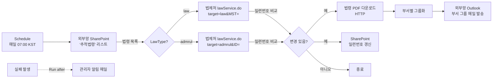
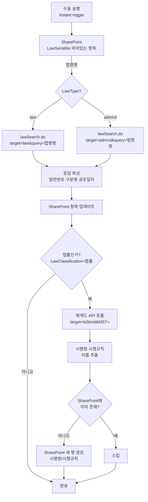

# 법령변경 자동 알림 설계서

> 본 문서는 ms-design-agents 페르소나 시스템이 협업하여 작성한 설계서다.

| 항목 | 내용 |
|------|------|
| 작성일 | 2026-05-23 |
| 최종 수정일 | 2026-05-27 |
| 프로젝트명 | 법령변경알림 |
| 망 배치 결정 | **외부망 단독 (패턴 B)** |
| 사용 기술 | Power Automate (Cloud Flow), SharePoint, 법제처 OpenAPI |
| Copilot Studio 사용 여부 | 아니오 |

---

## 1. 개요

### 1.1 요청사항

> 법제처 사이트에서 SharePoint 리스트로 관리하는 **법률·시행령·시행규칙·행정규칙(고시)** 등이 변경될 경우, 법제처 OpenAPI로 변경 내용을 파악하고 바뀐 법령들을 모두 모아서 법령 PDF 파일까지 함께 메일로 전달하는 Power Automate 플로우. 초기에는 **법률명만** SharePoint에 등록하면, 부트스트랩 플로우가 법제처 API를 호출하여 법령 일련번호·법령 구분을 자동으로 채우고, **체계도 API로 연관된 시행령·시행규칙을 자동 발견하여 하위 행으로 등록**한다.

### 1.2 자동화 목표

회사가 추적 중인 법령(법률·시행령·시행규칙)과 행정규칙(고시·훈령·예규)의 개정·신설을 매일 자동으로 감지하고, 변경이 발견되면 담당 부서 그룹 메일로 법령 원문 PDF와 함께 알림을 발송한다. 컴플라이언스 담당자가 매일 법제처 사이트를 수동으로 모니터링하는 작업을 제거한다.

### 1.3 법령 유형 체계

법제처 OpenAPI는 **법령(target=law)** 과 **행정규칙(target=admrul)** 을 별도 서비스로 제공한다. 두 유형은 API 엔드포인트·파라미터·응답 구조가 다르므로 반드시 분기 처리해야 한다.

| 구분 | API target | 검색 API | 본문 조회 API | 식별자 파라미터 | 해당 법령 종류 |
|------|-----------|----------|-------------|---------------|-------------|
| **법령** | `law` | `lawSearch.do?target=law` | `lawService.do?target=law` | `MST` (법령일련번호) | 법률, 대통령령(시행령), 총리령·부령(시행규칙) |
| **행정규칙** | `admrul` | `lawSearch.do?target=admrul` | `lawService.do?target=admrul` | `ID` (행정규칙일련번호) | 고시, 훈령, 예규, 지침 등 |

하나의 법률(예: 여신전문금융업법)은 **법률 본체 + 시행령 + 시행규칙**으로 구성된다. 법제처에서 이 세 가지는 각각 독립된 `법령일련번호(MST)`를 가진 별도 항목이다. 본 설계는 **체계도 API(`target=lsStmd`)**를 사용하여 법률 등록 시 연관 시행령·시행규칙을 자동으로 발견하고 추적 대상에 추가한다.

> 현재 추적 대상: 사용자 등록 기준 **법률 33건 + 행정규칙(고시) 1건 = 34건**. 부트스트랩 실행 후 시행령·시행규칙이 자동 추가되어 총 건수가 늘어난다.

### 1.4 사용자 측 사전 확인 사항 (Security 조건부 통과)

설계 진행 전 다음을 확인할 것:

1. **부서-법령 매핑 정보(부서 그룹 메일 주소 + 추적 법령 목록)의 외부망 SharePoint 저장이 사내 정보보안 정책상 허용되는지** — 정보보안팀 확인 필수
2. 법제처 OpenAPI 인증 코드(OC)의 외부망 보관 방식 (Secure Input + 환경 변수 권장)
3. 메일 첨부 용량(25MB) 초과 시 동작 방식 합의 — 본 설계는 "초과 시 SharePoint 링크로 전환"을 명시

### 1.5 처리 대상 데이터

| 데이터 항목 | 종류 | 출처 | 개인정보 여부 |
|------------|------|------|--------------|
| 법령 본문 (원문, PDF) | 공개 데이터 | 법제처 OpenAPI | - |
| 법령 일련번호 (MST) / 행정규칙 일련번호, 공포일자 | 공개 데이터 | 법제처 OpenAPI | - |
| 법령 구분 (법률/시행령/시행규칙/고시) | 공개 데이터 | 법제처 OpenAPI | - |
| 법령 체계도 (법률-시행령-시행규칙 관계) | 공개 데이터 | 법제처 OpenAPI (lsStmd) | - |
| 추적 법령 목록 (회사 관심 법령) | 회사 메타정보 | 외부망 SharePoint | 조직 정보로 보안 정책 검토 대상 (§1.4) |
| 부서 그룹 메일 주소 | 회사 메타정보 | 외부망 SharePoint | 그룹 메일, 개인 식별 없음 |

---

## 2. 아키텍처

### 2.1 다이어그램

#### 2.1.1 일일 변경 감지 플로우 (LawChangeMonitor)



#### 2.1.2 초기 데이터 구축 플로우 (LawDataBootstrap)



### 2.2 컴포넌트 표

| # | 컴포넌트 | 역할 | 위치 | 사용 기술 |
|---|---------|------|------|----------|
| 1 | 추적법령 리스트 | 회사 관심 법령 마스터 | 외부망 | SharePoint List |
| 2 | 일정 트리거 | 매일 자동 실행 | 외부망 | Power Automate (Schedule) |
| 3 | 법제처 API 호출 (법령) | target=law 변경 감지 | 외부망 | Power Automate (HTTP, Premium) |
| 3a | 법제처 API 호출 (행정규칙) | target=admrul 변경 감지 | 외부망 | Power Automate (HTTP, Premium) |
| 4 | 비교·분기 로직 | 일련번호 비교 후 변경 판단 | 외부망 | Power Automate (Variable, Condition) |
| 5 | 법령 PDF 다운로드 | 원문 PDF 취득 | 외부망 | Power Automate (HTTP) |
| 6 | 부서별 메일 발송 | 알림 | 외부망 | Power Automate (Outlook V2) |
| 7 | 실패 처리 | 관리자 알림 | 외부망 | Power Automate (Run after) |
| 8 | OC 코드 보관 | 인증 정보 | 외부망 | 환경 변수 + Secure Input |
| 9 | **초기 데이터 구축 플로우** | 법령명 → 일련번호 조회 + 시행령/시행규칙 자동 발견 | 외부망 | Power Automate (Instant + HTTP) |
| 10 | **체계도 API 호출** | 법률의 시행령·시행규칙 자동 발견 | 외부망 | Power Automate (HTTP, target=lsStmd) |

---

## 3. 망 배치 결정 근거

[workflow/decision_tree.md](../../workflow/decision_tree.md) 적용:

| 질문 | 응답 | 근거 |
|------|------|------|
| Q1 개인정보 처리 | 아니오 | 부서 그룹 메일만 사용. 개인 식별 없음 |
| Q3 외부 API/데이터 의존 | **예** | 법제처 OpenAPI, PDF 원문 다운로드 |
| Q4 수신자 = 내부 직원 | (부분) | 메일은 외부망 Outlook → 인터넷 → 회사 메일 게이트웨이로 도달. 표준 외부 메일 채널이므로 별도 게이트웨이 설계 불필요 |
| Q5 알림에 개인정보 | 아니오 | 부서 단위 일괄 |

**결정: 패턴 B — 외부망 단독**

### 대안 검토

- **패턴 A (내부망 단독)**: 법제처 API가 외부 인터넷이라 내부망에서 호출 불가
- **패턴 C (외부망 → 내부망 연계)**: 수신자가 부서 그룹 메일이고 개인 식별이 없어 별도 게이트웨이 설계가 과잉. 단순한 외부망 메일 발송으로 충분

---

## 4. Power Automate 플로우 명세

### 4.1 플로우 목록

본 프로젝트는 **2개의 플로우**로 구성한다.

| 플로우 | 용도 | 트리거 | 실행 빈도 |
|--------|------|--------|----------|
| `LawDataBootstrap_External` | 초기 데이터 구축 — 법령명 → 일련번호 조회 + **시행령/시행규칙 자동 발견·등록** | Instant (수동) | 초기 1회 + 신규 법령 추가 시 |
| `LawChangeMonitor_External` | 일일 변경 감지 및 알림 | Recurrence (매일 07:00) | 매일 |

### 4.2 플로우 A — 초기 데이터 구축 (LawDataBootstrap_External)

#### 4.2.1 플로우 개요

| 항목 | 값 |
|------|----|
| 플로우명 | `LawDataBootstrap_External` |
| 위치 | 외부망 M365 |
| 트리거 | Instant (수동 실행) |
| 용도 | (1) SharePoint에 법령명만 입력된 항목의 일련번호·법령구분을 API로 자동 조회 (2) **법률인 경우 체계도 API로 시행령·시행규칙을 발견하여 하위 행 자동 생성** |
| 라이선스 등급 | **Premium** (HTTP 커넥터) |

#### 4.2.2 단계 명세

**Phase 1 — 메타데이터 조회·갱신**

| 순번 | 단계명 | 액션 종류 | 커넥터 | 입력 매개변수 | 출력 변수 | 비고 |
|------|--------|----------|--------|---------------|-----------|------|
| B1 | 트리거 | Instant | Built-in | 수동 실행 (버튼 클릭) | - | - |
| B2 | 미완성 항목 조회 | Get items | SharePoint | Site=외부망, List=`추적법령`, Filter Query=`LawSerialNo eq null or LawSerialNo eq ''` | emptyItems | LawSerialNo가 비어있는 항목만 |
| B3 | 반복 | Apply to each | Built-in | `@body('미완성_항목_조회')?['value']` | currentItem | 병렬 제한 1 (API 한도 보호) |
| B3.1 | 조건 — LawType 분기 | Condition | Built-in | `@items('Apply_to_each')?['LawType']?['Value']` equals `admrul` | - | 법령/행정규칙 API 분기 |
| B3.1a | **(False: 법령)** 법령 검색 API | HTTP | HTTP | Method=`GET`, URI=`https://www.law.go.kr/DRF/lawSearch.do?OC=@{environment.OC_CODE}&target=law&type=JSON&query=@{encodeUriComponent(items('Apply_to_each')?['Title'])}&display=5` | lawSearchResult | target=law |
| B3.1b | **(True: 행정규칙)** 행정규칙 검색 API | HTTP | HTTP | Method=`GET`, URI=`https://www.law.go.kr/DRF/lawSearch.do?OC=@{environment.OC_CODE}&target=admrul&type=JSON&query=@{encodeUriComponent(items('Apply_to_each')?['Title'])}&display=5` | admrulSearchResult | target=admrul |
| B3.2 | JSON 파싱 | Parse JSON | Data Operations | Content=분기별 응답 body, Schema=§9.1a/§9.1b 참조 | parsed | - |
| B3.3 | 첫 번째 결과 추출 | Compose | Data Operations | 법령: `@first(body('Parse_JSON')?['법령'])` / 행정규칙: `@first(body('Parse_JSON')?['행정규칙'])` | firstResult | 검색 결과 최상위 1건 |
| B3.4 | SharePoint 항목 업데이트 (법령) | Update item | SharePoint | Id=현재 항목 ID, LawSerialNo=`법령일련번호`, LawClassification=`법령구분명`, LastCheckedSerialNo=`법령일련번호`, LastPromulgationDate=`공포일자` | - | 법령 분기 |
| B3.4a | SharePoint 항목 업데이트 (행정규칙) | Update item | SharePoint | Id=현재 항목 ID, LawSerialNo=`행정규칙일련번호`, LawClassification=`행정규칙종류`, LastCheckedSerialNo=`행정규칙일련번호`, LastPromulgationDate=`발령일자` | - | 행정규칙 분기 |

**Phase 2 — 시행령·시행규칙 자동 발견 (법률인 경우만)**

| 순번 | 단계명 | 액션 종류 | 커넥터 | 입력 매개변수 | 출력 변수 | 비고 |
|------|--------|----------|--------|---------------|-----------|------|
| B3.5 | **조건 — 법률 여부 확인** | Condition | Built-in | `@outputs('firstResult')?['법령구분명']` equals `법률` AND LawType=`law` | - | 시행령/시행규칙은 법률 하위에만 존재. 행정규칙·시행령·시행규칙 항목은 스킵 |
| B3.5.1 | **(True) 체계도 API 호출** | HTTP | HTTP | Method=`GET`, URI=`https://www.law.go.kr/DRF/lawService.do?OC=@{environment.OC_CODE}&target=lsStmd&MST=@{outputs('firstResult')?['법령일련번호']}&type=JSON` | stmdResponse | **핵심**: 법률의 시행령·시행규칙 정보 반환 |
| B3.5.2 | 체계도 JSON 파싱 | Parse JSON | Data Operations | Content=`@body('체계도_API_호출')`, Schema=§9.1e 참조 | parsedStmd | 시행령·시행규칙 필드 추출 |
| B3.5.3 | **조건 — 시행령 존재 확인** | Condition | Built-in | `@not(empty(outputs('parsedStmd')?['시행령']))` | - | 시행령이 없는 법률도 있음 (예: 일부 기본법) |
| B3.5.3a | 시행령 중복 확인 | Get items | SharePoint | Filter Query=`Title eq '@{outputs('parsedStmd')?['시행령']}' and ParentTitle eq '@{items('Apply_to_each')?['Title']}'` | existingDecree | 이미 등록되었으면 스킵 |
| B3.5.3b | **(중복 없음)** 시행령 행 생성 | Create item | SharePoint | Title=`@{outputs('parsedStmd')?['시행령']}`, LawType=`law`, Category=부모와 동일, DepartmentEmail=부모와 동일, **ParentTitle**=`@{items('Apply_to_each')?['Title']}`, IsActive=Yes, LawSerialNo/LawClassification=**비워둠** | - | 다음 부트스트랩 실행 시 Phase 1에서 자동 채움 |
| B3.5.4 | **조건 — 시행규칙 존재 확인** | Condition | Built-in | `@not(empty(outputs('parsedStmd')?['시행규칙']))` | - | 시행규칙이 없는 법률도 있음 |
| B3.5.4a | 시행규칙 중복 확인 | Get items | SharePoint | Filter Query=`Title eq '@{outputs('parsedStmd')?['시행규칙']}' and ParentTitle eq '@{items('Apply_to_each')?['Title']}'` | existingRule | 이미 등록되었으면 스킵 |
| B3.5.4b | **(중복 없음)** 시행규칙 행 생성 | Create item | SharePoint | Title=`@{outputs('parsedStmd')?['시행규칙']}`, LawType=`law`, Category=부모와 동일, DepartmentEmail=부모와 동일, **ParentTitle**=`@{items('Apply_to_each')?['Title']}`, IsActive=Yes, LawSerialNo/LawClassification=**비워둠** | - | 다음 부트스트랩 실행 시 Phase 1에서 자동 채움 |

**Phase 3 — 완료**

| 순번 | 단계명 | 액션 종류 | 커넥터 | 입력 매개변수 | 출력 변수 | 비고 |
|------|--------|----------|--------|---------------|-----------|------|
| B4 | 완료 알림 | Send an email (V2) | Outlook | To=관리자 메일, Subject=`[법령 부트스트랩 완료]`, Body=처리 결과 요약 (조회 N건 + 시행령/시행규칙 M건 자동 생성) | - | - |

> **실행 방법**: 부트스트랩을 **2회 연속 실행**한다. 1회차에서 법률 34건의 메타데이터를 채우고 시행령·시행규칙 행을 생성한다. 2회차에서 1회차에 생성된 시행령·시행규칙 행(LawSerialNo가 비어있음)의 메타데이터를 채운다.

#### 4.2.3 에러 핸들링

| 단계 | 실패 시 동작 |
|------|-------------|
| HTTP (검색 API) | 자동 재시도 3회. 실패 시 해당 항목 스킵, 다음 항목 진행 (Configure run after) |
| HTTP (체계도 API) | 자동 재시도 3회. 실패 시 시행령/시행규칙 자동 발견 스킵 — Phase 1 결과는 유지 |
| 검색 결과 0건 | firstResult가 null → SharePoint 갱신 스킵. 법령명 오타 가능성이므로 운영자가 수동 확인 |
| 검색 결과 복수건 | 첫 번째 결과(가장 관련도 높은 항목) 사용. 운영자가 결과 확인 후 필요 시 수동 보정 |
| 시행령/시행규칙 중복 | SharePoint 조회로 기존 등록 여부 확인 후 스킵. 중복 생성 방지 |

### 4.3 플로우 B — 일일 변경 감지 (LawChangeMonitor_External)

#### 4.3.1 플로우 개요

| 항목 | 값 |
|------|----|
| 플로우명 | `LawChangeMonitor_External` |
| 위치 | 외부망 M365 |
| 환경(Environment) | 외부망 Default 환경 (또는 사내 표준 환경) |
| 트리거 | Recurrence |
| 실행 빈도 | 매일 07:00 KST |
| 예상 일 호출 횟수 | 추적 법령 ~100건(34건 법률 + 시행령/시행규칙) x API 2회 = ~200회 |
| 라이선스 등급 | **Premium** (HTTP 커넥터) |

#### 4.3.2 사용 커넥터

| 커넥터 | 등급 | 테넌트 | 용도 |
|--------|------|--------|------|
| Schedule | Standard | 외부망 | 트리거 |
| SharePoint | Standard | 외부망 | 법령 마스터 조회·갱신 |
| HTTP | **Premium** | 외부망 | 법제처 API, PDF 다운로드 |
| Office 365 Outlook | Standard | 외부망 | 메일 발송 |
| Data Operations | Standard | 외부망 | Parse JSON, Filter, Select, Compose |
| Variable | Standard | 외부망 | 변수 관리 |

#### 4.3.3 사전 준비 — SharePoint '추적법령' 리스트 스키마

| 컬럼명 | 타입 | 예시 값 | 용도 |
|--------|------|---------|------|
| Title | 단일 줄 텍스트 | `개인정보 보호법` | 법령명 (초기 입력 — 법률명만 입력하면 됨) |
| **LawType** | 선택(Choice) | `law` / `admrul` | **법제처 API target 파라미터** — `law`(법률·시행령·시행규칙) 또는 `admrul`(고시·훈령·예규). 초기 입력 시 지정 필수 |
| **LawClassification** | 단일 줄 텍스트 | `법률` / `대통령령` / `고시` | **법령 세부 구분** — 부트스트랩 플로우가 API 응답의 `법령구분명` 또는 `행정규칙종류`로 자동 채움 |
| **Category** | 선택(Choice) | `금융 관련` | 관리 편의를 위한 분류 카테고리 |
| **LawSerialNo** | 단일 줄 텍스트 | `259844` | **법제처 일련번호** — 법령은 `법령일련번호`, 행정규칙은 `행정규칙일련번호`. 부트스트랩 플로우가 자동 채움 |
| **ParentTitle** | 단일 줄 텍스트 | `여신전문금융업법` | **부모 법률명** — 시행령·시행규칙이 어떤 법률에 속하는지 연결. 법률 본체와 행정규칙은 빈 값. 부트스트랩 플로우가 자동 설정 |
| LastCheckedSerialNo | 단일 줄 텍스트 | `259844` | 마지막 확인 시점의 일련번호 (변경 감지 키). 부트스트랩 플로우가 초기값 자동 채움 |
| LastPromulgationDate | 날짜 | `2024-09-15` | 마지막 확인 공포일자/발령일자 (참고용) |
| DepartmentEmail | 단일 줄 텍스트 | `compliance@company.com` | 담당 부서 그룹 메일 |
| IsActive | 예/아니오 | Yes | 추적 활성화 여부 |

> **운영 흐름 요약**:
> 1. 사용자는 `Title`(법률명), `LawType`(`law`/`admrul`), `Category`, `DepartmentEmail`만 입력
> 2. `LawDataBootstrap_External` 1회차 실행 → 메타데이터 자동 채움 + 시행령/시행규칙 행 자동 생성
> 3. `LawDataBootstrap_External` 2회차 실행 → 자동 생성된 시행령/시행규칙의 메타데이터 채움
> 4. 이후 `LawChangeMonitor_External`이 법률·시행령·시행규칙·행정규칙 모두를 매일 감시

#### 4.3.4 단계 명세

| 순번 | 단계명 | 액션 종류 | 커넥터 | 입력 매개변수 | 출력 변수 | 비고 |
|------|--------|----------|--------|---------------|-----------|------|
| 1 | 트리거 | Recurrence | Schedule | Frequency=Day, Interval=1, StartTime=07:00, TimeZone=Korea Standard Time | - | - |
| 2 | 변경 목록 변수 초기화 | Initialize variable | Variable | Name=`changedLaws`, Type=Array, Value=`[]` | changedLaws | - |
| 3 | 추적 법령 조회 | Get items | SharePoint | Site=외부망 사이트, List=`추적법령`, Filter Query=`IsActive eq 1 and LawSerialNo ne null` | trackedLaws | LawSerialNo가 채워진(부트스트랩 완료된) 항목만. 법률·시행령·시행규칙·행정규칙 모두 포함 |
| 4 | 반복 | Apply to each | Built-in | `@body('추적_법령_조회')?['value']` | currentLaw | 병렬 제한 1 (API 한도 보호) |
| 4.1 | **조건 — LawType 분기** | Condition | Built-in | `@items('Apply_to_each')?['LawType']?['Value']` equals `admrul` | - | **핵심 분기: 법령 vs 행정규칙** |
| 4.1a | **(False: 법령)** 법령 본문 조회 | HTTP | HTTP | Method=`GET`, URI=`https://www.law.go.kr/DRF/lawService.do?OC=@{environment.OC_CODE}&target=law&MST=@{items('Apply_to_each')?['LawSerialNo']}&type=JSON` | lawApiResponse | target=law, MST 파라미터. 법률·시행령·시행규칙 모두 이 경로 |
| 4.1b | **(True: 행정규칙)** 행정규칙 본문 조회 | HTTP | HTTP | Method=`GET`, URI=`https://www.law.go.kr/DRF/lawService.do?OC=@{environment.OC_CODE}&target=admrul&ID=@{items('Apply_to_each')?['LawSerialNo']}&type=JSON` | admrulApiResponse | target=admrul, **ID 파라미터** (MST 아님) |
| 4.2 | JSON 파싱 | Parse JSON | Data Operations | Content=분기별 응답 body, Schema=§9.1 참조 | parsed | 법령/행정규칙 스키마 분기 |
| 4.3 | **조건 — 일련번호 변경 감지** | Condition | Built-in | (법령) `@parsed?['법령']?['법령일련번호']` != `@items('Apply_to_each')?['LastCheckedSerialNo']` / (행정규칙) `@parsed?['행정규칙']?['행정규칙일련번호']` != `@items('Apply_to_each')?['LastCheckedSerialNo']` | - | **일련번호 비교** |
| 4.3a | (True) PDF 다운로드 | HTTP | HTTP | Method=`GET`, URI=(법령) `lawService.do?...&target=law&MST=...&type=PDF` / (행정규칙) `lawService.do?...&target=admrul&ID=...&type=PDF` | pdfResponse | Response Body는 binary |
| 4.3b | 변경 목록에 추가 | Append to array variable | Variable | Name=`changedLaws`, Value=`{ "lawName": "Title", "lawType": "LawType", "lawClassification": "LawClassification", "parentTitle": "ParentTitle", "newSerialNo": "...", "promulgationDate": "...", "departmentEmail": "DepartmentEmail", "pdfContent": "base64(...)" }` | changedLaws | ParentTitle 포함 — 메일에서 그룹 표시 |
| 4.3c | 마스터 갱신 | Update item | SharePoint | Id=현재 항목 ID, LastCheckedSerialNo=새 일련번호, LastPromulgationDate=새 공포/발령일자 | - | - |
| 5 | 조건 — 변경 있음 | Condition | Built-in | `length(variables('changedLaws')) > 0` | - | - |
| 5.1 | (True) 부서 목록 추출 | Select | Data Operations | From=`@variables('changedLaws')`, Map=`@item().departmentEmail` | departmentList | - |
| 5.2 | 부서 중복 제거 | Compose | Data Operations | `@union(body('Select'), body('Select'))` | uniqueDepartments | - |
| 5.3 | 부서별 반복 | Apply to each | Built-in | `@outputs('Compose')` | currentDept | - |
| 5.3.1 | 해당 부서 법령 필터 | Filter array | Data Operations | From=`@variables('changedLaws')`, Condition=`item().departmentEmail` equals `@items('Apply_to_each_부서')` | deptLaws | - |
| 5.3.2 | 메일 본문 조립 | Compose | Data Operations | HTML 표 — 법령명, 법령구분, 부모법률, 공포일자, 일련번호 (부록 §9.2 참조) | mailBody | - |
| 5.3.3 | 첨부 배열 조립 | Select | Data Operations | From=`@body('Filter_array')`, Map=`{ "Name": "@{item().lawName}_@{item().promulgationDate}.pdf", "ContentBytes": "@{item().pdfContent}" }` | attachments | - |
| 5.3.4 | 총 첨부 용량 계산 | Compose | Data Operations | `@div(length(string(body('Select_첨부'))), 1024)` (KB 환산) | attachmentSizeKB | 25MB = 25600 KB 초과 검사 |
| 5.3.5 | 조건 — 용량 초과 분기 | Condition | Built-in | `attachmentSizeKB` < `20000` (안전 마진 포함 20MB) | - | - |
| 5.3.5a | (True, 용량 OK) 메일 발송 (첨부 포함) | Send an email (V2) | Office 365 Outlook | To=부서 메일, Subject=`[법령변경 알림] N건 변경 (yyyy-MM-dd)`, Body=메일 본문, IsHtml=Yes, Attachments=첨부 배열 | - | - |
| 5.3.5b | (False, 용량 초과) PDF SharePoint 업로드 | Create file (반복) | SharePoint | Site=외부망, Folder Path=`/법령변경알림/@{utcNow('yyyy-MM-dd')}/` | uploadedFiles | - |
| 5.3.5c | (False) 메일 발송 (링크 본문) | Send an email (V2) | Office 365 Outlook | To=부서 메일, Body=용량 초과 안내 + SharePoint 링크 목록 | - | - |
| 6 | (Run after = failed/timed out) 실패 시 관리자 알림 | Send an email (V2) | Office 365 Outlook | To=관리자 메일, Subject=`[법령변경알림 실패] yyyy-MM-dd`, Body=실패 단계명 + 워크플로우 실행 URL | - | - |

#### 4.3.5 변수 목록

| 변수명 | 타입 | 초기값 | 용도 |
|--------|------|--------|------|
| `changedLaws` | Array | `[]` | 변경 감지된 법령 객체 누적 |
| (환경 변수) `OC_CODE` | String | 법제처 발급값 | API 인증 코드. Secure Input |

#### 4.3.6 에러 핸들링

| 단계 | 실패 시 동작 |
|------|-------------|
| HTTP (법령/행정규칙 본문 조회) | 자동 재시도 3회 (지수 백오프, Power Automate 기본). 그래도 실패 시 해당 법령 스킵하고 다음 법령으로 진행 (Configure run after 사용) |
| HTTP (PDF 다운로드) | 자동 재시도 3회. 실패 시 해당 법령은 PDF 없이 본문에만 포함 (PDF 없음 표시) |
| SharePoint Update | 자동 재시도 3회 |
| Outlook 발송 | 자동 재시도 3회. 실패 시 관리자 알림 (단계 6) |
| 플로우 전체 | 단계 6의 Run after = failed/timed out 로 관리자 메일 |

#### 4.3.7 처리량·한도 검토

- **법제처 API**: 일 1,000회 한도 (등급에 따라 다름). 추적 법령 ~100건(법률 34 + 시행령/시행규칙 ~66) x API 2회 = ~200회 << 1,000회. 안전 마진 충분.
- **Outlook 첨부**: 25MB. 단계 5.3.5에서 분기 처리.
- **Power Automate 처리량**: Premium 라이선스 기본 한도 내 충분.

#### 4.3.8 DLP 정책 영향

- HTTP (Premium) 커넥터가 회사 외부망 DLP 정책의 Business 그룹에 포함되어 있어야 함
- SharePoint, Outlook 모두 동일 그룹 권장
- Premium 커넥터 사용 권한이 플로우 소유자에게 있어야 함

---

## 5. Copilot Studio 구성 명세

해당 없음 — 본 자동화는 Power Automate 단독으로 구성.

---

## 6. 보안 검토 결과

[templates/security_checklist.md](../../templates/security_checklist.md) 적용 결과:

| 카테고리 | 항목 | 결과 | 근거 |
|---------|------|------|------|
| A. 망분리 | A1-A5 모두 | pass | 외부망 단독, 내부망 컴포넌트 없음 |
| B. 개인정보 | B1 외부망 처리 | 조건부 | 부서 매핑 정보 외부망 저장 — §1.4 정책 확인 조건 |
| B. 개인정보 | B2 외부 API 전송 | pass | 법제처 API에는 일련번호/법령명만 전송 |
| B. 개인정보 | B3 알림 본문 | pass | 부서 단위, 개인 식별 없음 |
| B. 개인정보 | B4 최소 수집 | pass | 법령 ID와 부서 메일만 |
| B. 개인정보 | B5-B6 보존기간 | N/A | 개인정보 미보유 |
| C. 민감정보 | C1 | N/A | 미처리 |
| D. 인증·인가 | D1 서비스 계정 | pass | OC 코드 환경 변수 + Secure Input 분리 (§4.3.5) |
| D. 인증·인가 | D2 최소 권한 | pass | Outlook 발신, SharePoint 특정 리스트 권한만 |
| D. 인증·인가 | D3 익명 호출 | pass | 법제처 API는 OC 인증, 내부 시스템 직접 도달 없음 |
| E. 감사·로깅 | E1 실행 이력 | pass | Power Automate 기본 28일 |
| E. 감사·로깅 | E3 실패 알림 | pass | 단계 6 추가 (§4.3.4) |
| F. 외부 AI | 전체 | N/A | AI 미사용 |
| G. 데이터 이송 | 전체 | N/A | 망간 이송 없음 (외부망 단독) |

**최종 보안 판정: 조건부 통과**

운영 시 모니터링 항목:
- 월 1회: 부서-법령 매핑 정보 보안등급 재검토
- 분기 1회: 법제처 API 호출 횟수 모니터링 (한도 80% 도달 시 경고)
- 변경 시: 새 법령 추가 시 부서 매핑 정확성 확인

---

## 7. 구현 단계별 가이드

### 7.1 사전 준비

1. 정보보안팀 승인: 부서-법령 매핑 정보의 외부망 SharePoint 저장 허용 여부
2. 법제처 OpenAPI 회원가입 및 OC 코드 발급 (https://open.law.go.kr)
3. 외부망 Power Automate Premium 라이선스 확보
4. 외부망 SharePoint 사이트 선정 및 '추적법령' 리스트 생성 (§4.3.3 스키마)
5. 외부망 환경에 환경 변수 `OC_CODE` 생성 — Secure Input 처리
6. 관리자 알림 수신용 메일 주소 확보

### 7.2 SharePoint 리스트 생성 및 초기 데이터

1. [스크린샷 위치 1] 외부망 SharePoint > 추적 대상 사이트 > 새로 만들기 > 리스트
2. 이름: `추적법령` (영문 내부 이름은 `TrackedLaws` 권장)
3. §4.3.3 스키마대로 컬럼 추가
   - `LawType` Choice 컬럼: 선택지 `law`, `admrul`
   - `Category` Choice 컬럼: 선택지는 §9.5 분류 카테고리 참조
   - `ParentTitle` 단일 줄 텍스트: 부트스트랩이 자동 설정
4. **초기 데이터 입력** — §9.5 법령 마스터 목록의 34건을 입력. 이때 `Title`(법령명), `LawType`(law/admrul), `Category`, `DepartmentEmail`만 입력
5. `LawDataBootstrap_External` **1회차 실행** → 메타데이터 자동 채움 + 시행령/시행규칙 행 자동 생성
6. `LawDataBootstrap_External` **2회차 실행** → 자동 생성된 시행령/시행규칙 행의 메타데이터 채움
7. SharePoint 리스트 확인: 원래 34건 + 자동 생성된 시행령/시행규칙이 모두 `LawSerialNo` 채워져 있는지 검증

### 7.3 환경 변수 등록

1. [스크린샷 위치 2] Power Apps Maker Portal > 솔루션 > 새 솔루션 생성
2. 솔루션 내부 > 새로 만들기 > 환경 변수
3. 이름: `OC_CODE`, 데이터 형식: Secret, 현재 값: 발급받은 OC 코드
4. [스크린샷 위치 3] 환경 변수 저장 후 솔루션 게시

### 7.4 Power Automate 플로우 생성

#### 7.4.1 부트스트랩 플로우 (LawDataBootstrap_External)

1. Power Automate Maker Portal > 새 인스턴트 클라우드 흐름
2. §4.2.2 표 순서대로 액션 추가 — Phase 1 → Phase 2 → Phase 3
3. 1회차 실행: 34건 메타데이터 채움 + 시행령/시행규칙 행 생성 확인
4. 2회차 실행: 자동 생성된 시행령/시행규칙 행의 메타데이터 채움 확인
5. SharePoint 리스트에서 전체 항목의 `LawSerialNo`, `LawClassification`, `ParentTitle`이 정상적으로 채워졌는지 검증

#### 7.4.2 변경 감지 플로우 (LawChangeMonitor_External)

1. [스크린샷 위치 4] Power Automate Maker Portal > 새 자동 클라우드 흐름 > 예약(Schedule) 선택
2. 트리거 설정: §4.3.4 #1
3. §4.3.4 표 순서대로 액션 추가 — **단계 4.1의 LawType 분기가 핵심**
4. [스크린샷 위치 5] HTTP 액션의 URI에서 OC 코드 부분을 환경 변수로 참조
5. 각 단계의 Configure run after 설정 (§4.3.6)
6. 플로우 전체에 대한 최상위 "Configure run after = failed/timed out" 액션 추가 (관리자 메일)

### 7.5 테스트 시나리오

| 시나리오 | 입력 | 기대 결과 |
|---------|------|----------|
| 부트스트랩 — 법률 메타데이터 | Title=`개인정보 보호법`, LawType=`law`, LawSerialNo 비어있음 | API 호출 후 LawSerialNo, LawClassification=`법률` 자동 채움 |
| 부트스트랩 — 행정규칙 메타데이터 | Title=`여신전문금융업감독규정`, LawType=`admrul`, LawSerialNo 비어있음 | API 호출 후 LawSerialNo, LawClassification=`고시` 자동 채움 |
| **부트스트랩 — 시행령/시행규칙 자동 발견** | Title=`여신전문금융업법`, LawClassification=`법률` | 체계도 API 호출 → `여신전문금융업법 시행령`, `여신전문금융업법 시행규칙` 행 자동 생성 (ParentTitle=`여신전문금융업법`) |
| **부트스트랩 — 시행령 없는 법률** | Title=`이자제한법`, LawClassification=`법률` | 체계도 API 호출 → 시행령 없음 → 시행규칙만 있으면 해당 행만 생성, 둘 다 없으면 스킵 |
| **부트스트랩 — 중복 방지** | 시행령이 이미 존재하는 상태에서 재실행 | 중복 확인 → 기존 행 스킵, 새 행 미생성 |
| 부트스트랩 — 2회차 실행 | 1회차에서 생성된 시행령/시행규칙 행 (LawSerialNo 비어있음) | Phase 1에서 LawSerialNo, LawClassification=`대통령령` 등 자동 채움 |
| 변경 감지 — 변경 없음 | SharePoint 전체 항목 최신 | changedLaws 빈 배열, 메일 미발송, 정상 종료 |
| 변경 감지 — 법률 변경 | LastCheckedSerialNo를 이전 값으로 수동 변경 | 변경 감지, 부서 메일 수신, PDF 첨부 확인 |
| 변경 감지 — 시행령 변경 | 시행령 항목의 LastCheckedSerialNo를 이전 값으로 변경 | 변경 감지, 메일에서 ParentTitle과 함께 표시 |
| 변경 감지 — 행정규칙 변경 | 여신전문금융업감독규정의 LastCheckedSerialNo를 이전 값으로 변경 | target=admrul API 호출, 변경 감지, 메일 수신 |
| API 실패 | 잘못된 OC 코드 | 3회 재시도 후 실패. 관리자 알림 메일 도달 |
| 용량 초과 | 30MB+ 분량의 변경 발생 시뮬레이션 | 5.3.5b/c 분기로 SharePoint 업로드 + 링크 메일 |
| 부서 그룹화 | 같은 부서에 매핑된 법령 2개 변경 | 1통의 메일에 2개 첨부 |

### 7.6 운영 전환 체크리스트

- [ ] 정보보안팀 승인 문서 보관
- [ ] 추적 법령 리스트 34건 초기 데이터 입력 완료
- [ ] LawDataBootstrap 1회차 실행 완료 (메타데이터 + 시행령/시행규칙 자동 생성)
- [ ] LawDataBootstrap 2회차 실행 완료 (시행령/시행규칙 메타데이터 채움)
- [ ] SharePoint 전체 항목 LawSerialNo 채워짐 확인
- [ ] 환경 변수 OC_CODE 등록 및 Secret 처리
- [ ] 관리자 알림 메일 주소 확정
- [ ] 12개 테스트 시나리오 통과
- [ ] 플로우 소유자에 백업 운영자 1명 추가 (단일 장애점 방지)
- [ ] DLP 정책 검토 완료

---

## 8. 운영 가이드

### 8.1 모니터링

- **일일**: Power Automate 실행 이력 확인. 실패 시 관리자 메일 도달 여부.
- **월별**: 법제처 API 호출 횟수 (한도 대비). 추적 법령 수 변화.
- **분기**: 부서-법령 매핑의 정확성 검토 (담당자 변경 반영).

### 8.2 추적 법령 추가·수정

1. SharePoint '추적법령' 리스트에 새 행 추가
2. `Title`에 법률명, `LawType`에 `law` 또는 `admrul`, `Category`, `DepartmentEmail` 입력
3. **`LawDataBootstrap_External` 1회차 실행** → 메타데이터 채움 + 시행령/시행규칙 자동 발견·생성
4. **`LawDataBootstrap_External` 2회차 실행** → 시행령/시행규칙 메타데이터 채움
5. 결과 확인 후 `IsActive`를 Yes로 설정

> 법률명 하나만 입력하면 시행령·시행규칙까지 자동으로 추적 대상에 포함된다. 법제처에서 수동으로 일련번호를 찾을 필요 없음.

### 8.3 변경 관리

- 법제처 OpenAPI 스펙 변경 시 §4.3.4의 Parse JSON 스키마 갱신 필요
- 신규 부서 추가 시 SharePoint 컬럼 변경 없이 행 추가만으로 가능
- 회사 메일 도메인 변경 시 환경 변수 또는 SharePoint 컬럼 일괄 수정
- 새로운 행정규칙(고시·훈령) 추적 필요 시 LawType=`admrul`로 추가 후 부트스트랩 실행

---

## 9. 부록

### 9.1 법제처 API 응답 스키마

실제 호출 결과로 Generate Schema 기능을 사용해 확정할 것. 아래는 참고용 골격.

#### 9.1a 법령 검색 응답 (lawSearch.do?target=law)

```json
{
  "법령": [
    {
      "법령일련번호": 259844,
      "현행연혁코드": "현행",
      "법령명한글": "개인정보 보호법",
      "법령약칭명": "개인정보보호법",
      "법령ID": 12345,
      "공포일자": "20240915",
      "공포번호": "20100",
      "제개정구분명": "일부개정",
      "소관부처명": "개인정보보호위원회",
      "법령구분명": "법률",
      "시행일자": "20241215",
      "법령상세링크": "/법령/개인정보보호법"
    }
  ]
}
```

#### 9.1b 행정규칙 검색 응답 (lawSearch.do?target=admrul)

```json
{
  "행정규칙": [
    {
      "행정규칙일련번호": 415678,
      "현행연혁구분": "현행",
      "행정규칙명": "여신전문금융업감독규정",
      "행정규칙종류": "고시",
      "발령일자": "20240301",
      "발령번호": "2024-10",
      "소관부처명": "금융위원회",
      "제개정구분명": "일부개정",
      "시행일자": "20240401"
    }
  ]
}
```

#### 9.1c 법령 본문 조회 응답 (lawService.do?target=law)

```json
{
  "법령": {
    "법령ID": "string",
    "법령일련번호": "string",
    "법령명_한글": "string",
    "공포일자": "yyyyMMdd",
    "공포번호": "string",
    "시행일자": "yyyyMMdd",
    "법령구분명": "string",
    "소관부처명": "string",
    "조문": { "조문단위": ["..."] }
  }
}
```

#### 9.1d 행정규칙 본문 조회 응답 (lawService.do?target=admrul)

```json
{
  "행정규칙": {
    "행정규칙일련번호": "string",
    "행정규칙명": "string",
    "행정규칙종류": "string",
    "발령일자": "yyyyMMdd",
    "발령번호": "string",
    "시행일자": "yyyyMMdd",
    "제개정구분명": "string",
    "현행여부": "string",
    "소관부처명": "string",
    "조문내용": "string"
  }
}
```

#### 9.1e 법령 체계도 응답 (lawService.do?target=lsStmd)

```json
{
  "법령ID": "string",
  "법령일련번호": "string",
  "공포일자": "yyyyMMdd",
  "공포번호": "string",
  "법종구분": "string",
  "법령명": "여신전문금융업법",
  "시행일자": "yyyyMMdd",
  "제개정구분": "string",
  "법률": "여신전문금융업법",
  "시행령": "여신전문금융업법 시행령",
  "시행규칙": "여신전문금융업법 시행규칙",
  "본문상세링크": "string"
}
```

> `시행령`, `시행규칙` 필드가 비어있으면 해당 하위 법령이 존재하지 않는 것. 실제 응답 구조는 API 호출 후 Generate Schema로 확정 필요.

### 9.2 메일 본문 HTML 템플릿 (예시)

```html
<p>다음 법령의 개정이 확인되었습니다.</p>
<table border="1" cellpadding="6" cellspacing="0">
  <tr>
    <th>법령명</th><th>유형</th><th>법령구분</th>
    <th>부모 법률</th><th>공포/발령일자</th><th>일련번호</th>
  </tr>
  <!-- Apply to each 또는 Select + Join 조합으로 구성 -->
  <tr>
    <td>@{item().lawName}</td>
    <td>@{if(equals(item().lawType,'admrul'),'행정규칙','법령')}</td>
    <td>@{item().lawClassification}</td>
    <td>@{if(empty(item().parentTitle),'-',item().parentTitle)}</td>
    <td>@{item().promulgationDate}</td>
    <td>@{item().newSerialNo}</td>
  </tr>
</table>
<p>원문 PDF는 첨부 파일을 참조하시기 바랍니다.</p>
<p>본 메일은 LawChangeMonitor_External 자동화에서 발송되었습니다. 문의: 관리자 메일</p>
```

> 위 표현식은 의사 코드 — 실제 Power Automate에서는 Apply to each 또는 Select + Join 조합으로 구성.

### 9.3 법제처 API 엔드포인트 정리

| 용도 | URL | target | 식별자 파라미터 | 주요 응답 필드 |
|------|-----|--------|---------------|---------------|
| 법령 목록 검색 | `law.go.kr/DRF/lawSearch.do` | `law` | `query`(법령명) | 법령일련번호, 법령명한글, 법령구분명, 공포일자 |
| 법령 본문 조회 | `law.go.kr/DRF/lawService.do` | `law` | `MST`(법령일련번호) | 법령 전문, 조문, 공포일자 |
| 법령 PDF 다운로드 | `law.go.kr/DRF/lawService.do` | `law` | `MST` + `type=PDF` | PDF binary |
| **법령 체계도 조회** | `law.go.kr/DRF/lawService.do` | **`lsStmd`** | `MST`(법령일련번호) | **법률명, 시행령명, 시행규칙명** |
| 행정규칙 목록 검색 | `law.go.kr/DRF/lawSearch.do` | `admrul` | `query`(규칙명) | 행정규칙일련번호, 행정규칙명, 행정규칙종류, 발령일자 |
| 행정규칙 본문 조회 | `law.go.kr/DRF/lawService.do` | `admrul` | `ID`(행정규칙일련번호) | 규칙 전문, 조문내용, 발령일자 |
| 행정규칙 PDF 다운로드 | `law.go.kr/DRF/lawService.do` | `admrul` | `ID` + `type=PDF` | PDF binary |

> 공통 필수 파라미터: `OC`(인증코드), `target`, `type`(HTML/XML/JSON/PDF)

### 9.4 참고 문서

- 법제처 OpenAPI 가이드: https://open.law.go.kr
- 법령 체계도 API 가이드: https://open.law.go.kr/LSO/openApi/guideResult.do?htmlName=lsStmdInfoGuide
- Power Automate Schedule 트리거: https://learn.microsoft.com/connectors/connectors-native-recurrence/
- Power Automate HTTP 커넥터: https://learn.microsoft.com/connectors/http/
- Outlook 첨부 용량: https://learn.microsoft.com/exchange/recipients/message-size-limits

### 9.5 추적 법령 마스터 목록 (사용자 등록 34건)

SharePoint '추적법령' 리스트 초기 데이터. 사용자는 아래 34건만 입력하면 된다. `LawSerialNo`, `LawClassification`은 부트스트랩 플로우가 자동 채우고, **시행령·시행규칙은 체계도 API를 통해 별도 행으로 자동 생성**된다.

#### 금융 관련 (9건)

| # | Title (법령명) | LawType | Category |
|---|--------------|---------|----------|
| 1 | 여신전문금융업법 | `law` | 금융 관련 |
| 2 | 여신전문금융업감독규정 | **`admrul`** | 금융 관련 |
| 3 | 금융소비자 보호에 관한 법률 | `law` | 금융 관련 |
| 4 | 금융실명거래 및 비밀보장에 관한 법률 | `law` | 금융 관련 |
| 5 | 금융회사의 지배구조에 관한 법률 | `law` | 금융 관련 |
| 6 | 금융지주회사법 | `law` | 금융 관련 |
| 7 | 신용정보의 이용 및 보호에 관한 법률 | `law` | 금융 관련 |
| 8 | 특정 금융거래정보의 보고 및 이용 등에 관한 법률 | `law` | 금융 관련 |
| 9 | 자본시장과 금융투자업에 관한 법률 | `law` | 금융 관련 |

#### 대출·소비자 관련 (5건)

| # | Title (법령명) | LawType | Category |
|---|--------------|---------|----------|
| 10 | 대부업 등의 등록 및 금융이용자 보호에 관한 법률 | `law` | 대출·소비자 관련 |
| 11 | 이자제한법 | `law` | 대출·소비자 관련 |
| 12 | 할부거래에 관한 법률 | `law` | 대출·소비자 관련 |
| 13 | 방문판매 등에 관한 법률 | `law` | 대출·소비자 관련 |
| 14 | 개인정보 보호법 | `law` | 대출·소비자 관련 |

#### 민사·기본법 (6건)

| # | Title (법령명) | LawType | Category |
|---|--------------|---------|----------|
| 15 | 민법 | `law` | 민사·기본법 |
| 16 | 상법 | `law` | 민사·기본법 |
| 17 | 민사소송법 | `law` | 민사·기본법 |
| 18 | 민사집행법 | `law` | 민사·기본법 |
| 19 | 소송촉진 등에 관한 특례법 | `law` | 민사·기본법 |
| 20 | 소액사건심판법 | `law` | 민사·기본법 |

#### 부동산 관련 (3건)

| # | Title (법령명) | LawType | Category |
|---|--------------|---------|----------|
| 21 | 주택임대차보호법 | `law` | 부동산 관련 |
| 22 | 상가건물 임대차보호법 | `law` | 부동산 관련 |
| 23 | 부동산등기법 | `law` | 부동산 관련 |

#### 자동차 관련 (3건)

| # | Title (법령명) | LawType | Category |
|---|--------------|---------|----------|
| 24 | 자동차관리법 | `law` | 자동차 관련 |
| 25 | 여객자동차 운수사업법 | `law` | 자동차 관련 |
| 26 | 자동차손해배상 보장법 | `law` | 자동차 관련 |

#### 세금·노동 관련 (4건)

| # | Title (법령명) | LawType | Category |
|---|--------------|---------|----------|
| 27 | 국세기본법 | `law` | 세금·노동 관련 |
| 28 | 근로기준법 | `law` | 세금·노동 관련 |
| 29 | 근로자퇴직급여 보장법 | `law` | 세금·노동 관련 |
| 30 | 노동조합 및 노동관계조정법 | `law` | 세금·노동 관련 |

#### 도산·금융채권 관련 (4건)

| # | Title (법령명) | LawType | Category |
|---|--------------|---------|----------|
| 31 | 채무자 회생 및 파산에 관한 법률 | `law` | 도산·금융채권 관련 |
| 32 | 기업구조조정 촉진법 | `law` | 도산·금융채권 관련 |
| 33 | 개인금융채권의 관리 및 개인금융채무자의 보호에 관한 법률 | `law` | 도산·금융채권 관련 |
| 34 | 특정경제범죄 가중처벌 등에 관한 법률 | `law` | 도산·금융채권 관련 |

> **합계**: 사용자 등록 34건 (법령 33 + 행정규칙 1). 부트스트랩 실행 후 시행령·시행규칙이 자동 추가되어 총 ~100건으로 확장 예상.

### 9.6 변경 이력

| 날짜 | 변경 내용 | 작성자 |
|------|----------|--------|
| 2026-05-23 | 최초 작성 (외부망 단독, 패턴 B) | ms-design-agents |
| 2026-05-27 | v1.1: 법률/시행령/시행규칙/행정규칙(고시) 전체 추적 체계 반영. 초기 데이터 구축 플로우(LawDataBootstrap) 추가. API target 분기(law/admrul) 로직. SharePoint 스키마 확장(LawType, LawClassification, Category, LawSerialNo). 34건 법령 마스터 목록 부록 추가. API 엔드포인트 정리 표 추가. | ms-design-agents |
| 2026-05-27 | v1.2: **시행령/시행규칙 자동 발견(B안)** 적용. 체계도 API(target=lsStmd) 활용하여 법률 등록 시 시행령·시행규칙을 자동 발견·하위 행 생성. SharePoint 스키마에 ParentTitle 컬럼 추가. 부트스트랩 2회 연속 실행 방식. 테스트 시나리오 12건으로 확대. | ms-design-agents |
