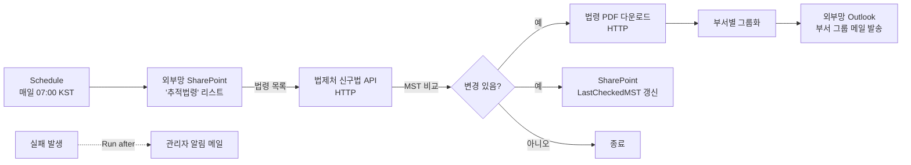

# 법령변경 자동 알림 설계서

> 본 문서는 ms-design-agents 페르소나 시스템이 협업하여 작성한 설계서다.

| 항목 | 내용 |
|------|------|
| 작성일 | 2026-05-23 |
| 프로젝트명 | 법령변경알림 |
| 망 배치 결정 | **외부망 단독 (패턴 B)** |
| 사용 기술 | Power Automate (Cloud Flow), SharePoint, 법제처 OpenAPI |
| Copilot Studio 사용 여부 | 아니오 |

---

## 1. 개요

### 1.1 요청사항

> 법제처 사이트에서 SharePoint 리스트에서 관리하는 법령(법률, 규정) 등이 변경될 경우, 신구법 API로 변경 내용을 파악하고 바뀐 법령들을 모두 모아서 변경된 법령이 있다면 법령 PDF 파일까지 함께 메일로 전달하는 Power Automate 플로우.

### 1.2 자동화 목표

회사가 추적 중인 법령의 개정·신설을 매일 자동으로 감지하고, 변경이 발견되면 담당 부서 그룹 메일로 법령 원문 PDF와 함께 알림을 발송한다. 컴플라이언스 담당자가 매일 법제처 사이트를 수동으로 모니터링하는 작업을 제거한다.

### 1.3 사용자 측 사전 확인 사항 (Security 조건부 통과)

설계 진행 전 다음을 확인할 것:

1. **부서-법령 매핑 정보(부서 그룹 메일 주소 + 추적 법령 목록)의 외부망 SharePoint 저장이 사내 정보보안 정책상 허용되는지** — 정보보안팀 확인 필수
2. 법제처 OpenAPI 인증 코드(OC)의 외부망 보관 방식 (Secure Input + 환경 변수 권장)
3. 메일 첨부 용량(25MB) 초과 시 동작 방식 합의 — 본 설계는 "초과 시 SharePoint 링크로 전환"을 명시

### 1.4 처리 대상 데이터

| 데이터 항목 | 종류 | 출처 | 개인정보 여부 |
|------------|------|------|--------------|
| 법령 본문 (원문, PDF) | 공개 데이터 | 법제처 OpenAPI | ❌ |
| 법령 일련번호 (MST), 공포일자 | 공개 데이터 | 법제처 OpenAPI | ❌ |
| 추적 법령 목록 (회사 관심 법령) | 회사 메타정보 | 외부망 SharePoint | ❌ (단, 조직 정보로 보안 정책 검토 대상 — §1.3) |
| 부서 그룹 메일 주소 | 회사 메타정보 | 외부망 SharePoint | ❌ (그룹 메일, 개인 식별 없음) |

---

## 2. 아키텍처

### 2.1 다이어그램



### 2.2 컴포넌트 표

| # | 컴포넌트 | 역할 | 위치 | 사용 기술 |
|---|---------|------|------|----------|
| 1 | 추적법령 리스트 | 회사 관심 법령 마스터 | 외부망 | SharePoint List |
| 2 | 일정 트리거 | 매일 자동 실행 | 외부망 | Power Automate (Schedule) |
| 3 | 법제처 신구법 API 호출 | 변경 감지 | 외부망 | Power Automate (HTTP, Premium) |
| 4 | 비교·분기 로직 | MST 비교 후 변경 판단 | 외부망 | Power Automate (Variable, Condition) |
| 5 | 법령 PDF 다운로드 | 원문 PDF 취득 | 외부망 | Power Automate (HTTP) |
| 6 | 부서별 메일 발송 | 알림 | 외부망 | Power Automate (Outlook V2) |
| 7 | 실패 처리 | 관리자 알림 | 외부망 | Power Automate (Run after) |
| 8 | OC 코드 보관 | 인증 정보 | 외부망 | 환경 변수 + Secure Input |

---

## 3. 망 배치 결정 근거

[workflow/decision_tree.md](../../workflow/decision_tree.md) 적용:

| 질문 | 응답 | 근거 |
|------|------|------|
| Q1 개인정보 처리 | 아니오 | 부서 그룹 메일만 사용. 개인 식별 없음 |
| Q3 외부 API/데이터 의존 | **예** | 법제처 OpenAPI, PDF 원문 다운로드 |
| Q4 수신자 = 내부 직원 | (부분) | 메일은 외부망 Outlook → 인터넷 → 회사 메일 게이트웨이로 도달. 표준 외부 메일 채널이므로 별도 게이트웨이 설계 불필요 |
| Q5 알림에 개인정보 | 아니오 | 부서 단위 일괄 |

**결정: 패턴 B — 외부망 단독**

### 대안 검토

- **패턴 A (내부망 단독)**: ❌ 법제처 API가 외부 인터넷이라 내부망에서 호출 불가
- **패턴 C (외부망 → 내부망 연계)**: ❌ 수신자가 부서 그룹 메일이고 개인 식별이 없어 별도 게이트웨이 설계가 과잉. 단순한 외부망 메일 발송으로 충분

---

## 4. Power Automate 플로우 명세

### 4.1 플로우 개요

| 항목 | 값 |
|------|----|
| 플로우명 | `LawChangeMonitor_External` |
| 위치 | 외부망 M365 |
| 환경(Environment) | 외부망 Default 환경 (또는 사내 표준 환경) |
| 트리거 | Recurrence |
| 실행 빈도 | 매일 07:00 KST |
| 예상 일 호출 횟수 | 추적 법령 N개 × API 2회(비교 + PDF) ≈ 200회 (N=100 가정) |
| 라이선스 등급 | **Premium** (HTTP 커넥터) |

### 4.2 사용 커넥터

| 커넥터 | 등급 | 테넌트 | 용도 |
|--------|------|--------|------|
| Schedule | Standard | 외부망 | 트리거 |
| SharePoint | Standard | 외부망 | 법령 마스터 조회·갱신 |
| HTTP | **Premium** | 외부망 | 법제처 API, PDF 다운로드 |
| Office 365 Outlook | Standard | 외부망 | 메일 발송 |
| Data Operations | Standard | 외부망 | Parse JSON, Filter, Select, Compose |
| Variable | Standard | 외부망 | 변수 관리 |

### 4.3 사전 준비 — SharePoint '추적법령' 리스트 스키마

| 컬럼명 | 타입 | 예시 값 | 용도 |
|--------|------|---------|------|
| Title | 단일 줄 텍스트 | `개인정보보호법` | 법령명 |
| LawId | 단일 줄 텍스트 | `259844` | 법제처 법령 일련번호 (MST) |
| LastCheckedMST | 단일 줄 텍스트 | `259844` | 마지막 확인 시점의 MST (변경 감지 키) |
| LastPromulgationDate | 날짜 | `2024-09-15` | 마지막 확인 공포일자 (참고용) |
| DepartmentEmail | 단일 줄 텍스트 | `compliance@company.com` | 담당 부서 그룹 메일 |
| IsActive | 예/아니오 | Yes | 추적 활성화 여부 |

### 4.4 단계 명세

| 순번 | 단계명 | 액션 종류 | 커넥터 | 입력 매개변수 | 출력 변수 | 비고 |
|------|--------|----------|--------|---------------|-----------|------|
| 1 | 트리거 | Recurrence | Schedule | Frequency=Day, Interval=1, StartTime=07:00, TimeZone=Korea Standard Time | - | - |
| 2 | 변경 목록 변수 초기화 | Initialize variable | Variable | Name=`changedLaws`, Type=Array, Value=`[]` | changedLaws | - |
| 3 | 추적 법령 조회 | Get items | SharePoint | Site=외부망 사이트, List=`추적법령`, Filter Query=`IsActive eq 1` | trackedLaws | 페이지 한도 5000 |
| 4 | 반복 | Apply to each | Built-in | `@trackedLaws.value` | currentLaw | 병렬 제한 1 (API 한도 보호) |
| 4.1 | 신구법 비교 호출 | HTTP | HTTP | Method=`GET`, URI=`https://www.law.go.kr/DRF/lawService.do?OC=@{environment.OC_CODE}&target=law&MST=@{items('Apply_to_each')?['LawId']}&type=JSON` | apiResponse | OC 코드는 환경 변수 |
| 4.2 | JSON 파싱 | Parse JSON | Data Operations | Content=`@body('신구법_비교_호출')`, Schema=법령 응답 스키마 (부록 §9.1 참조) | parsed | - |
| 4.3 | 조건 — MST 변경 감지 | Condition | Built-in | `@parsed?['법령']?['법령MST']` ≠ `@items('Apply_to_each')?['LastCheckedMST']` | - | **MST 비교** (공포일자 비교보다 안전) |
| 4.3a | (True) PDF 다운로드 | HTTP | HTTP | Method=`GET`, URI=`https://www.law.go.kr/DRF/lawService.do?OC=@{environment.OC_CODE}&target=law&MST=@{items('Apply_to_each')?['LawId']}&type=PDF` | pdfResponse | Response Body는 binary |
| 4.3b | 변경 목록에 추가 | Append to array variable | Variable | Name=`changedLaws`, Value=`{ "lawName": "@{items('Apply_to_each')?['Title']}", "newMST": "@{parsed.법령.법령MST}", "promulgationDate": "@{parsed.법령.공포일자}", "departmentEmail": "@{items('Apply_to_each')?['DepartmentEmail']}", "pdfContent": "@{base64(body('PDF_다운로드'))}" }` | changedLaws | - |
| 4.3c | 마스터 갱신 | Update item | SharePoint | Id=`@items('Apply_to_each')?['ID']`, LastCheckedMST=`@parsed.법령.법령MST`, LastPromulgationDate=`@parsed.법령.공포일자` | - | - |
| 5 | 조건 — 변경 있음 | Condition | Built-in | `length(variables('changedLaws')) > 0` | - | - |
| 5.1 | (True) 부서 목록 추출 | Select | Data Operations | From=`@variables('changedLaws')`, Map=`@item().departmentEmail` | departmentList | - |
| 5.2 | 부서 중복 제거 | Compose | Data Operations | `@union(body('Select'), body('Select'))` | uniqueDepartments | - |
| 5.3 | 부서별 반복 | Apply to each | Built-in | `@outputs('Compose')` | currentDept | - |
| 5.3.1 | 해당 부서 법령 필터 | Filter array | Data Operations | From=`@variables('changedLaws')`, Condition=`item().departmentEmail` equals `@items('Apply_to_each_부서')` | deptLaws | - |
| 5.3.2 | 메일 본문 조립 | Compose | Data Operations | HTML 표 — 법령명, 공포일자, MST (부록 §9.2 참조) | mailBody | - |
| 5.3.3 | 첨부 배열 조립 | Select | Data Operations | From=`@body('Filter_array')`, Map=`{ "Name": "@{item().lawName}_@{item().promulgationDate}.pdf", "ContentBytes": "@{item().pdfContent}" }` | attachments | - |
| 5.3.4 | 총 첨부 용량 계산 | Compose | Data Operations | `@div(length(string(body('Select_첨부'))), 1024)` (KB 환산) | attachmentSizeKB | 25MB ≈ 25600 KB 초과 검사 |
| 5.3.5 | 조건 — 용량 초과 분기 | Condition | Built-in | `attachmentSizeKB` < `20000` (안전 마진 포함 20MB) | - | - |
| 5.3.5a | (True, 용량 OK) 메일 발송 (첨부 포함) | Send an email (V2) | Office 365 Outlook | To=`@items('Apply_to_each_부서')`, Subject=`[법령변경 알림] @{length(body('Filter_array'))}건의 법령이 변경되었습니다 (@{formatDateTime(utcNow(), 'yyyy-MM-dd')})`, Body=`@outputs('메일_본문_조립')`, IsHtml=Yes, Attachments=`@body('Select_첨부')` | - | - |
| 5.3.5b | (False, 용량 초과) PDF SharePoint 업로드 | Create file (반복) | SharePoint | Site=외부망, Folder Path=`/법령변경알림/@{utcNow('yyyy-MM-dd')}/`, File Name·Content 각각 매핑 | uploadedFiles | - |
| 5.3.5c | (False) 메일 발송 (링크 본문) | Send an email (V2) | Office 365 Outlook | To=`@items('Apply_to_each_부서')`, Body=용량 초과 안내 + SharePoint 링크 목록 | - | - |
| 6 | (Run after = failed/timed out — 플로우 최상위) 실패 시 관리자 알림 | Send an email (V2) | Office 365 Outlook | To=관리자 메일, Subject=`[법령변경알림 실패] @{utcNow('yyyy-MM-dd')}`, Body=실패 단계명 + 워크플로우 실행 URL | - | Security 조건 3 |

### 4.5 변수 목록

| 변수명 | 타입 | 초기값 | 용도 |
|--------|------|--------|------|
| `changedLaws` | Array | `[]` | 변경 감지된 법령 객체 누적 |
| (환경 변수) `OC_CODE` | String | 법제처 발급값 | API 인증 코드. Secure Input |

### 4.6 에러 핸들링

| 단계 | 실패 시 동작 |
|------|-------------|
| HTTP (신구법 비교) | 자동 재시도 3회 (지수 백오프, Power Automate 기본). 그래도 실패 시 해당 법령 스킵하고 다음 법령으로 진행 (Configure run after 사용) |
| HTTP (PDF 다운로드) | 자동 재시도 3회. 실패 시 해당 법령은 PDF 없이 본문에만 포함 (PDF 없음 표시) |
| SharePoint Update | 자동 재시도 3회 |
| Outlook 발송 | 자동 재시도 3회. 실패 시 관리자 알림 (단계 6) |
| 플로우 전체 | 단계 6의 Run after = failed/timed out 로 관리자 메일 |

### 4.7 처리량·한도 검토

- **법제처 API**: 일 1,000회 한도 (등급에 따라 다름). 추적 법령 100개 × 2회 = 200회 < 1,000회. 안전 마진 충분.
- **Outlook 첨부**: 25MB. 단계 5.3.5에서 분기 처리.
- **Power Automate 처리량**: Premium 라이선스 기본 한도 내 충분.

### 4.8 DLP 정책 영향

- HTTP (Premium) 커넥터가 회사 외부망 DLP 정책의 Business 그룹에 포함되어 있어야 함
- SharePoint, Outlook 모두 동일 그룹 권장
- Premium 커넥터 사용 권한이 플로우 소유자에게 있어야 함

---

## 5. Copilot Studio 구성 명세

해당 없음 — 본 자동화는 Power Automate 단독으로 구성.

---

## 6. 보안 검토 결과

[templates/security_checklist.md](../../templates/security_checklist.md) 적용 결과:

| 카테고리 | 항목 | 결과 | 근거 |
|---------|------|------|------|
| A. 망분리 | A1-A5 모두 | ✅ | 외부망 단독, 내부망 컴포넌트 없음 |
| B. 개인정보 | B1 외부망 처리 | ⚠️ 조건부 | 부서 매핑 정보 외부망 저장 — §1.3 정책 확인 조건 |
| B. 개인정보 | B2 외부 API 전송 | ✅ | 법제처 API에는 MST만 전송 |
| B. 개인정보 | B3 알림 본문 | ✅ | 부서 단위, 개인 식별 없음 |
| B. 개인정보 | B4 최소 수집 | ✅ | 법령 ID와 부서 메일만 |
| B. 개인정보 | B5-B6 보존기간 | N/A | 개인정보 미보유 |
| C. 민감정보 | C1 | N/A | 미처리 |
| D. 인증·인가 | D1 서비스 계정 | ⚠️ → ✅ | OC 코드 환경 변수 + Secure Input 분리 (§4.5) |
| D. 인증·인가 | D2 최소 권한 | ✅ | Outlook 발신, SharePoint 특정 리스트 권한만 |
| D. 인증·인가 | D3 익명 호출 | ✅ | 법제처 API는 OC 인증, 내부 시스템 직접 도달 없음 |
| E. 감사·로깅 | E1 실행 이력 | ✅ | Power Automate 기본 28일 |
| E. 감사·로깅 | E3 실패 알림 | ⚠️ → ✅ | 단계 6 추가 (§4.4) |
| F. 외부 AI | 전체 | N/A | AI 미사용 |
| G. 데이터 이송 | 전체 | N/A | 망간 이송 없음 (외부망 단독) |

**최종 보안 판정: 조건부 통과**

운영 시 모니터링 항목:
- 월 1회: 부서-법령 매핑 정보 보안등급 재검토
- 분기 1회: 법제처 API 호출 횟수 모니터링 (한도 80% 도달 시 경고)
- 변경 시: 새 법령 추가 시 부서 매핑 정확성 확인

---

## 7. 구현 단계별 가이드

### 7.1 사전 준비

1. 정보보안팀 승인: 부서-법령 매핑 정보의 외부망 SharePoint 저장 허용 여부
2. 법제처 OpenAPI 회원가입 및 OC 코드 발급 (https://open.law.go.kr)
3. 외부망 Power Automate Premium 라이선스 확보
4. 외부망 SharePoint 사이트 선정 및 '추적법령' 리스트 생성 (§4.3 스키마)
5. 외부망 환경에 환경 변수 `OC_CODE` 생성 — Secure Input 처리
6. 관리자 알림 수신용 메일 주소 확보

### 7.2 SharePoint 리스트 생성

1. [스크린샷 위치 1] 외부망 SharePoint > 추적 대상 사이트 > 새로 만들기 > 리스트
2. 이름: `추적법령` (영문 내부 이름은 `TrackedLaws` 권장)
3. §4.3 스키마대로 컬럼 추가
4. 초기 데이터 입력 — 추적할 법령 1~2개로 테스트

### 7.3 환경 변수 등록

1. [스크린샷 위치 2] Power Apps Maker Portal > 솔루션 > 새 솔루션 생성
2. 솔루션 내부 > 새로 만들기 > 환경 변수
3. 이름: `OC_CODE`, 데이터 형식: Secret, 현재 값: 발급받은 OC 코드
4. [스크린샷 위치 3] 환경 변수 저장 후 솔루션 게시

### 7.4 Power Automate 플로우 생성

1. [스크린샷 위치 4] Power Automate Maker Portal > 새 자동 클라우드 흐름 > 인스턴트 → 예약(Schedule) 선택
2. 트리거 설정: §4.4 #1
3. §4.4 표 순서대로 액션 추가
4. [스크린샷 위치 5] HTTP 액션의 URI에서 OC 코드 부분을 환경 변수로 참조 — Add dynamic content > 환경 변수 > OC_CODE
5. 각 단계의 Configure run after 설정 (§4.6)
6. 플로우 전체에 대한 최상위 "Configure run after = failed/timed out" 액션 추가 (관리자 메일)

### 7.5 테스트 시나리오

| 시나리오 | 입력 | 기대 결과 |
|---------|------|----------|
| 정상 케이스 (변경 없음) | SharePoint의 모든 법령이 최신 | API 호출 후 changedLaws 빈 배열, 메일 미발송, 마지막 단계 정상 종료 |
| 정상 케이스 (변경 있음) | LastCheckedMST를 임의로 이전 값으로 수동 변경 | 변경 감지, 부서 메일 수신, PDF 첨부 확인 |
| 빈 리스트 | IsActive=Yes 항목이 없음 | trackedLaws 빈 배열, 정상 종료 |
| API 실패 | 잘못된 OC 코드 | 3회 재시도 후 실패. 관리자 알림 메일 도달 |
| 용량 초과 | 30MB+ 분량의 변경 발생을 인위적으로 시뮬레이션 | 5.3.5b/c 분기로 SharePoint 업로드 + 링크 메일 |
| 부서 그룹화 | 같은 부서에 매핑된 법령 2개 변경 | 1통의 메일에 2개 첨부 |

### 7.6 운영 전환 체크리스트

- [ ] 정보보안팀 승인 문서 보관
- [ ] 추적 법령 리스트 초기 데이터 입력 완료
- [ ] 환경 변수 OC_CODE 등록 및 Secret 처리
- [ ] 관리자 알림 메일 주소 확정
- [ ] 5개 테스트 시나리오 통과
- [ ] 플로우 소유자에 백업 운영자 1명 추가 (단일 장애점 방지)
- [ ] DLP 정책 검토 완료

---

## 8. 운영 가이드

### 8.1 모니터링

- **일일**: Power Automate 실행 이력 확인. 실패 시 관리자 메일 도달 여부.
- **월별**: 법제처 API 호출 횟수 (한도 대비). 추적 법령 수 변화.
- **분기**: 부서-법령 매핑의 정확성 검토 (담당자 변경 반영).

### 8.2 추적 법령 추가·수정

1. SharePoint '추적법령' 리스트에 새 행 추가
2. LawId(MST)는 법제처 사이트에서 해당 법령 페이지 URL의 lsiSeq 값 확인
3. LastCheckedMST는 등록 시점의 MST와 동일하게 입력
4. DepartmentEmail은 회사 부서 그룹 메일

### 8.3 변경 관리

- 법제처 OpenAPI 스펙 변경 시 §4.4의 Parse JSON 스키마 갱신 필요
- 신규 부서 추가 시 SharePoint 컬럼 변경 없이 행 추가만으로 가능
- 회사 메일 도메인 변경 시 환경 변수 또는 SharePoint 컬럼 일괄 수정

---

## 9. 부록

### 9.1 법제처 lawService.do 응답 스키마 (예시)

실제 호출 결과로 Generate Schema 기능을 사용해 확정할 것. 아래는 참고용 골격:

```json
{
  "법령": {
    "법령ID": "string",
    "법령MST": "string",
    "법령명_한글": "string",
    "공포일자": "yyyyMMdd",
    "공포번호": "string",
    "시행일자": "yyyyMMdd",
    "법령구분명": "string",
    "소관부처명": "string",
    "조문": { "조문단위": [...] }
  }
}
```

### 9.2 메일 본문 HTML 템플릿 (예시)

```html
<p>다음 법령의 개정이 확인되었습니다.</p>
<table border="1" cellpadding="6" cellspacing="0">
  <tr><th>법령명</th><th>공포일자</th><th>법령MST</th></tr>
  @{join(map(body('Filter_array'), '<tr><td>', item().lawName, '</td><td>', item().promulgationDate, '</td><td>', item().newMST, '</td></tr>'), '')}
</table>
<p>원문 PDF는 첨부 파일을 참조하시기 바랍니다.</p>
<p>본 메일은 LawChangeMonitor_External 자동화에서 발송되었습니다. 문의: 관리자 메일</p>
```

> 위 표현식은 의사 코드 — 실제 Power Automate에서는 Apply to each 또는 Select + Join 조합으로 구성.

### 9.3 참고 문서

- 법제처 OpenAPI 가이드: https://open.law.go.kr
- Power Automate Schedule 트리거: https://learn.microsoft.com/connectors/connectors-native-recurrence/
- Power Automate HTTP 커넥터: https://learn.microsoft.com/connectors/http/
- Outlook 첨부 용량: https://learn.microsoft.com/exchange/recipients/message-size-limits

### 9.4 변경 이력

| 날짜 | 변경 내용 | 작성자 |
|------|----------|--------|
| 2026-05-23 | 최초 작성 (외부망 단독, 패턴 B) | ms-design-agents |
