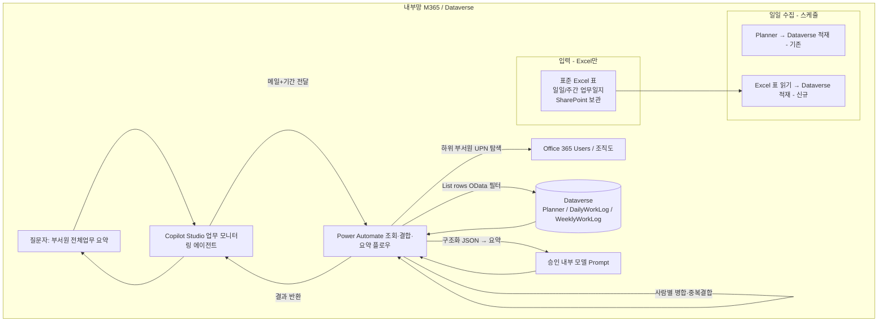

# 업무 모니터링 에이전트 설계서

> 본 문서는 ms-design-agents가 자동 생성한 설계서다.

| 항목 | 내용 |
|------|------|
| 작성일 | 2026-05-28 |
| 프로젝트명 | 업무 모니터링 에이전트 (Planner + 업무일지 통합) |
| 요청자 | (사용자) |
| 망 배치 결정 | **내부망 단독 (패턴 A)** |
| 사용 기술 | Copilot Studio + Power Automate + Dataverse + Excel Online(Business) + Office 365 Users + (요약) 회사 승인 내부 모델 |

---

## 1. 개요

### 1.1 요구사항
> 전사 MS Planner 데이터를 매일 아침 수집해 Dataverse에 적재 중. 업무 모니터링 에이전트에 접속해 예: "부서원 전체업무 요약"이라고 입력하면 Power Automate를 호출해 질문자 메일로 하위 부서원을 탐색하고, Dataverse 쿼리로 부서원들의 Planner 데이터를 프로젝트→플랜→버킷→태스크→체크리스트로 요약해 준다(여기까지 구현·동작 양호). **그러나 모든 업무가 Planner에만 있지 않다.** 일일업무일지·주간업무일지에 기록되는 업무도 종합해 답변해야 한다. 이를 (a) 에이전트를 분리해 답변을 다시 취합할지, (b) 일지를 RAG로 두고 날짜 기반으로 Planner와 결합할지 구조가 명확치 않다. 또한 일일/주간 업무일지를 Copilot Studio가 잘 해석할 수 있는 구조로 표준화해야 한다(현재는 엑셀에 가로로 날짜 열을 늘려 사용 — 비표준). **제약: 회사 문화상 테이블/폼 등록 불가, Power Apps 사용·제작 불가 → 현실적으로 Excel로 관리.**

### 1.2 자동화 목표
질문자(상위자)가 자연어로 요청하면 **하위 부서원들의 모든 업무**(Planner + 일일/주간 업무일지)를 **전수·정확하게 집계·결합**해 사람별·기간별로 요약 제공.

### 1.3 현재 구현(유지) & 추가 범위 & 제약
| 구분 | 상태 |
|------|------|
| 전사 Planner → Dataverse 일일 수집 | ✅ 구현됨(유지) |
| 질문자 메일 → 하위 부서원 탐색 | ✅ 구현됨(유지) |
| Dataverse 쿼리 → Planner 요약(프로젝트>플랜>버킷>태스크>체크리스트) | ✅ 구현됨(유지) |
| **일일/주간 업무일지 통합** | 🆕 본 설계 |
| **업무일지 표준화(입력 도구 제약 반영)** | 🆕 본 설계 |
| **제약: Power Apps/폼/테이블 등록 불가 → Excel 입력** | ⛔ 설계 전제 |

### 1.4 처리 대상 데이터
| 데이터 | 종류 | 출처 | 개인정보 |
|--------|------|------|----------|
| Planner 업무 | 구조화 | Dataverse(기존 수집) | ✅ (직원 업무·이름) |
| 일일업무일지 | 구조화(표준 Excel→Dataverse) | Dataverse | ✅ |
| 주간업무일지 | 구조화(표준 Excel→Dataverse) | Dataverse | ✅ |
| 조직도(상하위) | 구조화 | Office 365 Users / Dataverse | ✅ |

---

## 2. 핵심 설계 결정 — 업무일지 통합 아키텍처

> 사용자의 핵심 고민(분리 에이전트 취합 vs RAG)에 대한 결정. 근거: Microsoft Learn — 생성형 답변은 "상위 트렌드 요약"용이며 전수 집계에 부적합("summarizes rather than itemizes", 일반 질의는 보통 상위 3건만 반환). 전수·결정적 집계는 Power Automate **List rows + OData 필터**가 적합.

### 2.1 옵션 비교
| 옵션 | 방식 | 장점 | 단점 | 판정 |
|------|------|------|------|------|
| **A. 에이전트 분리 + 취합** | Planner 에이전트 + 일지 에이전트 각각 답변 → 취합 에이전트가 다시 합침 | 모듈 분리 | 취합·중복결합이 LLM 의존(**비결정적**), 다단 호출로 지연·비용·디버깅↑ | ❌ |
| **B. 일지 RAG + 날짜 결합** | 일지를 지식 소스(RAG)로 두고 검색 후 Planner와 결합 | 비정형 텍스트 그대로 | **RAG는 top-k 검색이라 부서원 전원×기간 전수 집계 불가**(누락 위험). 행 수준 권한·중복결합 난해. MS도 전수 itemize 비권장 | ❌ (핵심 용도 부적합) |
| **C. 일지 구조화 → Dataverse 통합 → 결정적 쿼리** | 일지를 표준 Excel→Dataverse 적재(Planner처럼), `List rows`로 부서원+기간 **전수** 조회 후 사람별 결합·요약 | 전수·결정적 집계, Planner와 **동일 경로·동일 사람/날짜 조인**, 행 수준 권한, 일관 품질 | 표준 Excel·수집 파이프라인 1회 투자 | ✅ **채택** |

### 2.2 채택안 요지
- 일일/주간 업무일지를 **표준 Excel 표로 작성 → Power Automate가 Dataverse 테이블에 적재**(§5, §6). **Power Apps·폼 불필요.**
- 기존 Planner 조회 플로우를 확장해 **하나의 플로우에서 Planner + 일일 + 주간을 부서원 UPN·기간으로 전수 조회 → 사람별 병합 → 요약**(§7).
- 단일 에이전트·단일 결정적 경로 유지 → 정확도·권한·유지보수 우위.
- **RAG는 핵심 경로에서 배제.** 단, 향후 자유 질의 보조가 필요하면 Dataverse를 지식 소스로 별도 토픽에 선택적 추가 가능(집계 답변과 분리).

---

## 3. 아키텍처

### 3.1 구성도


### 3.2 컴포넌트
| 컴포넌트 | 역할 | 기술 |
|---------|------|------|
| 수집 플로우(Planner) | 전사 Planner → Dataverse 적재 | Power Automate(기존) |
| 수집 플로우(업무일지) | **표준 Excel 표 → Dataverse 적재** | Power Automate + Excel Online(Business)(신규) |
| 조회·결합·요약 플로우 | 부서원·기간 전수 조회 + 병합 + 요약 | Power Automate(확장) |
| Dataverse 테이블 | Planner / DailyWorkLog / WeeklyWorkLog | Dataverse |
| 부서원 탐색 | 질문자 하위 부서원 UPN | Office 365 Users / 조직도 |
| 요약 | 구조화 데이터 → 자연어 요약 | 회사 승인 내부 모델(Prompt) |
| 에이전트 | 질의 의도·기간 수집·호출 | Copilot Studio(내부망 채널) |

---

## 4. 망 배치 결정 근거

`workflow/decision_tree.md` 적용:
- Q1 (개인정보): **예** — 직원 업무·이름·일지.
- Q2/Q3 (외부 의존): **아니오** — Planner/Dataverse/조직도 모두 M365 내부, 요약도 **회사 승인 내부 모델** 사용.
- **결정: 패턴 A (내부망 단독).**

> 내부망 Copilot Studio의 생성형 답변·프롬프트는 **회사 승인 내부 모델만** 가능(`constraints/tenant_capabilities.md`). 요약 모델은 반드시 승인 모델로 제한.

---

## 5. 업무일지 표준화 (Copilot Studio가 잘 읽는 구조)

> **에이전트는 일지 파일을 직접 읽지 않는다. Dataverse의 구조화 테이블을 쿼리한다.** 따라서 "잘 읽는 구조" = 깨끗한 관계형 스키마 + 통제 어휘. 현재의 "가로로 날짜 열을 늘린 Excel"은 집계·필터·조인이 모두 불가능한 안티패턴 → **세로(long) 포맷 + Excel 표로 전환**.

### 5.1 표준화 5원칙
1. **세로(long) 포맷** — 1행 = 1업무. 날짜를 열로 늘리지 않는다(현재 방식의 반대).
2. **통제 어휘(선택값)** — 진행상태·업무구분 등은 자유 텍스트 금지, 드롭다운. → 일관 집계·필터.
3. **원자성** — 한 셀/행에 여러 업무를 몰아넣지 않는다.
4. **명시적 키** — 작성자(UPN)·날짜(ISO YYYY-MM-DD)를 컬럼으로. → Planner 조인·부서원 매칭.
5. **Planner 연계 키** — `planner_task_id` 등으로 일지-Planner 중복을 식별·결합.
- 보강: 컬럼 표시명은 사람 친화적으로, **동의어·설명(synonym/description)** 을 부여해 NLU 해석도↑(MS 권고).

### 5.2 일일업무일지 표준 (DailyWorkLog 테이블 / Excel 표 컬럼)
| 내부 컬럼 | 표시명 | 타입 | 통제값/형식 | 필수 |
|----------|--------|------|------------|------|
| author_upn | 작성자 | 텍스트(이메일) | UPN | ✅ |
| department | 부서 | 선택 | 부서 마스터 | ✅ |
| work_date | 업무일자 | 날짜 | YYYY-MM-DD | ✅ |
| category | 업무구분 | 선택 | 기획/개발/운영/회의/지원/교육/기타 | ✅ |
| title | 업무명 | 텍스트 | 1행 1업무 | ✅ |
| detail | 상세내용 | 다중행 텍스트 | - | ⬜ |
| status | 진행상태 | 선택 | 예정/진행중/완료/보류/취소 | ✅ |
| progress | 진척도 | 숫자 | 0~100 | ⬜ |
| hours | 소요시간 | 숫자 | 시간 | ⬜ |
| planner_task_id | 연계 Planner 태스크 | 텍스트 | Planner taskId | ⬜ |
| remark | 비고 | 텍스트 | - | ⬜ |

### 5.3 주간업무일지 표준 (WeeklyWorkLog 테이블 / Excel 표 컬럼)
| 내부 컬럼 | 표시명 | 타입 | 통제값/형식 | 필수 |
|----------|--------|------|------------|------|
| author_upn | 작성자 | 텍스트(이메일) | UPN | ✅ |
| department | 부서 | 선택 | 부서 마스터 | ✅ |
| week_start | 주 시작일 | 날짜 | ISO 주 월요일 | ✅ |
| week_end | 주 종료일 | 날짜 | YYYY-MM-DD | ⬜ |
| item_type | 구분 | 선택 | 금주실적/차주계획/이슈리스크 | ✅ |
| category | 업무구분 | 선택 | (일일과 동일) | ⬜ |
| title | 항목 | 텍스트 | - | ✅ |
| detail | 상세 | 다중행 텍스트 | - | ⬜ |
| status | 상태 | 선택 | 예정/진행중/완료/보류 | ⬜ |
| progress | 진척도 | 숫자 | 0~100 | ⬜ |
| related_plan | 관련 플랜/프로젝트 | 텍스트 | Planner plan/project | ⬜ |
| remark | 비고 | 텍스트 | - | ⬜ |

### 5.4 입력 방식 — 표준 Excel 템플릿 (폼·Power Apps 불가 환경)
회사 문화상 폼/테이블 등록·Power Apps가 불가하므로, **사용자는 익숙한 Excel을 그대로 쓰되 "Excel 표(Table)"로 표준화**한다. Power Automate가 그 표를 읽어 Dataverse에 적재하므로 **Power Apps가 전혀 필요 없다.**

**필수 요건**
1. 데이터는 반드시 **Excel 표(삽입 > 표 / Insert > Table)** 여야 한다. 일반 셀 범위는 Excel Online 커넥터가 읽지 못한다(표 없으면 "테이블을 찾을 수 없음" 오류).
2. **세로(long) 포맷** — 1행 1업무, 고정 헤더(§5.2/§5.3). **가로 날짜 확장 금지.**
3. 통제 컬럼(업무구분·진행상태 등)은 **Excel 데이터 유효성 검사 드롭다운**(Excel 기본 기능, Power Apps 불필요)으로 선택만 가능하게.
4. 업무일자는 날짜 서식 또는 텍스트 `YYYY-MM-DD`로 일관.
5. (선택) 헤더 행 보호 — 사용자는 표에 행만 추가.

**표준 템플릿 배포**
- `일일업무일지_표준.xlsx`(표 이름 `tbl_DailyLog`), `주간업무일지_표준.xlsx`(`tbl_WeeklyLog`)를 사내 배포.
- 작성자·부서는 개인 파일에 미리 채워 재입력 최소화.
- 사용자 체감: "양식 엑셀에 한 줄씩 적기" → 시스템엔 완전 구조화 데이터.

**파일 보관 방식 (택1)**
- **(A, 권장) 개인별 워크북**: `/업무일지/2026/팀명/홍길동_일일.xlsx`. 동시편집 충돌 없음, 소유·권한 명확.
- (B) 팀 공유 워크북 1개 + 작성자 열: 파일 수↓, 단 공동편집·표 훼손 주의.

> 참고: Microsoft Lists도 가능하나 "목록 등록"이 문화적으로 폼처럼 받아들여질 수 있어, 본 설계는 **Excel 표를 1순위**로 한다.

---

## 6. 수집 파이프라인 (표준 Excel → Dataverse, 매일)

| 순번 | 단계 | 액션/커넥터 | 비고 |
|-----|------|------------|------|
| 1 | 트리거 | Recurrence(매일 06:00 KST) | 아침 요약 전 |
| 2 | 파일 목록 | SharePoint — 폴더 내 파일 목록 | 업무일지 라이브러리(연/팀) |
| 3 | 각 파일 | Apply to each | |
| 3a | 파일 ID | Get file metadata | Excel 액션은 파일 ID 필요 |
| 3b | 행 읽기 | Excel Online(Business) — **List rows present in a table** | Table=`tbl_DailyLog`/`tbl_WeeklyLog` |
| 3c | 각 행 검증 | Condition | 필수값·통제값·날짜형식 |
| 3d | 적재 | Dataverse — **Upsert(또는 Add a new row)** | 멱등성: §6.1 |
| 4 | 오류 | Scope + 미준수 행 리포트 | 작성자/관리자 알림(누락 가시화) |

### 6.1 멱등성(중복 방지) — 택1
- **(권장) 기간 재적재(delete-reload)**: 매 수집 시 대상 작성자의 최근 N일(예 14일) Dataverse 행을 삭제 후 현재 Excel 행으로 재삽입. **안정적 행 키 불필요**, 재실행해도 중복 없음.
- (대안) **대체 키 Upsert**: Dataverse 대체 키(`author_upn`+`work_date`+`entry_no` 등)로 Upsert. ⚠️ 키 값에 `< > * % & : / \ #` 포함 시 upsert 실패 → **제목을 키로 쓰지 말 것**, 깨끗한 키 사용.

### 6.2 표 작성 위생 (사용자 안내)
- 셀 병합 금지, 중간 빈 행 금지, 헤더는 1행, 시트당 표 1개, 드롭다운 외 임의 값 금지.

### 6.3 레이아웃이 표로 정리 안 되는 기존 양식
복잡한 기존 양식은 **Office Scripts("Run script" 액션)** 로 시트를 파싱해 JSON 추출 후 적재 가능(단 Office Scripts 사용 허용 필요). 단순함 우선이므로 1순위는 Excel 표.

### 6.4 대안 아키텍처 — 수집 없이 조회 시 직접 읽기
소규모면 조회 플로우가 질의 시점에 Excel 표를 직접 `List rows present in a table`로 읽어 Planner와 병합 가능(수집 불필요·항상 최신). 단 파일 多·동시성·**행 수준 권한 부재**로 확장성·보안 약함 → **부서원 多·전사 규모는 Dataverse 적재(권장)**.

---

## 7. 조회·결합·요약 플로우 (기존 확장)

### 7.1 단계
| 순번 | 단계 | 액션/커넥터 | 입력 | 비고 |
|-----|------|------------|------|------|
| 1 | 트리거 | Copilot 호출 | 질문자 UPN, 기간 | §8 |
| 2 | 하위 부서원 탐색 | Office 365 Users / 조직도 쿼리 | 질문자 UPN | 기존 로직, 권한 범위=하위자 |
| 3 | Planner 조회 | Dataverse **List rows** | filter: `assignee_upn in (...) and 기간` | 기존 |
| 4 | 일일일지 조회 | Dataverse **List rows** | filter: `author_upn in (...) and work_date ge X and le Y` | 신규 |
| 5 | 주간일지 조회 | Dataverse **List rows** | filter: `author_upn in (...) and week_start in 기간` | 신규 |
| 6 | 사람별 병합 | Select/Compose | UPN 기준 그룹화 | - |
| 7 | 중복 결합 | 조건 | `planner_task_id` 매칭 시 1건으로(추적=Planner, 상세/공수=일지) | - |
| 8 | 요약 | Prompt(승인 내부 모델) | 구조화 JSON 입력 | §7.3 |
| 9 | 반환 | Respond to agent | 요약 텍스트/카드 | - |

### 7.2 쿼리 주의 (OData/List rows)
- 다수 UPN은 `in` 연산자로 한 번에 필터, 날짜는 `ge`/`le`.
- **조건 500개 한계** — 부서원이 많으면 UPN 배치 분할/페이징(5,000행 초과 시 skip token/FetchXML 페이징).
- 선택열(Select columns)로 필요한 컬럼만 → 성능.
- FetchXML 집계(aggregate)는 List rows에서 미지원 → **집계는 플로우/요약 단계에서 수행**.

### 7.3 요약 출력 구조 (사람별)
```
[홍길동] (영업1팀)
■ Planner 업무
  프로젝트 > 플랜 > 버킷 > 태스크(상태/진척) > 체크리스트
■ 업무일지 업무 (Planner 외 추가분)
  - 2026-05-27 [운영] 거래처 응대 (완료)
  - 주간(차주계획) 신규 제안서 작성
■ 종합: 진행중 N건 / 완료 M건 / 이슈 K건
```
- 중복(planner_task_id 매칭): "Planner 태스크 X — 일지 상세/공수 결합" 한 줄로.
- 일지 미작성자: "업무일지 미작성"으로 표기(누락 가시화).

---

## 8. Copilot Studio 토픽

| 항목 | 값 |
|------|----|
| 트리거 | "부서원 업무 요약", "전체업무 요약" 등 |
| 기간 수집 | Question/엔티티: 오늘 / 이번주 / 지난주 / 이번달 / 사용자지정 → 절대 날짜로 변환(KST) |
| 호출 | Action 노드 → 조회·결합·요약 플로우(질문자 UPN, 기간 전달) |
| 응답 | 요약 텍스트 또는 사람별 카드 |
| 모델 | 회사 승인 내부 모델만 |

---

## 9. 보안 검토 결과

| 항목 | 결과 | 비고 |
|------|------|------|
| 망분리 | ✅ | 내부망 단독, 외부 의존 없음 |
| 요약 모델 | ⚠️ | **회사 승인 내부 모델만**(직원 업무=개인정보, 외부 LLM 금지) |
| 데이터 접근 범위 | ⚠️ | 질문자는 **자기 하위 부서원만** 조회(권한 상승 방지) → 조직도 기반 필터 + Dataverse 행 수준 보안 |
| Excel 보관 권한 | ⚠️ | 업무일지 라이브러리 접근 통제(작성자·관리자), 수집 후 Dataverse가 권한 기준 |
| 결정적 쿼리의 권한 이점 | ✅ | RAG 대비 행 수준 권한·전수성 우위 |
| 감사 로그 | ⚠️ | 누가 누구 업무를 조회했는지 Purview/플로우 이력 |
| 보존 | ⚠️ | 일지·집계 보존기간 정책 |

**판정: 조건부 통과** — (a) 승인 내부 모델, (b) 하위 부서원으로 접근 범위 제한, (c) 행 수준 보안.

---

## 10. 추가 고려 변수
- **A. 접근 범위(권한 상승 방지)** — 질문자가 상위자가 아니어도 타인 업무를 못 보게 조직도 기준 엄격 제한.
- **B. 기간 파싱** — 상대 표현(이번주/지난주)→절대 날짜, KST 경계.
- **C. Planner-일지 중복** — `planner_task_id`로 결합, 없으면 보완 표기.
- **D. 일지 미작성자** — 공백 가시화 + (선택) 작성 독려 알림.
- **E. 대용량 부서** — UPN 배치/페이징, 요약 토큰 한계 → 사람별 분할 요약 후 통합.
- **F. 시간대** — 수집·조회·요약 모두 KST 고정.
- **G. 표준 미준수 과거 데이터** — 세로 포맷으로 마이그레이션(아래 T).
- **H. 선택값 거버넌스** — 업무구분/상태 마스터 변경 관리(드롭다운 목록 동기화).
- **I. 조직 개편** — 부서·상하위 변경 시 조직도 동기화.
- **J. 요약 품질·환각** — 구조화 입력만 사용(ungrounded 비활성), 수치는 플로우 집계값 제시.
- **K. Excel 위생 리스크** — 표 미지정/셀 병합/임의 값 입력 → 수집 실패. 템플릿 배포 + 검증 + 미준수 리포트로 관리(§6.2).
- **L. 파일 누락·잠금** — 파일 미생성/열림 상태 → 수집 건너뜀+리포트.
- **T. 마이그레이션** — 가로 Excel → 세로(Unpivot) 변환 1회 배치 후 신규는 표준 템플릿으로.

---

## 11. 구현 단계별 가이드
1. **표준 스키마 확정** — DailyWorkLog/WeeklyWorkLog Dataverse 테이블 생성(§5), 선택값 마스터 정의.
2. **표준 Excel 템플릿 제작·배포** — 표(Table) 지정, 데이터 유효성 드롭다운, 보관 라이브러리·명명 규칙(§5.4). 사용자 안내.
3. **과거 데이터 마이그레이션** — 가로→세로 변환 배치(§10-T).
4. **수집 플로우** — Excel 표 → Dataverse 멱등 적재(§6).
5. **조회 플로우 확장** — 기존 Planner 조회에 일일/주간 List rows + 병합/중복결합/요약 추가(§7).
6. **에이전트 토픽** — 기간 수집 + 플로우 호출 + 응답(§8).
7. **권한·보안** — 행 수준 보안, 하위 부서원 범위, 승인 모델 확인.
8. **테스트**(§12).

## 12. 테스트 시나리오
| 시나리오 | 입력 | 기대 |
|---------|------|------|
| 정상 | "이번주 부서원 업무 요약" | Planner+일지 전수 결합 요약 |
| 일지만 있는 업무 | Planner 외 일지 업무 | 누락 없이 포함 |
| 중복 | planner_task_id 매칭 | 1건으로 결합 표기 |
| 미작성자 | 일지 없음 | "업무일지 미작성" 표기 |
| 권한 | 비상위자가 타 부서 조회 | 거부/빈 결과 |
| 대용량 | 부서원 다수 | 페이징·분할 요약 정상 |
| 기간 | "지난주" | 절대 날짜로 정확 필터 |
| Excel 위생 | 표 미지정/임의 값 | 수집 실패 감지 + 미준수 리포트 |
| 재적재 | 같은 날 2회 수집 | 중복 0(멱등) |

## 13. 운영 가이드
- 모니터링: 수집 실패율, 표준 미준수 행, 파일 누락, 조회 플로우 실패, 요약 품질.
- 보존·파기: 일지·집계 보존기간(Purview).
- 변경관리: 선택값 마스터·조직도·승인 모델·템플릿 버전 변경 시 점검.

## 14. 부록
### 14.1 참고 문서 (Microsoft Learn)
- Process math and data queries using generative AI strategies(전수 집계 한계) — https://learn.microsoft.com/microsoft-copilot-studio/guidance/generative-ai-math-data-queries
- Knowledge sources summary(Dataverse RAG 특성) — https://learn.microsoft.com/microsoft-copilot-studio/knowledge-copilot-studio
- Use lists of rows in flows(List rows·OData·페이징) — https://learn.microsoft.com/power-automate/dataverse/list-rows
- Filter rows by using OData / FetchXML — https://learn.microsoft.com/power-apps/developer/data-platform/webapi/query/filter-rows
- Excel Online(Business) — 표 미형식 시 "테이블을 찾을 수 없음" — https://learn.microsoft.com/troubleshoot/power-platform/power-automate/flow-creation/unable-to-find-excel-online-table-in-microsoft-flow
- Use Upsert to Create or Update a record / 대체 키 — https://learn.microsoft.com/power-apps/developer/data-platform/use-upsert-insert-update-record
- Define alternate keys to reference rows — https://learn.microsoft.com/power-apps/maker/data-platform/define-alternate-keys-reference-records
- Run Office Scripts with Power Automate(복잡 레이아웃 대안) — https://learn.microsoft.com/office/dev/scripts/develop/power-automate-integration
- Use your prompt actions in Copilot Studio — https://learn.microsoft.com/ai-builder/use-a-custom-prompt-in-mcs

### 14.2 변경 이력
| 날짜 | 변경 내용 | 작성자 |
|------|----------|--------|
| 2026-05-28 | 최초 작성 — Planner+업무일지 통합(구조화 Dataverse 결정적 쿼리 채택, RAG/분리에이전트 배제), 일일/주간 업무일지 표준 스키마·표준화 5원칙 | ms-design-agents |
| 2026-05-28 | 입력 방식을 표준 Excel 템플릿 기반으로 전환(Power Apps/폼 불가 환경) — Excel 표→Dataverse 적재(List rows present in a table), 데이터 유효성 드롭다운, 멱등 재적재/대체키, Office Scripts·직접읽기 대안 | ms-design-agents |
