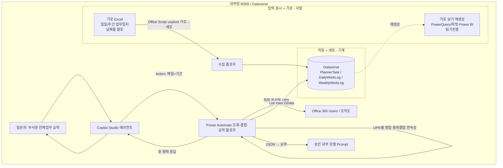
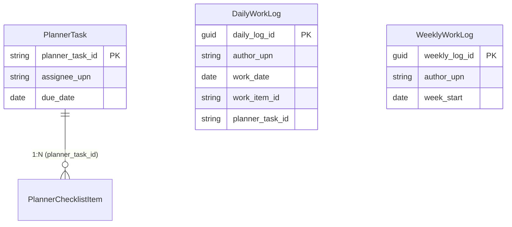
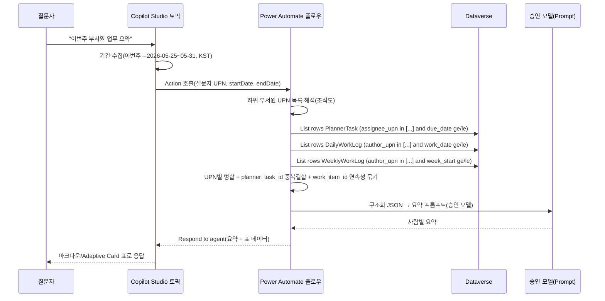

# 업무 모니터링 에이전트 설계서

> 본 문서는 ms-design-agents가 자동 생성한 설계서다.

| 항목 | 내용 |
|------|------|
| 작성일 | 2026-05-28 |
| 프로젝트명 | 업무 모니터링 에이전트 (Planner + 업무일지 통합) |
| 요청자 | (사용자) |
| 망 배치 결정 | **내부망 단독 (패턴 A)** |
| 사용 기술 | Copilot Studio + Power Automate + Dataverse + Excel Online(Business) + Office Scripts + Office 365 Users + (요약) 회사 승인 내부 모델 |

---

## 1. 개요

### 1.1 요구사항
> 전사 MS Planner 데이터를 매일 아침 수집해 Dataverse에 적재 중. 업무 모니터링 에이전트에 접속해 예: "부서원 전체업무 요약"이라고 입력하면 Power Automate를 호출해 질문자 메일로 하위 부서원을 탐색하고, Dataverse 쿼리로 부서원들의 Planner 데이터를 프로젝트→플랜→버킷→태스크→체크리스트로 요약해 준다(여기까지 구현·동작 양호). **그러나 모든 업무가 Planner에만 있지 않다.** 일일업무일지·주간업무일지에 기록되는 업무도 종합해 답변해야 한다. 또한 일일/주간 업무일지를 표준화해야 한다. **제약: 회사 문화상 테이블/폼 등록·Power Apps 불가 → Excel로 관리. 추가로 한국식 "가로(날짜를 열로)" 가독성을 포기할 수 없다(담당자 업무 연속성 파악).**

### 1.2 자동화 목표
질문자(상위자)가 자연어로 요청하면 **하위 부서원들의 모든 업무**(Planner + 일일/주간 업무일지)를 **전수·정확하게 집계·결합**해 사람별·기간별로 요약 제공. **입력·표시 가독성(가로)은 유지하되 저장은 기계 친화(세로)로** 분리한다.

### 1.3 현재 구현(유지) & 추가 범위 & 제약
| 구분 | 상태 |
|------|------|
| 전사 Planner → Dataverse 일일 수집 | ✅ 구현됨(유지) |
| 질문자 메일 → 하위 부서원 탐색 | ✅ 구현됨(유지) |
| Dataverse 쿼리 → Planner 요약(프로젝트>플랜>버킷>태스크>체크리스트) | ✅ 구현됨(유지) |
| **일일/주간 업무일지 통합** | 🆕 본 설계 |
| **가로 입력 가독성 보존 + 세로 저장(자동 변환)** | 🆕 본 설계 |
| **데이터 모델·조인·Copilot 호출 구조 상세** | 🆕 본 설계 |
| **제약: Power Apps/폼/테이블 등록 불가, 가로 가독성 필수** | ⛔ 설계 전제 |

### 1.4 처리 대상 데이터
| 데이터 | 종류 | 출처 | 개인정보 |
|--------|------|------|----------|
| Planner 업무 | 구조화 | Dataverse(기존 수집) | ✅ (직원 업무·이름) |
| 일일업무일지 | 가로 Excel 입력 → 세로 Dataverse | Dataverse | ✅ |
| 주간업무일지 | 가로 Excel 입력 → 세로 Dataverse | Dataverse | ✅ |
| 조직도(상하위) | 구조화 | Office 365 Users / Dataverse | ✅ |

---

## 2. 핵심 설계 결정 — 업무일지 통합 아키텍처

> 근거: Microsoft Learn — 생성형 답변은 "상위 트렌드 요약"용이며 전수 집계에 부적합("summarizes rather than itemizes", 일반 질의는 보통 상위 3건만 반환). 전수·결정적 집계는 Power Automate **List rows + OData 필터**가 적합.

### 2.1 옵션 비교
| 옵션 | 방식 | 장점 | 단점 | 판정 |
|------|------|------|------|------|
| **A. 에이전트 분리 + 취합** | 각각 답변 → 취합 에이전트가 합침 | 모듈 분리 | 취합·중복결합이 LLM 의존(**비결정적**), 지연·디버깅↑ | ❌ |
| **B. 일지 RAG + 날짜 결합** | 일지를 지식 소스(RAG)로 검색 후 결합 | 비정형 그대로 | **RAG는 top-k라 전수 집계 불가**(누락), 권한·중복결합 난해 | ❌ |
| **C. 일지 구조화 → Dataverse 통합 → 결정적 쿼리** | 표준화→Dataverse 적재, `List rows`로 전수 조회 후 결합·요약 | 전수·결정적, Planner와 동일 경로·조인, 행 권한, 일관 품질 | 표준화·수집 1회 투자 | ✅ **채택** |

### 2.2 채택안 요지
- 일지를 **가로 Excel로 작성(가독성 유지) → 자동 세로 변환 → Dataverse 적재**(§5, §6). Power Apps 불필요.
- 단일 플로우에서 **Planner + 일일 + 주간을 부서원 UPN·기간으로 전수 조회 → 사람별 병합 → 요약**(§7).
- **RAG는 핵심 경로 배제**(자유 질의 보조로만 선택적).

---

## 3. 아키텍처

### 3.1 구성도


### 3.2 컴포넌트
| 컴포넌트 | 역할 | 기술 |
|---------|------|------|
| 수집 플로우(Planner) | 전사 Planner → Dataverse | Power Automate(기존) |
| 수집 플로우(업무일지) | **가로 Excel → (unpivot) → 세로 Dataverse** | Power Automate + Office Scripts/Excel(신규) |
| 조회·결합·요약 플로우 | 부서원·기간 전수 조회 + 병합 + 요약 | Power Automate(확장) |
| Dataverse 테이블 | PlannerTask / PlannerChecklistItem / DailyWorkLog / WeeklyWorkLog | Dataverse |
| 가로 보기 | 세로 저장 → 가로 그리드 재생성(읽기전용) | Excel PowerQuery·피벗 / Power BI |
| 요약 | 구조화 데이터 → 자연어·표 요약 | 회사 승인 내부 모델 |
| 에이전트 | 질의·기간 수집·호출·표 렌더 | Copilot Studio(내부망) |

### 3.3 데이터 모델 & 조인 키 (상세)
> **모든 결합의 뼈대는 사람(UPN) + 날짜.** 일지와 Planner는 별도 테이블로 두고 **조회 시점에 플로우에서 조인**한다.

**대표 테이블 구조**
`PlannerTask` (기존 수집)
| 컬럼 | 역할 |
|------|------|
| planner_task_id | PK/대체키, **중복결합 키** |
| assignee_upn | **조인 키(사람)** |
| project_name / plan_name / bucket_name | 계층 |
| task_title / task_status / percent_complete | 업무 |
| due_date / completed_date | **기간 필터 키** |
| last_synced | 수집 시각 |

`PlannerChecklistItem` (PlannerTask 1:N)
| 컬럼 | 역할 |
|------|------|
| checklist_item_id | PK |
| planner_task_id | FK(부모 태스크) |
| item_title / is_checked | 체크리스트 |

`DailyWorkLog`
| 컬럼 | 역할 |
|------|------|
| daily_log_id | PK |
| author_upn | **조인 키(사람)** |
| work_date | **기간 필터 키** |
| **work_item_id** | **연속성 키**(같은 업무의 여러 날 연결) |
| category / title / detail / status / progress / hours | 업무 |
| planner_task_id | **중복결합 키**(일지↔Planner) |

`WeeklyWorkLog`
| 컬럼 | 역할 |
|------|------|
| weekly_log_id | PK |
| author_upn | 조인 키(사람) |
| week_start / week_end | 기간 필터 키 |
| item_type(금주실적/차주계획/이슈) / category / title / detail / status / progress | 업무 |
| related_plan / work_item_id | 연계·연속성 |

**관계도**

**논리 조인 키 요약**
| 목적 | 키 |
|------|----|
| 사람 매칭 | `assignee_upn` = `author_upn` (UPN) |
| 기간 필터 | `due_date`/`completed_date` ↔ `work_date`/`week_start` |
| Planner-일지 중복결합 | `planner_task_id` |
| 업무 연속성(여러 날 동일 업무) | `work_item_id` |

---

## 4. 망 배치 결정 근거
`workflow/decision_tree.md`: Q1(개인정보)=예, Q2/Q3(외부 의존)=아니오(M365 내부+승인 내부 모델) → **패턴 A(내부망 단독)**. 요약 모델은 **회사 승인 내부 모델만**(`constraints/tenant_capabilities.md`).

---

## 5. 업무일지 표준화 (가독성 보존 + 기계 친화)

> 에이전트는 일지 파일이 아니라 **Dataverse 세로 테이블**을 쿼리한다. 가로 가독성은 입력·표시 층에서 유지한다(§5.5).

### 5.1 표준화 5원칙(저장 층)
1. **세로(long) 포맷 저장** — 1행 1업무(×1날짜). 2. **통제 어휘(선택값)**. 3. **원자성**. 4. **명시적 키(UPN·ISO 날짜)**. 5. **Planner 연계 키 + `work_item_id`(연속성)**. 보강: 컬럼에 동의어·설명 부여(NLU).

### 5.2 일일업무일지 저장 스키마 (DailyWorkLog)
| 내부 컬럼 | 표시명 | 타입 | 통제값/형식 | 필수 |
|----------|--------|------|------------|------|
| author_upn | 작성자 | 텍스트(이메일) | UPN | ✅ |
| department | 부서 | 선택 | 부서 마스터 | ✅ |
| work_date | 업무일자 | 날짜 | YYYY-MM-DD | ✅ |
| work_item_id | 업무식별자 | 텍스트 | 가로 시트의 업무행 ID(연속성) | ✅ |
| category | 업무구분 | 선택 | 기획/개발/운영/회의/지원/교육/기타 | ✅ |
| title | 업무명 | 텍스트 | 1행 1업무 | ✅ |
| detail | 상세내용 | 다중행 | - | ⬜ |
| status | 진행상태 | 선택 | 예정/진행중/완료/보류/취소 | ✅ |
| progress | 진척도 | 숫자 | 0~100 | ⬜ |
| hours | 소요시간 | 숫자 | 시간 | ⬜ |
| planner_task_id | 연계 Planner 태스크 | 텍스트 | Planner taskId | ⬜ |
| remark | 비고 | 텍스트 | - | ⬜ |

### 5.3 주간업무일지 저장 스키마 (WeeklyWorkLog)
| 내부 컬럼 | 표시명 | 타입 | 통제값/형식 | 필수 |
|----------|--------|------|------------|------|
| author_upn | 작성자 | 텍스트(이메일) | UPN | ✅ |
| department | 부서 | 선택 | 부서 마스터 | ✅ |
| week_start | 주 시작일 | 날짜 | ISO 주 월요일 | ✅ |
| week_end | 주 종료일 | 날짜 | YYYY-MM-DD | ⬜ |
| item_type | 구분 | 선택 | 금주실적/차주계획/이슈리스크 | ✅ |
| work_item_id | 업무식별자 | 텍스트 | 연속성 | ⬜ |
| category / title / detail / status / progress | (일일과 동일) | | | |
| related_plan | 관련 플랜/프로젝트 | 텍스트 | Planner plan/project | ⬜ |
| remark | 비고 | 텍스트 | - | ⬜ |

### 5.4 입력 방식 — 가로 Excel 유지 (폼·Power Apps 불가)
- 사용자는 **익숙한 가로 Excel(날짜를 열로 늘린 형태)을 그대로** 작성. Power Apps·폼 불필요.
- 통제 컬럼(업무구분·상태)은 **Excel 데이터 유효성 검사 드롭다운**으로 선택.
- 파일 보관: (권장) 개인별 워크북 `/업무일지/2026/팀명/홍길동.xlsx`, (대안) 팀 공유 워크북+작성자 열.

### 5.5 가독성 보존 — "가로 입력 / 세로 저장 / 가로 출력" 3층 분리 (핵심)
한국식 가로 가독성과 기계 친화 세로 저장을 **둘 다** 얻는다.

| 층 | 형태 | 누가/무엇 | 비고 |
|----|------|----------|------|
| **입력** | 가로(날짜=열) | 사람이 Excel 작성 | 기존 문화 유지 |
| **저장** | 세로(1행=1업무×1날짜) | 자동 변환(§6.5) → Dataverse | 집계·조인·권한 |
| **출력/보기** | 가로 표 | 에이전트 표 응답 + (선택) 가로 보기 재생성 | "표처럼" 보임 |

**업무 연속성 보존 — `work_item_id`**
- 가로 시트에서 "한 업무 행"이 여러 날에 걸치는 그 행에 **고유 ID(`work_item_id`)** 를 부여(시트의 행 번호/업무코드).
- 세로로 풀어도 같은 `work_item_id`가 날짜만 다른 여러 행으로 **연결** → "이 업무 5/26~5/28 연속 진행"을 **결정적으로** 산출. (눈으로 보던 연속성을 시스템이 정확히 계산 = 가로보다 강함.)

**가로 "보기" 재생성(읽기전용)** — 사람이 표로 보고 싶을 때:
- Excel **Power Query/피벗** 또는 **Power BI** 로 세로 Dataverse를 "업무 × 날짜" 또는 "사람 × 날짜" 가로 그리드로 재생성.
- 에이전트 답변 자체도 **마크다운 표 / Adaptive Card 표**로 렌더(§7.4) → 채팅에서도 표처럼.

---

## 6. 수집 파이프라인 (가로 Excel → 세로 Dataverse, 매일)

| 순번 | 단계 | 액션/커넥터 | 비고 |
|-----|------|------------|------|
| 1 | 트리거 | Recurrence(매일 06:00 KST) | 아침 요약 전 |
| 2 | 파일 목록 | SharePoint — 폴더 내 파일 목록 | 업무일지 라이브러리 |
| 3 | 각 파일 | Apply to each | |
| 3a | 파일 ID | Get file metadata | |
| 3b | **가로→세로 변환** | **Office Scripts "Run script"** (§6.5) | 세로 레코드 JSON 반환 |
| 3c | 각 행 검증 | Condition | 필수값·통제값·날짜형식 |
| 3d | 적재 | Dataverse **Upsert/Add** | 멱등성 §6.1 |
| 4 | 오류 | Scope + 미준수 리포트 | 작성자/관리자 알림 |

### 6.1 멱등성(중복 방지)
- **(권장) 기간 재적재**: 대상 작성자 최근 N일 Dataverse 행 삭제 후 재삽입. 안정 키 불필요.
- (대안) **대체 키 Upsert**: `author_upn`+`work_date`+`work_item_id`. ⚠️ 키 값에 `< > * % & : / \ #` 금지.

### 6.2 가로→세로 변환 상세 (Office Scripts unpivot — 권장)
가로 시트는 날짜가 **동적 열**이라 일반 "List rows present in a table"로는 부적합. **Office Scripts("Run script")** 가 사용 범위를 코드로 읽어 unpivot한다.
- 동작: 헤더행에서 날짜 열을 식별 → 각 업무행 × 각 날짜열(값 있는 셀)마다 세로 레코드 `{author_upn, work_date=열헤더, work_item_id=행ID, title, status, ...}` 생성 → JSON 배열 반환.
- 행의 정체성을 `work_item_id`로 매핑 → **연속성 자동 보존**.
- Power Automate는 그 JSON을 받아 검증·적재.

### 6.3 Office Scripts 사용 불가 시 대안
- **고정열 주간 템플릿**: 한 시트=한 주, 날짜열 월~일 7개 **고정**. 열이 고정이라 Power Automate `Select`/표현식으로 unpivot 가능(동적 열 문제 없음). 주마다 행 추가.
- 또는 입력만 가로, 사용자가 "저장용 세로 표" 탭을 Excel 수식으로 자동 생성하고 그 표를 "List rows present in a table"로 읽기.

### 6.4 표 작성 위생
- 셀 병합 금지, 중간 빈 행 금지, 헤더 1행, 드롭다운 외 임의 값 금지, 날짜열 형식 일관.

### 6.5 대안 아키텍처 — 수집 없이 조회 시 직접 읽기
소규모면 조회 플로우가 질의 시점에 Excel(또는 Office Script)로 직접 읽어 병합 가능(항상 최신). 단 파일 多·동시성·행 권한 부재 → 전사 규모는 Dataverse 적재 권장.

---

## 7. 조회·결합·요약 & Copilot Studio 호출 구조 (상세)

> **중요: Copilot Studio는 Dataverse를 직접 집계하지 않는다.** 토픽이 **Action 노드로 단일 Power Automate 플로우**를 호출하고, 플로우가 `List rows`로 **결정적 전수 조회→결합→요약**한 결과 문자열을 반환한다. (RAG로 직접 묻지 않는 이유 = 전수 집계 불가, §2.)

### 7.1 호출 시퀀스


### 7.2 OData 필터 예시 (List rows — Filter rows)
```
# PlannerTask
assignee_upn in ('hong@x.com','kim@x.com') and due_date ge 2026-05-25 and due_date le 2026-05-31

# DailyWorkLog
author_upn in ('hong@x.com','kim@x.com') and work_date ge 2026-05-25 and work_date le 2026-05-31

# WeeklyWorkLog
author_upn in ('hong@x.com','kim@x.com') and week_start ge 2026-05-25 and week_start le 2026-05-31
```
- 다수 UPN = `in`. 날짜 = `ge`/`le`. **조건 500개 한계** → 부서원 多면 UPN 배치 분할. 5,000행 초과 → 페이징(skip token/FetchXML).
- Select columns로 필요한 열만(성능). 집계는 플로우/요약 단계에서.

### 7.3 결합 JSON 형태 (사람별 — Prompt 입력)
```json
{
  "person": "hong@x.com", "name": "홍길동", "dept": "영업1팀",
  "planner": [
    { "task_id":"PT-001","project":"A제안","plan":"B","bucket":"진행",
      "task":"제안서 작성","status":"진행중","percent":60,
      "checklist":[{"item":"초안","checked":true},{"item":"검토","checked":false}] }
  ],
  "daily": [
    { "date":"2026-05-26","work_item_id":"W-12","category":"기획","title":"제안서 작성","status":"진행중","linked_task":"PT-001" },
    { "date":"2026-05-27","work_item_id":"W-12","category":"기획","title":"제안서 작성","status":"진행중","linked_task":"PT-001" },
    { "date":"2026-05-27","work_item_id":"W-20","category":"운영","title":"거래처 응대","status":"완료" }
  ],
  "weekly": [ { "week":"2026-05-25","type":"차주계획","title":"고객 미팅 준비" } ]
}
```
- `work_item_id=W-12`가 5/26~5/27 연속 → "제안서 작성 2일 연속 진행"으로 요약.
- `linked_task=PT-001` → Planner 태스크와 **중복결합**(중복 계산 방지, "추적=Planner / 상세·공수=일지").

### 7.4 응답 렌더(표처럼)
- 마크다운 표 또는 Adaptive Card 표로 "업무 × 날짜" 그리드 렌더:
```
홍길동 (영업1팀)         5/25  5/26  5/27  5/28
- 제안서 작성(W-12)        -    진행  진행   -
- 거래처 응대(W-20)        -     -    완료   -
■ Planner: 제안서 작성 60%(체크리스트 1/2)
■ 종합: 진행중 1 / 완료 1
```
- 연속성·표 가독성을 답변에서 재현.

### 7.5 단계 요약
| 순번 | 단계 | 액션 | 비고 |
|-----|------|------|------|
| 1 | 트리거 | Copilot 호출 | 질문자 UPN, 기간 |
| 2 | 부서원 탐색 | 조직도 | 권한 범위=하위자 |
| 3~5 | 3개 테이블 조회 | Dataverse List rows | §7.2 필터 |
| 6 | 병합·중복결합·연속성 | Select/Compose | UPN·planner_task_id·work_item_id |
| 7 | 요약 | Prompt(승인 모델) | §7.3 JSON |
| 8 | 반환 | Respond to agent | 표/요약 |

---

## 8. Copilot Studio 토픽
| 항목 | 값 |
|------|----|
| 트리거 | "부서원 업무 요약", "전체업무 요약" 등 |
| 기간 수집 | 오늘/이번주/지난주/이번달/사용자지정 → 절대 날짜(KST) |
| 호출 | Action 노드 → 조회·결합·요약 플로우(질문자 UPN, 기간) |
| 응답 | 마크다운/Adaptive Card 표(§7.4) |
| 모델 | 회사 승인 내부 모델만 |

---

## 9. 보안 검토 결과
| 항목 | 결과 | 비고 |
|------|------|------|
| 망분리 | ✅ | 내부망 단독 |
| 요약 모델 | ⚠️ | 회사 승인 내부 모델만 |
| 데이터 접근 범위 | ⚠️ | 질문자=자기 하위 부서원만(권한 상승 방지), 조직도 필터 + 행 수준 보안 |
| Excel 보관 권한 | ⚠️ | 일지 라이브러리 접근 통제 |
| 결정적 쿼리 권한 이점 | ✅ | RAG 대비 행 권한·전수성 우위 |
| 감사 로그 | ⚠️ | Purview/플로우 이력 |

**판정: 조건부 통과** — 승인 모델 + 하위 부서원 범위 + 행 수준 보안.

---

## 10. 추가 고려 변수
- **A. 접근 범위(권한 상승 방지)** — 하위자만 조회.
- **B. 기간 파싱** — 상대→절대, KST.
- **C. Planner-일지 중복** — `planner_task_id` 결합.
- **D. 업무 연속성** — `work_item_id`로 묶음(가로 가독성 대체).
- **E. 일지 미작성자** — 공백 가시화/독려.
- **F. 대용량 부서** — UPN 배치/페이징, 분할 요약.
- **G. 시간대** — KST 고정.
- **H. 선택값 거버넌스** — 드롭다운 마스터 동기화.
- **I. 조직 개편** — 조직도 동기화.
- **J. 요약 환각** — 구조화 입력만, 수치는 플로우 집계값.
- **K. Excel 위생** — 표/병합/임의값 → 검증·리포트.
- **L. 가로→세로 변환 신뢰성** — Office Scripts 의존, 미허용 시 고정열 템플릿(§6.3).
- **M. work_item_id 부여 규칙** — 사용자가 헷갈리지 않게 행ID 자동/안내(템플릿에 수식 또는 Office Script가 행번호 기반 생성).
- **T. 마이그레이션** — 기존 가로 데이터 1회 변환 적재.

---

## 11. 구현 단계
1. 표준 스키마(테이블)·선택값 마스터 확정.
2. 가로 Excel 템플릿(유효성 드롭다운, work_item_id 규칙) 제작·배포.
3. **Office Script(가로→세로 unpivot) 작성** 또는 고정열 템플릿(§6.3).
4. 수집 플로우(멱등 적재).
5. 조회·결합·요약 플로우 확장(§7) + 표 렌더(§7.4).
6. 에이전트 토픽(기간 수집·호출·표 응답).
7. 권한·보안(행 수준, 하위 부서원, 승인 모델).
8. 마이그레이션·테스트.

## 12. 테스트 시나리오
| 시나리오 | 입력 | 기대 |
|---------|------|------|
| 정상 | "이번주 부서원 업무 요약" | Planner+일지 전수 결합 표 |
| 연속성 | 같은 work_item_id 여러 날 | "N일 연속 진행"으로 묶임 |
| 중복 | planner_task_id 매칭 | 1건 결합 표기 |
| 일지만 | Planner 외 업무 | 누락 없이 포함 |
| 미작성자 | 일지 없음 | "미작성" 표기 |
| 권한 | 비상위자 타 부서 | 거부/빈 결과 |
| 가로→세로 | 동적 날짜열 | unpivot 정상 |
| 재적재 | 같은 날 2회 | 중복 0(멱등) |

## 13. 운영 가이드
- 모니터링: 수집 실패율, 변환 오류, 표준 미준수, 조회 실패, 요약 품질.
- 보존·파기: Purview 보존기간.
- 변경관리: 드롭다운 마스터·조직도·승인 모델·템플릿·Office Script 버전.

## 14. 부록
### 14.1 참고 문서 (Microsoft Learn)
- Process math and data queries using generative AI strategies(전수 집계 한계) — https://learn.microsoft.com/microsoft-copilot-studio/guidance/generative-ai-math-data-queries
- Knowledge sources summary(Dataverse RAG 특성) — https://learn.microsoft.com/microsoft-copilot-studio/knowledge-copilot-studio
- Use lists of rows in flows(List rows·OData·페이징·distinct/union) — https://learn.microsoft.com/power-automate/dataverse/list-rows
- Filter rows by using OData / FetchXML — https://learn.microsoft.com/power-apps/developer/data-platform/webapi/query/filter-rows
- Excel Online(Business) — 표 미형식 시 "테이블을 찾을 수 없음" — https://learn.microsoft.com/troubleshoot/power-platform/power-automate/flow-creation/unable-to-find-excel-online-table-in-microsoft-flow
- Run Office Scripts with Power Automate(가로→세로 변환) — https://learn.microsoft.com/office/dev/scripts/develop/power-automate-integration
- Output Excel table data as JSON(Office Script) — https://learn.microsoft.com/office/dev/scripts/resources/samples/get-table-data
- Use Upsert / 대체 키 — https://learn.microsoft.com/power-apps/developer/data-platform/use-upsert-insert-update-record
- Use your prompt actions in Copilot Studio — https://learn.microsoft.com/ai-builder/use-a-custom-prompt-in-mcs

### 14.2 변경 이력
| 날짜 | 변경 내용 | 작성자 |
|------|----------|--------|
| 2026-05-28 | 최초 작성 — Planner+업무일지 통합(구조화 Dataverse 결정적 쿼리 채택), 표준 스키마 | ms-design-agents |
| 2026-05-28 | 입력 방식을 표준 Excel 기반으로 전환(Power Apps/폼 불가) | ms-design-agents |
| 2026-05-28 | 가로 가독성 보존(가로입력/세로저장/가로출력 3층 분리, work_item_id 연속성, Office Script unpivot) + 데이터 모델·조인키·OData·결합 JSON·Copilot 호출 시퀀스·표 렌더 상세화 | ms-design-agents |
