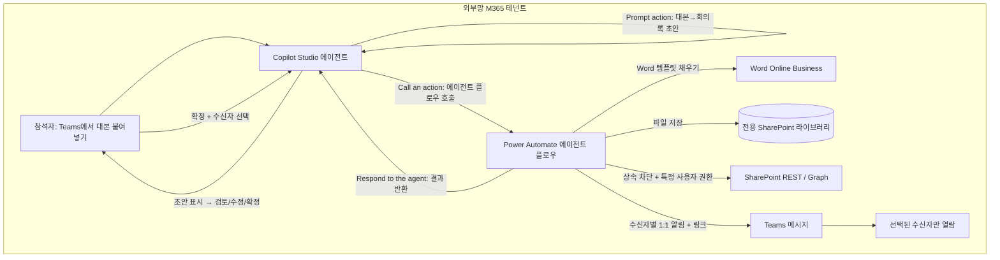
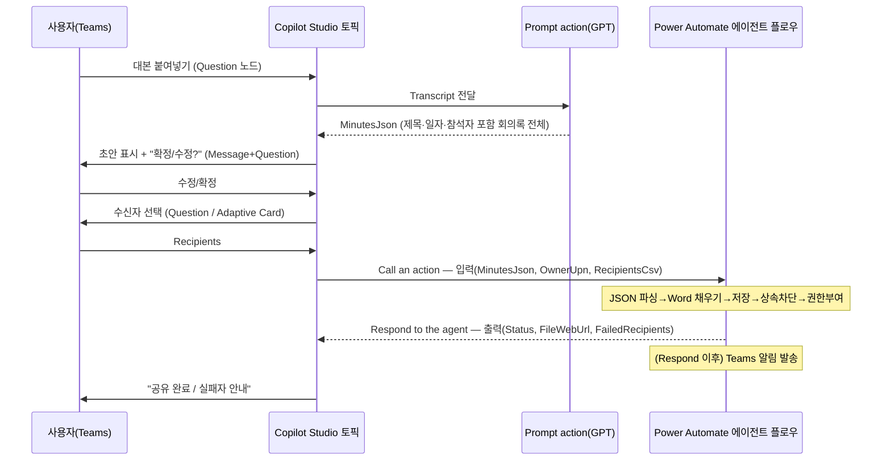

# 회의록 자동 작성·공유 에이전트 설계서

> 본 문서는 ms-design-agents가 자동 생성한 설계서다.

| 항목 | 내용 |
|------|------|
| 작성일 | 2026-05-28 |
| 프로젝트명 | 회의록 자동 작성·공유 에이전트 |
| 요청자 | (사용자) |
| 망 배치 결정 | **외부망 단독 (패턴 B)** |
| 사용 기술 | Copilot Studio + Power Automate(에이전트 플로우) + Word Online(Business) + SharePoint Online + Teams + Microsoft Graph |

---

## 1. 개요

### 1.1 요구사항
사용자 요청 원문(요약 인용):

> Teams 녹화가 끝나면 참석자가 대본(transcript)을 복사해 에이전트에 붙여넣고, 회사 양식 기반 회의록이 자동 작성되어 Word(.docx)로 저장된다. 저장 후 "이 문서를 누구에게 보내시겠습니까?"라고 묻고, 사용자가 수신자를 선택하면 선택한 사용자만 문서를 열람할 수 있도록 권한을 부여하고, Teams로 공유 알림이 간다. 모두가 보는 SharePoint에 회의록이 노출되는 것을 원치 않는다. 누구나 쉽게 사용할 수 있어야 한다. 외부망 M365 테넌트 기준.

### 1.2 자동화 목표
Teams 회의가 끝난 뒤 참석자가 대본만 붙여넣으면, 회사 표준 양식의 회의록이 자동 작성·검토·확정되고, Word로 저장된 뒤 **선택한 사람에게만** 안전하게 공유된다.

### 1.3 처리 대상 데이터
| 데이터 항목 | 종류 | 출처 | 개인정보 여부 |
|------------|------|------|--------------|
| 회의 대본(transcript) | 텍스트 | 사용자 붙여넣기 | ✅ (화자명·발언 내용) |
| 회의 메타(제목·일자·참석자) | 텍스트 | **대본에서 Prompt가 자동 추출** | ✅ |
| 생성된 회의록 | .docx | 에이전트 산출 | ✅ |
| 수신자 목록 | 이메일/UPN | 사용자 선택 | ✅ |

### 1.4 핵심 설계 관점
"대본 → 회사 양식 회의록"으로의 변환은 **생성형 AI(GPT)** 가 수행한다. 이 작업은 Copilot Studio의 **Prompt action(AI Builder 프롬프트) 단 하나의 노드**로 구현하며, 제목·일자·참석자까지 한 번에 추출한다. 외부 LLM 기반이라 외부망 배치가 자연스럽고, 회의 대본이 외부 모델로 입력된다는 점은 §7의 보안 조건으로 통제한다.

---

## 2. 아키텍처

### 2.1 구성도



### 2.2 컴포넌트 표
| 컴포넌트 | 역할 | 위치 | 사용 기술 |
|---------|------|------|-----------|
| 회의록 도우미 에이전트 | 대화·초안 작성·검토 루프·수신자 선택 | 외부망 | Copilot Studio (Teams 채널) |
| Prompt action | 대본 → 구조화 JSON 회의록(제목·일자·참석자 포함) | 외부망 | Copilot Studio Prompt(AI Builder, GPT) |
| 회의록 문서생성·공유 플로우 | docx 생성·저장·권한·알림 | 외부망 | Power Automate **에이전트 플로우** |
| 회의록 템플릿(.docx) | 회사 표준 양식(콘텐츠 컨트롤) | 외부망 | SharePoint 보관 |
| 회의록 문서 라이브러리 | 회의록 보관(파일별 고유 권한) | 외부망 | SharePoint Online |
| 권한 부여 | 상속 차단 + 특정 사용자 열람권 | 외부망 | SharePoint REST(HTTP) / Microsoft Graph |
| 알림 | 공유 알림 메시지 | 외부망 | Teams 커넥터 |

---

## 3. 망 배치 결정 근거

`workflow/decision_tree.md` 적용: Q1(개인정보)=예, Q2/Q3(외부 의존)=예(생성형 LLM). 원칙은 패턴 C이나, 모든 데이터·수신자가 동일 외부망 M365 안에 있고 사용자가 단일 테넌트 배치를 명시 → **패턴 B(외부망 단독)** 으로 확정. 민감정보 우려는 §7 보안 조건으로 흡수.

대안 검토:
- **패턴 A(내부망 단독)**: 외부 LLM 필요. 내부망은 회사 승인 내부 모델만 가능 → 내부 모델 없으면 부적합.
- **패턴 C(연계)**: 단일 테넌트 운영 범위에 과도. 게이트웨이 불필요.

---

## 4. Copilot Studio ↔ Power Automate 연계 설계 (핵심)

> 본 절은 "둘이 어느 단계에서, 어떤 액션으로, 무슨 데이터를 주고받으며 연결되는가"를 상세화한다. 근거: Microsoft Learn — [Create an agent flow as a tool](https://learn.microsoft.com/microsoft-copilot-studio/advanced-flow-create), [Modify an existing flow to use with an agent](https://learn.microsoft.com/microsoft-copilot-studio/flow-modify-use-with-agent), [Call an agent flow from an agent](https://learn.microsoft.com/microsoft-copilot-studio/advanced-use-flow), [A1 case study](https://learn.microsoft.com/power-platform/guidance/case-studies/boost-efficiency-experience-case-study).

### 4.1 연계 방식 선택 — 토픽 레벨 Action 노드(채택)
Copilot Studio가 플로우를 호출하는 방법은 두 가지다.

| 방식 | 호출 주체 | 특징 | 본 설계 |
|------|----------|------|---------|
| **토픽 레벨 Action 노드** (Call an action) | 토픽 흐름이 정해진 지점에서 호출 | **결정적(deterministic)**. "사용자가 확정한 뒤에만" 실행 보장 | ✅ **채택** |
| 에이전트 레벨 도구(Tool) | 오케스트레이터가 의도 매칭 시 자동 호출 | 자연어 기반, 호출 시점 비결정적 | ❌ (확정 전 조기 실행 위험) |

회의록은 "사용자가 초안을 검토·확정한 **다음에만**" 문서를 생성·공유해야 하므로, 오케스트레이터의 자동 호출이 아니라 **토픽 흐름 안의 Action 노드**로 명시적으로 호출한다.

### 4.2 연계 지점(어느 단계에서 연결되는가)



**연결되는 단 한 지점은 ⑦ Action 노드**다. 그 앞단(대본 입력·초안 작성·검토·수신자 선택)은 전부 Copilot Studio 토픽 내부에서 처리되고, Action 노드에서 플로우로 넘어갔다가 `Respond to the agent`로 돌아온다.

### 4.3 플로우 측 필수 구성 (반드시 지킬 것)
에이전트가 호출 가능한 플로우가 되려면 다음을 충족해야 한다.

1. **트리거**: `When an agent calls the flow` (구버전 명칭 "Run a flow from Copilot" / "Power Virtual Agents가 흐름을 호출하는 경우"). 트리거에 **입력 매개변수**를 정의한다.
2. **응답 액션**: 마지막에 `Respond to the agent`(구 "Respond to Copilot") 액션을 두고 **출력 매개변수**를 정의한다.
3. **동기 응답**: `Respond to the agent` 설정의 **Asynchronous response = Off**(실시간). 에이전트에 **100초 이내** 응답해야 한다.
4. **솔루션 플로우 + 동일 환경**: 플로우는 에이전트와 **같은 Power Platform 환경의 솔루션** 안에 있어야 한다.
5. **게시(Publish)** 후 Copilot Studio에서 도구로 추가 가능.

### 4.4 입력·출력 계약 (스키마)
Copilot Studio는 단순 타입(Text/Number/Boolean) 전달이 안정적이므로, **배열·객체는 JSON 문자열(Text)로 전달**하고 플로우 내부에서 Parse JSON으로 푼다. (복잡 타입 직접 전달 시 Teams에서 `FlowActionBadRequest` 유발 가능)

**Copilot → Flow (트리거 입력)**
| 매개변수 | 타입 | 설명 |
|---------|------|------|
| MinutesJson | Text | 구조화 회의록(JSON 문자열, §10 스키마). **제목·일자·참석자가 이 안에 포함됨** |
| OwnerUpn | Text | 작성자 UPN |
| RecipientsCsv | Text | 수신자 UPN/이메일 콤마 구분 |

> 회의 제목·일자는 별도 입력으로 받지 않는다. 플로우가 `MinutesJson`을 파싱해 `title`·`datetime`을 꺼내 파일명·폴더 경로에 사용한다. 저장 경로의 **팀명은 작성자 M365 프로필의 부서(Department)** 에서 자동으로 가져온다(§8.2).

**Flow → Copilot (Respond to the agent 출력)**
| 매개변수 | 타입 | 설명 |
|---------|------|------|
| Status | Text | success / partialFailure / error |
| FileWebUrl | Text | 생성된 회의록 링크 |
| FailedRecipients | Text | 권한 부여 실패자(콤마 구분, 없으면 빈 문자열) |

### 4.5 동기 100초 한계 대응
문서 생성·저장·권한 부여는 수 초 내 끝나지만, **수신자가 많을 때 Teams 알림 루프가 길어질 수 있다.** 따라서:
- 핵심 결과(파일 생성·권한 부여)는 `Respond to the agent` **이전**에 완료하고 즉시 응답한다.
- **Teams 알림 발송 루프는 `Respond to the agent` 이후**에 배치한다(응답 후 액션은 플로우 실행 한도 내에서 계속 실행됨). 사용자는 "공유 완료" 응답을 빠르게 받고, 알림은 뒤이어 전달된다.

### 4.6 스키마 변경 시 운영 주의
플로우의 입력/출력을 바꾸면 **Copilot Studio의 Action 노드를 반드시 `Refresh`(노드 ⋮ → Refresh) 후 에이전트 재게시**해야 한다. 누락 시 Teams 채널에서 `FlowActionBadRequest` 오류가 발생한다. 또한 입력값 null 방지를 위해 토픽에서 빈 값 검증 분기를 둔다.

---

## 5. Copilot Studio 토픽 상세 (노드별)

### 5.1 에이전트 개요
| 항목 | 값 |
|------|----|
| 에이전트명 | 회의록 도우미 |
| 위치 | 외부망 |
| 채널 | Microsoft Teams |
| 인증 | Microsoft Entra ID(수동 인증) — 사용자 컨텍스트로 동작 |

### 5.2 "회의록 작성" 토픽 — 노드 구성

> **핵심: 회의록 요약은 ③ Prompt 노드 하나가 전부 한다.** 대본을 입력으로 받아 제목·일자·참석자·안건·논의·결정·후속조치까지 한 번에 JSON으로 만든다. 따라서 "제목 추출용 노드", "일자 추출용 노드" 같은 것은 **따로 두지 않는다.**

| # | 노드 종류 | 구성 | 입력→출력 변수 |
|---|----------|------|----------------|
| 1 | **Trigger** | 트리거 구문: "회의록", "회의록 작성", "회의록 만들어줘" | - |
| 2 | **Question** (대본 입력) | "회의 대본을 붙여넣어 주세요." 멀티라인 텍스트 수신 | → `Transcript` (Text) |
| 3 | **Action → Create a prompt** ⭐**(회의록 요약 — 바로 여기)** | 대본을 읽어 **제목·일시·참석자·안건·논의·결정·후속조치 전체를 JSON으로 생성** (지시문 §6.2) | `Transcript` → `MinutesJson` (Text) |
| 4 | **Message** (초안 표시) | `MinutesJson`을 보기 좋게 렌더(Adaptive Card 권장) | `MinutesJson` |
| 5 | **Question** (검토) | "이대로 확정할까요? 수정할 내용이 있나요?" 선택지: 확정 / 수정 | → `ReviewChoice` |
| 6 | **Condition** (수정 루프) | 수정 선택 시 → 6a Question("무엇을 고칠까요?") → 6b Prompt(수정 반영) → ④로 복귀. 확정 시 다음으로 | → `EditRequest` |
| 7 | **Question** (수신자) | 대본 참석자(`MinutesJson.attendees`)를 **기본 후보로 제시**, 다중 선택. 외부 게스트 제외 | → `RecipientsCsv` (Text) |
| 8 | **Action** (플로우 호출) | 회의록 문서생성·공유 플로우 호출. §4.4 입력 매핑(`MinutesJson`, `OwnerUpn`, `RecipientsCsv`) | → `Status`, `FileWebUrl`, `FailedRecipients` |
| 9 | **Condition** | `Status`에 따라 분기 | - |
| 10 | **Message** (종료) | 성공: "회의록이 공유되었습니다. [열기](FileWebUrl)" / 부분실패: 실패자 안내 | - |

**제목·일자·팀명은 어떻게 채워지나 (요약)**
- **제목·일시·참석자**: ③ Prompt가 대본 문장에서 자동 추출해 `MinutesJson`에 담음(§6.4 예시 참조).
- **팀명(저장 경로용)**: 대본에 안 나오는 경우가 많으므로 추출하지 않고, **플로우가 작성자 프로필의 부서(Department)** 를 읽어 채움(§8.2).
- 추출이 틀리거나 비면 → ⑤ 검토 단계에서 사용자가 수정.

### 5.3 변수 목록
| 변수 | 타입 | 범위 | 용도 |
|------|------|------|------|
| Transcript | Text | Topic | 붙여넣은 대본 |
| MinutesJson | Text | Topic | Prompt 출력(제목·일자·참석자 포함 회의록 전체) |
| ReviewChoice / EditRequest | Text | Topic | 검토·수정 루프 |
| RecipientsCsv | Text | Topic | 수신자 |
| Status / FileWebUrl / FailedRecipients | Text | Topic | 플로우 반환 |

---

## 6. 생성형 AI 구성 (Prompt action)

### 6.1 왜 Prompt action인가 (Generative answers와 구분)
| 기능 | 용도 | 본 설계 적합성 |
|------|------|----------------|
| **Prompt action (AI Builder 프롬프트, GPT)** | 요약·추출·**변환**·분류 — "붙여넣은 텍스트를 양식으로 재작성" | ✅ **채택** |
| Create generative answers | 지식 소스(SharePoint/웹 등) 기반 **Q&A(RAG)** | ❌ (대본 변환 용도 아님) |

Microsoft 문서상 Prompt(prompt builder)의 대표 사용처가 "**transcripts 요약**, action item 추출, 분류, 번역, 데이터 변환"이며, 본 요구와 정확히 일치한다. 또한 MS는 GPT 출력에 대한 **사람 검토(human oversight)** 를 권고 → §5.2의 검토 노드(5)와 부합.

### 6.2 프롬프트 지시문 (복사용 전문)
③ Prompt 노드에 아래 지시문을 넣고, `{Transcript}` 자리에 토픽 변수 `Transcript`를 연결한다. 출력은 `MinutesJson`에 저장한다.

```
당신은 회의록 작성 도우미입니다. 아래 [회의 대본]을 읽고 한국어 회의록을 작성하세요.

[규칙]
- 반드시 아래 JSON 형식 하나만 출력하고, 그 외 설명 문장은 쓰지 마세요.
- 대본에서 제목·일시·참석자·안건·논의 내용·결정 사항·후속 조치를 찾아 각 칸을 채우세요.
- 대본에 없는 정보는 추측하지 말고 빈 문자열("") 또는 빈 배열([])로 두세요.
- 화자 이름은 attendees에, 불참/휴가 언급은 absentees에 넣으세요.
- 후속 조치는 "누가 / 무엇을 / 언제까지" 형태로 actionItems에 담으세요.
- 개조식(~함, ~하기로 함)으로 간결히 정리하세요.

[출력 JSON 형식]
{ "title":"", "datetime":"", "location":"", "attendees":[], "absentees":[],
  "agenda":[], "discussion":"", "decisions":[],
  "actionItems":[{"owner":"","task":"","due":""}], "notes":"" }

[회의 대본]
{Transcript}
```

- **입력 매개변수**: `Transcript` (대본)
- **출력 매개변수**: `MinutesJson` (위 JSON 텍스트)
- 입력/출력에 명확한 이름·설명을 부여해 스키마 매칭을 안정화한다.

### 6.3 모델·자격·라이선스
- 모델: 회사 승인 모델만(Prompt는 Azure OpenAI/Azure Foundry 기반). **프롬프트 데이터 비학습** 확인 필수.
- 전제조건: 환경에 **Dataverse 설치**, **Copilot Credits** 필요, 지원 리전.
- 과금: 에이전트 플로우는 Power Automate 별도 라이선스가 아니라 **Copilot Studio 사용량으로 과금**되며 **프리미엄 커넥터 사용 가능**(Word/HTTP/Graph 포함). Prompt는 Copilot Credits 소모.

### 6.4 동작 예시 (입력 → 추출 결과)
"대본에서 제목·일자를 추출한다"는 것은, 위 지시문에 따라 GPT가 대본 문장을 읽고 해당 칸을 채우는 것을 뜻한다.

**입력(붙여넣은 대본):**
```
[10:03] 김지훈: 2026년 5월 28일 마케팅팀 2분기 캠페인 정기회의 시작하겠습니다.
        오늘 박서연, 이준호 참석했고 최민지 님은 휴가입니다.
[10:05] 박서연: 지난 캠페인 전환율이 3.2%로 목표 3%를 넘겼습니다.
[10:09] 이준호: 다음 분기엔 인스타 광고 비중을 늘리면 좋겠습니다.
[10:15] 김지훈: 좋습니다. 이준호 님이 다음 주 금요일까지 인스타 광고안 초안 잡아주세요.
```

**③ Prompt 출력(MinutesJson):**
```json
{
  "title": "마케팅팀 2분기 캠페인 정기회의",
  "datetime": "2026-05-28 10:03",
  "location": "",
  "attendees": ["김지훈", "박서연", "이준호"],
  "absentees": ["최민지(휴가)"],
  "agenda": ["지난 캠페인 성과", "2분기 캠페인 방향"],
  "discussion": "지난 캠페인 전환율 3.2%로 목표 초과. 차기 분기 인스타그램 광고 비중 확대 논의함.",
  "decisions": ["인스타그램 광고 비중 확대"],
  "actionItems": [
    { "owner": "이준호", "task": "인스타그램 광고안 초안 작성", "due": "다음 주 금요일" }
  ],
  "notes": ""
}
```

`title`·`datetime`·`attendees`가 모두 대본 문장에서 자동으로 채워졌다. 비어 있는 칸(`location` 등)은 ⑤ 검토 단계에서 사용자가 보완한다.

---

## 7. 보안 검토 결과

| 항목 | 결과 | 비고 |
|------|------|------|
| 망분리 위반 여부 | ✅ | 외부망 단일 테넌트 내 완결 |
| 외부 LLM에 대본 전송 | ⚠️ | **회사 승인 모델 + "프롬프트 비학습" 보장 필수** |
| 개인정보 외부망 처리 | ⚠️ | 검토 단계 + 민감도 레이블로 보완 |
| 문서 기본 접근 범위 | ✅ | 상속 차단으로 사이트 멤버 전원 노출 방지 |
| 인증·인가 | ✅ | "특정 사용자" 권한만, **조직 전체 링크 금지** |
| 플로우 연결(커넥션) 권한 | ⚠️ | 커넥션 레퍼런스 계정(서비스/메이커)의 SharePoint·Graph 권한 최소화 |
| 감사 로그 | ⚠️ | Purview 감사 + 플로우 실행 이력으로 생성·공유·열람 추적 |
| 보존기간 | ⚠️ | 회의록 보존·자동 파기 정책 필요 |

**최종 보안 판정: 조건부 통과** — (a) 승인 모델·비학습, (b) 확정 전 검토 단계 필수, (c) 저장 즉시 상속 차단 + "특정 사용자" 권한만.

---

## 8. Power Automate 에이전트 플로우 명세

> A1 case study의 검증된 시퀀스(Run a flow from Copilot → Populate a Word template → Compose 파일명 → Create file(SharePoint) → 알림 → Respond)를 본 요구(권한 모델·링크 알림)에 맞게 확장.

### 8.1 개요
| 항목 | 값 |
|------|----|
| 플로우명 | 회의록_문서생성_공유 |
| 종류 | **에이전트 플로우**(솔루션, 에이전트와 동일 환경) |
| 트리거 | When an agent calls the flow |
| 응답 | Respond to the agent (async off, 100초 내) |

### 8.2 단계 명세
| 순번 | 단계 | 액션 | 커넥터 | 입력 | 출력 | 비고 |
|-----|------|------|--------|------|------|------|
| 1 | 트리거 | When an agent calls the flow | Copilot | §4.4 입력 3종 | - | MinutesJson, OwnerUpn, RecipientsCsv |
| 2 | 회의록 파싱 | Parse JSON | 내장 | MinutesJson | minutes | §10 스키마 |
| 2b | 팀명 도출 | Get my profile (V2) | Office 365 Users | - | TeamName(부서) | 대본에 없는 팀명 보완(없으면 기본 폴더) |
| 3 | 파일명·경로 | Compose | 내장 | `minutes.datetime`·`minutes.title` | fileName, folderPath | `/회의록/YYYY/팀명/날짜_회의명.docx`, 금칙문자 치환 |
| 4 | 문서 작성 | **Populate a Microsoft Word template** | Word Online(Business) | 템플릿(사이트/라이브러리/파일) + 필드 매핑 | docxContent | 콘텐츠 컨트롤 채움 |
| 5 | 저장 | Create file | SharePoint | folderPath, fileName, docxContent | itemId, webUrl | 전용 라이브러리 |
| 6 | (선택) 레이블 | Send an HTTP request / Graph | Graph(HTTP) | itemId | - | 민감도 레이블 |
| 7a | 상속 차단 | Send an HTTP request to SharePoint | SharePoint | `.../items({id})/breakroleinheritance(copyRoleAssignments=false,clearSubscopes=true)` | - | **전원 노출 차단 핵심** |
| 7b | 권한 부여 | Grant access / Graph invite | SharePoint/Graph | RecipientsCsv 분할 루프, roles=read, requireSignIn=true | failedRecipients | 부분 실패 허용 |
| 8 | **응답** | **Respond to the agent** | Copilot | Status, webUrl, failedRecipients | - | 여기서 즉시 반환 |
| 9 | 알림(응답 후) | Post message in a chat or channel | Teams | 수신자별 1:1, webUrl | - | 선(先)권한→후(後)링크 |

### 8.3 에러 핸들링
- 4~7단계를 Scope로 묶고 실패 시 `Status=error`로 응답 + 작성자 알림.
- 7b 루프 개별 실패는 `failedRecipients` 누적 후 계속 → `Status=partialFailure`.
- 상속 차단(7a)이 권한 부여(7b)보다 **먼저** 수행되어, 권한 단계가 실패해도 과다 노출이 없다(안전 우선).

---

## 9. 저장 위치 & 공유 방식 결정

### 9.1 저장·권한 모델 — 전용 SharePoint + 파일별 고유 권한 (확정)
| 방식 | 기본 노출 | 장점 | 단점 |
|------|----------|------|------|
| 공유 SharePoint 라이브러리 | 사이트 멤버 전체 | 거버넌스 쉬움 | **전원 열람 → 요구 위반** |
| 작성자 OneDrive + 특정 사용자 공유 | 소유자 전용 | 단순·즉시 비공개 | 작성자 퇴사 시 접근 단절 |
| **전용 SharePoint + 파일별 고유 권한** | 부여한 사람만 | **거버넌스·보존·퇴사 무관** | 상속 차단 설정 복잡·오설정 위험 |

**확정: 전용 SharePoint 라이브러리 + 파일별 고유 권한.** 라이브러리 기본 멤버 열람을 최소화하고, 파일 생성 직후 상속 차단 후 선택 수신자에게만 읽기 권한 부여.

### 9.2 공유 방식 — 권한 링크 + Teams 알림 (확정, 파일 직접 전송 아님)
근거: ①단일 원본(수정 시 최신본 공유), ②권한 통제 유지(첨부 복사본은 재전달 가능, 링크는 권한 강제), ③감사 추적, ④민감도 레이블 유지. **선(先)권한 부여 → 후(後)링크 안내**, 수신자 다수 시 **각자 1:1 메시지**(그룹 채팅 지양).

---

## 10. 회사 표준 회의록 양식 & 출력 스키마

Word 템플릿(.docx)에 **Plain Text 콘텐츠 컨트롤**(개발자 탭)로 placeholder를 만들고 논리적 이름을 부여, SharePoint 라이브러리에 보관(A1 case study 권장 방식).

필드: 회의명/일시·장소/참석자·불참자/안건/주요 논의/결정 사항/후속 조치(반복 섹션: 담당자·할 일·기한)/특이사항/작성자·작성일.

Prompt action 출력 JSON 스키마:
```json
{
  "title": "string",
  "datetime": "string",
  "location": "string",
  "attendees": ["string"],
  "absentees": ["string"],
  "agenda": ["string"],
  "discussion": "string",
  "decisions": ["string"],
  "actionItems": [{ "owner": "string", "task": "string", "due": "string" }],
  "notes": "string"
}
```

---

## 11. 추가 고려 변수

사용자 제시: ①대본 품질(→§5.2 검토 노드), ②저장 경로 규칙(`/회의록/YYYY/팀명/날짜_회의명.docx`).

확장:
- **C. 외부 LLM 민감정보 노출** — 승인 모델 + 비학습 + 산출물 민감도 레이블. (최우선)
- **D. 녹화·전사 동의** — 참석자 사전 고지·동의.
- **E. 문서 소유자 생명주기** — 전용 SharePoint 채택으로 작성자 퇴사 영향 제거.
- **F. 수신자 선택 UX** — 대본에서 참석자 자동 추출 후 기본 후보 제시, 외부 게스트 제외, 유효 사용자 검증.
- **G. 긴 회의 토큰 한계** — 1시간+ 대본은 모델 입력 한도 초과 가능 → 구간 분할 요약·통합(map-reduce).
- **H. 멱등성/중복 처리** — 동일 회의 재처리 시 덮어쓰기 vs 버전 정책.
- **I. 파일명/경로 정리** — `\ / : * ? " < > |` 금칙문자 치환, 경로 길이 제한.
- **J. 템플릿 거버넌스** — 템플릿 위치·버전·관리자, 회의 유형별 다중 템플릿.
- **K. 언어 처리** — 한국어/혼용 대본, 출력 언어·문체 통일.
- **L. 부분 실패** — 일부 수신자 권한 실패 시 나머지 진행 + 보고.
- **M. 감사·보존·파기** — 생성/공유/열람 로그, 보존기간·자동 파기.
- **N. 라이선스·비용** — Copilot Studio 사용량 과금, Copilot Credits, 프리미엄 커넥터.
- **O. 모바일/접근성** — Teams 모바일 붙여넣기, 어댑티브 카드 가독성.

---

## 12. 구현 단계별 가이드

### 12.1 사전 준비
1. 외부망 환경에 Copilot Studio 라이선스·Copilot Credits·Dataverse 확인.
2. 커넥터(Word Online Business, SharePoint, Teams, HTTP/Graph, Office 365 Users) 활성화 및 DLP 확인.
3. 회사 승인 생성형 모델 확인(비학습).
4. 회의록 전용 SharePoint 사이트·라이브러리 생성, 멤버 기본 열람 최소화.
5. 회의록 Word 템플릿(콘텐츠 컨트롤) 작성·보관.

### 12.2 구성 순서 (연계 중심)
1. **솔루션 생성** — 에이전트·플로우·프롬프트를 같은 환경의 동일 솔루션에 둔다.
2. **에이전트 플로우 작성** — `When an agent calls the flow` 트리거에 입력 3종 정의 → §8.2 액션 구성 → `Respond to the agent`에 출력 3종 정의(async off) → **게시**.
3. **Prompt action 작성** — Create → Prompt, §6.2 지시문·입력(Transcript)·출력(MinutesJson), Test prompt로 검증.
4. **에이전트·토픽 작성** — §5.2 노드 구성. ③에서 Prompt 연결, ⑧ Action 노드에서 게시된 플로우 선택 후 **입력/출력 변수 매핑**.
5. **연계 검증** — Test your agent로 호출 확인. 스키마 변경 시 Action 노드 **Refresh** 후 재게시.
6. **Teams 채널 게시**.

### 12.3 테스트 시나리오
| 시나리오 | 입력 | 기대 결과 |
|---------|------|----------|
| 정상 | 정상 대본 | 양식 회의록 생성·저장·선택 수신자만 열람 |
| 대본 오인식 | 화자 오류 포함 | 초안 표시 → 수정 후 확정 |
| 긴 대본 | 1시간+ | 분할 요약 후 통합 |
| 권한 검증 | 비수신자 접근 | 열람 거부 |
| 부분 실패 | 잘못된 수신자 1명 | 나머지 공유 + 실패 보고 |
| 스키마 불일치 | 플로우 변경 후 미Refresh | FlowActionBadRequest 재현·Refresh로 해소 확인 |

---

## 13. 운영 가이드

### 13.1 모니터링
- 실패 알림: 작성자 1:1 + 운영 채널.
- 점검: 플로우 실패율, 권한 부여 실패 건, 100초 초과 여부, 모델 응답 품질.

### 13.2 보존 및 파기
- Purview 보존 레이블로 회의록 보존기간 설정, 경과 시 자동 파기.

### 13.3 변경 관리
- 양식 변경 → Word 템플릿 버전 갱신.
- 플로우 입출력 변경 → **Action 노드 Refresh + 재게시** 필수.
- 승인 모델 변경 → 프롬프트·DLP 재검토.

---

## 14. 부록

### 14.1 참고 문서 (Microsoft Learn)
- Create an agent flow as a tool — https://learn.microsoft.com/microsoft-copilot-studio/advanced-flow-create
- Modify an existing flow to use with an agent (트리거/응답·100초·async off) — https://learn.microsoft.com/microsoft-copilot-studio/flow-modify-use-with-agent
- Call an agent flow from an agent — https://learn.microsoft.com/microsoft-copilot-studio/advanced-use-flow
- Manage topic inputs and outputs — https://learn.microsoft.com/microsoft-copilot-studio/advanced-managing-topic-inputs-outputs
- Use your prompt actions in Copilot Studio — https://learn.microsoft.com/ai-builder/use-a-custom-prompt-in-mcs
- Overview of prompts — https://learn.microsoft.com/microsoft-copilot-studio/prompts-overview
- FlowActionBadRequest 문제해결(스키마 Refresh) — https://learn.microsoft.com/troubleshoot/power-platform/copilot-studio/channels/agent-flow-action-bad-request
- A1 case study(Word 템플릿→SharePoint 저장→알림→Respond) — https://learn.microsoft.com/power-platform/guidance/case-studies/boost-efficiency-experience-case-study

### 14.2 변경 이력
| 날짜 | 변경 내용 | 작성자 |
|------|----------|--------|
| 2026-05-28 | 최초 작성 (외부망 단독, 전용 SharePoint 고유권한, 권한링크 알림) | ms-design-agents |
| 2026-05-28 | Copilot Studio↔Power Automate 연계 상세 보강 | ms-design-agents |
| 2026-05-28 | 회의록 요약 단계 명확화 — Prompt 노드 단일화, 제목·일자 자동 추출 예시·지시문 전문, 팀명 프로필 도출, 입력 3종으로 단순화 | ms-design-agents |
