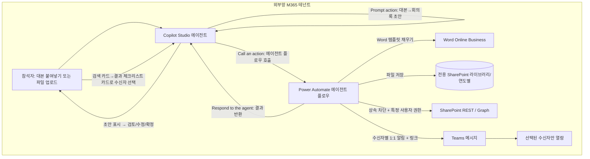
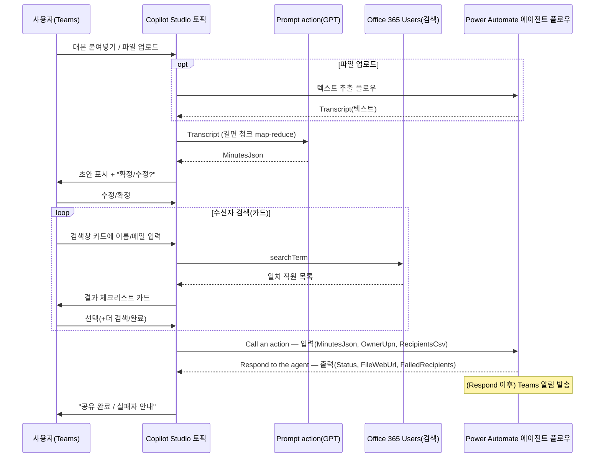

# 회의록 자동 작성·공유 에이전트 설계서

> 본 문서는 ms-design-agents가 자동 생성한 설계서다.

| 항목 | 내용 |
|------|------|
| 작성일 | 2026-05-28 |
| 프로젝트명 | 회의록 자동 작성·공유 에이전트 |
| 요청자 | (사용자) |
| 망 배치 결정 | **외부망 단독 (패턴 B)** |
| 사용 기술 | Copilot Studio + Power Automate(에이전트 플로우) + Word Online(Business) + SharePoint Online + Teams + Office 365 Users + Microsoft Graph |

---

## 1. 개요

### 1.1 요구사항
사용자 요청 원문(요약 인용):

> Teams 녹화가 끝나면 참석자가 대본(transcript)을 복사해 에이전트에 붙여넣고(또는 파일로 올리고), 회사 양식 기반 회의록이 자동 작성되어 Word(.docx)로 저장된다. 저장 후 "이 문서를 누구에게 보내시겠습니까?"라고 묻고, 사용자가 **카드에서 전사 직원을 검색·선택**하면 선택한 사용자만 문서를 열람할 수 있도록 권한을 부여하고, Teams로 공유 알림이 간다. 모두가 보는 SharePoint에 회의록이 노출되는 것을 원치 않는다. 누구나 쉽게 사용할 수 있어야 한다. 외부망 M365 테넌트 기준.

### 1.2 자동화 목표
Teams 회의가 끝난 뒤 참석자가 대본만 붙여넣거나 파일로 올리면, 회사 표준 양식의 회의록이 자동 작성·검토·확정되고, Word로 저장된 뒤 **선택한 사람에게만** 안전하게 공유된다.

### 1.3 처리 대상 데이터
| 데이터 항목 | 종류 | 출처 | 개인정보 여부 |
|------------|------|------|--------------|
| 회의 대본(transcript) | 텍스트/파일 | 사용자 붙여넣기 또는 파일 업로드 | ✅ (화자명·발언 내용) |
| 회의 메타(제목·일자·참석자) | 텍스트 | **대본에서 Prompt가 자동 추출** | ✅ |
| 생성된 회의록 | .docx | 에이전트 산출 | ✅ |
| 수신자 목록 | 이메일/UPN | **카드에서 디렉터리 검색 후 선택** | ✅ |

### 1.4 핵심 설계 관점
"대본 → 회사 양식 회의록"으로의 변환은 **생성형 AI(GPT)** 가 수행한다. 이 작업은 Copilot Studio의 **Prompt action(AI Builder 프롬프트)** 으로 구현하며, 외부 LLM 기반이라 외부망 배치가 자연스럽고, 회의 대본이 외부 모델로 입력된다는 점은 §7의 보안 조건으로 통제한다.

---

## 2. 아키텍처

### 2.1 구성도



### 2.2 컴포넌트 표
| 컴포넌트 | 역할 | 위치 | 사용 기술 |
|---------|------|------|-----------|
| 회의록 도우미 에이전트 | 대화·입력·초안·검토·수신자 선택 | 외부망 | Copilot Studio (Teams 채널) |
| Prompt action | 대본 → 구조화 JSON 회의록(긴 경우 청크) | 외부망 | Copilot Studio Prompt(AI Builder, GPT) |
| 사용자 검색 | 전사 직원 검색(이름·메일) | 외부망 | Office 365 Users — Search for users (V2) |
| 수신자 선택 카드 | 검색창 + 결과 체크리스트 | 외부망 | Adaptive Card(1.5) |
| 회의록 문서생성·공유 플로우 | docx 생성·저장·권한·알림 | 외부망 | Power Automate **에이전트 플로우** |
| 회의록 템플릿(.docx) | 회사 표준 양식(콘텐츠 컨트롤) | 외부망 | SharePoint 보관 |
| 회의록 문서 라이브러리 | 회의록 보관(파일별 고유 권한, **연도별 분리**) | 외부망 | SharePoint Online |
| 권한 부여 | 상속 차단 + 특정 사용자 열람권 | 외부망 | SharePoint REST(HTTP) / Microsoft Graph |
| 알림 | 공유 알림 메시지 | 외부망 | Teams 커넥터 |

---

## 3. 망 배치 결정 근거

`workflow/decision_tree.md` 적용: Q1(개인정보)=예, Q2/Q3(외부 의존)=예(생성형 LLM). 원칙은 패턴 C이나, 모든 데이터·수신자가 동일 외부망 M365 안에 있고 사용자가 단일 테넌트 배치를 명시 → **패턴 B(외부망 단독)** 으로 확정. 민감정보 우려는 §7 보안 조건으로 흡수.

대안 검토:
- **패턴 A(내부망 단독)**: 외부 LLM 필요. 내부망은 회사 승인 내부 모델만 가능 → 내부 모델 없으면 부적합.
- **패턴 C(연계)**: 단일 테넌트 운영 범위에 과도. 게이트웨이 불필요.

---

## 4. Copilot Studio ↔ Power Automate 연계 설계 (핵심)

> 근거: Microsoft Learn — [Create an agent flow as a tool](https://learn.microsoft.com/microsoft-copilot-studio/advanced-flow-create), [Modify an existing flow to use with an agent](https://learn.microsoft.com/microsoft-copilot-studio/flow-modify-use-with-agent), [Call an agent flow from an agent](https://learn.microsoft.com/microsoft-copilot-studio/advanced-use-flow), [A1 case study](https://learn.microsoft.com/power-platform/guidance/case-studies/boost-efficiency-experience-case-study).

### 4.1 연계 방식 선택 — 토픽 레벨 Action 노드(채택)
| 방식 | 호출 주체 | 특징 | 본 설계 |
|------|----------|------|---------|
| **토픽 레벨 Action 노드** (Call an action) | 토픽 흐름이 정해진 지점에서 호출 | **결정적**. "사용자가 확정한 뒤에만" 실행 보장 | ✅ **채택** |
| 에이전트 레벨 도구(Tool) | 오케스트레이터가 의도 매칭 시 자동 호출 | 비결정적 | ❌ (확정 전 조기 실행 위험) |

### 4.2 연계 지점



### 4.3 플로우 측 필수 구성
1. **트리거**: `When an agent calls the flow`. 입력 매개변수 정의.
2. **응답**: `Respond to the agent` 액션 + 출력 매개변수.
3. **동기**: Asynchronous response = Off, **100초 이내** 응답.
4. **솔루션 + 동일 환경** 플로우.
5. **게시** 후 도구로 추가.

### 4.4 입력·출력 계약 (스키마)
배열·객체는 **JSON 문자열(Text)** 로 전달하고 플로우에서 Parse JSON.

**Copilot → Flow (메인 플로우 입력)**
| 매개변수 | 타입 | 설명 |
|---------|------|------|
| MinutesJson | Text | 구조화 회의록(JSON 문자열). 제목·일자·참석자 포함 |
| OwnerUpn | Text | 작성자 UPN |
| RecipientsCsv | Text | 선택된 수신자 UPN 콤마 구분 |

> 제목·일자는 플로우가 `MinutesJson`에서 파싱해 파일명·경로에 사용. 팀명은 작성자 프로필 부서(Department)에서 자동 도출(§8.2).

**Flow → Copilot (출력)**
| 매개변수 | 타입 | 설명 |
|---------|------|------|
| Status | Text | success / partialFailure / error |
| FileWebUrl | Text | 회의록 링크 |
| FailedRecipients | Text | 권한 부여 실패자 |

### 4.5 동기 100초 한계 대응
파일 생성·권한 부여는 `Respond to the agent` **이전**에 끝내고 즉시 응답, **Teams 알림 루프는 응답 이후**에 배치.

### 4.6 스키마 변경 시 운영 주의
플로우 입출력 변경 시 Action 노드 **Refresh + 재게시** 필수(누락 시 `FlowActionBadRequest`).

---

## 5. Copilot Studio 토픽 상세

### 5.1 에이전트 개요
| 항목 | 값 |
|------|----|
| 에이전트명 | 회의록 도우미 |
| 위치 | 외부망 |
| 채널 | Microsoft Teams |
| 인증 | Microsoft Entra ID(수동 인증) |
| 파일 업로드 | 설정 → 생성형 AI → **파일 업로드 켜기** |

### 5.2 "회의록 작성" 토픽 — 노드 구성

> **핵심: 회의록 요약은 ④ Prompt 노드 하나가 한다.** 대본을 입력으로 받아 제목·일자·참석자·안건·논의·결정·후속조치까지 한 번에 JSON으로 만든다.

| # | 노드 종류 | 구성 | 입력→출력 변수 |
|---|----------|------|----------------|
| 1 | **Trigger** | "회의록", "회의록 작성" 등 | - |
| 2 | **Question** (입력 방식) | "대본을 붙여넣을까요, 파일로 올릴까요?" 선택지: 붙여넣기 / 파일 | → `InputMode` |
| 3 | **Condition** (입력 분기) | 붙여넣기 → 3a Question(멀티라인) → `Transcript` / 파일 → 3b Question(Identify=**File**, 메타 포함) → `UploadedFile` → 3c Action(텍스트 추출 플로우) → `Transcript` (§5.4) | → `Transcript` |
| 4 | **Action → Create a prompt** ⭐**(회의록 요약)** | 대본을 회사 양식 회의록(JSON)으로 변환. 길면 청크 처리(§6.5) | `Transcript` → `MinutesJson` |
| 5 | **Message** (초안 표시) | `MinutesJson`을 Adaptive Card로 렌더 | `MinutesJson` |
| 6 | **Question** (검토) | "확정 / 수정" | → `ReviewChoice` |
| 7 | **Condition** (수정 루프) | 수정 시 요청 받아 Prompt 재실행 → ⑤로 복귀 | → `EditRequest` |
| 8 | **수신자 선택 카드 루프** | 검색창 카드 → 디렉터리 검색 → 결과 체크리스트 카드(§5.5) | → `RecipientsCsv` |
| 9 | **Action** (플로우 호출) | 메인 플로우 호출, §4.4 입력 매핑 | → `Status`, `FileWebUrl`, `FailedRecipients` |
| 10 | **Condition** | `Status` 분기 | - |
| 11 | **Message** (종료) | 성공/부분실패 안내 + 링크 | - |

**제목·일자·팀명 채우기**: 제목·일시·참석자는 ④ Prompt가 대본에서 추출(§6.4). 팀명(경로용)은 플로우가 프로필 부서에서 도출. 틀리면 ⑥ 검토에서 수정.

### 5.3 변수 목록
| 변수 | 타입 | 용도 |
|------|------|------|
| InputMode | Text | 붙여넣기/파일 분기 |
| UploadedFile | File | 업로드된 대본 파일 |
| Transcript | Text | 대본 텍스트 |
| MinutesJson | Text | Prompt 출력(회의록 전체) |
| ReviewChoice / EditRequest | Text | 검토·수정 루프 |
| SearchTerm | Text | 수신자 검색어 |
| RecipientsCsv | Text | 선택된 수신자 |
| Status / FileWebUrl / FailedRecipients | Text | 플로우 반환 |

### 5.4 입력 방식 — 붙여넣기 vs 파일 업로드 (긴 대본 대응)
Teams 채팅 붙여넣기는 **메시지 길이 제한**으로 긴 대본이 잘릴 수 있다. 따라서 두 경로를 제공한다.

- **짧은 대본**: 붙여넣기(멀티라인 Question).
- **긴 대본**: **.txt 파일 업로드** 권장(Word도 가능하나 변환 단계 추가).
  - 에이전트 **설정 → 생성형 AI → 파일 업로드 켜기** 선행.
  - Question 노드 **Identify=File**(Entity recognition → Include file metadata) 또는 `First(System.Activity.Attachments)`로 첨부 수신.
  - 플로우에 전달: Power Fx `{ contentBytes: Topic.UploadedFile.Content, name: Topic.UploadedFile.Name }`, 플로우 입력 타입 **File**.
  - 텍스트 추출: `.txt`는 `base64ToString(contentBytes)`로 즉시 변환. `.docx`는 별도 변환 단계 필요(권장도 낮음).

> ⚠️ **금지**: "지식 소스로 파일 업로드"(generative answers용) 경로는 **올린 파일이 에이전트 사용자 전원에게 노출**된다(MS 경고). 민감한 회의 대본은 반드시 **대화 첨부 → 플로우 전달** 경로만 사용한다.

### 5.5 수신자 — 전사 직원 검색·선택 (카드 기반)
대본 참석자만이 아니라 **전 직원을 카드에서 검색·선택**한다. 자연어 자유 입력이 아니라 **카드 폼**으로 받는다.

#### 5.5.1 중요한 플랫폼 제약 (네이티브 People Picker 불가)
Teams에는 Adaptive Card용 **People Picker / 동적 타입어헤드**(`Input.ChoiceSet`의 `choices.data: { dataset: "graph.microsoft.com/users" }`)가 있어 "한 카드에서 조직 전체를 입력하는 대로 검색"할 수 있다. **그러나 이 기능은 Copilot Studio로 만든 Teams 에이전트에서는 사용할 수 없다.**
- People Picker·동적 타입어헤드는 Adaptive Card **스키마 1.6 + `Data.Query`/`Action.Execute`** 에 의존.
- **Copilot Studio의 Teams 채널은 Adaptive Card 1.5로 제한**되고, 기본 웹챗도 `Action.Execute` 미지원.
- 따라서 카드 내 실시간 조직 검색 컨트롤은 **직접 코딩한 봇(Bot Framework/Azure Bot)** 이 있어야 가능 → 로우코드 Copilot Studio 경로에서는 불가.
- **결정**: 본 설계는 Copilot Studio 로우코드를 유지하고, 아래 **검색창 카드 + 결과 체크리스트 카드 2단 루프**로 동등한 UX를 구현한다. (네이티브 피커가 반드시 필요하면 커스텀 봇으로 전환 — 별도 트레이드오프.)

#### 5.5.2 채택 패턴 — 2단 카드 루프
1. **검색창 카드**(Adaptive Card 노드): `Input.Text`(검색어) + `Action.Submit` → `SearchTerm` 캡처.
2. **디렉터리 검색**: Office 365 Users **Search for users (V2)** (`searchTerm`으로 표시이름·성·이름·메일·메일닉네임·UPN 검색, 결과로 DisplayName·Mail·UPN·부서 반환).
3. **결과 체크리스트 카드**: 검색 결과를 Power Fx로 `Input.ChoiceSet`(`isMultiSelect:true`, `style:"filtered"`)에 채워 표시 → 사용자가 체크 → 선택 UPN을 `RecipientsCsv`에 추가.
4. **반복/종료**: "더 검색 / 완료" → 추가면 1로 복귀.

- `style:"filtered"`(1.5)는 **방금 검색된 결과 목록**에 대한 클라이언트 타입어헤드 필터다(전 직원 전체 라이브 검색이 아님 — 그건 5.5.1 제약).
- 게스트·비활성 계정은 후보에서 제외. 대본 참석자(`MinutesJson.attendees`)는 첫 화면 **기본 후보**로 제시.

#### 5.5.3 카드 JSON 예시
**① 검색창 카드**
```json
{ "type":"AdaptiveCard","version":"1.5",
  "body":[ {"type":"TextBlock","text":"받는 사람 검색","weight":"Bolder"},
           {"type":"Input.Text","id":"searchTerm","placeholder":"이름 또는 이메일 입력"} ],
  "actions":[ {"type":"Action.Submit","title":"검색"} ] }
```
**② 결과 체크리스트 카드** (choices는 검색 결과로 동적 생성)
```json
{ "type":"AdaptiveCard","version":"1.5",
  "body":[ {"type":"TextBlock","text":"받는 사람을 선택하세요","weight":"Bolder"},
           {"type":"Input.ChoiceSet","id":"selectedRecipients",
            "isMultiSelect":true,"style":"filtered",
            "choices":[ {"title":"김지훈 (마케팅팀)","value":"jihun@contoso.com"},
                        {"title":"박서연 (마케팅팀)","value":"seoyeon@contoso.com"} ]} ],
  "actions":[ {"type":"Action.Submit","title":"선택 완료"} ] }
```

---

## 6. 생성형 AI 구성 (Prompt action)

### 6.1 왜 Prompt action인가 (Generative answers와 구분)
| 기능 | 용도 | 적합성 |
|------|------|--------|
| **Prompt action (AI Builder, GPT)** | 요약·추출·변환·분류 | ✅ 채택 |
| Create generative answers | 지식 소스 기반 Q&A(RAG) | ❌ (대본 변환 용도 아님) |

MS 문서상 Prompt의 대표 사용처가 "transcripts 요약·action item 추출·변환"이며, 사람 검토(human oversight)를 권고 → §5.2 검토 노드와 부합.

### 6.2 프롬프트 지시문 (복사용 전문)
```
당신은 회의록 작성 도우미입니다. 아래 [회의 대본]을 읽고 한국어 회의록을 작성하세요.

[규칙]
- 반드시 아래 JSON 형식 하나만 출력하고, 그 외 설명 문장은 쓰지 마세요.
- 대본에서 제목·일시·참석자·안건·논의 내용·결정 사항·후속 조치를 찾아 각 칸을 채우세요.
- 대본에 없는 정보는 추측하지 말고 빈 문자열("") 또는 빈 배열([])로 두세요.
- 화자 이름은 attendees에, 불참/휴가 언급은 absentees에 넣으세요.
- 후속 조치는 "누가 / 무엇을 / 언제까지" 형태로 actionItems에 담으세요.
- 개조식(~함, ~하기로 함)으로 간결히 정리하세요.

[출력 JSON 형식]
{ "title":"", "datetime":"", "location":"", "attendees":[], "absentees":[],
  "agenda":[], "discussion":"", "decisions":[],
  "actionItems":[{"owner":"","task":"","due":""}], "notes":"" }

[회의 대본]
{Transcript}
```
- 입력: `Transcript` / 출력: `MinutesJson`

### 6.3 모델·자격·라이선스
- 회사 승인 모델만(Azure OpenAI/Foundry 기반), **프롬프트 비학습** 확인.
- 전제: Dataverse 설치, Copilot Credits, 지원 리전.
- 과금: 에이전트 플로우는 Copilot Studio 사용량 과금, 프리미엄 커넥터 가능. Prompt는 Copilot Credits 소모.

### 6.4 동작 예시 (입력 → 추출 결과)
**입력(대본):**
```
[10:03] 김지훈: 2026년 5월 28일 마케팅팀 2분기 캠페인 정기회의 시작하겠습니다.
        오늘 박서연, 이준호 참석했고 최민지 님은 휴가입니다.
[10:05] 박서연: 지난 캠페인 전환율이 3.2%로 목표 3%를 넘겼습니다.
[10:15] 김지훈: 이준호 님이 다음 주 금요일까지 인스타 광고안 초안 잡아주세요.
```
**출력(MinutesJson):**
```json
{
  "title": "마케팅팀 2분기 캠페인 정기회의",
  "datetime": "2026-05-28 10:03",
  "location": "",
  "attendees": ["김지훈", "박서연", "이준호"],
  "absentees": ["최민지(휴가)"],
  "agenda": ["지난 캠페인 성과", "2분기 캠페인 방향"],
  "discussion": "지난 캠페인 전환율 3.2%로 목표 초과. 차기 분기 인스타그램 광고 비중 확대 논의함.",
  "decisions": ["인스타그램 광고 비중 확대"],
  "actionItems": [{ "owner": "이준호", "task": "인스타그램 광고안 초안 작성", "due": "다음 주 금요일" }],
  "notes": ""
}
```

### 6.5 긴 대본 토큰 최적화 (초과 방지)
대본이 길면 모델 입력 한도를 넘을 수 있다. 두 단계로 방지한다.

1. **전처리(압축)**: 타임스탬프·`[오전 10:03]` 등 화자표기 반복·군더더기 제거(플로우의 replace/정규식 또는 경량 Compose). 토큰 20~40% 절감.
2. **청크 + 합치기(map-reduce)**:
   - **분할**: 대본을 N개 조각(예: 4,000~6,000자 단위)으로 나눔.
   - **map**: 각 조각을 "이 조각의 핵심 논의·결정·액션을 요약" 프롬프트로 부분 요약.
   - **reduce**: 부분 요약들을 모아 §6.2 프롬프트로 **하나의 회의록 JSON**으로 통합.
   - 플로우가 조각 수만큼 반복 호출하므로 길이에 상관없이 처리.
3. **길이 분기**: 토픽/플로우에서 글자 수를 재서 임계값 미만이면 1회 처리, 이상이면 자동으로 청크 경로.

> 입력 단계(§5.4)에서 긴 대본을 파일로 받으면 채팅 잘림을 피하고, 본 절에서 모델 한도를 피한다 — 두 한계를 분리 대응.

---

## 7. 보안 검토 결과

| 항목 | 결과 | 비고 |
|------|------|------|
| 망분리 위반 여부 | ✅ | 외부망 단일 테넌트 내 완결 |
| 외부 LLM에 대본 전송 | ⚠️ | 승인 모델 + 비학습 보장 필수 |
| 업로드 파일 노출 경로 | ✅ | 지식소스 업로드 금지, 대화 첨부→플로우 경로만 사용(§5.4) |
| 개인정보 외부망 처리 | ⚠️ | 검토 단계 + 민감도 레이블 |
| 문서 기본 접근 범위 | ✅ | 상속 차단으로 사이트 멤버 전원 노출 방지(§9.3) |
| 인증·인가 | ✅ | "특정 사용자" 권한만, 조직 전체 링크 금지 |
| 고유 권한 범위 한계 | ⚠️ | 라이브러리당 5,000 권장/50,000 한계 → 연도별 분리(§9.4) |
| 감사 로그 | ⚠️ | Purview 감사 + 플로우 실행 이력 |
| 보존기간 | ⚠️ | 보존·자동 파기 정책 필요 |

**최종 보안 판정: 조건부 통과** — (a) 승인 모델·비학습, (b) 확정 전 검토, (c) 저장 즉시 상속 차단 + "특정 사용자" 권한만, (d) 업로드는 대화 첨부 경로만.

---

## 8. Power Automate 에이전트 플로우 명세

> A1 case study 검증 시퀀스(Run a flow from Copilot → Populate a Word template → Compose → Create file → 알림 → Respond)를 권한 모델·링크 알림에 맞게 확장.

### 8.1 개요
| 항목 | 값 |
|------|----|
| 플로우명 | 회의록_문서생성_공유 |
| 종류 | 에이전트 플로우(솔루션, 동일 환경) |
| 트리거 | When an agent calls the flow |
| 응답 | Respond to the agent (async off, 100초 내) |

### 8.2 단계 명세
| 순번 | 단계 | 액션 | 커넥터 | 입력 | 출력 | 비고 |
|-----|------|------|--------|------|------|------|
| 1 | 트리거 | When an agent calls the flow | Copilot | MinutesJson, OwnerUpn, RecipientsCsv | - | - |
| 2 | 회의록 파싱 | Parse JSON | 내장 | MinutesJson | minutes | §10 스키마 |
| 2b | 팀명 도출 | Get my profile (V2) | Office 365 Users | - | TeamName(부서) | 경로 보완 |
| 3 | 파일명·경로 | Compose | 내장 | `minutes.datetime`·`minutes.title`, 연도 | fileName, folderPath | `/회의록{연도}/팀명/날짜_회의명.docx`, 금칙문자 치환 |
| 4 | 문서 작성 | Populate a Microsoft Word template | Word Online(Business) | 템플릿 + 필드 매핑 | docxContent | 콘텐츠 컨트롤 |
| 5 | 저장 | Create file | SharePoint | folderPath, fileName, docxContent | itemId, webUrl | **연도별 라이브러리** |
| 6 | (선택) 레이블 | Send an HTTP request / Graph | Graph(HTTP) | itemId | - | 민감도 레이블 |
| 7a | 상속 차단 | Send an HTTP request to SharePoint | SharePoint | `.../items({id})/breakroleinheritance(copyRoleAssignments=false,clearSubscopes=true)` | - | **전원 노출 차단(§9.3)** |
| 7b | 권한 부여 | Grant access / Graph invite | SharePoint/Graph | RecipientsCsv 분할 루프, roles=read, requireSignIn=true | failedRecipients | 부분 실패 허용 |
| 8 | **응답** | Respond to the agent | Copilot | Status, webUrl, failedRecipients | - | 즉시 반환 |
| 9 | 알림(응답 후) | Post message in a chat or channel | Teams | 수신자별 1:1, webUrl | - | 선권한→후링크 |

별도 보조 플로우:
- **텍스트 추출 플로우**(§5.4): File 입력 → `.txt` base64 디코드 → Transcript 반환.
- **사용자 검색 플로우**(§5.5, 선택): searchTerm → Search for users(V2) → 후보 목록 반환.

### 8.3 에러 핸들링
- 4~7 Scope, 실패 시 `Status=error` + 작성자 알림.
- 7b 개별 실패는 `failedRecipients` 누적 → `Status=partialFailure`.
- 상속 차단(7a)이 권한 부여(7b)보다 먼저 → 권한 실패해도 과다 노출 없음.

---

## 9. 저장 위치 & 공유 방식 & 권한 모델

### 9.1 저장·권한 모델 — 전용 SharePoint + 파일별 고유 권한 (확정)
| 방식 | 기본 노출 | 장점 | 단점 |
|------|----------|------|------|
| 공유 SharePoint 라이브러리 | 사이트 멤버 전체 | 거버넌스 쉬움 | 전원 열람 → 요구 위반 |
| 작성자 OneDrive + 특정 사용자 공유 | 소유자 전용 | 단순 | 작성자 퇴사 시 접근 단절 |
| **전용 SharePoint + 파일별 고유 권한** | 부여한 사람만 | 거버넌스·보존·퇴사 무관 | 상속 차단 설정·고유범위 관리 필요 |

### 9.2 공유 방식 — 권한 링크 + Teams 알림 (확정, 파일 직접 전송 아님)
근거: 단일 원본, 권한 통제 유지, 감사 추적, 민감도 레이블 유지. **선권한→후링크**, 수신자 다수 시 각자 1:1.

### 9.3 권한 "상속 차단"이란 (쉬운 설명)
SharePoint는 **부모의 권한이 자식에게 자동으로 흘러내린다**: 사이트 → 라이브러리 → 폴더 → 파일. 그래서 라이브러리가 "팀 전체 열람"이면 그 안 **모든 파일도 자동으로 팀 전체 열람**이 된다. 이 흘러내림이 **권한 상속(inheritance)** 이다.

`breakroleinheritance(copyRoleAssignments=false)` = **그 파일만 부모와의 연결을 끊고, 물려받은 권한을 비운다.** 결과:
- 사이트/라이브러리 멤버라도 **이 파일은 못 본다**(상속이 끊겼으므로).
- 이후 **선택한 수신자에게만** 읽기 권한을 직접 부여 → "그 사람들만 열람" 성립.

가능해지는 관리: 파일 단위 최소권한, 전원 노출 방지, 파일별 부여·회수·감사.

### 9.4 고유 권한 "범위(scope)" 한계 — 반드시 관리 (중요 변수)
상속을 끊은 파일 하나가 **고유 권한 범위(unique security scope) 1개**로 카운트된다. **한 라이브러리당 권장 5,000개 / 최대 50,000개**이며, 초과 시 SQL 라운드트립 증가로 성능이 급격히 나빠진다(목록 보기 임계값). 회의록은 파일마다 고유 권한이라 **회의가 쌓일수록 이 숫자가 누적**된다.

대책:
- **연도별 라이브러리 분리**(`회의록2026`, `회의록2027` …)로 라이브러리당 범위 수를 5,000 미만 유지(§8.2 경로에 연도 반영).
- 오래된 회의록은 아카이브 사이트/라이브러리로 이동.
- 폴더 단위 공유는 본 요구(파일별 다른 수신자)와 맞지 않으므로 사용하지 않음 — 대신 위 분리·아카이브로 관리.

---

## 10. 회사 표준 회의록 양식 & 출력 스키마

Word 템플릿(.docx)에 **Plain Text 콘텐츠 컨트롤**로 placeholder를 만들고 논리적 이름 부여, SharePoint 보관(A1 case study 권장).

필드: 회의명/일시·장소/참석자·불참자/안건/주요 논의/결정 사항/후속 조치(반복: 담당자·할 일·기한)/특이사항/작성자·작성일.

```json
{
  "title": "string", "datetime": "string", "location": "string",
  "attendees": ["string"], "absentees": ["string"], "agenda": ["string"],
  "discussion": "string", "decisions": ["string"],
  "actionItems": [{ "owner": "string", "task": "string", "due": "string" }],
  "notes": "string"
}
```

---

## 11. 추가 고려 변수

사용자 제시: ①대본 품질(→검토 노드), ②저장 경로 규칙.

확장:
- **C. 외부 LLM 민감정보 노출** — 승인 모델 + 비학습 + 민감도 레이블. (최우선)
- **D. 녹화·전사 동의** — 참석자 사전 고지·동의.
- **E. 문서 소유자 생명주기** — 전용 SharePoint로 작성자 퇴사 영향 제거.
- **F. 수신자 선택 UX** — 카드 기반 검색·선택(§5.5). 네이티브 People Picker는 Copilot Studio×Teams(1.5) 제약으로 불가 → 검색창+결과 체크리스트 카드 2단 루프. 참석자 기본 후보·게스트 제외.
- **G. 긴 대본 — 두 한계 분리** — 채팅 잘림(→파일 업로드 §5.4) / 토큰 초과(→청크 §6.5).
- **H. 멱등성/중복 처리** — 동일 회의 재처리 시 덮어쓰기 vs 버전.
- **I. 파일명/경로 정리** — 금칙문자 치환, 경로 길이 제한.
- **J. 템플릿 거버넌스** — 위치·버전·관리자, 회의 유형별 다중 템플릿.
- **K. 언어 처리** — 한국어/혼용, 출력 언어·문체 통일.
- **L. 부분 실패** — 일부 수신자 권한 실패 시 나머지 진행 + 보고.
- **M. 감사·보존·파기** — 생성/공유/열람 로그, 보존·파기.
- **N. 라이선스·비용** — Copilot Studio 사용량, Copilot Credits, 프리미엄 커넥터.
- **O. 모바일/접근성** — Teams 모바일 붙여넣기·업로드, 카드 가독성.
- **P. 고유 권한 범위 한계** — 라이브러리당 5,000/50,000, 연도별 분리·아카이브(§9.4).
- **Q. 파일 업로드 노출 위험** — 지식소스 업로드 금지, 대화 첨부 경로만(§5.4).
- **R. 카드 스키마 제약** — Copilot Studio Teams 채널은 Adaptive Card 1.5 한계, `Action.Execute`/`Data.Query` 미지원(§5.5.1).

---

## 12. 구현 단계별 가이드

### 12.1 사전 준비
1. Copilot Studio 라이선스·Copilot Credits·Dataverse 확인.
2. 커넥터(Word Online Business, SharePoint, Teams, HTTP/Graph, Office 365 Users) 활성화·DLP 확인.
3. 회사 승인 생성형 모델 확인(비학습).
4. 회의록 전용 SharePoint 사이트 + **연도별 라이브러리** 생성, 멤버 기본 열람 최소화.
5. 회의록 Word 템플릿(콘텐츠 컨트롤) 작성·보관.
6. 에이전트 **파일 업로드 켜기**.

### 12.2 구성 순서 (연계 중심)
1. **솔루션 생성** — 에이전트·플로우·프롬프트 동일 환경/솔루션.
2. **메인 플로우** — `When an agent calls the flow`(입력 3종) → §8.2 → `Respond to the agent`(출력 3종, async off) → 게시.
3. **보조 플로우** — 텍스트 추출(§5.4), (선택)사용자 검색(§5.5).
4. **Prompt action** — §6.2 지시문, 입력 Transcript / 출력 MinutesJson.
5. **에이전트·토픽** — §5.2 노드. ④ Prompt, ⑧ 수신자 카드 루프, ⑨ Action 매핑.
6. **연계 검증** — Test your agent. 스키마 변경 시 Action 노드 Refresh + 재게시.
7. **Teams 채널 게시**.

### 12.3 테스트 시나리오
| 시나리오 | 입력 | 기대 결과 |
|---------|------|----------|
| 정상(붙여넣기) | 정상 대본 | 회의록 생성·저장·선택 수신자만 열람 |
| 파일 업로드 | .txt 긴 대본 | 잘림 없이 처리 |
| 긴 대본 | 임계값 초과 | 청크 map-reduce 처리 |
| 대본 오인식 | 화자 오류 | 초안 표시 → 수정 후 확정 |
| 수신자 카드 검색 | 이름 일부 | 검색창 카드 → 결과 체크리스트 → 선택 |
| 권한 검증 | 비수신자 접근 | 열람 거부 |
| 부분 실패 | 잘못된 수신자 1명 | 나머지 공유 + 실패 보고 |
| 스키마 불일치 | 플로우 변경 후 미Refresh | FlowActionBadRequest 재현·해소 |

---

## 13. 운영 가이드

### 13.1 모니터링
- 실패 알림: 작성자 1:1 + 운영 채널.
- 점검: 플로우 실패율, 권한 실패 건, 100초 초과, **라이브러리 고유 범위 수**, 모델 품질.

### 13.2 보존 및 파기
- Purview 보존 레이블로 보존기간 설정, 경과 시 자동 파기. 연도별 라이브러리 아카이브.

### 13.3 변경 관리
- 양식 변경 → 템플릿 버전 갱신.
- 플로우 입출력 변경 → Action 노드 Refresh + 재게시.
- 승인 모델 변경 → 프롬프트·DLP 재검토.
- 매년 신규 연도 라이브러리 생성.

---

## 14. 부록

### 14.1 참고 문서 (Microsoft Learn)
- Create an agent flow as a tool — https://learn.microsoft.com/microsoft-copilot-studio/advanced-flow-create
- Modify an existing flow to use with an agent — https://learn.microsoft.com/microsoft-copilot-studio/flow-modify-use-with-agent
- Call an agent flow from an agent — https://learn.microsoft.com/microsoft-copilot-studio/advanced-use-flow
- Manage topic inputs and outputs — https://learn.microsoft.com/microsoft-copilot-studio/advanced-managing-topic-inputs-outputs
- Use your prompt actions in Copilot Studio — https://learn.microsoft.com/ai-builder/use-a-custom-prompt-in-mcs
- Overview of prompts — https://learn.microsoft.com/microsoft-copilot-studio/prompts-overview
- Pass files to agent flows, connectors, and tools — https://learn.microsoft.com/microsoft-copilot-studio/guidance/pass-files-to-connectors
- Allow file input from users (파일 업로드 켜기) — https://learn.microsoft.com/microsoft-copilot-studio/image-input-analysis
- Using Adaptive Cards in Copilot Studio (1.5/1.6 제약) — https://learn.microsoft.com/microsoft-copilot-studio/adaptive-cards-overview
- People Picker in Adaptive Cards — https://learn.microsoft.com/microsoftteams/platform/task-modules-and-cards/cards/people-picker
- Typeahead search in Adaptive Cards (static/dynamic) — https://learn.microsoft.com/microsoftteams/platform/task-modules-and-cards/cards/dynamic-search
- Office 365 Users 커넥터(Search for users) — https://learn.microsoft.com/connectors/office365users/
- SharePoint 권한 수준·상속 — https://learn.microsoft.com/sharepoint/understanding-permission-levels
- Manage Permission Scopes in SharePoint — https://learn.microsoft.com/sharepoint/manage-permission-scope
- Migration permission guidance(5,000/50,000 범위 한계) — https://learn.microsoft.com/sharepoint/dev/apis/migration-perm-guidance
- FlowActionBadRequest 문제해결 — https://learn.microsoft.com/troubleshoot/power-platform/copilot-studio/channels/agent-flow-action-bad-request
- A1 case study — https://learn.microsoft.com/power-platform/guidance/case-studies/boost-efficiency-experience-case-study

### 14.2 변경 이력
| 날짜 | 변경 내용 | 작성자 |
|------|----------|--------|
| 2026-05-28 | 최초 작성 (외부망 단독, 전용 SharePoint 고유권한, 권한링크 알림) | ms-design-agents |
| 2026-05-28 | Copilot Studio↔Power Automate 연계 상세 보강 | ms-design-agents |
| 2026-05-28 | 회의록 요약 단계 명확화 — Prompt 노드 단일화, 추출 예시·지시문 전문 | ms-design-agents |
| 2026-05-28 | 전사 직원 검색·파일 업로드 입력·긴 대본 청크 최적화, 권한 상속 차단 쉬운 설명·고유범위 관리 보강 | ms-design-agents |
| 2026-05-28 | 수신자 선택 카드 기반 구체화 — 네이티브 People Picker(1.6/Data.Query) Copilot Studio×Teams(1.5) 제약 명시, 검색창+결과 체크리스트 카드 2단 루프 및 카드 JSON 예시 | ms-design-agents |
