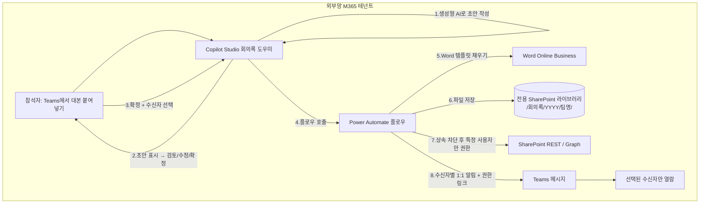

# 회의록 자동 작성·공유 에이전트 설계서

> 본 문서는 ms-design-agents가 자동 생성한 설계서다.

| 항목 | 내용 |
|------|------|
| 작성일 | 2026-05-28 |
| 프로젝트명 | 회의록 자동 작성·공유 에이전트 |
| 요청자 | (사용자) |
| 망 배치 결정 | **외부망 단독 (패턴 B)** |
| 사용 기술 | Copilot Studio + Power Automate + Word Online(Business) + SharePoint Online + Teams + Microsoft Graph |

---

## 1. 개요

### 1.1 요구사항
사용자 요청 원문(요약 인용):

> Teams 녹화가 끝나면 참석자가 대본(transcript)을 복사해 에이전트에 붙여넣고, 회사 양식 기반 회의록이 자동 작성되어 Word(.docx)로 SharePoint/OneDrive에 저장된다. 저장 후 "이 문서를 누구에게 보내시겠습니까?"라고 묻고, 사용자가 수신자를 선택하면 해당 문서가 전송되거나 Teams로 "회의록이 공유되었습니다. SharePoint에서 확인하세요" 형태의 알림이 간다. 어떤 공유 방식이 적합한지 판단 포함. 모두가 보는 SharePoint에 회의록이 노출되는 것을 원치 않으며, 선택한 사용자만 문서를 열람할 수 있도록 권한을 주고 싶다. 누구나 쉽게 사용할 수 있어야 한다. 외부망 M365 테넌트 기준으로 작성.

### 1.2 자동화 목표
Teams 회의가 끝난 뒤 참석자가 대본만 붙여넣으면, 회사 표준 양식의 회의록이 자동 작성·검토·확정되고, Word로 저장된 뒤 **선택한 사람에게만** 안전하게 공유된다. 회의록 작성에 드는 수작업과 양식 편차를 없애고, 기본적으로 비공개를 보장하는 것이 목표.

### 1.3 처리 대상 데이터
| 데이터 항목 | 종류 | 출처 | 개인정보 여부 |
|------------|------|------|--------------|
| 회의 대본(transcript) | 텍스트 | 사용자 붙여넣기 | ✅ (화자명·발언 내용) |
| 회의 메타(제목·일자·참석자) | 텍스트 | 대본 추출/사용자 입력 | ✅ |
| 생성된 회의록 | .docx | 에이전트 산출 | ✅ |
| 수신자 목록 | 이메일/UPN | 사용자 선택 | ✅ |

### 1.4 핵심 설계 관점 (재정의)
"대본 → 회사 양식 회의록"으로의 변환은 **생성형 AI(LLM)** 가 수행한다. `constraints/tenant_capabilities.md` 기준으로 외부 LLM 기반 생성형 답변은 **외부망 Copilot Studio에서만** 가능하므로, 데이터가 M365 내부에 있어도 "요약·재작성" 행위 때문에 **외부망 배치가 자연스럽다.** 단, 회의 대본이 외부 LLM에 입력된다는 점은 Security가 반드시 통제해야 한다(§6).

---

## 2. 아키텍처

### 2.1 다이어그램



### 2.2 컴포넌트 표

| 컴포넌트 | 역할 | 위치 | 사용 기술 |
|---------|------|------|-----------|
| 회의록 도우미 에이전트 | 대화·초안 작성·검토 루프·수신자 선택 | 외부망 | Copilot Studio (Teams 채널) |
| 생성형 프롬프트 | 대본 → 구조화 JSON 회의록 | 외부망 | Copilot Studio 프롬프트 액션(회사 승인 모델) |
| 회의록 문서생성·공유 플로우 | docx 생성·저장·권한·알림 | 외부망 | Power Automate |
| 회의록 템플릿(.docx) | 회사 표준 양식(콘텐츠 컨트롤) | 외부망 | SharePoint 보관 |
| 회의록 문서 라이브러리 | 회의록 보관(파일별 고유 권한) | 외부망 | SharePoint Online |
| 권한 부여 | 상속 차단 + 특정 사용자 열람권 | 외부망 | SharePoint REST(HTTP) / Microsoft Graph |
| 알림 | 공유 알림 메시지 | 외부망 | Teams 커넥터 |

---

## 3. 망 배치 결정 근거

`workflow/decision_tree.md` 적용 결과:

- Q1 (개인정보 처리): **예** — 대본에 화자(직원) 이름·발언 포함
- Q2/Q3 (외부 의존): **예** — 생성형 LLM으로 대본을 재작성
- Q4 (수신자): 내부 직원
- Q5 (개인정보 알림): 예 (개인별 공유)

결정 트리상 원칙은 패턴 C(외부망→내부망 연계)이나, 사용자가 본 자동화를 **외부망 단일 테넌트** 배치로 명시했고 모든 데이터·수신자가 동일 외부망 M365 안에 있으므로 **패턴 B(외부망 단독)** 로 확정한다. 민감정보 우려는 §6의 보안 조건으로 흡수한다.

**결정: 패턴 B (외부망 단독)**

대안 검토:
- **패턴 A(내부망 단독)**: 생성형 재작성이 핵심이라 외부 LLM이 필요. 내부망은 회사 승인 내부 모델만 가능하므로, 내부 모델이 없으면 부적합.
- **패턴 C(연계)**: 단일 테넌트 운영 범위에는 과도. 망연계 게이트웨이가 불필요.

---

## 4. Power Automate 플로우 명세

### 4.1 플로우 개요
| 항목 | 값 |
|------|----|
| 플로우명 | 회의록_문서생성_공유 |
| 위치 | 외부망 |
| 트리거 종류 | Copilot에서 호출(Power Virtual Agents/Copilot 트리거) |
| 실행 빈도 | 이벤트 기반 (회의록 확정 시) |

### 4.2 단계 명세

| 순번 | 단계 | 액션 종류 | 커넥터 | 입력 | 출력 변수 | 비고 |
|-----|------|----------|--------|------|----------|------|
| 1 | 트리거 | Copilot 호출 시 실행 | Copilot/PVA | MinutesJSON, 제목, 일자, 팀, 작성자, 수신자[] | - | - |
| 2 | JSON 파싱 | Parse JSON | 내장 | MinutesJSON | minutes | LLM 출력 스키마 검증 |
| 3 | 파일명 생성 | Compose | 내장 | `YYYY-MM-DD_회의명.docx` | fileName | 금칙문자 치환 |
| 4 | 문서 작성 | Populate a Word template | Word Online(Business) | 템플릿 + 매핑 필드 | docxContent | 콘텐츠 컨트롤 채움 (Premium) |
| 5 | 저장 | Create file | SharePoint | /회의록/YYYY/팀명/fileName | itemId, webUrl | 전용 라이브러리 |
| 6 | (선택) 민감도 레이블 | Send HTTP request / Graph | Graph(HTTP) | itemId | - | 회사 정책 시 |
| 7a | 상속 차단 | Send an HTTP request to SharePoint | SharePoint | `breakroleinheritance(copyRoleAssignments=false, clearSubscopes=true)` | - | **기본 노출 차단 핵심** |
| 7b | 권한 부여 | Grant access / addroleassignment | SharePoint/Graph | 수신자[], roles=read | - | 수신자별 루프, 부분 실패 허용 |
| 8 | 알림 | Post message in a chat (1:1) | Teams | 수신자, webUrl | - | 선(先)권한→후(後)링크 |
| 9 | 결과 반환 | Respond to Copilot | Copilot | 성공/실패, 실패 수신자 명단 | - | - |

### 4.3 변수 목록
| 변수명 | 타입 | 용도 |
|-------|------|------|
| MinutesJSON | Object | LLM이 생성한 구조화 회의록 |
| fileName | String | 저장 파일명 |
| recipients | Array | 선택된 수신자 UPN/이메일 |
| failedRecipients | Array | 권한 부여 실패자 |

### 4.4 조건 분기
- 7b 수신자 루프에서 개별 권한 부여 실패 시 `failedRecipients`에 누적 후 계속 진행(부분 실패 허용).
- 9단계에서 `failedRecipients`가 비어있지 않으면 작성자에게 별도 보고.

### 4.5 에러 핸들링
- 4~8단계를 Scope로 묶고 "구성된 후(run-after) 실패/시간초과" 분기 → 작성자에게 실패 알림.
- 재시도: HTTP 액션 기본 재시도 정책(고정 간격 4회) 유지.

---

## 5. Copilot Studio 구성 명세

### 5.1 에이전트 개요
| 항목 | 값 |
|------|----|
| 에이전트명 | 회의록 도우미 |
| 위치 | 외부망 |
| 채널 | Teams |

### 5.2 토픽 목록

| 토픽명 | 트리거 구문 / 설명 | 엔티티 | 호출 액션 | 변수 |
|-------|-------------------|--------|-----------|------|
| 회의록 작성 | "회의록", "회의록 작성", 대본 붙여넣기 | 텍스트(대본), 사람(수신자) | 회의록_문서생성_공유 플로우 | Transcript, MinutesJSON, Recipients |

### 5.3 토픽 흐름
1. 대본 입력 받기(다중 행 질문) → `Transcript`
2. 제목·일자 추출(생성형) 또는 사용자 확인
3. 생성형 프롬프트로 회사 양식 구조화 회의록 작성 → `MinutesJSON`
4. **초안을 사용자에게 표시 + "확정 / 수정" 질문** (검토 단계)
5. 수정 요청 시 수정 반영 후 재표시(루프)
6. 수신자 선택 — **대본에서 추출한 참석자를 기본 후보로 제시**, 외부 게스트 제외
7. 플로우 호출 → 결과 안내("공유 완료" 또는 실패 보고)

### 5.4 생성형 AI 사용 여부
- 사용 여부: **예**
- 사용 모델: **회사 승인 모델만** (외부 LLM, 프롬프트 데이터 비학습 확인 필수)
- 입력 데이터 분류: 내부 회의 대본(개인정보·잠재 민감정보 포함) → §6 통제 적용

---

## 6. 보안 검토 결과

| 항목 | 결과 | 비고 |
|------|------|------|
| 망분리 위반 여부 | ✅ | 외부망 단일 테넌트 내 완결 |
| 외부 LLM에 대본 전송 | ⚠️ | **회사 승인 모델 + "프롬프트 비학습" 보장 필수** |
| 개인정보 외부망 처리 | ⚠️ | 검토 단계 + 민감도 레이블로 보완 |
| 문서 기본 접근 범위 | ✅ | 상속 차단으로 사이트 멤버 전원 노출 방지 |
| 인증·인가 설계 | ✅ | "특정 사용자" 권한만, **조직 전체 링크 금지** |
| 감사 로그 | ⚠️ | Purview 감사 + 플로우 실행 이력으로 생성·공유·열람 추적 |
| 보존기간 설계 | ⚠️ | 회의록 보존·자동 파기 정책 수립 필요 |

**최종 보안 판정: 조건부 통과**
- (a) 회사 승인 생성형 모델 사용 및 비학습 보장
- (b) "확정 전 사용자 검토" 단계 필수
- (c) 저장 즉시 상속 차단 + "특정 사용자"로만 권한 부여, 조직 전체 링크 금지

---

## 7. 저장 위치 & 공유 방식 결정

### 7.1 저장·권한 모델 — 전용 SharePoint + 파일별 고유 권한 (확정)

| 방식 | 기본 노출 | 장점 | 단점 |
|------|----------|------|------|
| 공유 SharePoint 라이브러리 | 사이트 멤버 전체 | 거버넌스 쉬움 | **전원 열람 → 요구 위반** |
| 작성자 OneDrive + 특정 사용자 공유 | 소유자 전용 | 단순·즉시 비공개 | 작성자 퇴사 시 접근 단절 |
| **전용 SharePoint + 파일별 고유 권한** | 부여한 사람만 | **조직 거버넌스·보존·퇴사 무관** | 상속 차단 설정 복잡·오설정 위험 |

**확정: 전용 SharePoint 라이브러리 + 파일별 고유 권한.** 회의록 전용 라이브러리를 만들고, 기본 멤버 그룹 접근을 최소화한 뒤, **파일 생성 직후 권한 상속을 차단(breakroleinheritance)** 하고 선택된 수신자에게만 읽기 권한을 부여한다. 작성자 개인 계정 생명주기와 무관하게 조직이 보존·감사·파기를 관리할 수 있다.

**오설정 위험 통제**:
- 라이브러리 기본 권한을 사이트 소유자/서비스 계정으로 최소화(멤버 그룹 열람 제거).
- 파일 생성 → 상속 차단(7a) → 권한 부여(7b)를 **반드시 순서대로** 단일 플로우에서 처리.
- 권한 부여 실패 시에도 상속은 이미 차단되어 있어 과다 노출이 발생하지 않음(안전 우선 설계).

### 7.2 공유 방식 — 파일 직접 전송 vs 권한 링크 알림 (확정)

**확정: Word 파일을 직접 전송하지 않고, 권한이 부여된 링크 + Teams 알림.**

근거:
1. **단일 원본** — 수정 시 모두가 최신본 열람, 첨부는 버전 분산.
2. **권한 통제 유지** — 첨부 복사본은 권한 밖 재전달 가능, 링크는 SharePoint 권한이 끝까지 강제됨("그 사람만 열람" 보장).
3. **감사 추적** — 누가 언제 열었는지 기록.
4. **민감도 레이블 유지** — 파일 레이블·암호화가 그대로 따라감.

순서 원칙: **선(先)권한 부여 → 후(後)링크 안내.** 알림은 수신자 다수 시 서로 노출되지 않도록 **각자 1:1 메시지** 권장(그룹 채팅 지양).

---

## 8. 회사 표준 회의록 양식

Word 템플릿(.docx)에 이름 지정 콘텐츠 컨트롤을 두고 LLM JSON을 매핑:

1. 회의명 (`Title`)
2. 일시 / 장소 (`DateTime`, `Location`)
3. 참석자 / 불참자 (`Attendees`, `Absentees`)
4. 안건 (`Agenda` — 목록)
5. 주요 논의 내용 (`Discussion`)
6. 결정 사항 (`Decisions` — 목록)
7. 후속 조치 / 액션 아이템 (`ActionItems` — 반복 섹션: 담당자·할 일·기한)
8. 특이사항 / 비고 (`Notes`)
9. 작성자 / 작성일 (`Author`, `CreatedDate`)

LLM 출력 스키마(JSON) 예:
```json
{
  "title": "string",
  "datetime": "string",
  "location": "string",
  "attendees": ["string"],
  "absentees": ["string"],
  "agenda": ["string"],
  "discussion": "string",
  "decisions": ["string"],
  "actionItems": [{ "owner": "string", "task": "string", "due": "string" }],
  "notes": "string"
}
```

---

## 9. 추가 고려 변수 (사용자 요청 항목 + 확장)

사용자 제시: ①대본 품질(→검토 단계 반영), ②저장 경로 규칙(`/회의록/YYYY/팀명/날짜_회의명.docx`).

확장:
- **C. 외부 LLM 민감정보 노출** — 대본 자체가 외부 모델로 입력. 승인 모델 + 비학습 계약 + 산출물 민감도 레이블. (최우선)
- **D. 녹화·전사 동의** — 참석자 사전 고지·동의(노무·개인정보).
- **E. 문서 소유자 생명주기** — 본 설계는 전용 SharePoint 채택으로 작성자 퇴사 영향 제거.
- **F. 수신자 선택 UX** — 대본에서 참석자 자동 추출 후 기본 후보 제시, 외부 게스트 제외, 유효 사용자 검증.
- **G. 긴 회의 토큰 한계** — 1시간+ 대본은 모델 입력 한도 초과 가능 → 구간 분할 요약·통합(map-reduce).
- **H. 멱등성/중복 처리** — 동일 회의 재처리 시 덮어쓰기 vs 버전 정책.
- **I. 파일명/경로 정리** — `\ / : * ? " < > |` 금칙문자 치환, 경로 길이 제한.
- **J. 템플릿 거버넌스** — 템플릿 위치·버전·관리자 지정, 회의 유형별 다중 템플릿 선택.
- **K. 언어 처리** — 한국어/혼용 대본, 출력 언어·문체 통일.
- **L. 부분 실패** — 일부 수신자 권한 부여 실패 시 나머지 진행 + 실패자 보고.
- **M. 감사·보존·파기** — 생성/공유/열람 로그, 보존기간·자동 파기.
- **N. 라이선스·비용** — Copilot Studio 메시지 과금, 프리미엄 커넥터(HTTP/Graph, Word 채우기) 라이선스.
- **O. 모바일/접근성** — Teams 모바일 붙여넣기, 어댑티브 카드 가독성.

---

## 10. 구현 단계별 가이드

### 10.1 사전 준비
1. 외부망 환경 라이선스(Copilot Studio, Power Automate Premium) 확인.
2. 필요 커넥터(Word Online Business, SharePoint, Teams, HTTP) 활성화 및 DLP 정책 확인.
3. 회사 승인 생성형 모델 확인(비학습 보장).
4. 회의록 전용 SharePoint 사이트·문서 라이브러리 생성, 멤버 그룹 기본 열람 권한 최소화.
5. 회의록 Word 템플릿(.docx, 콘텐츠 컨트롤) 작성·보관.

### 10.2 외부망 구성 단계
1. [스크린샷 위치: Copilot Studio 에이전트 생성] "회의록 도우미" 에이전트 생성, Teams 채널 게시.
2. "회의록 작성" 토픽 작성(§5.3 흐름), 생성형 프롬프트 구성(§8 스키마 출력 강제).
3. [스크린샷 위치: Power Automate Maker Portal] "회의록_문서생성_공유" 플로우 생성(§4 명세).
4. SharePoint 상속 차단·권한 부여 HTTP 액션 구성(§4.2 7a/7b).
5. Teams 1:1 알림 액션 구성(§4.2 8).

### 10.3 테스트 시나리오
| 시나리오 | 입력 | 기대 결과 |
|---------|------|----------|
| 정상 | 정상 대본 | 양식 회의록 생성·저장·선택 수신자만 열람 |
| 대본 오인식 | 화자 오류 포함 | 초안 표시 → 사용자 수정 후 확정 |
| 긴 대본 | 1시간+ | 분할 요약 후 통합 |
| 권한 검증 | 비수신자 접근 | 열람 거부 |
| 부분 실패 | 잘못된 수신자 1명 | 나머지 공유 + 실패 보고 |

---

## 11. 운영 가이드

### 11.1 모니터링
- 실패 알림 채널: 작성자 1:1 + 운영 채널.
- 점검 항목: 플로우 실패율, 권한 부여 실패 건, 모델 응답 품질.

### 11.2 보존 및 파기
- 보존기간: 회사 정책에 따른 회의록 보존기간 설정(Purview 보존 레이블 권장).
- 파기: 보존기간 경과 시 자동 파기.

### 11.3 변경 관리
- 양식 변경 시 Word 템플릿 버전 갱신.
- 승인 모델 변경 시 프롬프트·DLP 재검토.

---

## 12. 부록

### 12.1 참고 문서
- Microsoft Learn — Copilot Studio, Power Automate, SharePoint REST(breakroleinheritance), Microsoft Graph(permissions/invite).
- 사내 정책 — 생성형 AI 사용 정책, 회의록 보존 정책.

### 12.2 변경 이력
| 날짜 | 변경 내용 | 작성자 |
|------|----------|--------|
| 2026-05-28 | 최초 작성 (외부망 단독, 전용 SharePoint 고유권한, 권한링크 알림 방식) | ms-design-agents |
