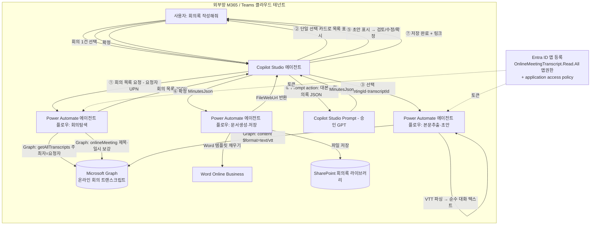

# 회의록 자동 작성 에이전트 설계서 (v2.0 — Graph 기반 전면 재설계)

> 본 문서는 ms-design-agents가 자동 생성한 설계서다.
> **v1(2026-05-28, 붙여넣기/파일 업로드 방식)을 폐기하고, "Teams Graph에 이미 존재하는 트랜스크립트를 직접 읽는" 방식으로 전면 재설계한 버전이다.**

| 항목 | 내용 |
|------|------|
| 작성일 | 2026-05-29 |
| 프로젝트명 | 회의록 자동 작성 에이전트 |
| 요청자 | (사용자) |
| 망 배치 결정 | **외부망 단독 (패턴 B)** — M365/Teams 클라우드 내 완결 |
| 사용 기술 | Copilot Studio + Power Automate(에이전트 플로우) + Microsoft Graph(온라인 회의 트랜스크립트) + Entra ID 앱 등록 + Word Online(Business) + SharePoint Online |
| 핵심 변경 | 사용자가 대본을 **올리지 않는다.** 에이전트가 Graph로 **내 회의 목록을 띄우고 → 선택하면 → 트랜스크립트 텍스트를 직접 가져와** 초안을 만든다. |

---

## 0. 왜 다시 설계하는가 — v1의 문제와 v2의 해결

사용자가 v1에서 겪은/우려한 제약을 Microsoft Learn 공식 문서로 하나씩 검증했다. 결론은 **"새 방향이 이 제약들을 우회하는 게 아니라 구조적으로 제거한다"** 이다.

| # | v1에서 겪은/우려한 제약 | 실제 사실 (MS Learn 근거) | v2의 처리 |
|---|------------------------|--------------------------|-----------|
| 1 | **docx·vtt 파일을 못 읽어** 프롬프트에 텍스트가 안 들어감 | 트랜스크립트는 Graph가 `GET …/transcripts/{id}/content?$format=text/vtt` 로 **WEBVTT 텍스트를 그대로 반환**한다. 파일 업로드·파싱 자체가 불필요. (Get callTranscript) | **파일 업로드 경로 전면 폐기.** Graph에서 텍스트를 직접 받아 VTT만 파싱(§5) |
| 2 | **Copilot Studio에서 사용자 검색이 안 뜸** | 핵심 흐름에는 **사용자 검색이 필요 없다.** 필요한 동작은 "내 회의 목록 중 1건 선택"이고, 이는 **단일 선택 카드(Adaptive Card 1.5)** 로 충분하다. 사용자 검색은 *수신자 공유* 에만 필요 → 본 설계 범위에서 제외(v2 별도) | 회의 선택 = 동적 단일 선택 카드. 사용자 검색 문제와 **완전히 분리** |
| 3 | 붙여넣기 **메시지 길이 제한**으로 긴 대본 잘림 | 사용자가 대본을 다루지 않으므로 채팅 길이 제한과 무관 | 붙여넣기 제거 |
| 4 | **토픽 노드·플로우가 실제로 되는지 미검증** | 본 설계의 모든 단계(getAllTranscripts · List transcripts · content · Populate Word template · Create file)는 **GA(정식 출시) API/액션**이다. 각 단계에 근거 URL을 명시(§14) | 단계별 MS Learn 근거 첨부 |

그리고 **정직하게 짚어야 할 신규 제약 2가지**(여기서 신뢰가 갈린다):

| # | 새 제약 (반드시 인지) | 사실 | 본 설계의 결정 |
|---|----------------------|------|----------------|
| A | "내가 **참석만** 한 회의"를 한 API로 나열 불가 | 사용자 범위 `getAllTranscripts`는 **"주최자(organizer)"가 본인인 회의만** 반환한다. 위임(delegated) 권한은 **미지원, 앱 권한 전용**. (onlineMeeting: getAllTranscripts) | **v1 범위 = 내가 주최한 회의.** "참석한 회의"는 캘린더 교차참조 + 테넌트 광역 권한이 필요 → **Tier 2(조건부)** 로 분리(§9) |
| B | 트랜스크립트 fetch API 비용 | 트랜스크립트/녹화 fetch API는 **과금되는 metered API** 이다. (Teams licenses — payment models for meeting APIs) | 비용·라이선스 절에 명시(§11) |

> **요지**: v1의 4대 고통은 사라진다. 대신 "주최 vs 참석" 권한 경계와 metered 비용이라는 **진짜** 제약을 정면으로 다룬다.

---

## 1. 개요

### 1.1 요구사항
사용자 요청 원문(요약 인용):

> 사용자가 에이전트에 접속해 "회의록 작성해줘"라고 하면, **사용자 기준으로 내가 참석/주최했던 회의 목록(녹화·대본이 있는 것만)을 띄워준다.** 목록에서 하나를 선택하면, 그 회의의 트랜스크립트를 Teams Graph에서 **텍스트만 긁어와** 초안 회의록을 만든다. 사용자가 "좋다"고 하면 Word(.docx)로 생성해 SharePoint에 저장한다. **수신자(공유 대상) 선택은 사용자 검색 제약이 있으니 일단 후순위로 미룬다.**

### 1.2 자동화 목표
회의가 끝나고 Teams가 자동 생성한 트랜스크립트를 사람이 옮겨 적거나 업로드하는 수작업 없이, **"회의록 작성해줘 → 목록에서 선택 → 검토 → 저장"** 4단계로 표준 양식 회의록을 만든다. 입력 데이터(대본)는 이미 M365 클라우드에 존재하므로 **사용자는 텍스트를 일절 다루지 않는다.**

### 1.3 처리 대상 데이터
| 데이터 항목 | 종류 | 출처 | 개인정보 여부 |
|------------|------|------|--------------|
| 내 회의 목록(제목·일시·meetingId·transcriptId) | JSON | Microsoft Graph(`getAllTranscripts` + `onlineMeeting`) | ✅ (회의 제목·시간) |
| 회의 트랜스크립트 본문 | text/vtt | Microsoft Graph(`…/transcripts/{id}/content`) | ✅ (화자명·발언 내용) |
| 생성된 회의록 | .docx | 에이전트 산출(Prompt + Word 템플릿) | ✅ |
| 요청자 식별자(UPN/objectId) | 텍스트 | 로그인 사용자 컨텍스트 | ✅ |

### 1.4 핵심 설계 관점
- 입력 확보(대본)는 **Graph 읽기**로, 변환(대본→회의록)은 **생성형 AI(Prompt action)** 로, 산출(.docx 저장)은 **Power Automate**로 분담한다.
- 트랜스크립트는 **이미 외부망 M365 테넌트(Teams 클라우드)에 존재**하는 데이터다. 에이전트는 "새 개인정보를 외부로 내보내는" 것이 아니라 "그 테넌트 안에 이미 있는 것을 읽어 같은 테넌트 안에서 가공"한다 → 망 배치는 v1과 동일하게 **패턴 B(외부망 단독)** 로 일관(§3).

---

## 2. 아키텍처

### 2.1 구성도



> 위 3개의 플로우(F1·F2·F3)는 구현상 1개 플로우의 분기로 합칠 수도 있으나, 100초 동기 응답 한계(§10.4)와 책임 분리를 위해 논리적으로 나눠 설명한다.

### 2.2 컴포넌트 표
| 컴포넌트 | 역할 | 위치 | 사용 기술 |
|---------|------|------|-----------|
| 회의록 도우미 에이전트 | 대화·목록 표시·선택·검토·확정 | 외부망 | Copilot Studio (Teams 채널) |
| 회의탐색 플로우(F1) | 요청자 주최 회의 중 트랜스크립트 보유 건 목록화 | 외부망 | Power Automate 에이전트 플로우 + Graph(HTTP) |
| 본문추출 플로우(F2) | 선택 회의 트랜스크립트 텍스트 수신·VTT 파싱 | 외부망 | Power Automate + Graph(HTTP) |
| Prompt action | 대본 → 표준 회의록 JSON 변환 | 외부망 | Copilot Studio Prompt(AI Builder, 승인 GPT) |
| 문서생성·저장 플로우(F3) | .docx 생성·SharePoint 저장 | 외부망 | Power Automate + Word Online + SharePoint |
| Entra ID 앱 등록 | Graph 트랜스크립트 읽기 권한 주체 | 외부망 | Microsoft Entra ID + application access policy |
| 회의록 Word 템플릿 | 회사 표준 양식(콘텐츠 컨트롤) | 외부망 | SharePoint 보관 |
| 회의록 문서 라이브러리 | 회의록 보관 | 외부망 | SharePoint Online |

---

## 3. 망 배치 결정 근거

`workflow/decision_tree.md` 적용:
- **Q1(개인정보 처리)** = 예 (트랜스크립트 = 화자명·발언). 
- **Q2/Q3(외부 의존)** = 예 (대본→회의록 변환에 생성형 LLM).
- 원칙상 패턴 C 후보이나, **데이터(트랜스크립트)·생성·저장이 모두 동일한 외부망 M365 테넌트 안에서 완결**되고 외부 인터넷의 별도 시스템으로 데이터가 나가지 않으므로 → **패턴 B(외부망 단독)** 로 확정. v1과 동일.

대안 검토:
- **패턴 A(내부망 단독)**: 내부망은 인터넷·외부 LLM·HTTP가 차단(`constraints/tenant_capabilities.md`). 트랜스크립트 Graph 호출(HTTP)과 외부 LLM 모두 불가 → 부적합. *단, 회의가 내부망 테넌트의 Teams에서 열린다면 이 설계 자체가 성립하지 않는다(§13.1 전제 확인 필수).*
- **패턴 C(연계)**: 단일 테넌트 내 완결 시나리오에 게이트웨이는 과도.

> ⚠️ **결정적 전제**: 본 설계는 **"녹화·전사가 일어나는 Teams 회의가 외부망 M365 테넌트에 있다"** 를 전제한다. 회사가 회의를 내부망 테넌트에서 연다면 외부 LLM 사용이 불가하므로, 그 경우 변환 단계를 회사 승인 내부 모델로 교체해야 한다(§13.1).

---

## 4. 회의 탐색·선택 설계 (핵심 ①②)

### 4.1 "내 회의 목록"을 만드는 법 — 사실관계
| 방법 | API | 권한 | 반환 범위 | 채택 |
|------|-----|------|----------|------|
| **주최 회의 트랜스크립트 일괄** | `GET /users/{requesterId}/onlineMeetings/getAllTranscripts(meetingOrganizerUserId='{requesterId}', startDateTime=…, endDateTime=…)` | **앱 권한** `OnlineMeetingTranscript.Read.All` + application access policy. *위임 미지원.* | 요청자가 **주최자**인 회의 중 **트랜스크립트가 존재하는** 회의 | ✅ **v1 채택** |
| 회의 제목·일시 보강 | `GET /users/{requesterId}/onlineMeetings/{meetingId}` (subject, startDateTime) | 위 동일 | 단건 메타 | ✅ 표시용 |
| 참석(주최 아님) 회의까지 | 캘린더(`/users/{id}/calendarView`)로 후보 나열 + 테넌트 광역 `communications/onlineMeetings/getAllTranscripts` 교차 | 테넌트 전체 트랜스크립트 읽기(광역) | 참석 회의 포함 | ⚠️ **Tier 2(조건부, §9)** |

**핵심 사실 (반드시 인지):**
1. `getAllTranscripts`는 **위임 권한 미지원 → 앱 권한 전용**이며, 반환 대상은 **"주최자가 본인인 회의"** 뿐이다. (근거: onlineMeeting: getAllTranscripts — Permissions/HTTP request)
2. 앱 권한으로 특정 사용자 대리 호출을 하려면 관리자가 **application access policy**(`Grant-CsApplicationAccessPolicy`)로 "이 앱이 이 사용자(들)를 대리해도 됨"을 부여해야 한다. (근거: Configure application access to online meetings)
3. `getAllTranscripts`는 **트랜스크립트가 있는 회의만** 돌려준다 → "녹화/대본 있는 것만 보여줘"라는 요구가 **API 차원에서 자동 충족**된다. (우리가 소비하는 건 녹화 mp4가 아니라 텍스트 트랜스크립트이므로, 게이트 기준도 "트랜스크립트 존재"가 정확하다.)

### 4.2 회의 선택 UX — 단일 선택 카드 (사용자 검색 불필요)
v1의 고통이었던 "사용자 검색/People Picker"는 **여기 등장하지 않는다.** 필요한 건 "내 회의 N건 중 1건 선택"이고, 이는 플로우가 돌려준 목록으로 **동적 단일 선택**을 만들면 된다. Adaptive Card 1.5의 `Input.ChoiceSet`(단일) 또는 Copilot Studio `Question`(Multiple choice)으로 충분하다.

```
에이전트:  최근 회의 중 회의록을 만들 회의를 고르세요
          ┌─────────────────────────────────────────────┐
          │ ○ 2026-05-27 10:00  마케팅 2분기 캠페인 정기회의 │
          │ ○ 2026-05-26 15:30  제품팀 스프린트 리뷰         │
          │ ○ 2026-05-22 09:00  주간 영업 현황 공유          │
          │                         [ 선택 ]               │
          └─────────────────────────────────────────────┘
사용자:    첫 번째 선택
에이전트:  대본을 불러와 회의록 초안을 만들고 있어요…
```

선택지 동적 생성(Power Fx, 플로우 반환 `Meetings` 테이블 기준):
```
ForAll(
  Topic.Meetings,
  { title: Text(startDateTime, "[$-ko]yyyy-mm-dd hh:mm") & "  " & subject,
    value: meetingId & "|" & transcriptId }   // 선택값에 두 ID를 함께 실어 보냄
)
```
> 선택값에 `meetingId|transcriptId`를 함께 담아, 다음 단계에서 분리(`Split`)해 사용한다.

### 4.3 회의탐색 플로우(F1) 반환 계약
**Copilot → F1 입력**
| 매개변수 | 타입 | 설명 |
|---------|------|------|
| RequesterId | Text | 로그인 사용자 objectId 또는 UPN |
| LookbackDays | Number | 조회 기간(예: 30). 기본 30일 |

**F1 → Copilot 출력**
| 매개변수 | 타입 | 설명 |
|---------|------|------|
| MeetingsJson | Text | `[{subject,startDateTime,meetingId,transcriptId}]` JSON 문자열 |
| Count | Number | 건수(0이면 "최근 트랜스크립트 있는 주최 회의가 없습니다") |

---

## 5. 트랜스크립트 텍스트 추출 (핵심 ③) — docx/vtt 문제의 해소

### 5.1 텍스트 직수신
선택한 회의의 트랜스크립트 본문을 **텍스트로 직접** 받는다.
```http
GET /users/{requesterId}/onlineMeetings/{meetingId}/transcripts/{transcriptId}/content?$format=text/vtt
Authorization: Bearer {app-token}
```
응답(근거: Get callTranscript):
```
HTTP/1.1 200 OK
Content-type: text/vtt

WEBVTT

00:00:03.663 --> 00:00:07.903
<v 김지훈>2분기 캠페인 정기회의 시작하겠습니다.</v>
00:00:08.100 --> 00:00:12.500
<v 박서연>지난 캠페인 전환율이 3.2%로 목표를 넘겼습니다.</v>
```
- 기본 포맷은 **VTT(텍스트)**. (Accept 헤더로 DOCX도 받을 수 있으나 **불필요** — 우리는 텍스트가 필요.)
- 평균 크기 30~60분 회의 ≈ 약 300KB. (근거: Export Teams content)
- **이 한 단계가 v1의 "docx/vtt를 못 읽음" 문제를 통째로 없앤다.** 파일 업로드도, 첨부 파싱도 없다.

### 5.2 VTT → 순수 대화 텍스트 파싱 (플로우 내부)
프롬프트에 넣기 좋게 타임스탬프·태그를 제거하고 `화자: 발언` 형태로 정리한다(플로우 `Compose` + `replace`/정규식, 또는 Office Script).
- `WEBVTT` 헤더 줄 제거.
- `00:00:03.663 --> 00:00:07.903` 같은 **시간 줄 제거**.
- `<v 화자>발언</v>` → `화자: 발언` 으로 변환(여는 태그에서 화자명 추출, 닫는 태그 제거).
- 결과 예:
```
김지훈: 2분기 캠페인 정기회의 시작하겠습니다.
박서연: 지난 캠페인 전환율이 3.2%로 목표를 넘겼습니다.
```

### 5.3 본문추출 플로우(F2) 계약
**Copilot → F2 입력**: `RequesterId`, `MeetingId`, `TranscriptId`
**F2 → Copilot 출력**: `Transcript`(Text, 파싱 완료된 순수 대화), `Status`

---

## 6. 회의록 생성 (핵심 ④) — Prompt action

### 6.1 왜 Prompt action인가
| 기능 | 용도 | 적합성 |
|------|------|--------|
| **Prompt action (AI Builder, GPT)** | 요약·추출·변환 | ✅ 채택 (대본→회의록 변환) |
| Create generative answers | 지식소스 RAG Q&A | ❌ (변환 용도 아님) |

### 6.2 프롬프트 지시문 (복사용 전문)
```
당신은 회의록 작성 도우미입니다. 아래 [회의 대본]을 읽고 한국어 회의록을 작성하세요.

[규칙]
- 반드시 아래 JSON 형식 하나만 출력하고, 그 외 설명 문장은 쓰지 마세요.
- 대본에서 제목·일시·참석자·안건·논의 내용·결정 사항·후속 조치를 찾아 각 칸을 채우세요.
- 대본에 없는 정보는 추측하지 말고 빈 문자열("") 또는 빈 배열([])로 두세요.
- 화자 이름은 attendees에, 불참/휴가 언급은 absentees에 넣으세요.
- 후속 조치는 "누가 / 무엇을 / 언제까지" 형태로 actionItems에 담으세요.
- 개조식(~함, ~하기로 함)으로 간결히 정리하세요.

[출력 JSON 형식]
{ "title":"", "datetime":"", "location":"", "attendees":[], "absentees":[],
  "agenda":[], "discussion":"", "decisions":[],
  "actionItems":[{"owner":"","task":"","due":""}], "notes":"" }

[회의 대본]
{Transcript}
```
- 입력: `Transcript`(F2 산출) / 출력: `MinutesJson`
- 제목·일시는 회의 메타(§4.1)로 보강·교정할 수 있다(프롬프트 출력이 비면 회의 subject/start로 채움).

### 6.3 긴 대본 토큰 대응 (map-reduce)
30~60분 회의 트랜스크립트(≈300KB)는 모델 입력 한도를 넘을 수 있다.
1. **전처리**: §5.2 파싱으로 타임스탬프·태그 제거(이미 20~40% 절감).
2. **청크 + 합치기**: 임계값 초과 시 4,000~6,000자 단위로 분할 → 조각별 부분요약(map) → 부분요약 통합(reduce, §6.2 프롬프트로 최종 JSON).
3. **길이 분기**: 임계값 미만이면 1회 처리, 이상이면 청크 경로.

### 6.4 검토·수정 루프
초안 `MinutesJson`을 카드로 표시 → 사용자가 "확정/수정" 선택 → 수정 시 요청 반영해 Prompt 재실행 → 재표시. (human oversight 권고와 부합.)

---

## 7. 문서 생성·저장 (핵심 ⑥) — Word + SharePoint

> v1의 A1 case study 시퀀스(Populate a Word template → Create file)를 그대로 사용. 검증된 GA 경로.

### 7.1 문서생성·저장 플로우(F3) 단계
| 순번 | 단계 | 액션 | 커넥터 | 비고 |
|-----|------|------|--------|------|
| 1 | 트리거 | When an agent calls the flow | Copilot | 입력: `MinutesJson`, `RequesterUpn` |
| 2 | 파싱 | Parse JSON | 내장 | §12 스키마 |
| 3 | 파일명·경로 | Compose | 내장 | `/회의록{연도}/{날짜}_{회의명}.docx`, 금칙문자 치환 |
| 4 | 문서 작성 | Populate a Microsoft Word template | Word Online(Business) | 콘텐츠 컨트롤 필드 매핑 |
| 5 | 저장 | Create file | SharePoint | webUrl 획득 |
| 6 | 응답 | Respond to the agent | Copilot | `Status`, `FileWebUrl` |

> **공유/권한 부여는 본 v1 범위 제외**(§9). 저장 위치는 우선 **작성자 본인 접근 가능 라이브러리**로 두고, 공유 모델은 v2에서 설계.

---

## 8. Entra ID 앱 등록 · 권한 · 인증 (구현의 관문)

이 설계가 "실제로 되느냐"의 8할은 여기서 갈린다.

### 8.1 필요 권한
| 권한 | 유형 | 용도 | 비고 |
|------|------|------|------|
| `OnlineMeetingTranscript.Read.All` | **Application** | getAllTranscripts·List transcripts·content | **위임 미지원**. 관리자 동의 필요 |
| `OnlineMeetings.Read.All` | Application | onlineMeeting 제목·일시 보강 | 관리자 동의 필요 |

### 8.2 application access policy (필수)
앱 권한으로 **특정 사용자를 대리**해 그 사용자의 회의 트랜스크립트를 읽으려면, 관리자가 정책을 만들어 앱↔사용자를 묶어야 한다. 누락 시 `403 "No application access policy found for this app"`. (근거: Configure application access to online meetings)
```powershell
New-CsApplicationAccessPolicy -Identity Minutes-Agent-Policy -AppIds "<APP_CLIENT_ID>" -Description "회의록 에이전트"
Grant-CsApplicationAccessPolicy -PolicyName Minutes-Agent-Policy -Identity "<대상 사용자 또는 -Global>"
```
> 정책 반영에 최대 30분 소요. 대상 사용자를 한정(부서/그룹)해 **최소권한** 원칙을 지킨다.

### 8.3 Power Automate에서 토큰 획득
`getAllTranscripts`가 **앱 권한 전용**이므로, "HTTP with Microsoft Entra ID" 커넥터(연결 사용자 위임)로는 부족하다. 다음 중 하나로 **client credentials(앱 토큰)** 를 사용한다.
- (권장) **사용자 지정 커넥터(Custom Connector)** 에 OAuth 2.0 **client credentials** 설정 → Graph 호출.
- 또는 **HTTP(Premium) 액션**으로 토큰 엔드포인트(`/oauth2/v2.0/token`, `scope=https://graph.microsoft.com/.default`)에서 토큰을 받아 후속 Graph 호출의 `Authorization` 헤더에 사용.
- **클라이언트 시크릿/인증서는 환경 변수 또는 Azure Key Vault에 보관**하고 플로우에서 보안 입력으로 참조(평문 금지).

---

## 9. 범위 결정 — 무엇을 v1에 넣고 무엇을 미루는가

| 기능 | v1 포함? | 사유 |
|------|---------|------|
| 내가 **주최한** 회의 목록·선택·초안·저장 | ✅ 포함 | `getAllTranscripts`로 확실히 지원 |
| 내가 **참석만** 한 회의 | ⚠️ **Tier 2(조건부)** | per-user API가 주최 회의만 반환. 캘린더 교차참조 + **테넌트 광역 트랜스크립트 읽기**가 필요 → 컴플라이언스 검토 부담 큼. 별도 승인 후 추가 |
| **수신자 검색·선택·권한공유·알림** | ❌ **v2로 분리** | 사용자 요청대로 후순위. People Picker 제약(Copilot Studio×Teams 1.5)으로 별도 설계 필요 |
| 회의 녹화(mp4) 활용 | ❌ | 회의록엔 텍스트 트랜스크립트면 충분 |

> Tier 2(참석 회의) 구현 시: ① `Calendars.Read`(앱)로 요청자 캘린더의 온라인 회의 후보 나열 → ② 각 회의의 organizer 식별 → ③ 테넌트 광역 `communications/onlineMeetings/getAllTranscripts` 또는 organizer 대리 권한으로 트랜스크립트 매칭. **타 직원 데이터 접근 범위가 넓어지므로 보안·법무 사전 검토 필수.**

---

## 10. Copilot Studio ↔ Power Automate 연계

### 10.1 연계 방식 — 토픽 레벨 Action 노드(채택)
사용자가 회의를 선택/확정한 **정해진 지점에서만** 플로우를 호출(결정적)한다. 에이전트 레벨 도구(자동 의도매칭)는 조기 실행 위험으로 미채택.

### 10.2 토픽 노드 구성 ("회의록 작성" 토픽)
| # | 노드 | 구성 | 변수 |
|---|------|------|------|
| 1 | Trigger | "회의록", "회의록 작성" | - |
| 2 | Action(F1) | 회의탐색 호출(요청자 UPN, 30일) | → `MeetingsJson`, `Count` |
| 3 | Condition | `Count`=0 → 안내 후 종료 | - |
| 4 | Question/카드 | 단일 선택 목록(§4.2) | → `SelectedValue`(meetingId\|transcriptId) |
| 5 | Set variable | `Split(SelectedValue,"|")` | → `MeetingId`, `TranscriptId` |
| 6 | Action(F2) | 본문추출 호출 | → `Transcript` |
| 7 | Action(Prompt) | 대본→회의록 JSON | → `MinutesJson` |
| 8 | Message | 초안 카드 표시 | `MinutesJson` |
| 9 | Question | "확정/수정" | → `ReviewChoice` |
| 10 | Condition | 수정 → 7 재실행 / 확정 → 11 | - |
| 11 | Action(F3) | 문서생성·저장 | → `Status`, `FileWebUrl` |
| 12 | Message | "저장 완료" + 링크 | - |

### 10.3 입출력은 JSON 문자열로
배열/객체는 **Text(JSON 문자열)** 로 주고받고 플로우에서 Parse JSON. (Copilot↔Flow 매개변수 제약 대응.)

### 10.4 동기 100초 한계
각 플로우는 `Respond to the agent`를 100초 내 반환. 회의 건수가 많으면 F1에서 `$top`·기간 축소로 응답시간 관리. 스키마 변경 시 Action 노드 **Refresh + 재게시**(누락 시 `FlowActionBadRequest`).

---

## 11. 보안·컴플라이언스 검토

| 항목 | 결과 | 비고 |
|------|------|------|
| 망분리 위반 | ✅ | 외부망 단일 테넌트 내 완결. 인터넷 별도 시스템 전송 없음 |
| 외부 LLM에 대본 전송 | ⚠️ | 트랜스크립트=개인정보. **승인 모델 + 비학습** 필수. 회의가 내부망 테넌트면 외부 LLM 금지(§3 전제) |
| Graph 권한 최소화 | ⚠️ | 앱 권한 `*.Read.All` + **application access policy로 대상 사용자 한정**해 광역 노출 차단 |
| 자격증명 보관 | ⚠️ | 클라이언트 시크릿/인증서 Key Vault·환경변수, 평문 금지 |
| 비용(metered API) | ⚠️ | 트랜스크립트 fetch는 과금. 호출량 모니터링·상한 |
| 검토 단계 | ✅ | 확정 전 사람 검토(§6.4) |
| 감사·보존 | ⚠️ | Purview 감사 + 플로우 실행이력, 회의록 보존·파기 정책 |
| 동의·고지 | ⚠️ | 회의 녹화·전사 사전 고지·동의(Teams 정책) |

**최종 보안 판정: 조건부 통과** — (a) 승인·비학습 모델, (b) application access policy로 대상 사용자 한정, (c) 자격증명 Key Vault 보관, (d) metered 비용 상한·모니터링, (e) 회의가 외부망 테넌트라는 전제 확인.

### 라이선스·비용 (근거: Teams licenses — payment models)
- 트랜스크립트/녹화 fetch API는 **metered**(모델 기반 과금). 회의록 1건당 트랜스크립트 1회 호출이 기본.
- Copilot Studio 사용량 + Prompt(Copilot Credits) + Power Automate Premium(HTTP/사용자 지정 커넥터) + Dataverse.

---

## 12. 표준 회의록 양식 & 출력 스키마

Word 템플릿(.docx)에 **Plain Text 콘텐츠 컨트롤**로 placeholder를 만들고 SharePoint 보관. 필드: 회의명/일시·장소/참석자·불참자/안건/주요 논의/결정 사항/후속 조치(반복)/특이사항.

```json
{
  "title": "string", "datetime": "string", "location": "string",
  "attendees": ["string"], "absentees": ["string"], "agenda": ["string"],
  "discussion": "string", "decisions": ["string"],
  "actionItems": [{ "owner": "string", "task": "string", "due": "string" }],
  "notes": "string"
}
```

---

## 13. 구현 단계별 가이드

### 13.1 사전 확인 (가장 먼저)
1. **회의 녹화/전사가 일어나는 Teams 테넌트가 외부망 M365인지** 확인(아니면 §3 전제 붕괴 → 내부 모델로 변환 단계 교체).
2. 회사 승인 생성형 모델(비학습) 확인.
3. Copilot Studio·Power Automate Premium·Dataverse·Copilot Credits 라이선스 확인.

### 13.2 Entra ID
4. 앱 등록 → `OnlineMeetingTranscript.Read.All`, `OnlineMeetings.Read.All`(Application) 추가 → 관리자 동의.
5. `New/Grant-CsApplicationAccessPolicy`로 앱↔대상 사용자 정책(최대 30분 반영).
6. 클라이언트 시크릿/인증서 발급 → Key Vault/환경변수 보관.

### 13.3 Power Automate (솔루션·동일 환경)
7. 사용자 지정 커넥터(또는 HTTP) — client credentials로 Graph 호출 토큰.
8. F1(회의탐색): `getAllTranscripts(meetingOrganizerUserId=요청자)` → 제목 보강 → `MeetingsJson`.
9. F2(본문추출): `…/content?$format=text/vtt` → VTT 파싱 → `Transcript`.
10. F3(문서생성·저장): Populate Word template → Create file → `FileWebUrl`.
11. 각 플로우 `Respond to the agent`(async off) → 게시.

### 13.4 Copilot Studio
12. 에이전트 생성, Teams 채널, Entra 인증.
13. Prompt action(§6.2) — 입력 `Transcript`, 출력 `MinutesJson`.
14. "회의록 작성" 토픽(§10.2) — F1/F2/Prompt/F3 Action 매핑, 단일 선택 카드.
15. Test → 스키마 변경 시 Action Refresh + 재게시 → Teams 게시.

### 13.5 테스트 시나리오
| 시나리오 | 입력 | 기대 결과 |
|---------|------|----------|
| 정상 | 주최 회의 1건 선택 | 트랜스크립트 텍스트 수신 → 초안 → 저장·링크 |
| 트랜스크립트 없음 | 최근 주최 회의 0건 | "최근 트랜스크립트 있는 주최 회의가 없습니다" |
| 긴 회의 | 60분+ 대본 | 청크 map-reduce 처리 |
| 권한 누락 | access policy 미부여 | 403 재현 → 정책 부여로 해소 |
| 참석(주최 아님) 회의 | 목록에 안 보임 | v1 범위 외임을 안내(§9) |

---

## 14. 부록

### 14.1 참고 문서 (Microsoft Learn) — 본 설계 검증 근거
- Get meeting transcripts and recordings using Graph APIs — https://learn.microsoft.com/microsoftteams/platform/graph-api/meeting-transcripts/overview-transcripts
- onlineMeeting: getAllTranscripts (앱 권한 전용·주최자 범위) — https://learn.microsoft.com/graph/api/onlinemeeting-getalltranscripts?view=graph-rest-1.0
- List transcripts (위임/앱 권한) — https://learn.microsoft.com/graph/api/onlinemeeting-list-transcripts?view=graph-rest-1.0
- Get callTranscript (content `$format=text/vtt`) — https://learn.microsoft.com/graph/api/calltranscript-get?view=graph-rest-1.0
- Export content with the Microsoft Teams Export APIs (VTT/크기) — https://learn.microsoft.com/microsoftteams/export-teams-content
- Configure application access to online meetings (application access policy) — https://learn.microsoft.com/graph/cloud-communication-online-meeting-application-access-policy
- Microsoft Graph permissions reference (OnlineMeetingTranscript.Read.All) — https://learn.microsoft.com/graph/permissions-reference
- Teams licenses — payment models for meeting APIs (metered) — https://learn.microsoft.com/graph/teams-licenses#payment-models-for-meeting-apis
- Get onlineMeeting (joinWebUrl로 조회) — https://learn.microsoft.com/graph/api/onlinemeeting-get?view=graph-rest-1.0
- Populate a Word template / Create file (A1 case study) — https://learn.microsoft.com/power-platform/guidance/case-studies/boost-efficiency-experience-case-study
- Create an agent flow as a tool — https://learn.microsoft.com/microsoft-copilot-studio/advanced-flow-create
- Call an agent flow from an agent — https://learn.microsoft.com/microsoft-copilot-studio/advanced-use-flow
- Use prompt actions in Copilot Studio — https://learn.microsoft.com/ai-builder/use-a-custom-prompt-in-mcs
- Using Adaptive Cards in Copilot Studio (1.5/1.6 제약) — https://learn.microsoft.com/microsoft-copilot-studio/adaptive-cards-overview
- FlowActionBadRequest 문제해결 — https://learn.microsoft.com/troubleshoot/power-platform/copilot-studio/channels/agent-flow-action-bad-request

### 14.2 변경 이력
| 날짜 | 변경 내용 | 작성자 |
|------|----------|--------|
| 2026-05-29 | **v2.0 전면 재설계** — 붙여넣기/파일 업로드 폐기, Graph 트랜스크립트 직접 읽기(getAllTranscripts→content text/vtt), 회의 단일선택 카드, Entra 앱권한+application access policy, 주최 회의 v1·참석 회의 Tier 2·수신자 공유 v2 분리, metered 비용 명시 | ms-design-agents |

### 14.3 v1 대비 핵심 차이 요약
| 구분 | v1(2026-05-28) | v2(본 문서) |
|------|----------------|-------------|
| 대본 입력 | 사용자가 붙여넣기/파일 업로드 | **Graph에서 텍스트 직접 수신** |
| docx/vtt 파싱 | 변환 단계 필요(권장도 낮음) | **불필요**(content가 text/vtt 반환) |
| 회의 선택 | 해당 없음 | **내 회의 단일선택 카드** |
| 사용자 검색 | 수신자 선택에 필요(People Picker 제약) | 핵심 흐름에서 **제거**(공유는 v2) |
| 주 권한 | 커넥터 위주 | **Entra 앱권한 + application access policy** |
| 신규 제약 | (미검증) | 주최자 범위·metered 비용 **명시** |
