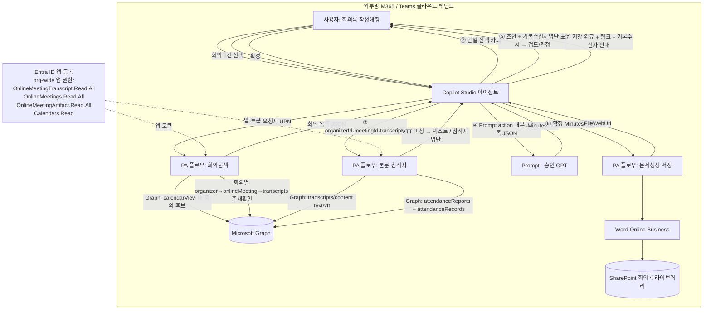

# 회의록 자동 작성 에이전트 설계서 (v2.1 — Graph 기반, 참석 회의 전체 + 참석자 기본 수신자)

> 본 문서는 ms-design-agents가 자동 생성한 설계서다.
> **v1(2026-05-28, 붙여넣기/파일 업로드)을 폐기하고 "Teams Graph에 이미 존재하는 트랜스크립트를 직접 읽는" 방식으로 재설계(v2.0)한 뒤, "참석한 회의 전체 + 기본 수신자=참석자" 요구를 반영해 v2.1로 갱신했다.**

| 항목 | 내용 |
|------|------|
| 작성일 | 2026-05-29 |
| 프로젝트명 | 회의록 자동 작성 에이전트 |
| 요청자 | (사용자) |
| 망 배치 결정 | **외부망 단독 (패턴 B)** — M365/Teams 클라우드 내 완결 |
| 사용 기술 | Copilot Studio + Power Automate(에이전트 플로우) + Microsoft Graph(캘린더·온라인 회의·트랜스크립트·참석 기록) + Entra ID 앱 등록(**org-wide 앱 권한**) + Word Online(Business) + SharePoint Online |
| 핵심 변경(v2.1) | "내가 **참석한** 회의 전부"를 다룬다(주최자 한정 아님). 회의의 **실제 참석자 명단을 자동 수집**해 공유 시 **기본 수신자로 미리 체크**한다. |

---

## 0. 왜 다시 설계하는가 — v1 문제와 v2의 해결, 그리고 v2.1의 핵심 결정

### 0.1 v1 4대 고통의 구조적 제거 (v2.0에서 확정)
| # | v1에서 겪은/우려한 제약 | 실제 사실 (MS Learn 근거) | 처리 |
|---|------------------------|--------------------------|------|
| 1 | **docx·vtt 파일을 못 읽어** 프롬프트에 텍스트가 안 들어감 | 트랜스크립트는 `GET …/transcripts/{id}/content?$format=text/vtt` 로 **WEBVTT 텍스트를 그대로 반환** (Get callTranscript) | 파일 업로드 폐기, Graph 텍스트 직수신(§5) |
| 2 | **Copilot Studio 사용자 검색이 안 뜸** | 핵심 흐름엔 사용자 검색이 불필요. "회의 1건 선택"은 단일 선택 카드(1.5)로 충분. **기본 수신자도 검색이 아니라 참석 기록에서 자동 산출**(§6) | 회의 선택·기본 수신자 모두 검색 없이 처리 |
| 3 | 붙여넣기 길이 제한으로 잘림 | 사용자가 대본을 다루지 않음 | 붙여넣기 제거 |
| 4 | 토픽·플로우가 실제로 되는지 미검증 | 모든 단계가 GA API/액션. 단계별 근거 URL 명시(§14) | 근거 첨부 |

### 0.2 v2.1 핵심 결정 — "참석한 회의 전체"가 권한 모델을 바꾼다 (정직하게)
사용자 요구: ① 주최뿐 아니라 **참석한 모든 회의**가 목록에 떠야 한다. ② 공유 시 **그 회의 참석자**가 기본 수신자여야 한다.

검증 결과(추측 아님, MS Learn 확인):

| 사실 | 근거 | 함의 |
|------|------|------|
| `getAllTranscripts`(사용자 범위)는 **앱 권한 전용**이고 **주최자(organizer) 회의만** 반환. 위임 미지원 | onlineMeeting: getAllTranscripts — Permissions | "내가 주최한 회의"만으로는 요구 ① 충족 불가 |
| "남이 주최한" 회의의 트랜스크립트를 **위임으로 읽는 것은 문서상 보장되지 않음**. 문서가 보장하는 경로는 **조직 전체(org-wide) 앱 권한** = 테넌트 내 **모든 회의** 읽기 | overview-transcripts — "organization-wide application permissions … read and access transcripts and recordings for **all meetings in the tenant**" | 요구 ①을 충족하려면 **org-wide 앱 권한**이 사실상 필수 |
| 참석 보고서(`attendanceRecords`)는 **위임은 주최자만** 접근. 앱 권한(`OnlineMeetingArtifact.Read.All`)이면 회의별 참석자 명단(이메일·이름·역할·참석시간) 수집 가능 | Online meeting artifacts and permissions | 요구 ②(기본 수신자=참석자)는 참석 기록으로 충족. 단 남의 회의까지면 **앱(org-wide)** 필요 |
| 트랜스크립트/참석/녹화 fetch는 **과금(metered) API** | Teams licenses — payment models | 호출량·비용 통제 필요 |

> **결론 (가장 중요)**: "참석한 모든 회의"를 진짜로 구현하려면 **에이전트 앱이 회사 전체 회의의 트랜스크립트·참석 기록을 읽을 수 있는 org-wide 앱 권한**을 가져야 한다. **기술적으로 가능하지만, 금융 망분리 환경에서 매우 강력한 권한**이다. 이 대가를 §8·§11에서 통제 방안과 함께 정면으로 다룬다. 보안이 org-wide를 불허하면 **주최 회의 한정(저권한)** 으로 축소하는 대안을 §9에 제시한다.

---

## 1. 개요

### 1.1 요구사항(최신)
> 사용자가 에이전트에 "회의록 작성해줘"라고 하면 **내가 참석/주최한 회의 목록(트랜스크립트 있는 것만)** 을 띄운다. 1건을 선택하면 트랜스크립트 텍스트를 가져와 초안을 만들고, 확정하면 Word(.docx)로 SharePoint에 저장한다. **공유 시 그 회의의 참석자가 기본 수신자로 미리 선택**되어 있어야 한다(추가/제외만 하면 되도록). 임의 사용자 검색·실제 권한 부여 실행은 후순위.

### 1.2 자동화 목표
회의가 끝나면 Teams가 만든 트랜스크립트로 표준 회의록을 "선택 → 검토 → 저장" 흐름으로 자동 작성한다. 사용자는 대본을 옮기거나 수신자를 일일이 찾지 않는다(참석자가 기본값).

### 1.3 처리 대상 데이터
| 데이터 항목 | 종류 | 출처(Graph) | 개인정보 |
|------------|------|-------------|----------|
| 내 회의 후보(제목·일시·organizer·joinUrl) | JSON | `…/calendarView` | ✅ |
| 회의 식별자(meetingId·transcriptId) | 문자열 | `…/onlineMeetings?$filter=JoinWebUrl eq` → `…/transcripts` | ✅ |
| 트랜스크립트 본문 | text/vtt | `…/transcripts/{id}/content` | ✅ (화자·발언) |
| **참석자 명단(이메일·이름·역할·참석시간)** | JSON | `…/attendanceReports?$expand=attendanceRecords` | ✅ |
| 생성된 회의록 | .docx | 에이전트 산출 | ✅ |

---

## 2. 아키텍처

### 2.1 구성도


### 2.2 컴포넌트 표
| 컴포넌트 | 역할 | 위치 | 기술 |
|---------|------|------|------|
| 회의록 도우미 에이전트 | 대화·목록·선택·검토·확정 | 외부망 | Copilot Studio (Teams) |
| 회의탐색 플로우(F1) | 캘린더로 참석 회의 후보 → 트랜스크립트 보유 건 목록화 | 외부망 | PA + Graph(앱 토큰) |
| 본문·참석자 플로우(F2) | 트랜스크립트 텍스트 + 참석자 명단 수신 | 외부망 | PA + Graph(앱 토큰) |
| Prompt action | 대본 → 회의록 JSON | 외부망 | Copilot Studio Prompt(승인 GPT) |
| 문서생성·저장 플로우(F3) | .docx 생성·저장 | 외부망 | PA + Word Online + SharePoint |
| Entra ID 앱 등록 | **org-wide** Graph 읽기 주체 | 외부망 | Entra ID(앱 권한) |

---

## 3. 망 배치 결정 근거

`workflow/decision_tree.md`: Q1(개인정보)=예, Q2/Q3(외부 LLM)=예. 데이터·생성·저장이 **동일 외부망 M365 테넌트 내 완결** → **패턴 B(외부망 단독)**.
- 패턴 A(내부망 단독): HTTP·외부 LLM 차단으로 불가.
- 패턴 C(연계): 단일 테넌트 완결에 과도.

> ⚠️ **전제**: 녹화·전사가 일어나는 Teams 회의가 **외부망 M365 테넌트**에 있어야 한다. 내부망 테넌트면 외부 LLM 불가 → 변환 단계를 승인 내부 모델로 교체(§13.1).

---

## 4. 회의 탐색·선택 설계 (핵심 ①②) — "참석한 회의 전체"

### 4.1 왜 캘린더 기반인가 (주최자 한정 회피)
"참석한 회의"의 가장 정확한 출처는 **요청자 본인의 캘린더**다. 캘린더에는 본인이 주최했든 초대받아 참석했든 **모든 회의**가 들어 있다.

```http
GET /users/{requesterId}/calendarView?startDateTime={from}&endDateTime={to}
    &$select=subject,start,end,isOnlineMeeting,onlineMeeting,organizer
```
- `isOnlineMeeting eq true` 인 항목만 후보.
- 각 항목에서 `onlineMeeting.joinUrl`(회의 식별)과 `organizer.emailAddress.address`(주최자) 확보.

### 4.2 후보별 트랜스크립트 존재 확인 (org-wide 앱 권한 사용)
주최자가 본인이 아니어도 읽으려면 **org-wide 앱 권한**으로 다음을 수행:
1. `GET /users/{organizerEmail}` → `organizerId`
2. `GET /users/{organizerId}/onlineMeetings?$filter=JoinWebUrl eq '{joinUrl 인코딩}'` → `meetingId`
3. `GET /users/{organizerId}/onlineMeetings/{meetingId}/transcripts` → 1건 이상이면 **목록에 포함**, `transcriptId` 보관

> 요청자가 주최자인 회의도 위 경로(organizerId = requesterId)로 동일하게 처리되어 흐름이 단일화된다. "트랜스크립트가 있는 회의만" 요구는 3단계가 자동 충족(없으면 제외).

> 효율: 후보가 많으면 metered 호출이 늘어난다. **조회 기간 기본 14~30일 + `$top` 제한 + 캘린더 단계에서 선필터**로 호출량을 통제(§11 비용).

### 4.3 회의 선택 UX — 단일 선택 카드 (사용자 검색 불필요)
```
에이전트:  회의록을 만들 회의를 고르세요 (최근 30일, 대본 있는 회의)
          ○ 2026-05-27 10:00  마케팅 2분기 캠페인 정기회의 (주최: 김지훈)
          ○ 2026-05-26 15:30  제품팀 스프린트 리뷰 (주최: 이수민)
          ○ 2026-05-22 09:00  주간 영업 현황 공유 (주최: 박서연)
                                  [ 선택 ]
```
선택지 동적 생성(Power Fx):
```
ForAll(
  Topic.Meetings,
  { title: Text(start,"[$-ko]yyyy-mm-dd hh:mm") & "  " & subject & " (주최:" & organizerName & ")",
    value: organizerId & "|" & meetingId & "|" & transcriptId }
)
```
> 선택값에 `organizerId|meetingId|transcriptId` 3개를 실어 다음 단계에서 `Split`으로 분리.

### 4.4 회의탐색 플로우(F1) 계약
**입력**: `RequesterId`, `LookbackDays`(기본 30)
**출력**: `MeetingsJson`(`[{subject,start,organizerName,organizerId,meetingId,transcriptId}]`), `Count`

---

## 5. 트랜스크립트 텍스트 추출 (핵심 ③)

### 5.1 텍스트 직수신
```http
GET /users/{organizerId}/onlineMeetings/{meetingId}/transcripts/{transcriptId}/content?$format=text/vtt
Authorization: Bearer {app-token}
→ 200 OK, Content-type: text/vtt  (WEBVTT 본문)
```
- 기본 VTT(텍스트). 평균 30~60분 ≈ 300KB. **v1의 docx/vtt 파싱 문제 소멸.**

### 5.2 VTT → 순수 대화 텍스트 (플로우 내부)
- `WEBVTT` 헤더·`00:00:03.663 --> …` 시간줄 제거
- `<v 김지훈>발언</v>` → `김지훈: 발언`
- 결과: `화자: 발언` 줄 목록 → Prompt 입력

---

## 6. 참석자 명단 → 기본 수신자 (핵심, v2.1 신규)

### 6.1 참석자 명단 출처 — 참석 기록(attendanceRecords)
"실제로 참석한 사람"은 참석 보고서로 정확히 얻는다.
```http
GET /users/{organizerId}/onlineMeetings/{meetingId}/attendanceReports?$expand=attendanceRecords
```
`attendanceRecord` 주요 필드(근거: attendanceRecord 리소스):
| 필드 | 의미 |
|------|------|
| `emailAddress` | 참석자 이메일(= 향후 권한 부여 키) |
| `identity.displayName` | 표시 이름 |
| `role` | Organizer / Presenter / Attendee |
| `totalAttendanceInSeconds` | 총 참석 시간(짧은 입퇴장 필터링용) |

> 회의가 여러 세션이면 attendanceReports가 복수일 수 있어 **이메일 기준 합치고 중복 제거**한다. 게스트/외부 참석자는 정책에 따라 제외 가능.

### 6.2 기본 수신자 구성 (검색 없이)
- F2가 참석자 명단을 `DefaultRecipients`(이메일·이름·역할 배열)로 반환.
- 검토 화면에서 **참석자를 모두 체크된 상태(기본 선택)** 로 카드에 표시 → 사용자는 **빼거나(언체크)** 그대로 둔다.
- 이로써 v1의 People Picker 문제 없이 "기본 수신자=참석자" 요구를 충족한다.

### 6.3 본문·참석자 플로우(F2) 계약
**입력**: `OrganizerId`, `MeetingId`, `TranscriptId`
**출력**: `Transcript`(파싱 텍스트), `DefaultRecipientsJson`(`[{email,name,role}]`), `Status`

### 6.4 공유 "실행"의 범위 (후순위 유지, 단 기본값은 지금 확정)
- **이번 범위**: 참석자 명단 수집 + 기본 수신자 **표시·선택**까지.
- **v2(후순위)**: 선택 결과로 실제 권한 부여(SharePoint 상속 차단 + 특정 사용자 읽기) + 알림 발송, **임의 사용자 검색 추가**(People Picker 대안). 기본 선택값은 본 §6 참석자 명단을 그대로 사용.

---

## 7. 회의록 생성 (핵심 ④) — Prompt action
§6.2(v2.0)와 동일. 입력 `Transcript` → 출력 `MinutesJson`. 지시문 전문은 부록 참조. 긴 대본은 map-reduce(전처리·청크·통합). 확정 전 사람 검토 루프 유지.

표준 회의록 출력 스키마:
```json
{ "title":"", "datetime":"", "location":"", "attendees":[], "absentees":[],
  "agenda":[], "discussion":"", "decisions":[],
  "actionItems":[{"owner":"","task":"","due":""}], "notes":"" }
```
> `attendees`는 Prompt가 대본 화자에서 추출하지만, **권한 부여용 정확한 명단은 §6 참석 기록(이메일 포함)** 을 정본으로 쓴다(대본 화자명은 이메일이 없을 수 있음).

---

## 8. Entra ID 앱 등록 · 권한 · 인증 (구현의 관문)

### 8.1 필요 권한 — 두 가지 선택지
| 옵션 | 권한(Application) | 범위 | 요구 충족 | 권장 |
|------|-------------------|------|----------|------|
| **A. org-wide(광역)** | `OnlineMeetingTranscript.Read.All`, `OnlineMeetings.Read.All`, `OnlineMeetingArtifact.Read.All`, `Calendars.Read` | 테넌트 **전체** 회의·참석·캘린더 읽기 | ✅ 참석 회의 전체 + 참석자 명단 | ✅ 요구 충족 위해 채택(통제 전제) |
| B. 저권한(대안) | `OnlineMeetingTranscript.Read.All` + **application access policy로 대상 사용자 한정** | 그 사용자가 **주최한** 회의만 | ⚠️ 주최 회의만 | 보안이 A를 불허할 때 |

- 모든 권한 **관리자 동의 필요**.
- 옵션 A의 대가: 앱이 **회사 모든 회의 대본·참석자**를 읽을 수 있음 → §11 통제 필수.
- `getAllTranscripts`/`/users/{id}/…` 경로에 앱 권한을 쓸 때, **남이 주최한 회의**는 application access policy로는 못 덮으므로 **org-wide 동의**가 핵심(B로는 참석 회의 불가).

### 8.2 인증 — client credentials(앱 토큰)
- `getAllTranscripts`·org-wide 읽기는 **앱 토큰** 필요(위임 불가). "HTTP with Entra ID"(위임)로는 부족.
- **사용자 지정 커넥터(OAuth client credentials)** 또는 **HTTP(Premium)로 토큰 엔드포인트**(`scope=…/.default`)에서 앱 토큰 획득.
- 클라이언트 시크릿/인증서는 **Azure Key Vault/환경 변수**에 보관(평문 금지).

---

## 9. 범위 결정 — v2.1

| 기능 | 이번 범위 | 사유 |
|------|----------|------|
| **참석한 회의 전체** 목록·선택·초안·저장 | ✅ 포함 | 캘린더 기반 + org-wide 앱 권한(§4·§8 옵션 A) |
| **참석자 명단 수집 + 기본 수신자 표시·선택** | ✅ 포함 | 참석 기록(§6). 검색 불필요 |
| 실제 권한 부여 실행 + 알림 + **임의 사용자 검색 추가** | ❌ **v2(후순위)** | 사용자 요청. 기본값은 §6 참석자 |
| 주최 회의 한정(저권한) | 대안 | 보안이 org-wide 불허 시 옵션 B로 축소 |
| 녹화 mp4 활용 | ❌ | 회의록엔 텍스트면 충분 |

---

## 10. Copilot Studio ↔ Power Automate 연계
- **토픽 레벨 Action 노드**(결정적) 채택. 선택/확정 지점에서만 플로우 호출.
- 배열/객체는 **Text(JSON 문자열)** 로 주고받고 플로우에서 Parse JSON.
- 각 플로우 `Respond to the agent` **100초 내** 반환. 후보 많으면 F1에서 기간·`$top` 축소. 스키마 변경 시 Action **Refresh + 재게시**(누락 시 `FlowActionBadRequest`).

### 10.1 "회의록 작성" 토픽 노드
| # | 노드 | 구성 | 변수 |
|---|------|------|------|
| 1 | Trigger | "회의록", "회의록 작성" | - |
| 2 | Action(F1) | 회의탐색(요청자 UPN, 30일) | → `MeetingsJson`, `Count` |
| 3 | Condition | `Count`=0 → 안내 종료 | - |
| 4 | Question/카드 | 단일 선택(§4.3) | → `Selected`(organizerId\|meetingId\|transcriptId) |
| 5 | Set variable | `Split(Selected,"|")` | → `OrganizerId`,`MeetingId`,`TranscriptId` |
| 6 | Action(F2) | 본문·참석자 | → `Transcript`,`DefaultRecipientsJson` |
| 7 | Action(Prompt) | 대본→회의록 JSON | → `MinutesJson` |
| 8 | Message | 초안 + 기본 수신자(체크된 명단) 표시 | `MinutesJson`,`DefaultRecipientsJson` |
| 9 | Question | "확정/수정" | → `ReviewChoice` |
| 10 | Condition | 수정→7 재실행 / 확정→11 | - |
| 11 | Action(F3) | 문서생성·저장 | → `Status`,`FileWebUrl` |
| 12 | Message | "저장 완료" + 링크 (+ 기본 수신자 안내, 공유 실행은 v2) | - |

---

## 11. 보안·컴플라이언스 검토

| 항목 | 결과 | 비고 |
|------|------|------|
| 망분리 위반 | ✅ | 외부망 단일 테넌트 내 완결 |
| **org-wide 앱 권한 과다** | ⚠️ **최우선 관리** | 앱이 회사 전체 회의 대본·참석자 열람 가능. 아래 통제 필수 |
| 외부 LLM에 대본 전송 | ⚠️ | 승인·비학습 모델. 회의가 내부망 테넌트면 외부 LLM 금지(§3) |
| 자격증명 보관 | ⚠️ | 시크릿/인증서 Key Vault, 평문 금지 |
| 비용(metered) | ⚠️ | 트랜스크립트·참석·캘린더 호출 과금. 기간·`$top` 제한·모니터링 |
| 검토 단계 | ✅ | 확정 전 사람 검토 |
| 감사·보존 | ⚠️ | Purview 감사 + 플로우 이력, 회의록 보존·파기 |
| 동의·고지 | ⚠️ | 회의 녹화·전사 사전 고지·동의 |

**org-wide 권한 통제 방안(필수):**
- 전용 **서비스 ID/앱**에만 부여, 인증서 기반 + Key Vault, 최소 사용처.
- **Conditional Access**로 앱 토큰 발급 조건 제한(위치·디바이스).
- **요청자 본인 회의로 사용 한정**: 앱은 광역 권한이지만, 플로우 로직은 항상 "요청자 캘린더에 있는 회의"로만 접근(코드 레벨 가드) → 광역 권한의 실사용 범위를 본인 참석 회의로 좁힘.
- Purview 감사·접근 로그 상시, 분기 권한 재검토.

**최종 판정: 조건부 통과** — (a) org-wide 권한의 위 통제, (b) 승인·비학습 모델, (c) 자격증명 Key Vault, (d) metered 비용 상한, (e) 외부망 테넌트 전제 확인. 보안이 org-wide 불허 시 **옵션 B(주최 회의 한정)** 로 축소.

### 라이선스·비용
- 트랜스크립트/참석/녹화 fetch는 **metered**(모델 기반 과금). 회의 1건 처리 시 캘린더 1 + 회의해석 N + 트랜스크립트 1 + 참석 1 호출.
- Copilot Studio 사용량 + Prompt(Copilot Credits) + PA Premium(HTTP/사용자 지정 커넥터) + Dataverse.

---

## 12. 구현 단계별 가이드

### 12.1 사전 확인
1. 녹화/전사 Teams 테넌트가 외부망 M365인지(§3 전제).
2. **보안: org-wide 앱 권한(옵션 A) 승인 여부** — 불허 시 옵션 B로 설계 축소.
3. 승인·비학습 생성형 모델, Copilot/PA Premium/Dataverse 라이선스.

### 12.2 Entra ID
4. 앱 등록 → (A) `OnlineMeetingTranscript.Read.All`,`OnlineMeetings.Read.All`,`OnlineMeetingArtifact.Read.All`,`Calendars.Read`(Application) → 관리자 동의.
5. 인증서 발급 → Key Vault 보관. (옵션 B면 `Grant-CsApplicationAccessPolicy`로 대상 한정.)
6. Conditional Access·감사 설정.

### 12.3 Power Automate (솔루션·동일 환경)
7. 사용자 지정 커넥터/HTTP — client credentials 앱 토큰.
8. F1: calendarView 후보 → organizer→onlineMeeting→transcripts 존재확인 → `MeetingsJson`.
9. F2: transcripts/content(VTT 파싱) + attendanceReports/attendanceRecords(명단 정리) → `Transcript`,`DefaultRecipientsJson`.
10. F3: Populate Word template → Create file → `FileWebUrl`.
11. 각 플로우 `Respond to the agent`(async off) → 게시.

### 12.4 Copilot Studio
12. 에이전트·Teams 채널·Entra 인증.
13. Prompt action(부록 지시문) — 입력 `Transcript`/출력 `MinutesJson`.
14. "회의록 작성" 토픽(§10.1) — F1/F2/Prompt/F3 매핑, 단일 선택 카드, 기본 수신자 체크 표시.
15. Test → 스키마 변경 시 Refresh+재게시 → 게시.

### 12.5 테스트 시나리오
| 시나리오 | 입력 | 기대 |
|---------|------|------|
| 내가 참석(주최 아님) 회의 | 타인 주최 회의 선택 | 대본 수신·초안·저장(org-wide 권한 확인) |
| 내가 주최 회의 | 본인 주최 | 동일 경로로 처리 |
| 기본 수신자 | 참석자 5명 회의 | 5명 체크된 상태로 표시, 빼기 가능 |
| 트랜스크립트 없음 | 대본 없는 회의 | 목록에서 제외 |
| 긴 회의 | 60분+ | 청크 처리 |
| 권한 부족 | org-wide 미동의 | 403 재현 → 동의/옵션 B |

---

## 13. 운영
- 모니터링: 플로우 실패율, metered 호출량/비용, 100초 초과, **org-wide 권한 사용 감사**.
- 보존·파기: Purview 보존 레이블, 연도별 라이브러리.
- 변경관리: 양식→템플릿 버전, 플로우 입출력→Action Refresh, 모델 변경→DLP 재검토.

### 13.1 전제 재확인
회의가 내부망 테넌트에서 열리면 외부 LLM 불가 → 변환 단계를 승인 내부 모델로 교체.

---

## 14. 부록

### 14.1 참고 문서 (Microsoft Learn) — 검증 근거
- Get meeting transcripts and recordings (org-wide vs RSC, metered) — https://learn.microsoft.com/microsoftteams/platform/graph-api/meeting-transcripts/overview-transcripts
- onlineMeeting: getAllTranscripts (앱 전용·주최자 범위) — https://learn.microsoft.com/graph/api/onlinemeeting-getalltranscripts?view=graph-rest-1.0
- List transcripts / Get callTranscript (content text/vtt) — https://learn.microsoft.com/graph/api/calltranscript-get?view=graph-rest-1.0
- Online meeting artifacts and permissions (참석 보고서·OnlineMeetingArtifact.Read.All) — https://learn.microsoft.com/graph/cloud-communications-online-meeting-artifacts
- Get meetingAttendanceReport / List attendanceRecords — https://learn.microsoft.com/graph/api/meetingattendancereport-get?view=graph-rest-1.0
- attendanceRecord 리소스(emailAddress·role·totalAttendanceInSeconds) — https://learn.microsoft.com/graph/api/resources/attendancerecord?view=graph-rest-1.0
- Get onlineMeeting (joinWebUrl 조회) — https://learn.microsoft.com/graph/api/onlinemeeting-get?view=graph-rest-1.0
- List calendarView (참석 회의 후보) — https://learn.microsoft.com/graph/api/calendar-list-calendarview?view=graph-rest-1.0
- Configure application access to online meetings (access policy, 옵션 B) — https://learn.microsoft.com/graph/cloud-communication-online-meeting-application-access-policy
- Microsoft Graph permissions reference — https://learn.microsoft.com/graph/permissions-reference
- Teams licenses — payment models for meeting APIs (metered) — https://learn.microsoft.com/graph/teams-licenses#payment-models-for-meeting-apis
- Create/Call an agent flow — https://learn.microsoft.com/microsoft-copilot-studio/advanced-flow-create , https://learn.microsoft.com/microsoft-copilot-studio/advanced-use-flow
- Prompt actions in Copilot Studio — https://learn.microsoft.com/ai-builder/use-a-custom-prompt-in-mcs
- Adaptive Cards in Copilot Studio (1.5/1.6 제약) — https://learn.microsoft.com/microsoft-copilot-studio/adaptive-cards-overview
- Populate a Word template / Create file (A1 case study) — https://learn.microsoft.com/power-platform/guidance/case-studies/boost-efficiency-experience-case-study

### 14.2 변경 이력
| 날짜 | 변경 내용 | 작성자 |
|------|----------|--------|
| 2026-05-29 | v2.0 전면 재설계 — Graph 트랜스크립트 직접 읽기(content text/vtt), 회의 단일선택 카드, Entra 앱권한+access policy, 주최 회의 v1·참석 Tier2·공유 v2 | ms-design-agents |
| 2026-05-29 | **v2.1** — "참석한 회의 전체"로 확장(캘린더 기반 + **org-wide 앱 권한**), **참석 기록(attendanceRecords)으로 기본 수신자=참석자** 확정, 권한 옵션 A/B·org-wide 통제 방안 명시 | ms-design-agents |

### 14.3 v1 → v2.1 핵심 차이
| 구분 | v1(05-28) | v2.1(본 문서) |
|------|-----------|---------------|
| 대본 입력 | 붙여넣기/업로드 | **Graph 텍스트 직수신** |
| 회의 범위 | (없음) | **참석한 회의 전체**(캘린더 + org-wide) |
| 회의 선택 | - | 단일선택 카드(검색 불필요) |
| 기본 수신자 | 검색·체크리스트 | **참석 기록에서 자동 산출(기본 체크)** |
| 주 권한 | 커넥터 | **Entra org-wide 앱 권한**(대안: access policy 한정) |
| 정직성 | (미검증) | 주최자 범위·org-wide 대가·metered 비용 명시 |
