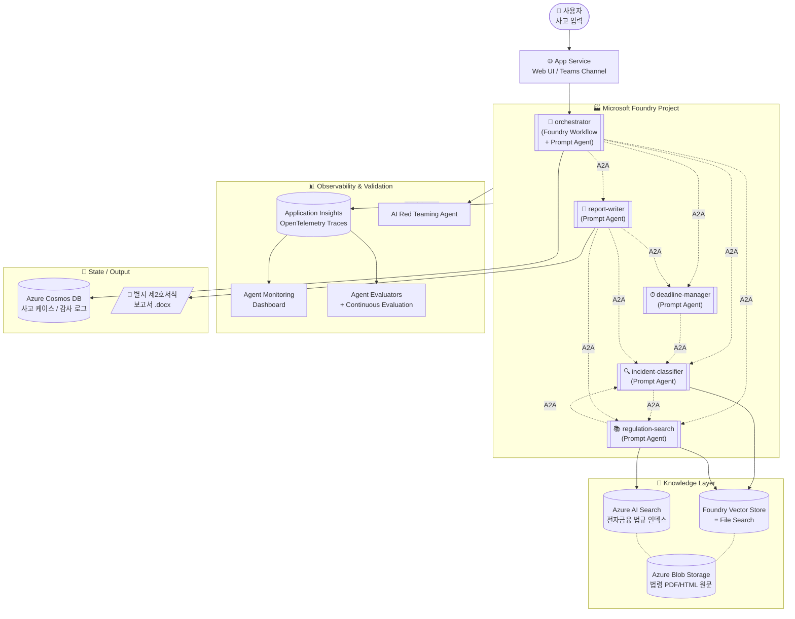
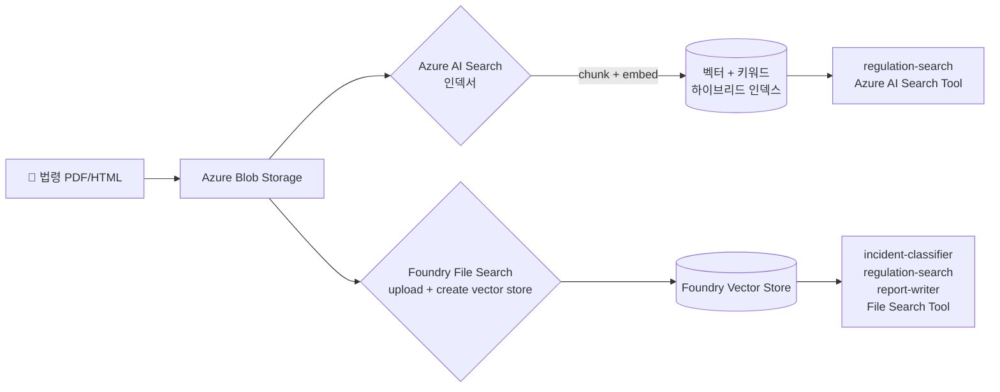

# EFARS 멀티에이전트 시스템 — Azure AI Foundry 기반 설계서

> **Electronic Financial Accident Reporting System** (이하 **EFARS**)
> 작성일: 2026-06-05 (KST) · 설계 버전: v1.0
> 설계 기반: **Microsoft Foundry Agent Service** + **Foundry Workflows** + **Agent2Agent (A2A) Protocol** + **Microsoft Agent Framework**
> 사용 제외: Power Automate, Copilot Studio (사용자 요청에 따라 본 설계에서는 사용하지 않음)

---

## 0. 본 설계 문서의 검증 원칙

본 설계의 모든 기술 요소는 Microsoft Learn 1차 문서로 검증되었으며, 추측에 기반한 기능은 포함하지 않습니다. preview 상태 기능은 `(preview)`로 표시합니다.

---

## 1. Executive Summary (5줄)

1. **Orchestrator**(Foundry Workflow 기반)가 사용자 사고 입력을 받아 4개 전문 에이전트에 작업을 분배·취합하는 컨트롤 타워 역할.
2. **incident-classifier**가 시행세칙 제7조의4 + **전자금융 관련 법 11종**(아래 §5 RAG 코퍼스)을 RAG로 숙지하여 보고 대상/제외 여부와 사고 유형을 판정.
3. **regulation-search**가 동일한 RAG Vector Store + Azure AI Search 인덱스에서 적용 조항과 인용문을 추출하여 근거 제시.
4. **deadline-manager**가 사고 인지 시각 기준으로 최초·중간·종결 보고 기한 타임라인을 Code Interpreter / Function Tool로 계산.
5. **report-writer**가 위 결과를 종합하여 EFARS 별지 제2호서식 보고서 초안을 자동 생성하며, 모든 에이전트는 **A2A 프로토콜(v1.0)** 로 연결되어 통신.

---

## 2. 전체 아키텍처

### 2-1. 토폴로지 다이어그램



### 2-2. 통신 모델 — A2A vs Workflow 하이브리드

Microsoft Foundry는 두 가지 멀티에이전트 패턴을 제공하며, 본 설계는 두 가지를 **계층적으로 조합**합니다.

| 패턴 | 본 설계 활용 | 출처 |
| --- | --- | --- |
| **Foundry Workflow (Sequential / Group Chat / Human-in-the-loop)** | 최상위 Orchestrator 레벨. 시각적 디자이너 + YAML 으로 결정적 순서·분기 정의, 노드별 실행 상태가 visualizer에서 애니메이션으로 표시 | [Build a workflow in Microsoft Foundry](https://learn.microsoft.com/azure/foundry/agents/concepts/workflow) |
| **A2A Tool (preview)** | 에이전트 간 횡적 호출. 예: `report-writer`가 `regulation-search`에 인용문 보강 요청 | [Connect to an A2A agent endpoint from Foundry Agent Service (preview)](https://learn.microsoft.com/azure/foundry/agents/how-to/tools/agent-to-agent) |
| **Incoming A2A endpoint (preview)** | 각 전문 에이전트를 외부에서도 호출 가능한 A2A 엔드포인트로 노출 (A2A protocol **v1.0** 지원) | [Enable incoming A2A on a Foundry agent (preview)](https://learn.microsoft.com/azure/foundry/agents/how-to/enable-agent-to-agent-endpoint) |

> **참고:** 구(舊) `Connected Agents` (classic) 는 2027-03-31 retirement 예정이므로 본 설계는 채택하지 않습니다. 출처: [Connected Agents (classic) — deprecation notice](https://learn.microsoft.com/azure/foundry-classic/agents/how-to/connected-agents)

---

## 3. 에이전트 상세 사양

각 에이전트는 **Foundry Prompt Agent** 로 단일 책임(singleton) 설계하며, A2A 엔드포인트로 노출됩니다. (Transparency Note 권고: "start with building singleton agents with Agent Service to get the most reliable, scalable, and secure agents" — [출처](https://learn.microsoft.com/azure/foundry/responsible-ai/agents/transparency-note))

### 3-1. 🎯 orchestrator (컨트롤 타워)

| 항목 | 값 |
| --- | --- |
| Agent Type | Foundry Workflow (Sequential + 조건 분기) + Prompt Agent |
| Model | `gpt-5-mini` 또는 `gpt-4.1` (reasoning model 권장) |
| Tools | A2A Tool × 4 (4개 전문 에이전트 연결), Function Tool (case_id 생성) |
| 책임 | ① 사용자 입력 정규화 → ② incident-classifier 호출 → ③ 보고 대상이면 regulation-search·deadline-manager 병렬 호출 → ④ 결과 취합 → ⑤ report-writer로 최종 산출물 생성 → ⑥ Cosmos DB에 케이스 영속화 |
| 출력 형식 | 구조화 JSON (`{case_id, classification, regulations[], timeline, report_url}`) |
| 시각화 | Foundry Workflow Visualizer가 각 노드(에이전트)의 실행 상태를 실시간 그래프 애니메이션으로 표시 |

**핵심 Instruction (요약)**
```
You are EFARS orchestrator. Receive a user-reported financial incident.
Always invoke agents in this order, never skip:
  1) incident-classifier  -> determine if reportable + incident_type
  2) IF reportable:
       parallel:
         - regulation-search   -> retrieve applicable clauses with citations
         - deadline-manager    -> compute T0 / interim / final deadlines
  3) report-writer -> draft EFARS 별지 제2호서식 .docx
Return structured JSON. Never fabricate clauses; if any sub-agent
returns low-confidence, request re-grounding once before failing.
```

---

### 3-2. 🔍 incident-classifier (사고 분류)

| 항목 | 값 |
| --- | --- |
| Agent Type | Prompt Agent (server-side, Standard setup) |
| Model | `gpt-5-mini` (reasoning model) |
| Tools | **File Search** (Foundry Vector Store), **Azure AI Search Tool**, Function Tool (`emit_classification`) |
| 책임 | 사고 사실관계 + RAG 코퍼스(§5)를 종합하여 다음 출력 → `{is_reportable, exclusion_basis?, incident_type, severity_class, confidence, citations[]}` |
| 정확성 강화 | Structured Output (JSON Schema) 강제 + `groundedness_pro` evaluator 연속 평가 |

**RAG 코퍼스 (§5에서 상세)**: 전자금융거래법·시행령·감독규정·시행세칙·개인정보보호법·신용정보법·정보통신망법 등 **11개 법령**을 Foundry Vector Store에 인제스트.

**핵심 Instruction (요약)**
```
You classify financial incidents per Korean electronic financial regulation.
Use File Search to ground every judgment in the indexed legal corpus.
For each incident:
  1) Cite the exact clause(s) that determine "reportable" vs "excluded".
  2) Always cite "전자금융감독규정 시행세칙 제7조의4" first, then any
     overriding/qualifying clauses from related laws.
  3) Return strict JSON. If groundedness is uncertain, lower confidence
     and explicitly list what additional evidence the user must provide.
```

---

### 3-3. 📚 regulation-search (규정 검색·인용)

| 항목 | 값 |
| --- | --- |
| Agent Type | Prompt Agent |
| Model | `gpt-4.1` (긴 컨텍스트 처리 필요) |
| Tools | **File Search** (동일 Vector Store), **Azure AI Search Tool** (하이브리드 검색: 벡터 + 키워드 + 시맨틱 랭킹), Function Tool (`emit_citations`) |
| 책임 | 분류 결과를 입력 받아 적용 조항·인용문·해석 가이드를 추출. 출력: `[{law_name, article, clause, exact_quote, url_or_file_id, relevance_score}]` |
| 인용 규칙 | 모든 인용문은 원문 그대로(`exact_quote`), 의역 금지. 인용 불가 시 `null` 반환. |

> **검색 모드**: Foundry File Search는 자동으로 vector + keyword 하이브리드 검색을 수행. Standard agent setup에서는 사용자 소유의 **Azure AI Search** 와 **Azure Blob Storage** 를 백엔드로 사용. 출처: [File search behavior by agent setup type](https://learn.microsoft.com/azure/foundry/agents/how-to/tools/file-search)

---

### 3-4. ⏱ deadline-manager (기한 계산)

| 항목 | 값 |
| --- | --- |
| Agent Type | Prompt Agent |
| Model | `gpt-4.1` |
| Tools | **Code Interpreter** (Python 일자 계산), **Function Tool** (`compute_deadlines`), File Search (기한 산정 근거 조항 확인용) |
| 책임 | 사고 인지 시각(T0) + incident_type을 입력 받아 **최초(T+2h)·중간(T+24h)·종결(T+30d)** 기한을 산정. 영업일·공휴일·KST/UTC 변환·시행세칙 단서조항 반영. |
| 출력 | `{T0, initial_due, interim_due, final_due, basis_clauses[], holiday_adjustments[]}` |

**핵심 Instruction (요약)**
```
Compute reporting deadlines using Code Interpreter for deterministic
date arithmetic. Always:
  - Treat T0 as Asia/Seoul (KST).
  - Read holiday calendar passed in the request body.
  - When the regulation cites "지체 없이" or relative durations, look up
    the exact clause via File Search before computing.
  - Return timezone-aware ISO 8601 timestamps.
```

---

### 3-5. 📝 report-writer (보고서 작성)

| 항목 | 값 |
| --- | --- |
| Agent Type | Prompt Agent |
| Model | `gpt-4.1` |
| Tools | **Function Tool** (`render_docx`: 별지 제2호서식 템플릿에 변수 매핑하여 .docx 생성, Azure Function 위탁), **File Search**, **A2A Tool** (regulation-search·incident-classifier 재호출) |
| 책임 | 4개 입력(분류·규정·기한·원본 사실관계)을 종합하여 별지 제2호서식 초안 생성. 누락 필드 발견 시 A2A로 해당 에이전트에 재조회. |
| 출력 | `{report_blob_url, missing_fields[], self_check_score}` |
| 품질 게이트 | `groundedness`, `response_completeness`, `task_adherence` evaluator 통과 시에만 "완료" 상태로 마킹 |

---

## 4. Foundry Workflow 정의 (Orchestrator 시각 흐름)

Foundry Workflow는 **시각 디자이너 + YAML** 로 작성 가능하며 (Sequential / Group Chat / Human-in-the-loop 템플릿 제공), 실행 중 각 노드의 진행 상태가 visualizer에서 실시간으로 표시됩니다. 출처: [Build a workflow in Microsoft Foundry — Understand workflow patterns](https://learn.microsoft.com/azure/foundry/agents/concepts/workflow)

```yaml
# EFARS Workflow (개념 스케치 — Foundry portal Build > Create new workflow > Sequential)
name: efars-orchestrator
version: 1
nodes:
  - id: classify
    type: agent
    agent: incident-classifier
    output_variable: classification
  - id: gate
    type: condition
    when: "${classification.is_reportable} == true"
    branches:
      true: [search_regs, calc_deadline]   # 병렬 실행 (Group chat / Concurrent)
      false: [write_exclusion_memo]
  - id: search_regs
    type: agent
    agent: regulation-search
    input: "${classification}"
    output_variable: regulations
  - id: calc_deadline
    type: agent
    agent: deadline-manager
    input: "${classification}"
    output_variable: timeline
  - id: write_report
    type: agent
    agent: report-writer
    input:
      classification: "${classification}"
      regulations: "${regulations}"
      timeline: "${timeline}"
    output_variable: report
  - id: human_review                    # 선택적 Human-in-the-loop 게이트
    type: human_input
    prompt: "초안 검토 후 승인하시겠습니까? (Y/N)"
```

워크플로는 **버전 관리·변경 로그·시각적 모니터링**을 기본 지원합니다 — *"The workflow designer supports versioning, change logs, and visual monitoring."* ([Transparency Note](https://learn.microsoft.com/azure/foundry/responsible-ai/agents/transparency-note))

---

## 5. RAG 코퍼스 — incident-classifier & regulation-search 공용

**incident-classifier가 "전자금융 관련 법을 모두 숙지"** 하도록 다음 11종을 Foundry Vector Store에 인제스트합니다. 원문은 Azure Blob Storage에 보관하고 (Standard agent setup) Azure AI Search 인덱스에서 하이브리드 검색.

| # | 법령/규정 | 우선순위 | 이유 |
| --- | --- | --- | --- |
| 1 | **전자금융거래법** | ★★★ | 사고 정의·보고 의무의 근거법 |
| 2 | 전자금융거래법 시행령 | ★★★ | 보고 대상 사고의 구체 범위 |
| 3 | **전자금융감독규정** | ★★★ | 감독규정 본문 |
| 4 | **전자금융감독규정 시행세칙** | ★★★ | 제7조의4 보고 대상/제외 + 별지 제2호서식 근거 |
| 5 | 금융분야 개인정보보호 가이드라인 | ★★ | 정보유출 사고 판정 |
| 6 | 개인정보 보호법 | ★★ | 개인정보 사고 시 중복 판정 |
| 7 | 신용정보의 이용 및 보호에 관한 법률 | ★★ | 신용정보 침해 사고 |
| 8 | 정보통신망 이용촉진 및 정보보호 등에 관한 법률 | ★★ | 침해사고 신고 의무 교차검토 |
| 9 | 금융회사의 정보처리 업무 위탁에 관한 규정 | ★ | 위탁사 사고 대응 |
| 10 | 금융보안원 정보보호 표준(FSI) | ★ | 사고 분류 보조 기준 |
| 11 | 한국은행법 제29조 관련 규정 | ★ | 결제시스템 사고 시 중복 보고 |

### 5-1. 인제스트 파이프라인



- **Standard agent setup** 사용: 파일은 사용자 소유 Blob에, 벡터는 사용자 소유 Azure AI Search에 저장 (데이터 거버넌스 확보)
- 청킹·임베딩·검색은 Foundry가 자동 처리: *"the service handles the entire ingestion process, which includes: automatically parsing and chunking documents; generating and storing embeddings; utilizing both vector and keyword searches"* ([File search tool for agents](https://learn.microsoft.com/azure/foundry/agents/how-to/tools/file-search))
- 인용 품질을 위해 메타데이터 필드(`law_name`, `article_no`, `effective_date`, `source_url`)를 인덱스에 부여 — RAG 권장사항 ([Retrieval augmented generation (RAG) and indexes](https://learn.microsoft.com/azure/foundry/concepts/retrieval-augmented-generation))

### 5-2. 갱신 전략

| 빈도 | 트리거 | 처리 |
| --- | --- | --- |
| 분기 정기 | 일정 스케줄 | 법제처 OpenAPI 자동 수집 → Blob 업로드 → Azure AI Search 재인덱싱 (skill set) |
| 이벤트 | 시행세칙 개정 알림 | 수동 업로드 + Vector Store 버전 태깅, 이전 버전은 archive |

---

## 6. 에이전트 통신 시각화 ("백로그/애니메이션")

사용자께서 요청하신 "에이전트 간 소통을 볼 수 있는 백로그/애니메이션"은 Azure AI Foundry가 다음 4가지 도구로 **GA + preview** 형태로 제공합니다.

| # | 도구 | 보여주는 것 | 출처 |
| --- | --- | --- | --- |
| ① | **Foundry Workflow Visualizer** | 워크플로 실행 중 각 에이전트 노드가 점등/완료되는 그래프 (시각적 진행 모니터링) | [workflow concepts](https://learn.microsoft.com/azure/foundry/agents/concepts/workflow) |
| ② | **Thread Logs (Agents playground)** | Thread 단위로 ordered run steps + tool calls + 입출력 메시지 → 에이전트 간 메시지 백로그 | [Trace and observe AI agents](https://learn.microsoft.com/azure/foundry-classic/how-to/develop/trace-agents-sdk) |
| ③ | **Foundry Tracing UI** (Application Insights 연동) | 분산 트레이스 spans을 타임라인 애니메이션으로 표시. LLM 호출 / Tool 호출 / A2A 호출의 nesting까지 가시화 | [Set up tracing in Microsoft Foundry](https://learn.microsoft.com/azure/foundry/observability/how-to/trace-agent-setup) |
| ④ | **Agent Monitoring Dashboard** | 실시간 메트릭(토큰·지연·오류율·품질 점수) + 평가 결과 추이 차트 | [Monitor agents with the Agent Monitoring Dashboard](https://learn.microsoft.com/azure/foundry/observability/how-to/how-to-monitor-agents-dashboard) |

추가로 로컬 개발 시 **Aspire Dashboard** (Docker로 1줄 실행)로 OpenTelemetry spans을 즉시 시각화 가능 — [Observability (python)](https://learn.microsoft.com/agent-framework/agents/observability)

### 6-1. 트레이싱 활성화

서버사이드 트레이싱은 **Application Insights 리소스를 Foundry 프로젝트에 연결하면 자동 활성화** (Prompt agents GA, Workflow/Hosted preview). 추가 코드 불필요. 출처: [Set up tracing](https://learn.microsoft.com/azure/foundry/observability/how-to/trace-agent-setup)

```python
# 클라이언트 측 보강 트레이스 (선택)
import os
os.environ["AZURE_TRACING_GEN_AI_CONTENT_RECORDING_ENABLED"] = "true"

from azure.ai.projects import AIProjectClient
from azure.identity import DefaultAzureCredential
from azure.monitor.opentelemetry import configure_azure_monitor

project = AIProjectClient(
    endpoint=os.environ["PROJECT_ENDPOINT"],
    credential=DefaultAzureCredential(),
)
configure_azure_monitor(
    connection_string=project.telemetry.get_application_insights_connection_string()
)
```

---

## 7. 정확성 검증 로직 (Validation)

"유기적으로 소통하고 결과값을 잘 내뱉는지 정확성을 검증" 요구에 대응하는 4단계 평가 체계.

### 7-1. 사용 Evaluator 매트릭스

각 evaluator는 **Foundry built-in** 이며 SDK / 포털 모두에서 호출 가능. 출처: [Agent evaluators](https://learn.microsoft.com/azure/foundry/concepts/evaluation-evaluators/agent-evaluators), [RAG evaluators](https://learn.microsoft.com/azure/foundry/concepts/evaluation-evaluators/rag-evaluators)

| 단계 | 적용 에이전트 | Evaluator | 통과 임계 | 의미 |
| --- | --- | --- | --- | --- |
| **A. RAG 정밀도** | incident-classifier, regulation-search | `Groundedness Pro`, `Relevance`, `Response Completeness` | ≥ 4/5 | 인용이 코퍼스 내에 실재, 환각 없음 |
| **B. 도구 사용 정확도** | 전 에이전트 | `Tool Call Accuracy`, `Tool Input Accuracy`, `Tool Output Utilization`, `Tool Call Success` | pass | A2A·File Search·Function 호출이 올바른지 |
| **C. 태스크 수행** | orchestrator, report-writer | `Intent Resolution`, `Task Adherence`, `Task Completion`, `Task Navigation Efficiency` | ≥ 4/5 | 사용자 의도 해결·지시 준수·완수 여부 |
| **D. 도메인 커스텀** | incident-classifier | **Custom Evaluator** (시행세칙 제7조의4 체크리스트 LLM-judge) | pass | 보고 대상 판정의 도메인 정합성 |

### 7-2. 연속 평가 (Continuous Evaluation)

프로덕션 트래픽의 일부를 **샘플링하여 자동 평가** (기본 한도 100 runs/hour, 설정 가능). 출처: [Set up continuous evaluation](https://learn.microsoft.com/azure/foundry/observability/how-to/how-to-monitor-agents-dashboard#set-up-continuous-evaluation)

```python
# 의사코드 — orchestrator 응답 완료 시마다 평가 룰 트리거
from azure.ai.projects.models import (
    EvaluationRule, EvaluationRuleEventType, EvaluatorIds
)

project_client.evaluation.create_rule(
    EvaluationRule(
        name="efars-quality-gate",
        event_type=EvaluationRuleEventType.AGENT_RESPONSE_COMPLETED,
        agent_id="incident-classifier:v1",
        sampling_percent=20,
        max_hourly_runs=100,
        evaluators={
            "Groundedness": {"Id": EvaluatorIds.Groundedness.value},
            "IntentResolution": {"Id": EvaluatorIds.IntentResolution.value},
            "ToolCallAccuracy": {"Id": EvaluatorIds.ToolCallAccuracy.value},
        },
    )
)
```

### 7-3. 사전 배포 평가 + CI/CD

- 골든 데이터셋(과거 사고 사례 100건 + 비보고 사례 50건)을 Foundry에 업로드, 매 배포 전 [GitHub Actions 평가](https://learn.microsoft.com/azure/foundry/how-to/evaluation-github-action) 로 회귀 방지 게이트 적용.
- `Groundedness < 4` 또는 `Task Completion < 4` 인 PR은 자동 차단.

### 7-4. 안전성 (AI Red Teaming)

[**AI Red Teaming Agent**](https://learn.microsoft.com/azure/ai-foundry/how-to/develop/run-ai-red-teaming-cloud) (PyRIT 기반)로 incident-classifier가 **거짓 정보 조작·악성 사고 시나리오·민감정보 유출** 공격에 어떻게 반응하는지 정기 스캔.

---

## 8. 배포 토폴로지

| 레이어 | 리소스 | 설명 |
| --- | --- | --- |
| Compute | **Foundry Project** (new portal) | 모든 에이전트를 Prompt Agent로 호스팅. 각 에이전트는 published Agent Application + own Agent Identity |
| Compute | Azure Function (`render_docx`) | 별지 제2호서식 .docx 렌더링 (python-docx) |
| Compute | App Service (선택) | 사용자 Web UI / Teams Channel |
| AI Service | gpt-5-mini / gpt-4.1 (Foundry Model Catalog) | Reasoning + Long-context 혼용 |
| Data | Azure Blob Storage | 법령 원문 보관 |
| Data | Azure AI Search | 하이브리드 인덱스 |
| Data | Foundry Vector Store | File Search 백엔드 (Standard setup → 위 두 리소스 사용) |
| State | Azure Cosmos DB | 사고 케이스·감사 로그 |
| Observability | Application Insights + Log Analytics | OpenTelemetry traces, Continuous Evaluation, Monitoring Dashboard |
| Identity | Entra ID (Managed Identity) | Agent ↔ Storage/Search/Cosmos 권한, **Foundry User** 롤 부여 (Continuous Evaluation 필수) |

### 8-1. 에이전트 게시 절차 요약

1. 각 전문 에이전트를 Foundry portal에서 생성 후 **별도 Agent Application으로 게시** → 안정적 endpoint + Agent Identity 발급
2. orchestrator의 Workflow에서 A2A Tool 연결 등록 (`Tools > Connect tool > Custom > Agent2Agent (A2A)`) — 인증은 키 기반 또는 OAuth
3. 외부 호출이 필요한 에이전트는 **Incoming A2A endpoint** 활성화 (A2A protocol v1.0)

---

## 9. 샘플 코드 — incident-classifier 생성 (Python)

> 검증 출처: [File search tool for agents (python)](https://learn.microsoft.com/azure/foundry/agents/how-to/tools/file-search), [Connect to an A2A agent endpoint (python)](https://learn.microsoft.com/azure/foundry/agents/how-to/tools/agent-to-agent)

```python
import os
from azure.ai.projects import AIProjectClient
from azure.ai.agents.models import FileSearchTool, MessageRole
from azure.identity import DefaultAzureCredential

project = AIProjectClient(
    endpoint=os.environ["PROJECT_ENDPOINT"],
    credential=DefaultAzureCredential(),
)

# 1) 11종 법령 PDF 업로드 후 벡터 스토어 생성 (Standard setup이면 Azure AI Search 백엔드 사용)
file_ids = []
for path in [
    "laws/01_전자금융거래법.pdf",
    "laws/02_전자금융거래법_시행령.pdf",
    "laws/03_전자금융감독규정.pdf",
    "laws/04_전자금융감독규정_시행세칙.pdf",
    "laws/05_금융분야_개인정보보호_가이드라인.pdf",
    "laws/06_개인정보_보호법.pdf",
    "laws/07_신용정보법.pdf",
    "laws/08_정보통신망법.pdf",
    "laws/09_금융회사_정보처리_위탁규정.pdf",
    "laws/10_FSI_정보보호표준.pdf",
    "laws/11_한국은행법_제29조_관련.pdf",
]:
    f = project.agents.files.upload_and_poll(file_path=path, purpose="assistants")
    file_ids.append(f.id)

vs = project.agents.vector_stores.create_and_poll(
    file_ids=file_ids, name="efars-legal-corpus-v1"
)
file_search = FileSearchTool(vector_store_ids=[vs.id])

# 2) incident-classifier 에이전트 생성
classifier = project.agents.create_agent(
    model=os.environ["MODEL_DEPLOYMENT_NAME"],  # 예: gpt-5-mini
    name="incident-classifier",
    instructions=(
        "You classify Korean electronic financial incidents. "
        "Always ground every judgment via File Search. "
        "Cite 전자금융감독규정 시행세칙 제7조의4 first, then qualifying "
        "clauses from related laws. Return strict JSON: "
        "{is_reportable, exclusion_basis, incident_type, severity_class, "
        " confidence, citations:[{law, article, exact_quote, file_id}]}. "
        "If groundedness uncertain, lower confidence and list missing evidence."
    ),
    tools=file_search.definitions,
    tool_resources=file_search.resources,
)
print("Agent ID:", classifier.id)

# 3) (이후) Foundry portal에서 이 에이전트를 게시 → Incoming A2A endpoint 활성화 →
#    orchestrator Workflow의 A2A Tool 연결로 등록
```

---

## 10. 보안·컴플라이언스 핵심 체크

본 시스템은 금융권에서 운영되므로 다음을 필수 적용 (전자금융감독규정 + 망분리 환경 고려):

| 항목 | 적용 |
| --- | --- |
| 데이터 거버넌스 | Standard agent setup으로 모든 RAG 데이터를 **사용자 소유 Blob + Azure AI Search** 에 저장 (Microsoft-managed 저장소 사용 안 함) |
| 네트워크 | Foundry Project를 **Bring-Your-Own VNet / Private Endpoint** 구성 (해당 기능은 Foundry 환경 종속이므로 별도 인프라 검토 필요) |
| ID/권한 | 모든 Azure 리소스 접근은 **Managed Identity**. Continuous Evaluation을 위한 **Foundry User** 롤 할당 |
| 감사 로그 | OpenTelemetry traces → Application Insights → 90일 retention. 사고 케이스 자체는 Cosmos DB에 영구 보관 |
| 모델 콘텐츠 안전 | `Risk and Safety Evaluators`(violence, self-harm, sexual, hate/unfairness) Continuous Evaluation에 포함 |
| 인용 무결성 | report-writer 출력은 **모든 조문 인용에 file_id + 페이지 메타데이터 첨부**, 감사 추적 가능 |

> **참고**: 본 EFARS 시스템은 사내 금융 데이터를 직접 다루므로 [feedback_verified_tech](../../) 원칙에 따라 본 설계는 "Foundry로 실제 가능한 범위"만 기술했습니다. 망분리·전용 회선·고객 IDP 연계 등은 인프라 영역으로 별도 설계 필요.

---

## 11. 구현 로드맵 (8주)

| 주차 | 마일스톤 | 산출물 |
| --- | --- | --- |
| W1 | Foundry Project 생성, Application Insights 연결, RBAC 셋업 | 베이스 인프라 |
| W2 | 11종 법령 코퍼스 수집·정제, Blob 업로드, Azure AI Search 인덱스 | RAG 코퍼스 v1 |
| W3 | incident-classifier + regulation-search 에이전트 구현 + File Search 연결 | 분류·검색 PoC |
| W4 | deadline-manager (Code Interpreter) + report-writer (Azure Function `render_docx`) | 4개 전문 에이전트 |
| W5 | A2A Tool 연결 + 각 에이전트 Incoming A2A endpoint 활성화 | 횡적 통신 확보 |
| W6 | Foundry Workflow 작성 (Sequential + 분기 + HITL), 시각화 검증 | Orchestrator |
| W7 | Custom Evaluator(시행세칙 7조의4 체크리스트) + Continuous Evaluation Rule 등록 + 골든셋 100건 | 품질 게이트 |
| W8 | AI Red Teaming 정기 스캔, Monitoring Dashboard 운영 SOP, 사용자 UAT | 운영 이관 |

---

## 12. 부록 — 본 설계 검증 출처 (Microsoft Learn 1차 문서)

1. [Foundry Agent Service overview](https://learn.microsoft.com/azure/foundry/agents/overview)
2. [Build a workflow in Microsoft Foundry](https://learn.microsoft.com/azure/foundry/agents/concepts/workflow)
3. [Connect to an A2A agent endpoint from Foundry Agent Service (preview)](https://learn.microsoft.com/azure/foundry/agents/how-to/tools/agent-to-agent)
4. [Enable incoming A2A on a Foundry agent (preview)](https://learn.microsoft.com/azure/foundry/agents/how-to/enable-agent-to-agent-endpoint)
5. [File search tool for agents](https://learn.microsoft.com/azure/foundry/agents/how-to/tools/file-search)
6. [Retrieval augmented generation (RAG) and indexes](https://learn.microsoft.com/azure/foundry/concepts/retrieval-augmented-generation)
7. [Set up tracing in Microsoft Foundry](https://learn.microsoft.com/azure/foundry/observability/how-to/trace-agent-setup)
8. [Monitor agents with the Agent Monitoring Dashboard](https://learn.microsoft.com/azure/foundry/observability/how-to/how-to-monitor-agents-dashboard)
9. [Agent evaluators](https://learn.microsoft.com/azure/foundry/concepts/evaluation-evaluators/agent-evaluators)
10. [Retrieval-Augmented Generation (RAG) evaluators](https://learn.microsoft.com/azure/foundry/concepts/evaluation-evaluators/rag-evaluators)
11. [Transparency Note for Foundry Agent Service](https://learn.microsoft.com/azure/foundry/responsible-ai/agents/transparency-note)
12. [Workflow-oriented multi-agent patterns](https://learn.microsoft.com/agents/architecture/multi-agent-workflow-oriented)
13. [Build a multiple-agent workflow automation solution by using Microsoft Agent Framework](https://learn.microsoft.com/azure/architecture/ai-ml/idea/multiple-agent-workflow-automation)
14. [Observability in generative AI](https://learn.microsoft.com/azure/foundry/concepts/observability)

---

## 13. 변경 이력

| 버전 | 일자 | 변경 내용 |
| --- | --- | --- |
| v1.0 | 2026-06-05 | 최초 작성. Power Automate/Copilot Studio 기반에서 Azure AI Foundry 기반으로 전면 전환. |
