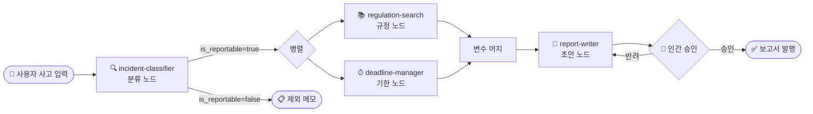

# EFARS 멀티에이전트 — Azure AI Foundry **Low-Code** 설계서 v2.0

> 코드 없이 **Microsoft Foundry 포털 UI** 클릭만으로 구축하는 가이드.
> 작성일: 2026-06-05 (KST) · 설계 버전: v2.0 (Low-Code Edition)
> v1.0(코드 기반)은 [동일 폴더의 별도 파일](./20260605_EFARS_multi_agent_Azure_AI_Foundry.md)을 참고하세요.

## 0. 사전 준비 (5분)

| 항목 | 값 |
| --- | --- |
| 포털 | <https://ai.azure.com> (좌상단 **New Foundry** 토글 ON) |
| 필요 권한 | Foundry 프로젝트의 **Contributor** 이상 (워크플로 편집용), **Foundry User** 롤 (Continuous Evaluation용) |
| 모델 배포 | Foundry Model Catalog에서 **gpt-4.1** 또는 **gpt-5-mini** 1개 배포 (`Build > Models + endpoints`) |
| Application Insights | Foundry 프로젝트에 1개 연결 → 트레이싱·모니터링 자동 활성화 |

---

## 1. 전체 그림 (Workflow 비주얼)

본 설계는 **Foundry Workflow** 1개와 **Prompt Agent 4개**로 구성됩니다. Workflow가 orchestrator 역할을 하며, 비주얼 디자이너에서 각 노드(에이전트)가 실행되는 모습이 실시간 애니메이션으로 표시됩니다.



| 컴포넌트 | 타입 | 역할 |
| --- | --- | --- |
| `efars-orchestrator-workflow` | **Workflow (Sequential + if/else + 병렬)** | 컨트롤 타워. 노드 실행 순서/조건/병렬을 비주얼로 정의 |
| `incident-classifier` | Prompt Agent | 사고 분류 + 보고 대상 판정 |
| `regulation-search` | Prompt Agent | 적용 조항·인용문 추출 |
| `deadline-manager` | Prompt Agent | 보고 기한 타임라인 계산 |
| `report-writer` | Prompt Agent | 별지 제2호서식 초안 생성 |

---

## 2. 4개 전문 에이전트 만들기 — 포털 클릭 절차

각 에이전트는 **Foundry 포털 → Build → Agents → Create agent** 에서 만듭니다. 공통 절차:

1. **Build** 클릭 → 좌측 **Agents** → **Create agent**
2. 에이전트 이름 입력 → **Create**
3. 배포된 모델 선택 (예: `gpt-4.1`)
4. **Instructions** 칸에 아래 §2-1 ~ §2-4의 프롬프트 **그대로 복사-붙여넣기**
5. 우측 **Setup** 패널 → **Knowledge → Add → Files** 클릭 → 아래에 명시한 파일 업로드 (벡터 스토어가 **자동 생성**되고 하이브리드 검색이 자동 활성화됨)
6. **Save** 클릭

> **Knowledge 자동 처리**: Foundry는 파일 업로드 시 자동으로 ① 800 token 청크 분할 ② `text-embedding-3-large` 임베딩 ③ 벡터 + 키워드 하이브리드 인덱스 생성. 별도 설정 불필요. 출처: [File search tool — How file search works](https://learn.microsoft.com/azure/foundry/agents/how-to/tools/file-search)

> **벡터 스토어 공유 팁**: 동일 법령 코퍼스를 여러 에이전트에서 재사용하려면 **Standard agent setup**(프로젝트 셋업 시 Azure Blob + Azure AI Search 연결) 사용 → **Knowledge → Add → Azure AI Search** 로 동일 인덱스를 여러 에이전트에 연결. 간단히 시작하려면 각 에이전트의 Knowledge에 **같은 파일 묶음**을 각각 업로드해도 됩니다.

---

### 2-1. 🔍 incident-classifier

#### 모델
`gpt-4.1` (또는 reasoning이 필요하면 `gpt-5-mini`)

#### Knowledge — 업로드 파일 (전자금융 관련 법 11종)

| # | 파일명 (권장) | 출처 |
| --- | --- | --- |
| 1 | `01_전자금융거래법.pdf` | 국가법령정보센터 |
| 2 | `02_전자금융거래법_시행령.pdf` | 〃 |
| 3 | `03_전자금융감독규정.pdf` | 금융위원회 |
| 4 | `04_전자금융감독규정_시행세칙.pdf` | 금융감독원 (제7조의4 포함) |
| 5 | `05_금융분야_개인정보보호_가이드라인.pdf` | 금융위·금감원 |
| 6 | `06_개인정보보호법.pdf` | 국가법령정보센터 |
| 7 | `07_신용정보의_이용_및_보호에_관한_법률.pdf` | 〃 |
| 8 | `08_정보통신망_이용촉진_및_정보보호_등에_관한_법률.pdf` | 〃 |
| 9 | `09_금융회사_정보처리_업무_위탁에_관한_규정.pdf` | 〃 |
| 10 | `10_금융보안원_정보보호_표준.pdf` | 금융보안원 |
| 11 | `11_한국은행법_제29조_관련_규정.pdf` | 한국은행 |

> 파일은 PDF/DOCX/HTML/TXT 모두 가능 (max 512 MB, 5,000,000 token per file). 한 vector store에 최대 10,000개 파일. 출처: [File search tool — Vector stores](https://learn.microsoft.com/azure/foundry/agents/how-to/tools/file-search#vector-stores)

#### Tools — 추가 설정
`Setup > Tools > Add > Code Interpreter` (없어도 동작하지만 표 생성 시 유용)

#### Instructions (복사-붙여넣기 — 그대로 사용 가능)

```text
당신은 한국 전자금융사고 분류 전문가다. 사용자가 제공한 사고 사실관계를 받아
보고 대상 여부와 사고 유형을 판정한다.

## 판정 절차 (반드시 순서대로)
1. Knowledge에 업로드된 11종 법령 문서를 file_search로 검색한다.
2. **전자금융감독규정 시행세칙 제7조의4**를 1순위 기준으로 적용한다.
3. 2순위로 전자금융거래법·시행령·감독규정 본문의 보고 의무 조항을 교차 확인한다.
4. 개인정보 침해 사고이면 개인정보보호법·신용정보법·정보통신망법의 신고 의무도
   병행 판정한다.
5. 모든 조항은 원문 그대로 인용한다. 의역·요약 금지.

## 출력 형식 (반드시 JSON, 추가 텍스트 금지)
{
  "is_reportable": true | false,
  "exclusion_basis": "비보고 사유 + 근거 조항" | null,
  "incident_type": "전산장애" | "정보유출" | "전자적_침해행위" | "기타",
  "severity_class": "중대" | "일반",
  "confidence": 0.0 ~ 1.0,
  "citations": [
    {
      "law": "법령명",
      "article": "조문번호",
      "exact_quote": "원문 그대로의 문장",
      "source_file": "파일명"
    }
  ],
  "missing_evidence": ["추가로 확인 필요한 사실관계 목록"]
}

## 금지 사항
- 법령 외 외부 지식으로 판정하지 말 것.
- Knowledge에서 근거 조항을 찾지 못하면 confidence를 0.5 이하로 낮추고
  missing_evidence에 사유를 명시할 것.
- 보고 대상 판정이 애매하면 "보수적으로 보고 대상"으로 처리할 것
  (금융감독 원칙: 의심스러우면 보고).
```

#### 출력 형식 강제
포털에서 **에이전트 상세 → Details → 파라미터 아이콘 → Text format → JSON Schema** 로 설정하면 모델이 위 JSON 스키마를 위반할 수 없게 됩니다. 출처: [Configure an output response format](https://learn.microsoft.com/azure/foundry/agents/concepts/workflow#add-agents)

---

### 2-2. 📚 regulation-search

#### 모델
`gpt-4.1` (긴 컨텍스트 필요)

#### Knowledge
`incident-classifier`와 **동일한 11종 법령 파일** 업로드. (Azure AI Search 연결 사용 시 같은 인덱스 재활용 권장)

#### Instructions (복사-붙여넣기)

```text
당신은 한국 전자금융 법규의 조항 검색·인용 전문가다. 분류 결과와 사고 사실관계를
받아 적용 조항과 인용문을 제시한다.

## 검색 절차
1. 입력으로 받은 incident_type, severity_class, 사고 사실관계를 키로 사용한다.
2. file_search로 Knowledge의 11종 법령에서 다음을 추출한다:
   a. 사고 정의·분류 조항
   b. 보고 의무·기한·방법 조항
   c. 사후 조치·과태료·시정명령 조항
   d. 적용 예외·단서 조항
3. 각 조항을 원문 그대로(exact_quote) 가져오고 파일명·페이지를 기록한다.
4. 동일 사항에 대해 여러 법령이 충돌하면 특별법 우선 원칙으로 정렬한다
   (전자금융감독규정 시행세칙 > 감독규정 > 시행령 > 모법).

## 출력 형식 (JSON, 추가 텍스트 금지)
{
  "applicable_clauses": [
    {
      "law": "법령명",
      "article": "제○조 제○항 제○호",
      "category": "정의" | "보고의무" | "기한" | "사후조치" | "예외",
      "exact_quote": "원문 그대로",
      "interpretation": "본 사고에 어떻게 적용되는지 1-2문장 해설",
      "source_file": "파일명",
      "relevance_score": 0.0 ~ 1.0
    }
  ],
  "primary_basis": "본 보고의 핵심 근거 조항 (1개)",
  "conflict_resolution": "법령 충돌이 있었다면 어떻게 우선순위를 정했는지" | null
}

## 인용 무결성 원칙
- exact_quote는 절대 변형 금지. 띄어쓰기 문장부호 그대로.
- 인용 불가능한 항목은 출력에서 제외 (null 채우지 말 것).
- relevance_score < 0.6 은 제외.
```

#### 출력 형식 강제
위와 동일하게 JSON Schema 모드 설정.

---

### 2-3. ⏱ deadline-manager

#### 모델
`gpt-4.1`

#### Knowledge
업로드 파일 2종으로 충분 (작은 코퍼스로 빠른 판정):

| # | 파일명 |
| --- | --- |
| 1 | `03_전자금융감독규정.pdf` |
| 2 | `04_전자금융감독규정_시행세칙.pdf` |

추가로 `holidays_kr_2026.json` (한국 공휴일 목록) 업로드.

#### Tools
**Setup → Tools → Add → Code Interpreter** 활성화 (날짜 산술용)

#### Instructions (복사-붙여넣기)

```text
당신은 전자금융사고 보고 기한 계산기다. 사고 인지 시각(T0)과 사고 유형을 받아
최초·중간·종결 보고 기한을 KST 기준 ISO 8601 형식으로 산정한다.

## 산정 절차
1. file_search로 시행세칙에서 사고 유형별 보고 기한 조항을 찾는다.
2. Code Interpreter로 다음을 계산한다:
   a. initial_due  = T0 + 시행세칙에서 명시한 최초 보고 시한 (보통 2시간 또는 즉시)
   b. interim_due  = T0 + 시행세칙에서 명시한 중간 보고 시한 (보통 24시간)
   c. final_due    = T0 + 시행세칙에서 명시한 종결 보고 시한 (보통 30일)
3. 공휴일·주말 보정:
   - 시행세칙이 "영업일 기준"으로 명시한 경우만 holidays_kr_2026.json을 참조하여 보정.
   - "지체 없이" 같은 표현은 보정하지 않고 그대로 반환하되 reason 필드에 명시.
4. 모든 시각은 Asia/Seoul (UTC+9).

## 입력 가정
- T0: ISO 8601 KST (예: "2026-06-05T14:30:00+09:00")
- incident_type: incident-classifier 출력의 동일 필드

## 출력 형식 (JSON)
{
  "T0_kst": "ISO 8601",
  "initial_due": {"deadline_kst": "ISO 8601", "basis_article": "시행세칙 제○조", "raw_phrase": "원문 표현"},
  "interim_due": {"deadline_kst": "ISO 8601", "basis_article": "시행세칙 제○조", "raw_phrase": "원문 표현"},
  "final_due":   {"deadline_kst": "ISO 8601", "basis_article": "시행세칙 제○조", "raw_phrase": "원문 표현"},
  "holiday_adjustments": ["YYYY-MM-DD: 공휴일 → 다음 영업일로 이월"],
  "computation_log": "Code Interpreter 계산 과정 요약"
}

## 금지
- 시행세칙 외 외부 기준으로 임의 산정 금지.
- 추측 금지: 시행세칙이 시한을 명시하지 않은 사고 유형이면 missing_basis로 표시.
```

---

### 2-4. 📝 report-writer

#### 모델
`gpt-4.1`

#### Knowledge
1개 파일 업로드:

| # | 파일명 |
| --- | --- |
| 1 | `별지_제2호서식_전자금융사고_보고서_템플릿.docx` |
| 2 | `04_전자금융감독규정_시행세칙.pdf` (서식 작성 지침 확인용) |

#### Tools
- **Code Interpreter** (.docx 렌더링)
- 또는 **MCP Tool** (사내 docx 생성 서비스가 있다면) — *Setup → Tools → Add → Custom → MCP*

#### Instructions (복사-붙여넣기)

```text
당신은 전자금융사고 보고서 작성자다. 분류·규정·기한 3개 결과를 받아
별지 제2호서식 초안을 작성한다.

## 작성 절차
1. Knowledge의 별지 제2호서식 템플릿 구조를 file_search로 확인한다.
2. 필수 필드를 다음 입력에서 매핑한다:
   - 사고개요 ← user_facts
   - 사고분류 ← classification.incident_type, severity_class
   - 보고대상_판단근거 ← classification.citations + regulations.primary_basis
   - 적용규정 ← regulations.applicable_clauses (category별로 그룹화)
   - 보고기한 ← timeline.initial_due / interim_due / final_due
3. 모든 인용은 regulations.exact_quote를 원문 그대로 사용.
4. 누락 필드가 있으면 출력 JSON의 missing_fields에 나열하되, 보고서 본문은 생성한다.
5. Code Interpreter로 markdown → docx 변환 후 파일 경로를 반환한다.

## 자체 검증 체크리스트 (출력 직전)
[ ] 모든 인용에 source_file이 표기되어 있는가
[ ] T0와 보고 기한이 일관된 timezone인가 (KST)
[ ] is_reportable=true인데 보고서가 비어있지 않은가
[ ] severity_class가 본문 표기와 일치하는가
self_check_score = 통과 개수 / 4

## 출력 형식 (JSON)
{
  "report_markdown": "...",         # 미리보기용
  "report_docx_path": "...",        # Code Interpreter 산출물 경로
  "missing_fields": ["..."],
  "self_check_score": 0.0 ~ 1.0,
  "citations_used": [{"law":"...","article":"...","exact_quote":"..."}]
}

## 금지
- 인용문 의역·축약 금지.
- 사용자에게 추가 입력을 묻지 말고, 누락 시 missing_fields에 기록.
```

---

## 3. Orchestrator 만들기 — Foundry **Workflow** 비주얼 디자이너

`orchestrator`는 **별도 에이전트가 아니라 Workflow** 입니다. Workflow가 시각적 디자이너에서 4개 에이전트를 순차/조건/병렬로 호출합니다.

### 3-1. Workflow 생성

1. 포털 좌상단 **Build** → 좌측 **Workflows**
2. **Create new workflow** → **Sequential** 템플릿 선택
3. 워크플로 이름: `efars-orchestrator-workflow`

> **저장 주의**: Foundry Workflow는 자동저장 안 됨. 매 변경 후 우상단 **Save** 필수. 저장할 때마다 새 버전이 생성되며 **Version 드롭다운**에서 이전 버전 복원 가능. 출처: [Build a workflow in Microsoft Foundry](https://learn.microsoft.com/azure/foundry/agents/concepts/workflow)

### 3-2. 노드 1 — 사용자 입력 받기

기본 **Start** 노드가 사용자 메시지를 받습니다. 추가 설정 불필요.

### 3-3. 노드 2 — incident-classifier 호출

1. **+** 아이콘 클릭 → **Invoke agent**
2. **existing** 선택 → 검색창에 `incident-classifier` 입력 → 선택
3. **Message** 필드에 다음 입력 (사용자 입력을 동적 토큰으로 전달):
   ```
   다음 사고 사실관계를 판정해주세요.

   {{System.LastMessage.Text}}
   ```
4. **Action settings** → **Save output json_schema as** → **Create new variable** → 변수명: `classification`

### 3-4. 노드 3 — if/else 분기

1. **+** → **if/else** 추가
2. **Condition** 박스에 Power Fx 수식 입력:
   ```
   Local.classification.is_reportable = true
   ```

### 3-5. 노드 4·5 — 병렬 호출 (true 분기)

if/else의 **true** 브랜치 안에:

**노드 4 — regulation-search**
1. **+** → **Invoke agent** → existing → `regulation-search`
2. Message:
   ```
   다음 분류 결과에 적용되는 조항을 검색해주세요.

   classification: {{Local.classification}}
   user_facts: {{System.LastMessage.Text}}
   ```
3. Save output as → 변수명: `regulations`

**노드 5 — deadline-manager**
1. **+** → **Invoke agent** → existing → `deadline-manager`
2. Message:
   ```
   다음 분류 결과의 보고 기한을 계산해주세요.

   classification: {{Local.classification}}
   T0_kst: {{System.LastMessage.Timestamp}}
   ```
3. Save output as → 변수명: `timeline`

> **병렬 실행**: 워크플로 비주얼에서 **두 노드를 같은 분기 깊이에 배치**하면 Concurrent 실행됩니다. 결과가 모두 도착할 때까지 다음 노드는 대기합니다.

### 3-6. 노드 6 — report-writer 호출

1. **+** → **Invoke agent** → existing → `report-writer`
2. Message:
   ```
   다음 3개 결과를 종합하여 별지 제2호서식 보고서 초안을 작성해주세요.

   user_facts: {{System.LastMessage.Text}}
   classification: {{Local.classification}}
   regulations: {{Local.regulations}}
   timeline: {{Local.timeline}}
   ```
3. Save output as → 변수명: `report`

#### Request human assistance when unsure
report-writer 노드에서 **Request human assistance when unsure** 토글을 **ON**으로 설정 (금융권은 고비용 오류 방지가 우선). 에이전트가 불확실하면 자동으로 연결 소유자에게 이메일로 에스컬레이션. 출처: [Add an agent node — Request human assistance](https://learn.microsoft.com/microsoft-copilot-studio/agent-node-workflow#request-human-assistance-when-unsure)

### 3-7. 노드 7 — 인간 승인 게이트 (Human-in-the-loop)

1. **+** → **Ask a question** 노드 추가
2. Question 텍스트:
   ```
   초안이 생성되었습니다. 검토 후 승인하시겠습니까?

   - self_check_score: {{Local.report.self_check_score}}
   - missing_fields: {{Local.report.missing_fields}}
   - 미리보기: {{Local.report.report_markdown}}

   (Y / N / 수정사항)
   ```
3. Save output as → 변수명: `human_decision`

### 3-8. 노드 8 — 승인 후 분기

1. **+** → **if/else**
2. Condition:
   ```
   Local.human_decision.Text = "Y"
   ```
3. **true** 분기: **End** (보고서 발행)
4. **false** 분기: report-writer로 **go to** (재작성 루프, 최대 3회 — 워크플로 변수 `retry_count`로 제한)

### 3-9. false 분기 (is_reportable = false)

원래 if/else로 돌아가서 **false** 브랜치:
1. **+** → **Invoke agent** → 새 에이전트 인라인 작성 또는 incident-classifier에 다음 메시지:
   ```
   비보고 사유와 근거 조항을 한 단락 메모로 작성해주세요.
   classification: {{Local.classification}}
   ```
2. End 노드로 마무리

### 3-10. 저장 + 실행

1. 우상단 **Save** (버전 1로 저장됨)
2. **Run Workflow** 클릭 → 채팅창에 사고 시나리오 입력
3. **시각화**: 비주얼라이저에서 각 노드의 점등·완료 상태가 실시간으로 표시됨. 이것이 사용자께서 요청하신 "에이전트 소통 애니메이션"

---

## 4. 에이전트 통신 백로그 보기 — 포털 메뉴

| 보고 싶은 것 | 포털 경로 |
| --- | --- |
| 워크플로 실행 중 노드 점등 애니메이션 | Build > Workflows > 워크플로 선택 > Run Workflow 시 자동 표시 |
| 에이전트 간 메시지/도구호출 백로그 | Build > Agents > 에이전트 선택 > Playground 우측 **Thread logs** 버튼 |
| 분산 트레이스 (LLM·Tool·A2A 모든 호출 타임라인) | 좌측 **Tracing** 메뉴 → 트레이스 선택 (Application Insights 자동 연동) |
| 실시간 메트릭 대시보드 (지연·토큰·오류율·품질점수) | 좌측 **Monitor** 메뉴 → Agent Monitoring Dashboard |
| 과거 스레드 다시 보기 | Build > Agents > 에이전트 > **My threads** → 스레드 선택 → **Try in playground** → **Thread logs** |

출처: [Trace and observe AI agents](https://learn.microsoft.com/azure/foundry-classic/how-to/develop/trace-agents-sdk), [Set up tracing in Microsoft Foundry](https://learn.microsoft.com/azure/foundry/observability/how-to/trace-agent-setup), [Monitor agents with the Agent Monitoring Dashboard](https://learn.microsoft.com/azure/foundry/observability/how-to/how-to-monitor-agents-dashboard)

---

## 5. 정확성 검증 — 포털 메뉴 한 곳에서 설정

**Monitor → Settings → Continuous evaluation** 탭에서 클릭만으로 설정 가능.

### 5-1. 4개 에이전트별 권장 Evaluator (포털에서 체크박스로 선택)

| 에이전트 | 추가할 Evaluator | 임계 |
| --- | --- | --- |
| incident-classifier | ☑ Groundedness Pro · ☑ Intent Resolution · ☑ Tool Call Accuracy | ≥ 4/5 |
| regulation-search | ☑ Groundedness Pro · ☑ Relevance · ☑ Response Completeness | ≥ 4/5 |
| deadline-manager | ☑ Tool Call Accuracy · ☑ Task Adherence | pass |
| report-writer | ☑ Task Completion · ☑ Task Adherence · ☑ Groundedness | ≥ 4/5 |

> 포털에서 **Monitor > Settings > Continuous evaluation > Add evaluator(s)** 클릭하여 체크박스로 선택. 샘플링 비율(기본 20%)과 시간당 최대 실행(기본 100/hour) 도 동일 화면에서 슬라이더로 조정. 출처: [Set up continuous evaluation](https://learn.microsoft.com/azure/foundry/observability/how-to/how-to-monitor-agents-dashboard#set-up-continuous-evaluation)

### 5-2. 도메인 Custom Evaluator (시행세칙 7조의4 체크리스트)

포털: **좌측 Evaluators → Create custom evaluator → Prompt-based** 선택. 다음 LLM-judge 프롬프트 입력:

```text
당신은 전자금융감독규정 시행세칙 제7조의4 체크리스트 채점관이다.
incident-classifier의 응답이 다음을 만족하는지 평가하라.

[1] 시행세칙 제7조의4를 1순위 근거로 인용했는가? (Y/N)
[2] 인용문이 원문과 정확히 일치하는가? (Y/N)
[3] is_reportable 판정이 인용 조항의 결론과 정합적인가? (Y/N)
[4] 보수적 처리 원칙(애매하면 보고)을 지켰는가? (Y/N)

출력: {"pass": Y개수 >= 3, "details": "..."}
```

이후 Continuous evaluation 설정 화면에서 **Custom evaluators** 섹션에서 추가.

### 5-3. 사전 배포 평가 (포털)

포털: **Evaluations → Create new evaluation** → 골든 데이터셋 JSONL 업로드 → 평가 대상 에이전트 선택 → 결과는 **Evaluations** 탭에서 비교. 코드 없이 가능. 출처: [Evaluate your AI agents — Interpret results](https://learn.microsoft.com/azure/foundry/observability/how-to/evaluate-agent#interpret-results)

### 5-4. Prompt Optimizer (보너스 - preview)

각 에이전트의 Instructions 편집 화면에서 **연필+반짝 (✏️✨) 아이콘** 클릭 → Prompt Optimizer가 자동으로 지침을 구조화·명료화·정밀화하여 제안. 마음에 들면 **Use prompt** 클릭하여 적용. 출처: [Optimize agent prompts by using Prompt Optimizer (preview)](https://learn.microsoft.com/azure/foundry/observability/how-to/prompt-optimizer)

### 5-5. AI Red Teaming (포털)

포털: **좌측 AI red teaming agent** → **New scan** → 대상 에이전트 선택 (`incident-classifier`) → **Risk categories** 체크박스 선택 (hate, violence, self-harm, sexual) → **Run** → 결과는 같은 화면에서 확인. 출처: [Run scans with AI Red Teaming Agent](https://learn.microsoft.com/azure/ai-foundry/how-to/develop/run-scans-ai-red-teaming-agent)

---

## 6. 가드레일 (포털 가이드 설정)

각 에이전트 상세 페이지에서 좌측 패널 **Guardrails** 섹션 펼치기 → **Manage guardrail** → **Guided guardrails setup** → 안내 질문에 답변하면 자동으로 안전 컨트롤이 적절한 지점(사용자 입력 / 도구 호출 / 도구 응답 / 출력)에 적용됨. 출처: [Configure guided guardrail set-up for an agent](https://learn.microsoft.com/azure/foundry/guardrails/guided-set-up)

권장 응답:
| 질문 | 권장 답변 |
| --- | --- |
| 대상 사용자 | 사내 컴플라이언스 담당자 (employee) |
| 다루는 데이터 | 금융 사고 사실관계 (민감) |
| 사용 도구 | File Search, Code Interpreter |

---

## 7. 구축 순서 (1주 안에 PoC)

| 일차 | 작업 | 포털 메뉴 |
| --- | --- | --- |
| Day 1 | Foundry 프로젝트 + Application Insights 연결 + 모델 배포 | Build > Models + endpoints |
| Day 2 | 법령 파일 11종 수집 (국가법령정보센터에서 PDF 다운로드) | — |
| Day 3 | incident-classifier 생성 + Knowledge 11종 업로드 + Instructions 붙여넣기 + Playground 테스트 | Build > Agents > Create agent |
| Day 4 | regulation-search, deadline-manager, report-writer 동일 절차로 생성 | 〃 |
| Day 5 | Workflow 비주얼 디자이너로 orchestrator 조립 + Save + Run | Build > Workflows > Create new workflow > Sequential |
| Day 6 | Continuous evaluation 룰 등록 + Custom evaluator 작성 + Guided guardrails | Monitor > Settings · Evaluators |
| Day 7 | AI Red Teaming 스캔 + Thread logs 검토 + Prompt Optimizer로 지침 다듬기 | AI red teaming · Tracing · Build > Agents > ✏️✨ |

---

## 8. 자주 묻는 질문

**Q1. 같은 11종 법령 파일을 4개 에이전트마다 따로 업로드해야 하나요?**
간단히 시작하려면 그렇습니다. 운영 단계에서는 **프로젝트 셋업에서 Standard agent setup** 선택 → Azure AI Search + Blob Storage 연결 → 한 번만 인덱싱 후 모든 에이전트의 Knowledge에서 동일 Azure AI Search 인덱스를 선택할 수 있습니다. 출처: [Standard agent setup](https://learn.microsoft.com/azure/foundry/agents/how-to/tools/file-search#standard-agent-setup)

**Q2. Workflow가 자동저장되지 않아서 작업 내용을 잃었어요.**
포털 문서가 명시적으로 경고합니다: *"Foundry doesn't save workflows automatically. Select Save after every change to preserve your work."* 매 변경 후 **Save** 클릭이 필수입니다.

**Q3. 에이전트 간 직접 호출(A2A)도 low-code로 가능한가요?**
가능합니다. 워크플로 대신 에이전트의 **Setup → Tools → Add → Custom → Agent2Agent (A2A)** 로 다른 에이전트를 도구로 등록할 수 있습니다 (preview). 본 설계는 시각적 모니터링과 결정적 흐름을 위해 **Workflow 패턴을 권장**합니다. 출처: [Connect to an A2A agent endpoint (preview)](https://learn.microsoft.com/azure/foundry/agents/how-to/tools/agent-to-agent)

**Q4. 코드는 정말 한 줄도 안 쓰나요?**
네. Foundry 포털만으로 본 설계 전체를 구축할 수 있습니다. 단, 다음 2가지는 **포털 클릭이 SDK/CLI 명령으로 잠깐 대체될 수 있습니다**:
1. Continuous Evaluation 룰의 세밀한 샘플링 조건 (포털에서 슬라이더 외 advanced rule 필요 시)
2. report-writer의 `render_docx`를 사내 docx 서비스로 위탁 시 Custom MCP 연결 URL 입력 (URL만 붙여넣기, 코드 작성 아님)

---

## 9. 검증 출처 (Microsoft Learn 1차 문서)

1. [Build a workflow in Microsoft Foundry](https://learn.microsoft.com/azure/foundry/agents/concepts/workflow) — Workflow 비주얼 디자이너, Sequential/Group chat/HITL 템플릿, JSON Schema 출력, Power Fx if/else, 버전 관리
2. [File search tool for agents](https://learn.microsoft.com/azure/foundry/agents/how-to/tools/file-search) — Knowledge 자동 인덱싱 (chunk 800/embed text-embedding-3-large/하이브리드 검색)
3. [Vector stores for file search](https://learn.microsoft.com/azure/foundry/agents/concepts/vector-stores) — 한 에이전트 ↔ 최대 1 vector store, 최대 10,000 files, 512MB/file
4. [Quickstart: Create a prompt agent](https://learn.microsoft.com/azure/foundry/agents/quickstarts/prompt-agent) — Build > Agents > Create agent 절차
5. [Add an agent node to an agent flow or workflow](https://learn.microsoft.com/microsoft-copilot-studio/agent-node-workflow) — Invoke agent, Message + Dynamic content, Request human assistance
6. [Set up continuous evaluation](https://learn.microsoft.com/azure/foundry/observability/how-to/how-to-monitor-agents-dashboard#set-up-continuous-evaluation) — Monitor > Settings에서 룰 등록, custom evaluator 추가
7. [Optimize agent prompts by using Prompt Optimizer (preview)](https://learn.microsoft.com/azure/foundry/observability/how-to/prompt-optimizer) — Instructions 화면 ✏️✨ 아이콘
8. [Configure guided guardrail set-up for an agent (preview)](https://learn.microsoft.com/azure/foundry/guardrails/guided-set-up) — 안내 질문 기반 가드레일
9. [Agent evaluators](https://learn.microsoft.com/azure/foundry/concepts/evaluation-evaluators/agent-evaluators) — Built-in evaluator 카탈로그
10. [Trace and observe AI agents](https://learn.microsoft.com/azure/foundry-classic/how-to/develop/trace-agents-sdk) — Thread logs, Tracing UI, Monitor dashboard

---

## 10. 변경 이력

| 버전 | 일자 | 내용 |
| --- | --- | --- |
| v1.0 | 2026-06-05 | 최초 작성 (코드 기반 — Foundry SDK Python) |
| v2.0 | 2026-06-05 | **Low-Code 전면 재작성**. 포털 UI 클릭만으로 구축. 각 에이전트의 Instructions 전문, 업로드 파일 목록, Workflow 비주얼 디자이너 호출 절차 수록. v1.0은 코드 참조용으로 유지. |
