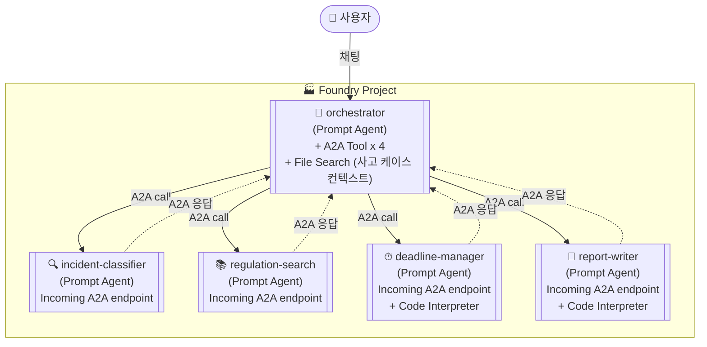
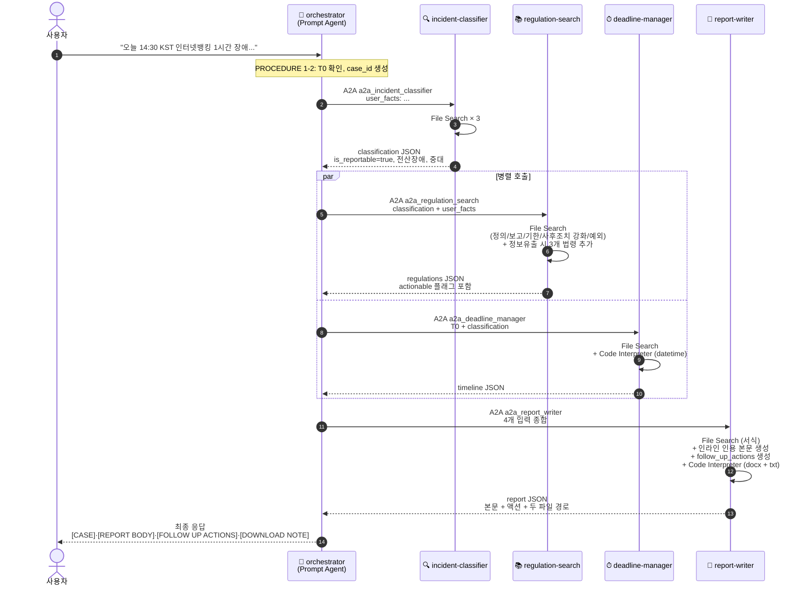

# EFARS 멀티에이전트 — Azure AI Foundry **A2A 전용** Low-Code 설계서 v3.1

> 코드 없이 **Foundry 포털 UI** + **A2A Tool**만으로 구축. Workflow 사용 안 함.
> 작성일: 2026-06-05 (KST) · 설계 버전: **v3.1 (A2A Edition — 보고서 출력·근거 인라인·후속조치 강화)**
> 이전 버전: [v3.0 A2A Edition](./20260605_EFARS_multi_agent_Azure_AI_Foundry_v3_A2A.md) · [v2.0 Workflow Edition](./20260605_EFARS_multi_agent_Azure_AI_Foundry_v2_LowCode.md)

---

## 0. v3.1이 v3.0과 다른 점 (변경 요약)

| 항목 | v3.0 | **v3.1 (본 문서)** |
| --- | --- | --- |
| 보고서 파일 출력 | docx만 (Code Interpreter 산출) | **docx + txt 동시 생성** (테스트·검증 용도 txt 백업) |
| 본문 사용자 노출 | report-writer가 markdown 반환 → orchestrator 요약 후 전달 | **report-writer가 완성형 본문 반환 → orchestrator가 채팅창에 그대로 표시** (요약 금지) |
| 근거 인용 위치 | OUTPUT 마지막 citations_used 배열에 일괄 | **본문 각 항목 옆에 인라인 `[근거: ...]` 의무화** + citations_used도 유지 |
| 후속조치 액션 | 없음 | **follow_up_actions 신규 출력 필드**. 시한·담당·근거 포함 체크리스트 |
| 정보유출 동반 처리 | 일반 분류 흐름과 동일 | **regulation-search가 개인정보보호법 제34조·신용정보법 제39조의4·정보통신망법 제48조의3 추가 검색** |
| 변경 대상 에이전트 | — | **3개 변경**(report-writer / regulation-search / orchestrator) · **2개 무변경**(incident-classifier / deadline-manager) |
| A2A file annotation 한계 | Q3에서 "사용자에게 반환" 단정 | §4-6 신규: A2A 경유 시 file annotation 손실 가능성 명시. 백업 경로 3단계 권고 |

### 변경 위치 요약 (어떤 에이전트의 어디를 고치는가)

| 에이전트 | 변경 섹션 | 변경 종류 |
| --- | --- | --- |
| 🔍 incident-classifier | — | **변경 없음** (v3.0 그대로) |
| 📚 regulation-search | `# 4. PROCEDURE` 단계 1 | 사후조치 키워드 검색 강화 + 정보유출 시 3개 법령 추가 검색 |
| ⏱ deadline-manager | — | **변경 없음** (v3.0 그대로) |
| 📝 report-writer | `# 4. PROCEDURE` 3-1·3-2 신규, 4 변경 / `# 5. OUTPUT` 스키마 확장 / `# 6. CONSTRAINTS` 3줄 추가 | 본문 인라인 근거·후속조치·txt 파일 출력 |
| 🎯 orchestrator | `# 5. OUTPUT` 포맷 확장 / `# 6. CONSTRAINTS` 3줄 추가 | 본문·액션·다운로드 안내 |

> ✅ 본 문서의 §5에 있는 5개 Instructions는 **변경 여부와 관계없이 모두 완성형 전체 본문**으로 기재되어 있습니다. 변경된 줄은 `[v3.1 변경]` 또는 `[v3.1 신규]` 마커로 표시합니다. 그대로 복사-붙여넣기로 교체하면 됩니다.

---

## 1. 전체 토폴로지 (A2A 전용 — v3.0과 동일)



**호출 규칙**: orchestrator가 사용자 입력을 받고 → Instructions에 명시된 순서/조건에 따라 → 4개 A2A Tool 중 필요한 것만 호출 → 각 응답을 받아 다음 호출에 사용 → 마지막에 최종 보고서를 사용자에게 반환.

---

## 2. 사전 준비 (v3.0과 동일)

| 항목 | 값 |
| --- | --- |
| 포털 | <https://ai.azure.com> (New Foundry 토글 ON) |
| 필요 권한 | 프로젝트 **Contributor** 이상, **Foundry User** 롤 |
| 모델 배포 | `gpt-4.1` 또는 `gpt-5-mini` |
| Application Insights | 프로젝트에 연결 (자동 트레이싱) |
| 리전 | Code Interpreter 가능 리전 선택 ([지원 리전](https://learn.microsoft.com/azure/foundry/reference/region-support)) |

---

## 3. Instructions 6섹션 표준 (v3.0과 동일)

본 설계의 모든 에이전트는 다음 6섹션으로 Instructions를 작성합니다. 섹션 헤더(`# 1. ROLE` 등)는 그대로 사용하세요.

| 섹션 | 의미 | 작성 원칙 |
| --- | --- | --- |
| `# 1. ROLE` | 한 줄로 정체성 정의 | "당신은 ~ 전문가다" 한 문장 |
| `# 2. INPUT` | 받게 되는 데이터의 형식·필드 | A2A 호출 시 orchestrator가 전달하는 메시지 구조 명시 |
| `# 3. TOOLS` | 사용 가능 도구와 각 도구를 언제·어떻게 쓸지 | 도구별 발화 트리거 명시 |
| `# 4. PROCEDURE` | 단계별 절차 | 번호 목록 1→2→3, 분기 조건 명시 |
| `# 5. OUTPUT` | 출력 형식 (반드시 JSON 스키마) | 추가 텍스트 금지 명시 |
| `# 6. CONSTRAINTS` | 금지·예외 처리·신뢰도 하한 | "X 외의 외부 지식 금지", "근거 못 찾으면 confidence 낮추기" |

---

## 4. Code Interpreter — 어떤 코드를 넣는가?

### 4-1. 핵심 원리 (v3.0과 동일)

| 흔한 오해 | 실제 동작 |
| --- | --- |
| 사용자가 미리 Python 코드를 등록해 둔다 | ❌ |
| **모델이 런타임에 필요한 Python 코드를 자동 작성·실행한다** | ✅ |

출처: [Code Interpreter — Sandboxed execution environment](https://learn.microsoft.com/azure/foundry/agents/how-to/tools/code-interpreter#sandboxed-execution-environment)

### 4-2. 동작 특성 (v3.0과 동일)

| 특성 | 값 | 영향 |
| --- | --- | --- |
| 언어 | Python | numpy, pandas, matplotlib, python-docx 등 사전 설치 |
| 세션 수명 | 최대 1시간 (idle 30분) | 장기 작업 시 청크 분할 |
| 네트워크 | **outbound 차단** | 외부 API 호출 불가 → orchestrator를 거쳐야 함 |
| 격리 | 대화별 별도 세션 | 동시 대화 = 동시 세션 |
| 파일 | 첨부 파일 읽기 가능, 차트·docx 생성 후 다운로드 링크 반환 | report-writer가 활용 |
| 추가 비용 | 토큰비 외 별도 과금 | Code Interpreter 활성 에이전트만 켜기 |

### 4-3. 본 설계 에이전트별 Code Interpreter 필요 여부 (v3.0과 동일)

| 에이전트 | Code Interpreter | 이유 |
| --- | --- | --- |
| orchestrator | ❌ | 라우팅·요약은 텍스트 추론으로 충분 |
| incident-classifier | ❌ | 분류 판정은 RAG + 텍스트 추론 |
| regulation-search | ❌ | 검색·인용은 File Search 결과 그대로 사용 |
| **deadline-manager** | ✅ | 날짜·시간 산술 결정성 |
| **report-writer** | ✅ | .docx + .txt 파일 생성 |

### 4-4. 모델이 자동 생성할 코드 예시 (v3.0 + v3.1 txt 출력 추가)

**deadline-manager** (v3.0과 동일 — 변경 없음):
```python
# 모델이 자동으로 작성하는 코드 — 사용자는 입력하지 않음
from datetime import datetime, timedelta
from zoneinfo import ZoneInfo
import json

T0 = datetime.fromisoformat("2026-06-05T14:30:00+09:00")
holidays = {"2026-06-06", "2026-08-15"}

def next_business_day(dt):
    while dt.strftime("%Y-%m-%d") in holidays or dt.weekday() >= 5:
        dt += timedelta(days=1)
    return dt

initial = T0 + timedelta(hours=2)
interim = T0 + timedelta(hours=24)
final   = next_business_day(T0 + timedelta(days=30))

print(json.dumps({
    "initial_due": initial.isoformat(),
    "interim_due": interim.isoformat(),
    "final_due":   final.isoformat(),
}, indent=2))
```

**report-writer** (v3.1 변경 — txt 동시 생성 추가):
```python
# 모델이 자동 생성 — 사용자는 입력하지 않음
from docx import Document

doc = Document("/mnt/data/별지_제2호서식_템플릿.docx")

mapping = {
    "{사고개요}": user_facts,
    "{사고분류}": classification["incident_type"],
    "{보고기한_최초}": timeline["initial_due"],
    # [v3.1 변경] 인용을 인라인 [근거: ...] 형태로 본문에 삽입한 보고서 본문 자체를 매핑
    "{본문}": report_markdown_with_inline_citations,
    "{후속조치}": follow_up_actions_markdown,
}
for p in doc.paragraphs:
    for k, v in mapping.items():
        if k in p.text:
            p.text = p.text.replace(k, v)

docx_path = "/mnt/data/EFARS_보고서_초안_{case_id}.docx"
doc.save(docx_path)

# [v3.1 신규] 테스트·검증용 txt 백업 — A2A로 file annotation 손실 시 대비
txt_path = "/mnt/data/EFARS_보고서_초안_{case_id}.txt"
with open(txt_path, "w", encoding="utf-8") as f:
    f.write(report_markdown_with_inline_citations)
    f.write("\n\n## 후속조치 액션 아이템\n")
    f.write(follow_up_actions_markdown)

print({"docx": docx_path, "txt": txt_path})
```

### 4-5. Code Interpreter를 켜는 포털 절차 (v3.0과 동일)

1. 에이전트 상세 페이지 → 우측 **Setup** 패널
2. **Tools** 섹션 → **Add** → **Code Interpreter** → 저장
3. (선택) **Knowledge** 또는 **Files** 섹션에서 분석 대상 파일 첨부

### 4-6. [v3.1 신규] A2A 경유 시 파일 다운로드 한계와 백업 경로

**문제**: A2A 공식 문서: *"Agent B's answer goes back to Agent A. Agent A then summarizes the answer and generates a response for the user."* — report-writer(B)가 만든 .docx의 `container_file_citation` annotation은 orchestrator(A)에게 반환되지만, orchestrator의 텍스트 요약 과정에서 **annotation이 손실될 가능성**이 있습니다. A2A는 preview이며 MS Learn에 file annotation 전파 보장이 명시되어 있지 않습니다.

**3단계 백업 경로** (위에서 아래 순으로 시도):

| 우선순위 | 경로 | 보장도 |
| --- | --- | --- |
| 1순위 | orchestrator 채팅창의 응답 텍스트에 sandbox 링크가 자동 렌더링되면 그대로 클릭 | ⚠️ 불확정 |
| 2순위 | report-writer Playground로 **단독 호출** (동일 case_id로 재실행) → 채팅창에 docx 다운로드 버튼 표시 | ✅ MS Learn 명시 |
| 3순위 | report-writer 응답에 포함된 `report_markdown` 본문 자체를 사용자가 채팅창에서 복사 + `.txt` 파일 경로(`container_id`/`file_id`)로 REST 호출 | ✅ 항상 동작 |

출처: [Code Interpreter REST 가이드 — Download the generated chart](https://learn.microsoft.com/azure/foundry/agents/how-to/tools/code-interpreter#create-a-chart-with-code-interpreter-using-the-rest-api)

---

## 5. 5개 에이전트 — 포털 클릭 가이드 (변경 마커 포함)

각 에이전트는 **Build > Agents > Create agent** 에서 생성. Knowledge 업로드 시 File Search vector store가 자동 생성. 출처: [File search tool — How file search works](https://learn.microsoft.com/azure/foundry/agents/how-to/tools/file-search#how-file-search-works)

---

### 5-1. 🔍 incident-classifier — **변경 없음 (v3.0과 동일)**

| 항목 | 값 |
| --- | --- |
| 모델 | `gpt-4.1` |
| Knowledge (업로드 파일) | **11종 법령 PDF** (§5-1-A 표) |
| Tools | `File Search` (Knowledge 추가 시 자동 활성화) |
| Code Interpreter | ❌ |
| Incoming A2A endpoint | ✅ |

#### 5-1-A. 업로드할 파일 (11종 — v3.0과 동일)
| # | 파일명 | 출처 |
| --- | --- | --- |
| 1 | `01_전자금융거래법.pdf` | 국가법령정보센터 |
| 2 | `02_전자금융거래법_시행령.pdf` | 〃 |
| 3 | `03_전자금융감독규정.pdf` | 금융위원회 |
| 4 | `04_전자금융감독규정_시행세칙.pdf` | 금감원 (제7조의4 포함) |
| 5 | `05_금융분야_개인정보보호_가이드라인.pdf` | 금융위·금감원 |
| 6 | `06_개인정보보호법.pdf` | 국가법령정보센터 |
| 7 | `07_신용정보법.pdf` | 〃 |
| 8 | `08_정보통신망법.pdf` | 〃 |
| 9 | `09_금융회사_정보처리_위탁규정.pdf` | 〃 |
| 10 | `10_FSI_정보보호표준.pdf` | 금융보안원 |
| 11 | `11_한국은행법_제29조_관련.pdf` | 한국은행 |

#### 5-1-B. Instructions (v3.0과 동일 — 그대로 유지)

```text
# 1. ROLE
당신은 한국 전자금융사고 분류 전문가다. 사고 사실관계를 받아 보고 대상 여부와
사고 유형을 판정한다.

# 2. INPUT
A2A로 다음 형식의 자연어 메시지를 받는다:
- user_facts: 사용자가 진술한 사고 사실관계 (자유 텍스트)
- (선택) hints: orchestrator가 부가한 컨텍스트

# 3. TOOLS
- File Search: Knowledge의 11종 법령에서 근거 조항을 검색한다.
  사용 시점: 모든 판정의 근거를 찾을 때 반드시 호출.
  사용 방법: incident_type 후보별로 1회씩 검색 + 시행세칙 제7조의4 항상 검색.

# 4. PROCEDURE
1. 사고 사실관계를 정리하여 다음 후보군 중 어디에 해당하는지 가설을 세운다:
   {전산장애, 정보유출, 전자적_침해행위, 기타}
2. File Search로 다음을 순차 호출한다:
   2-1. "전자금융감독규정 시행세칙 제7조의4" (1순위)
   2-2. 가설된 incident_type 관련 정의·보고의무 조항
   2-3. 개인정보 침해이면 개인정보보호법·신용정보법·정보통신망법 신고 의무
3. 검색된 원문 인용을 그대로 보관한다 (의역 금지).
4. 종합 판정:
   - is_reportable: 시행세칙 제7조의4 + 관련법을 충족하면 true
   - severity_class: 중대 / 일반 (시행세칙 기준에 따름)
   - confidence: 인용 명확도 0.0~1.0
5. 애매하면 보수적으로 보고 대상(true)으로 처리한다.

# 5. OUTPUT
반드시 다음 JSON만 반환 (추가 텍스트 금지):
{
  "is_reportable": true | false,
  "exclusion_basis": "비보고 사유 + 근거 조항" | null,
  "incident_type": "전산장애" | "정보유출" | "전자적_침해행위" | "기타",
  "severity_class": "중대" | "일반",
  "confidence": 0.0~1.0,
  "citations": [
    {"law":"...", "article":"...", "exact_quote":"...", "source_file":"..."}
  ],
  "missing_evidence": ["추가 확인 필요한 사실관계 목록"]
}

# 6. CONSTRAINTS
- 11종 법령 외의 외부 지식으로 판정 금지.
- exact_quote는 원문 그대로. 의역·축약·재구성 금지.
- File Search에서 근거를 못 찾으면 confidence를 0.5 이하로 낮추고 missing_evidence 채울 것.
- 사용자에게 추가 질문하지 말 것. 추가 정보 필요시 missing_evidence에만 기록.
- 출력은 한국어로 작성하되 JSON 키는 영문 그대로.
```

---

### 5-2. 📚 regulation-search — **PROCEDURE 단계 1 변경**

| 항목 | 값 |
| --- | --- |
| 모델 | `gpt-4.1` |
| Knowledge | **incident-classifier와 동일한 11종 법령 PDF** (다시 업로드) |
| Tools | `File Search` |
| Code Interpreter | ❌ |
| Incoming A2A endpoint | ✅ |

#### Instructions (v3.1 — 변경 포함 완성형)

```text
# 1. ROLE
당신은 한국 전자금융 법규의 조항 검색·인용 전문가다. 분류 결과를 받아 적용 조항과
원문 인용을 제시한다.

# 2. INPUT
A2A로 다음 자연어 메시지를 받는다:
- classification: incident-classifier의 JSON 출력 (incident_type, severity_class, citations 등)
- user_facts: 원본 사고 사실관계

# 3. TOOLS
- File Search: Knowledge의 11종 법령에서 조항을 검색한다.
  사용 시점: 카테고리별(정의/보고의무/기한/사후조치/예외)로 최소 1회씩.

# 4. PROCEDURE
1. classification.incident_type을 키로 다음 카테고리를 각각 File Search로 검색한다:
   - 정의 조항
   - 보고 의무 조항
   - 보고 기한 조항
   - 사후 조치 조항 — [v3.1 변경] 다음 키워드를 OR로 검색하여 액션 문구를 빠짐없이 추출:
     "통보", "신고", "보고", "점검", "재발방지", "원인분석", "공시", "개선계획"
     액션 문구가 있는 조항은 actionable=true 마크.
   - 적용 예외·단서 조항
   - [v3.1 신규] 분류가 정보유출 또는 개인정보 침해 동반이면 다음 3개 법령을 추가 File Search:
     · 개인정보보호법 제34조 (개인정보위 신고 의무 — 72시간)
     · 신용정보법 제39조의4 (개인신용정보 누설 신고)
     · 정보통신망법 제48조의3 (침해사고 신고)
2. 검색 결과에서 원문 그대로(exact_quote) 추출한다.
3. 충돌 시 우선순위: 시행세칙 > 감독규정 > 시행령 > 모법.
4. 본 보고의 핵심 근거 조항 1개를 primary_basis로 선정한다.
5. relevance_score < 0.6인 항목은 제외한다.

# 5. OUTPUT
반드시 다음 JSON만 반환:
{
  "applicable_clauses": [
    {
      "law": "법령명",
      "article": "제○조 제○항 제○호",
      "category": "정의" | "보고의무" | "기한" | "사후조치" | "예외",
      "exact_quote": "원문 그대로",
      "interpretation": "본 사고에 어떻게 적용되는지 1-2문장 해설",
      "source_file": "파일명",
      "relevance_score": 0.0~1.0,
      "actionable": true | false
    }
  ],
  "primary_basis": "본 보고의 핵심 근거 조항 (1개)",
  "conflict_resolution": "법령 충돌 시 우선순위 적용 사유" | null
}

# 6. CONSTRAINTS
- exact_quote 의역·축약·재구성 금지 (띄어쓰기·문장부호 포함 원문 그대로).
- File Search 결과에 없는 조항은 출력에서 제외 (null로 채우지 말 것).
- relevance_score는 인용의 적합도이며 LLM 자체 평가가 아닌 File Search 점수 기반.
- 사용자에게 추가 질문 금지.
- [v3.1 신규] 정보유출 동반 시 위 3개 법령 검색을 생략하면 안 됨. 검색 결과가 없으면 결과 없음으로 명시.
```

---

### 5-3. ⏱ deadline-manager — **변경 없음 (v3.0과 동일)**

| 항목 | 값 |
| --- | --- |
| 모델 | `gpt-4.1` |
| Knowledge | `03_전자금융감독규정.pdf`, `04_전자금융감독규정_시행세칙.pdf`, `holidays_kr_2026.json` |
| Tools | `File Search` + **`Code Interpreter` ✅** |
| Code Interpreter 용도 | **모델이 datetime 산술 코드를 자동 작성·실행** |
| Incoming A2A endpoint | ✅ |

#### Instructions (v3.0과 동일 — 그대로 유지)

```text
# 1. ROLE
당신은 전자금융사고 보고 기한 계산기다. T0(사고 인지 시각)와 사고 유형을 받아
최초/중간/종결 보고 기한을 KST ISO 8601로 산정한다.

# 2. INPUT
A2A로 다음 자연어 메시지를 받는다:
- T0_kst: ISO 8601 KST (예: "2026-06-05T14:30:00+09:00")
- classification: incident-classifier의 JSON 출력 (incident_type, severity_class)

# 3. TOOLS
- File Search: 시행세칙에서 사고 유형별 보고 기한 조항을 찾는다.
- Code Interpreter: datetime 산술과 영업일 보정을 결정적으로 수행한다.
  사용 시점: 기한 계산은 반드시 Code Interpreter로 처리 (텍스트 추론 금지).
  사용 방법: Python으로 datetime + zoneinfo + 공휴일 목록을 사용한 코드를 작성하라.

# 4. PROCEDURE
1. File Search로 시행세칙에서 다음 시한을 찾는다:
   - 최초 보고 시한 (보통 즉시 또는 2시간)
   - 중간 보고 시한 (보통 24시간)
   - 종결 보고 시한 (보통 30일)
2. holidays_kr_2026.json을 Code Interpreter로 로드한다.
3. Code Interpreter로 다음을 계산하라 (Python 코드를 직접 작성·실행):
   - T0를 Asia/Seoul 타임존으로 파싱
   - 각 시한 더하기 (timedelta)
   - 시행세칙이 "영업일 기준"으로 명시한 경우만 주말·공휴일 보정
   - "지체 없이"는 보정하지 말고 raw_phrase에 원문 표현 그대로 기록
4. 계산 결과를 OUTPUT JSON에 매핑한다.

# 5. OUTPUT
반드시 다음 JSON만 반환:
{
  "T0_kst": "ISO 8601",
  "initial_due": {
    "deadline_kst": "ISO 8601",
    "basis_article": "시행세칙 제○조",
    "raw_phrase": "원문 시한 표현"
  },
  "interim_due": { ... 동일 구조 },
  "final_due":   { ... 동일 구조 },
  "holiday_adjustments": ["YYYY-MM-DD: 공휴일/주말 → 다음 영업일로 이월"],
  "computation_log": "Code Interpreter가 실행한 계산 단계 요약"
}

# 6. CONSTRAINTS
- 시한 산정은 Code Interpreter 결과만 사용. 텍스트 추론으로 날짜 만들지 말 것.
- 시행세칙에 명시 없는 사고 유형이면 해당 필드를 missing_basis 객체로 표시:
  {"deadline_kst": null, "missing_basis": "시행세칙 제○조에 해당 사고유형 시한 명시 없음"}
- "지체 없이" 같은 정성 표현은 KST 시각을 만들지 말고 raw_phrase에 원문 그대로 둘 것.
```

---

### 5-4. 📝 report-writer — **PROCEDURE / OUTPUT / CONSTRAINTS 변경**

| 항목 | 값 |
| --- | --- |
| 모델 | `gpt-4.1` |
| Knowledge | `별지_제2호서식_템플릿.docx`, `04_전자금융감독규정_시행세칙.pdf` |
| Tools | `File Search` + **`Code Interpreter` ✅** |
| Code Interpreter 용도 | **모델이 python-docx 코드를 자동 작성·실행하여 별지 제2호서식 .docx 렌더링 + .txt 백업 생성** |
| Incoming A2A endpoint | ✅ |

#### Instructions (v3.1 — 변경 포함 완성형)

```text
# 1. ROLE
당신은 전자금융사고 보고서 작성자다. 분류·규정·기한 3개 결과를 받아 별지 제2호서식
초안을 생성한다.

# 2. INPUT
A2A로 다음 자연어 메시지를 받는다:
- user_facts: 사고 사실관계
- classification: incident-classifier의 JSON 출력
- regulations: regulation-search의 JSON 출력 (applicable_clauses에 actionable 플래그 포함)
- timeline: deadline-manager의 JSON 출력

# 3. TOOLS
- File Search: 별지 제2호서식 템플릿의 필수 필드 구조를 파악한다.
- Code Interpreter: python-docx로 .docx 파일을 렌더링하고 .txt 백업을 함께 생성한다.
  사용 시점: OUTPUT의 report_docx_path와 report_txt_path를 만들 때 반드시 사용.
  사용 방법: Python으로 Document 로드 → placeholder 치환 → docx 저장 → 동일 본문을 txt로 추가 저장.

# 4. PROCEDURE
1. File Search로 별지 제2호서식의 필수 필드 목록을 추출한다.
2. 입력 4종을 각 필드에 매핑한다:
   - 사고개요 ← user_facts
   - 사고분류 ← classification.incident_type, severity_class
   - 보고대상_판단근거 ← classification.citations + regulations.primary_basis
   - 적용규정 ← regulations.applicable_clauses (category별 그룹화)
   - 보고기한 ← timeline.initial_due / interim_due / final_due
3. 모든 인용은 regulations.applicable_clauses[].exact_quote를 원문 그대로 사용.
3-1. [v3.1 신규] 본문의 각 항목·문단 뒤에 인라인 근거를 다음 형식으로 삽입:
     [근거: <law> <article> — "<exact_quote 앞 30자>..."]
     - 사고분류·기한·사후조치 등 모든 판정 항목은 반드시 인용 1개 이상 첨부.
     - 동일 조항을 여러 곳에서 인용할 경우 약식 [근거: <law> <article>]만 사용 가능.
     - 본문 예시:
       "## 2. 사고분류
        전산장애 / 중대
        [근거: 전자금융감독규정 시행세칙 제7조의4 제1항 — "전산장애로 인하여..."]"
3-2. [v3.1 신규] 후속조치 액션 아이템 follow_up_actions 생성:
     - regulations.applicable_clauses에서 actionable==true 또는 category=="사후조치"인 항목을 모두 추출
     - timeline.initial_due / interim_due / final_due 와 매칭하여 시한이 있는 액션은 due_kst에 시한 명시
     - 각 액션은 다음 구조로 변환:
       {
         "action": "<행동 1문장>",
         "due_kst": "<ISO 8601 또는 null>",
         "responsible_role": "<조항에 명시된 경우만, 아니면 null>",
         "basis": {"law":"...","article":"...","exact_quote":"..."}
       }
     - 정보유출 동반 시: 개인정보보호법 제34조(72시간 신고), 신용정보법 제39조의4,
       정보통신망법 제48조의3 항목이 입력에 있으면 별도 액션으로 추가.
4. [v3.1 변경] Code Interpreter로 다음 Python 코드를 작성·실행한다:
   - /mnt/data/별지_제2호서식_템플릿.docx 로드
   - placeholder 치환 (본문은 3-1의 인라인 인용 포함 buffer를 사용)
   - /mnt/data/EFARS_보고서_초안_{case_id}.docx로 저장
   - [v3.1 신규] 동일 본문 + 후속조치 markdown을 /mnt/data/EFARS_보고서_초안_{case_id}.txt로
     UTF-8 저장 (테스트·검증용 백업, A2A file annotation 손실 대비)
5. 자체 검증 체크리스트 점수를 산출한다:
   [ ] 모든 인용에 source_file 있음
   [ ] T0와 기한 timezone 일관 (KST)
   [ ] is_reportable=true인데 본문 비어있지 않음
   [ ] severity_class가 본문과 일치
   [ ] [v3.1 신규] 본문의 모든 판정 항목에 인라인 [근거: ...] 1개 이상 존재
   [ ] [v3.1 신규] follow_up_actions에 사후조치 카테고리 조항이 빠짐없이 반영
   self_check_score = 통과 개수 / 6
6. 누락 필드는 missing_fields에 나열 (보고서 본문은 생성 진행).

# 5. OUTPUT
[v3.1 변경] 반드시 다음 JSON만 반환:
{
  "report_markdown": "본문 전체 — 각 항목에 인라인 [근거: ...] 포함. orchestrator가 사용자에게 그대로 표시할 수 있도록 완성형 markdown",
  "report_docx_path": "/mnt/data/EFARS_보고서_초안_{case_id}.docx",
  "report_txt_path":  "/mnt/data/EFARS_보고서_초안_{case_id}.txt",
  "follow_up_actions": [
    {
      "action": "T+2h: 금감원 전자공시시스템 최초보고 제출",
      "due_kst": "2026-06-05T16:30:00+09:00" | null,
      "responsible_role": "CISO" | "준법감시인" | "정보보호최고책임자" | null,
      "basis": {"law":"...","article":"...","exact_quote":"..."}
    }
  ],
  "missing_fields": ["..."],
  "self_check_score": 0.0~1.0,
  "citations_used": [
    {"law":"...","article":"...","exact_quote":"...","source_file":"..."}
  ]
}

# 6. CONSTRAINTS
- 인용문 의역·축약·재구성 금지.
- 사용자에게 추가 입력 요청 금지 → 누락 시 missing_fields에 기록.
- Code Interpreter는 외부 네트워크 호출 불가 → 모든 데이터는 입력으로 받은 것만 사용.
- self_check_score < 0.75이면 OUTPUT 직전에 한 번 본문을 재검토한 후 다시 계산.
- [v3.1 신규] 본문의 모든 판정 항목에 인라인 [근거: ...] 1개 이상 필수. 누락 시 self_check_score 0.17 감점.
- [v3.1 신규] follow_up_actions의 basis 필드는 regulations.applicable_clauses에 존재하는 인용만 사용 (자체 생성 금지).
- [v3.1 신규] responsible_role을 추정하지 말 것 — 인용된 조항에 명시된 경우만 채우고, 아니면 null.
```

---

### 5-5. 🎯 orchestrator — **OUTPUT / CONSTRAINTS 변경**

| 항목 | 값 |
| --- | --- |
| 모델 | `gpt-5-mini` (reasoning 권장) 또는 `gpt-4.1` |
| Knowledge | (선택) 과거 사고 케이스 .jsonl 한 파일 |
| Tools | **`A2A Tool` × 4** + (선택) `File Search` |
| Code Interpreter | ❌ |
| Incoming A2A endpoint | 선택 |

#### Tools에 연결할 A2A 4종 (v3.0과 동일)

| 연결명 (Name) | 가리킬 endpoint | 설명(=Tool description) |
| --- | --- | --- |
| `a2a_incident_classifier` | incident-classifier의 A2A endpoint URL | "사고 사실관계를 분류하고 보고 대상 여부를 판정. 항상 가장 먼저 호출." |
| `a2a_regulation_search` | regulation-search의 A2A endpoint URL | "분류 결과를 받아 적용 조항과 원문 인용을 추출. is_reportable=true일 때 호출." |
| `a2a_deadline_manager` | deadline-manager의 A2A endpoint URL | "T0와 분류를 받아 보고 기한을 계산. is_reportable=true일 때 regulation-search와 병행 호출 가능." |
| `a2a_report_writer` | report-writer의 A2A endpoint URL | "분류·규정·기한 3개 결과를 받아 별지 제2호서식 .docx 초안 생성. 가장 마지막에 호출." |

#### Instructions (v3.1 — 변경 포함 완성형)

```text
# 1. ROLE
당신은 EFARS(전자금융사고 보고 시스템) 컨트롤 타워다. 사용자의 사고 입력을 받아
4개 전문 에이전트(A2A 도구)를 정해진 순서·조건으로 호출하고 최종 보고서를 사용자에게
반환한다.

# 2. INPUT
사용자가 자연어로 다음을 입력한다:
- 사고 사실관계 (필수)
- T0 = 사고 인지 시각 KST (없으면 사용자에게 1회 질문하여 받음)
- 추가 맥락 (선택)

# 3. TOOLS
당신이 사용할 도구는 4개의 A2A 도구뿐이다. 각 도구를 정확한 시점에 호출하라.

[3-1] a2a_incident_classifier
  - 언제: 사용자 입력 직후 항상 1순위로 호출.
  - 입력 메시지 형식:
      "user_facts: <사용자 사실관계>"
  - 받는 출력: classification JSON

[3-2] a2a_regulation_search
  - 언제: classification.is_reportable == true 일 때.
  - 입력 메시지 형식:
      "classification: <classification JSON>
       user_facts: <사용자 사실관계>"
  - 받는 출력: regulations JSON

[3-3] a2a_deadline_manager
  - 언제: classification.is_reportable == true 일 때. regulation-search와 병행 호출 가능.
  - 입력 메시지 형식:
      "T0_kst: <ISO 8601>
       classification: <classification JSON>"
  - 받는 출력: timeline JSON

[3-4] a2a_report_writer
  - 언제: 위 3개 결과가 모두 도착한 뒤 마지막에 1회 호출.
  - 입력 메시지 형식:
      "user_facts: ...
       classification: ...
       regulations: ...
       timeline: ..."
  - 받는 출력: report JSON (report_markdown, report_docx_path, report_txt_path,
    follow_up_actions, citations_used, self_check_score, missing_fields)

# 4. PROCEDURE
1. 사용자 입력 정규화. T0가 없으면 "사고를 인지하신 정확한 시각(KST)을 알려주세요"라고
   1회만 묻고 입력을 받는다.
2. case_id 생성: "EFARS-YYYYMMDD-HHmm-<랜덤4자리>" 형식. (LLM이 직접 생성)
3. a2a_incident_classifier 호출 → classification 수신.
4. 분기:
   - classification.is_reportable == false → STEP 5로 가서 비보고 메모만 작성.
   - classification.is_reportable == true → STEP 6로 진행.
5. (비보고 경로) 한 단락 메모를 직접 작성하여 사용자에게 반환:
   "본 사고는 다음 사유로 보고 대상이 아닙니다: <classification.exclusion_basis>"
   그리고 END.
6. (보고 경로) 다음 두 호출을 순서대로 또는 가능하면 동시에 수행한다:
   - a2a_regulation_search → regulations 수신
   - a2a_deadline_manager → timeline 수신
7. a2a_report_writer 호출 → report 수신.
8. 사용자에게 최종 응답:
   - case_id
   - 보고서 docx / txt 경로 두 개 모두
   - 핵심 기한 3개 (initial/interim/final)
   - [v3.1 신규] report_markdown 본문 전체를 [REPORT BODY] 섹션에 그대로 표시
   - [v3.1 신규] follow_up_actions를 [FOLLOW UP ACTIONS] 섹션에 체크리스트로 표시
   - self_check_score
   - missing_fields (있으면 빨간 글씨)
9. self_check_score < 0.75 이거나 missing_fields가 비어있지 않으면 사용자에게
   "검토가 필요합니다" 표시.

# 5. OUTPUT
[v3.1 변경] 사용자에게 반환하는 최종 메시지는 다음 구조로 작성:

[CASE] <case_id>
[STATUS] 보고대상 (또는 비보고)
[CLASSIFICATION] <incident_type> / <severity_class> / confidence=<...>
[KEY DEADLINES]
  - 최초: <initial_due>
  - 중간: <interim_due>
  - 종결: <final_due>
[REPORT FILE - DOCX] <report_docx_path>
[REPORT FILE - TXT]  <report_txt_path>
[SELF CHECK] <self_check_score>/1.0
[NEEDS REVIEW] <missing_fields 또는 없음>

[REPORT BODY]
<report_markdown 전체를 여기에 그대로 붙여넣기 — 각 항목에 인라인 [근거: ...] 포함>

[FOLLOW UP ACTIONS]
<follow_up_actions 배열을 체크박스 markdown으로 렌더링>
- [ ] <action> (시한: <due_kst>, 담당: <responsible_role>)
      [근거: <basis.law> <basis.article>]

[CITATIONS COUNT] <citations 수>
[DOWNLOAD NOTE]
docx/txt 파일 다운로드 링크가 이 채팅창에 자동으로 표시되지 않으면 다음을 시도하세요:
  1) report-writer Playground에서 동일 case_id로 단독 실행 → 채팅창에 다운로드 버튼 표시
  2) [REPORT BODY] 본문을 복사하여 별도로 docx로 저장
  3) txt 파일은 위 경로의 container_id/file_id로 REST GET 호출

# 6. CONSTRAINTS
- 4개 A2A 도구 외의 도구로 사고 판정·인용·기한 산정 금지.
- 직접 법령을 해석하거나 기한을 계산하지 말 것 — 전문 에이전트에 위임.
- A2A 호출 순서를 임의로 바꾸지 말 것 (분류 → 규정+기한 → 보고서).
- 사용자에게 같은 정보를 두 번 묻지 말 것.
- 어떤 A2A 호출이 실패하면 1회 재시도 후 사용자에게 명시적으로 보고하고 종료.
- 비보고 판정도 사용자에게 사유를 명확히 설명할 것.
- 최종 응답에 자체 추측을 넣지 말고 전문 에이전트의 출력만 종합할 것.
- [v3.1 신규] report-writer가 반환한 report_markdown은 사용자에게 그대로 노출 (요약·재작성·축약 금지).
- [v3.1 신규] follow_up_actions는 빠짐없이 모두 표시 (선별·우선순위 변경 금지).
- [v3.1 신규] docx/txt 다운로드 링크 노출이 보장되지 않으므로 [DOWNLOAD NOTE] 안내 섹션을 항상 포함.
```

---

## 6. A2A 연결 만들기 — 포털 클릭 절차 (v3.0과 동일)

### 6-1. 각 전문 에이전트를 Incoming A2A endpoint로 노출

4개 전문 에이전트 각각에 대해 반복:

1. 포털에서 해당 에이전트 상세 페이지 열기 (예: incident-classifier)
2. 우측 **Setup** 패널 → 하단 **Incoming A2A** 섹션 펼치기
3. **Enable incoming A2A** 토글 ON
4. **A2A protocol version**: `1.0`
5. 발급된 **A2A endpoint URL**과 인증 키(또는 Entra ID 옵션)를 메모

출처: [Enable incoming A2A on a Foundry agent (preview)](https://learn.microsoft.com/azure/foundry/agents/how-to/enable-agent-to-agent-endpoint)

### 6-2. Orchestrator에서 A2A connection 만들기

4개 전문 에이전트 각각에 대해 반복:

1. 좌측 **Tools** 메뉴 클릭
2. **Connect tool** 클릭
3. **Custom** 탭 선택
4. **Agent2Agent (A2A)** 선택 → **Create**
5. 입력:
   - **Name**: `a2a_incident_classifier` (위 §5-5 표의 이름 그대로)
   - **A2A Agent Endpoint**: §6-1에서 메모한 URL
   - **Authentication**: 키 기반이면 credential name `x-api-key` + secret 값 / Entra ID이면 해당 옵션
6. **Save**

출처: [Connect to an A2A agent endpoint — Create the connection in the Foundry portal](https://learn.microsoft.com/azure/foundry/agents/how-to/tools/agent-to-agent#create-the-connection-in-the-foundry-portal)

### 6-3. Orchestrator 에이전트에 A2A 도구 부착

1. Build > Agents > **orchestrator** 선택
2. 우측 **Setup** → **Tools** → **Add**
3. **Custom** → **Agent2Agent (A2A)** → §6-2에서 만든 connection 4개를 각각 선택해서 추가
4. 각 도구의 **Description** 칸에 §5-5의 "라우팅 단서" 문장 그대로 입력
5. **Save**

---

## 7. 검증·관찰 (v3.0과 동일)

| 항목 | 포털 경로 |
| --- | --- |
| Thread Logs (메시지 백로그) | Build > Agents > 에이전트 > Playground > 우측 **Thread logs** |
| 분산 트레이스 (A2A 호출 타임라인) | 좌측 **Tracing** → 트레이스 선택 (Application Insights 연동) |
| 실시간 메트릭 | 좌측 **Monitor** → Agent Monitoring Dashboard |
| Continuous Evaluation | Monitor > Settings > **Continuous evaluation** → evaluator 체크박스 |
| 사전 배포 평가 | **Evaluations** > Create new evaluation > 골든셋 업로드 |
| Guided Guardrails | 에이전트 상세 > 좌측 **Guardrails** > **Guided guardrails setup** |
| AI Red Teaming | 좌측 **AI red teaming agent** > New scan |
| Prompt Optimizer | 에이전트 Instructions 편집 화면 우측 상단 ✏️✨ 아이콘 |

### 7-1. 에이전트별 권장 Evaluator (v3.0과 동일)

| 에이전트 | Evaluators |
| --- | --- |
| orchestrator | Intent Resolution · Task Adherence · Task Completion · Tool Call Accuracy |
| incident-classifier | Groundedness Pro · Intent Resolution · Tool Call Accuracy |
| regulation-search | Groundedness Pro · Relevance · Response Completeness |
| deadline-manager | Tool Call Accuracy · Task Adherence |
| report-writer | Task Completion · Task Adherence · Groundedness |

출처: [Agent evaluators](https://learn.microsoft.com/azure/foundry/concepts/evaluation-evaluators/agent-evaluators), [Set up continuous evaluation](https://learn.microsoft.com/azure/foundry/observability/how-to/how-to-monitor-agents-dashboard#set-up-continuous-evaluation)

---

## 8. 한눈에 보는 실행 흐름 (v3.1 — 본문·액션 노출 반영)



---

## 9. 자주 묻는 질문

**Q1. Orchestrator의 LLM이 호출 순서를 잘못 정하면?**
A2A 도구는 "LLM 자율 라우팅"이므로 Instructions의 PROCEDURE 섹션이 호출 순서를 강제하는 핵심입니다. §5-5의 PROCEDURE를 그대로 사용하면 LLM이 분류 → 규정+기한 → 보고서 순서를 정확히 따릅니다. Tool Call Accuracy evaluator로 지속 검증하세요.

**Q2. 호출 실패 시 자동 재시도?**
Foundry는 A2A 호출에 기본 retry 정책을 갖습니다(연결 오류 시). 비즈니스 로직 재시도(예: 응답이 JSON이 아닐 때)는 Instructions의 CONSTRAINTS에 "1회 재시도 후 사용자에게 보고"로 명시되어 있습니다.

**Q3. [v3.1 갱신] Code Interpreter 결과를 다른 에이전트가 받을 수 있나요? .docx는 사용자에게 어떻게 도달하나요?**
deadline-manager의 Code Interpreter 결과는 JSON 텍스트로 직렬화되어 orchestrator에 전달됩니다. report-writer의 .docx/.txt는 컨테이너에 저장되고 `container_file_citation` annotation으로 응답에 첨부됩니다. **단, A2A 경유 시 orchestrator의 텍스트 요약 과정에서 annotation이 손실될 수 있습니다** (MS Learn에 보장 명시 없음). 따라서 v3.1은 다음 3중 백업을 제공합니다: ① 본문 markdown을 응답에 인라인 포함 → 채팅창에서 바로 확인 ② txt 파일 동시 생성 ③ report-writer Playground 단독 호출로 docx 다운로드 보장. §4-6 참조.

**Q4. A2A는 preview인데 운영 환경에 써도 되나요?**
2026-06 현재 A2A Tool은 public preview이며 SLA가 없습니다. 운영 도입 전 다음을 권장합니다: ① Continuous Evaluation으로 품질 지속 측정 ② AI Red Teaming 정기 실행 ③ 핵심 경로는 Human-in-the-loop 게이트 추가. 출처: [Connect to an A2A agent endpoint (preview)](https://learn.microsoft.com/azure/foundry/agents/how-to/tools/agent-to-agent)

**Q5. Code Interpreter가 외부 데이터를 못 가져오나요?**
네. *"dynamic sessions can't make outbound network requests"* — sandbox는 outbound 네트워크 차단입니다. 모든 외부 데이터는 Knowledge 파일 업로드 또는 A2A 호출 입력으로 주입되어야 합니다.

**Q6. [v3.1 신규] 본문 인라인 인용이 누락되면 어떻게 감지하나요?**
report-writer의 self_check_score 항목 5(`본문의 모든 판정 항목에 인라인 [근거: ...] 1개 이상`)가 0.17점을 차지하므로, 인라인 누락 시 점수가 0.83 이하로 떨어집니다. orchestrator의 PROCEDURE 9가 self_check_score < 0.75에서 "검토가 필요합니다" 표시를 강제합니다. 추가로 Groundedness Pro evaluator가 인용 사실성을 지속 평가합니다.

**Q7. [v3.1 신규] follow_up_actions를 더 풍부하게 만들고 싶으면?**
가장 단순한 확장은 regulation-search PROCEDURE 1의 "사후조치 키워드" 목록에 도메인 특화 단어("FDS 점검", "내부통제 점검" 등)를 추가하는 것입니다. 더 본격적으로는 별도 `action-recommender` 6번째 에이전트를 추가하여 follow_up_actions에 우선순위·예상 소요 시간·관련 부서를 부여할 수 있습니다(미래 v3.2 후보).

---

## 10. 검증 출처 (Microsoft Learn 1차 문서)

1. [Connect to an A2A agent endpoint from Foundry Agent Service (preview)](https://learn.microsoft.com/azure/foundry/agents/how-to/tools/agent-to-agent) — A2A vs Workflow, 포털 절차, *Agent A keeps control* 원칙
2. [Enable incoming A2A on a Foundry agent (preview)](https://learn.microsoft.com/azure/foundry/agents/how-to/enable-agent-to-agent-endpoint) — Incoming A2A endpoint 활성화
3. [Agent2Agent (A2A) authentication](https://learn.microsoft.com/azure/foundry/agents/concepts/agent-to-agent-authentication)
4. [Code Interpreter tool for Microsoft Foundry agents](https://learn.microsoft.com/azure/foundry/agents/how-to/tools/code-interpreter) — sandbox, outbound 차단, **container_file_citation 다운로드 절차**
5. [File search tool for agents](https://learn.microsoft.com/azure/foundry/agents/how-to/tools/file-search)
6. [Tool best practice](https://learn.microsoft.com/azure/foundry/agents/concepts/tool-best-practice)
7. [Agent evaluators](https://learn.microsoft.com/azure/foundry/concepts/evaluation-evaluators/agent-evaluators)
8. [Set up continuous evaluation](https://learn.microsoft.com/azure/foundry/observability/how-to/how-to-monitor-agents-dashboard#set-up-continuous-evaluation)
9. [Set up tracing in Microsoft Foundry](https://learn.microsoft.com/azure/foundry/observability/how-to/trace-agent-setup)

---

## 11. 변경 이력

| 버전 | 일자 | 내용 |
| --- | --- | --- |
| v1.0 | 2026-06-05 | 코드 기반 (Foundry SDK Python) |
| v2.0 | 2026-06-05 | Low-code (Workflow 비주얼 디자이너 기반) |
| v3.0 | 2026-06-05 | **A2A 전용**: Workflow 제거, 모든 통신 A2A Tool로. Instructions 6섹션 표준화. Code Interpreter 동작 명확화 |
| **v3.1** | **2026-06-05** | **보고서 출력·근거 인라인·후속조치 강화**: ① report-writer가 .docx + .txt 동시 생성 ② 본문 각 항목에 인라인 `[근거: ...]` 의무화 ③ follow_up_actions 출력 필드 신규 ④ regulation-search 사후조치 키워드 검색 강화 + 정보유출 시 3개 법령 추가 검색 ⑤ orchestrator가 본문·액션을 채팅창에 그대로 표시 (요약 금지) ⑥ A2A 경유 file annotation 손실 가능성 명시 + 3중 백업 경로 추가 ⑦ 변경 대상: report-writer·regulation-search·orchestrator (incident-classifier·deadline-manager 무변경) |
