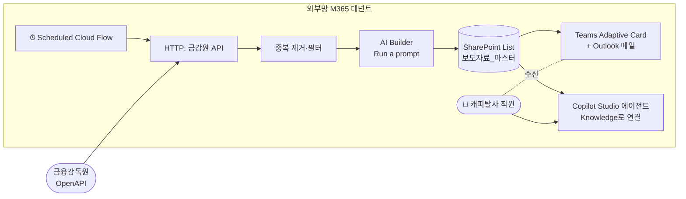
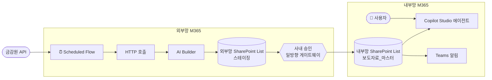

# 금감원 보도자료 캐피탈 안내 에이전트 — 설계서 v1.0

> Power Automate + Copilot Studio 기반 설계 (Azure AI Foundry 사용 안 함).
> 작성일: 2026-06-05 (KST) · 설계 버전: v1.0
> README 페르소나 협업·망분리 결정트리 적용.

---

## 0. 요구사항 요약 (Orchestrator 인테이크)

[Orchestrator] 사용자 요구를 분해합니다.

| 항목 | 정리 |
| --- | --- |
| **목적** | 금감원이 발행하는 보도자료 중 **캐피탈사·여신전문금융업 관련 사항**과 **금융업계 종사자가 반드시 알아야 할 사항**을 사전에 식별·요약·알림 |
| **데이터 소스** | 금감원 보도자료 OpenAPI (사용자가 키 보유) |
| **자동화 빈도** | 영업일 매일 1~2회 (권장: 09:00 / 17:00 KST 2회) |
| **사용자 인터페이스** | ① **자동 푸시**: Teams 채널 Adaptive Card / 이메일 ② **온디맨드 질의**: Copilot Studio 에이전트 (예: "오늘 캐피탈 관련 보도자료 보여줘") |
| **핵심 제약** | Power Automate + Copilot Studio**만** 사용. Azure AI Foundry/Functions 사용 안 함 |
| **README 제약 적용** | 망분리 의사결정 트리 적용. 보도자료는 공개정보이지만 사용자 환경(캐피탈사 사내)에 따라 배치 분기 |

---

## 1. 망 배치 결정 (Architect)

[Architect] README의 §4 결정 로직을 적용합니다.

| 조건 | 본 시스템 |
| --- | --- |
| 외부 API 호출 필요한가? | ✅ 금감원 OpenAPI |
| 개인정보·민감정보 포함? | ❌ 공개 보도자료만 다룸 |
| 내부망 M365 데이터 접근 필요? | ❌ 사용자가 Teams로 결과 수신만 |

→ 두 가지 배치 시나리오 모두 제시. **회사가 어느 시나리오인지 확정 후 채택**.

### 1-1. 시나리오 A — 외부망 M365 단독 (권장 — 간단)



- **장점**: 단일 테넌트, 구성 단순, 모든 컴포넌트 GA
- **적용**: 캐피탈사가 외부망 M365 테넌트를 사용자 업무용으로 운영 중인 경우

### 1-2. 시나리오 B — 외부망 → 내부망 양망 연계 (Type C)

회사 정책상 사용자가 **내부망 M365에서만 Teams/Copilot Studio 사용**하는 경우, 외부망에서 수집·요약 후 승인된 게이트웨이를 통해 내부망 SharePoint List로 전달.



- **장점**: 망분리 정책 준수
- **단점**: 게이트웨이 인프라 별도 구축·승인 필요
- **본 설계서는 시나리오 A를 기본으로 상세화**. 시나리오 B는 §6에서 차이점만 보완.

---

## 2. 컴포넌트 구성 (Developer — 1단계: 데이터 수집·저장)

[Developer] Power Automate 단독으로 모든 자동화를 구현합니다.

### 2-1. SharePoint List 스키마 — `보도자료_마스터`

본 설계의 **단일 진실 공급원(Single Source of Truth)**. Power Automate가 쓰고 Copilot Studio가 읽는다.

| 컬럼명 | 타입 | 설명 | 인덱싱 |
| --- | --- | --- | --- |
| Title | 단일 줄 텍스트 | 보도자료 제목 | ✅ |
| 발표일 | 날짜/시간 | 금감원 발표 일시 (KST) | ✅ |
| 자료번호 | 단일 줄 텍스트 | 금감원 API의 고유 ID (중복 제거 키) | ✅ Unique |
| 원문URL | 하이퍼링크 | 금감원 보도자료 페이지 URL | |
| 첨부URL | 하이퍼링크 | PDF/HWP 첨부 URL | |
| 원문요약_AI | 여러 줄 텍스트 | AI Builder가 생성한 3-5줄 요약 | |
| 핵심키워드 | 여러 줄 텍스트 | AI Builder 추출 키워드 콤마 구분 | |
| 캐피탈_관련도 | 선택 | `높음 / 중간 / 낮음 / 무관` | ✅ |
| 캐피탈_관련사유 | 여러 줄 텍스트 | AI가 산출한 판정 이유 1-2문장 | |
| 업계_필수참고 | 예/아니오 | 캐피탈 무관이어도 금융업 전체가 알아야 하는지 | ✅ |
| 카테고리 | 선택 | `감독·규제 / 검사·제재 / 통계·동향 / 인사·조직 / 기타` | ✅ |
| 처리상태 | 선택 | `신규 / 알림완료 / 검토필요 / 보관` | ✅ |
| 수집시각 | 날짜/시간 | Power Automate가 저장한 시각 | |

> SharePoint List는 Copilot Studio Knowledge에서 **실시간 연결**되며 사용자 SharePoint 권한을 자동 적용. 출처: [Add SharePoint as a knowledge source — SharePoint lists](https://learn.microsoft.com/microsoft-copilot-studio/knowledge-add-sharepoint#add-sharepoint-lists-as-a-knowledge-source)

### 2-2. AI Builder 프롬프트 — `금감원_보도자료_캐피탈_판정`

Power Automate의 **AI Builder > Run a prompt** 액션에서 호출할 커스텀 프롬프트를 미리 만들어둡니다. (Power Automate 좌측 **AI hub > Prompts > New prompt**)

> 2025-05 부터 액션명이 **Run a prompt**로 변경됨 (이전: Create text with GPT using a prompt). 출처: [Use your prompt in Power Automate](https://learn.microsoft.com/ai-builder/use-a-custom-prompt-in-flow)

**프롬프트 정의 (그대로 입력):**

```text
당신은 한국 금융감독원 보도자료 분석 전문가다.
입력으로 받은 보도자료 본문을 읽고 다음을 판정한다.

## 입력 변수
- title : 보도자료 제목 ({title})
- body  : 보도자료 본문 ({body})
- date  : 발표일 ({date})

## 판정 절차
1. 본문을 3-5줄로 요약 (한국어, 평어체).
2. 핵심 키워드 5개 추출 (콤마 구분).
3. 캐피탈사·여신전문금융업과의 관련도를 다음 기준으로 분류:
   - 높음: 여전법, 여전감독규정, 캐피탈/리스/할부금융 직접 언급, 신용공여 한도 등
   - 중간: 가계대출·연체율 같이 캐피탈사가 영향을 받을 수 있는 거시 지표
   - 낮음: 은행·보험·증권 등 타 업권 주요 사안이지만 참조 가치 있음
   - 무관: 캐피탈 업계와 무관
4. 캐피탈 무관이어도 다음에 해당하면 industry_must_read=true:
   - 금융소비자보호법·자금세탁방지·내부통제 등 전 금융업권 공통 규제
   - 금감원 검사·제재 일반 원칙, 임원 결격·해임 권고 사례
5. 카테고리 분류: 감독·규제 / 검사·제재 / 통계·동향 / 인사·조직 / 기타

## 출력 형식 (반드시 JSON, 추가 텍스트 금지)
{
  "summary": "3-5줄 한국어 요약",
  "keywords": ["키워드1","키워드2","키워드3","키워드4","키워드5"],
  "capital_relevance": "높음" | "중간" | "낮음" | "무관",
  "capital_reason": "판정 사유 1-2문장",
  "industry_must_read": true | false,
  "category": "감독·규제" | "검사·제재" | "통계·동향" | "인사·조직" | "기타"
}

## 금지 사항
- 본문에 없는 사실 추측 금지.
- 의역하더라도 사실 왜곡 금지.
- 출력은 반드시 위 JSON 한 객체만. 마크다운 코드 펜스 금지.
```

**프롬프트 입력 파라미터(동적)**: `title`, `body`, `date` 3개를 텍스트로 정의.

> AI Builder Run a prompt는 GPT-4o 또는 GPT-4o mini 기반(Azure OpenAI). 출처: [AI Builder in Power Automate overview](https://learn.microsoft.com/ai-builder/use-in-flow-overview#power-automate-ai-builder-action), [Use your prompt in Power Automate](https://learn.microsoft.com/ai-builder/use-a-custom-prompt-in-flow)

### 2-3. Power Automate Cloud Flow — `금감원_보도자료_일일수집`

타입: **Scheduled cloud flow**. My flows > New flow > **Scheduled cloud flow**.

**Recurrence 설정**:
- Time zone: `(UTC+09:00) Seoul`
- Repeat every: `1 Day`
- At these hours: `9, 17`
- At these minutes: `5`

> 출처: [Run a cloud flow on a schedule](https://learn.microsoft.com/power-automate/run-scheduled-tasks#configure-cloud-flow-triggers-and-actions)

**액션 단계 (순서대로)**:

| # | 액션 | 커넥터 | 설정 요지 |
| --- | --- | --- | --- |
| ① | **Recurrence** | (트리거) | 위 설정 |
| ② | **Get secret** | Azure Key Vault (또는 환경 변수) | 금감원 API 키 보관 (코드에 키 평문 금지) |
| ③ | **HTTP** (Premium) | HTTP | `GET {금감원_API_엔드포인트}?serviceKey=@{outputs('Get_secret')?['value']}&startDate=@{addDays(utcNow(),-1)}` 등 사용자가 받은 API 명세에 맞춰 작성. 응답 200 가정 |
| ④ | **Parse JSON** | Data Operation | ③ 응답 스키마 정의 → 항목 리스트 추출 |
| ⑤ | **Apply to each** | (제어) | 항목 리스트 반복 |
| ⑤-1 | **Get items** | SharePoint | `보도자료_마스터`에서 `자료번호 eq '<현재 항목 ID>'` 필터로 조회 (중복 체크) |
| ⑤-2 | **Condition** | (제어) | `length(body('Get_items')?['value'])` = 0 (신규일 때만 진행) |
| ⑤-3 (true) | **Run a prompt** | AI Builder | 프롬프트: `금감원_보도자료_캐피탈_판정`. 파라미터: title=item.title, body=item.body, date=item.date |
| ⑤-4 | **Parse JSON** | Data Operation | ⑤-3의 텍스트 응답을 JSON으로 파싱 (스키마 §2-2의 출력 형식) |
| ⑤-5 | **Create item** | SharePoint | `보도자료_마스터`에 항목 생성: 위 §2-1 컬럼 매핑 (처리상태=`신규`, 수집시각=`utcNow()`) |
| ⑤-6 | **Condition** | (제어) | `or(equals(capital_relevance,'높음'), equals(industry_must_read, true))` |
| ⑤-7 (true) | **Post adaptive card** | Microsoft Teams | 채널 `금감원-보도자료-알림`에 Adaptive Card 발송 (§2-4 카드 JSON) |
| ⑤-8 | **Update item** | SharePoint | 알림 발송한 항목의 `처리상태`=`알림완료` |
| ⑥ | **Send an email (V2)** | Office 365 Outlook | (선택) `높음` 등급만 모은 일일 다이제스트를 컴플라이언스 메일그룹에 발송 |
| ⑦ | **Configure run after** (오류 처리) | 각 액션 | HTTP/AI Builder/SharePoint에 대해 `has failed` 분기 → Teams에 운영자 알림 + Try-Catch 패턴 |

> Premium 라이선스 필요: HTTP, SharePoint 일부 액션, AI Builder. 출처: [Cloud flow error code reference — Licensing errors](https://learn.microsoft.com/power-automate/error-reference#licensing-errors)

### 2-4. Teams Adaptive Card 본문 (Post adaptive card 액션의 Message)

```json
{
  "type": "AdaptiveCard",
  "$schema": "http://adaptivecards.io/schemas/adaptive-card.json",
  "version": "1.5",
  "body": [
    {
      "type": "TextBlock",
      "size": "Medium",
      "weight": "Bolder",
      "text": "📢 금감원 보도자료 — 캐피탈 관련 신규"
    },
    {
      "type": "TextBlock",
      "wrap": true,
      "weight": "Bolder",
      "text": "@{items('Apply_to_each')?['title']}"
    },
    {
      "type": "FactSet",
      "facts": [
        { "title": "발표일", "value": "@{items('Apply_to_each')?['date']}" },
        { "title": "캐피탈 관련도", "value": "@{body('Parse_JSON_2')?['capital_relevance']}" },
        { "title": "카테고리", "value": "@{body('Parse_JSON_2')?['category']}" },
        { "title": "업계 필수참고", "value": "@{if(body('Parse_JSON_2')?['industry_must_read'],'예','아니오')}" }
      ]
    },
    {
      "type": "TextBlock",
      "wrap": true,
      "text": "**요약**: @{body('Parse_JSON_2')?['summary']}"
    },
    {
      "type": "TextBlock",
      "wrap": true,
      "text": "**판정사유**: @{body('Parse_JSON_2')?['capital_reason']}"
    }
  ],
  "actions": [
    { "type": "Action.OpenUrl", "title": "원문 보기", "url": "@{items('Apply_to_each')?['originalUrl']}" },
    { "type": "Action.OpenUrl", "title": "SharePoint 등록 보기", "url": "@{outputs('Create_item')?['body/{Link}']}" }
  ]
}
```

---

## 3. Copilot Studio 에이전트 (Developer — 2단계: 사용자 인터페이스)

[Developer] 동일한 SharePoint List를 자연어 인터페이스로 노출합니다.

### 3-1. 에이전트 생성

1. Copilot Studio 포털 → **Agents** → **New agent** → **Skip to configure**
2. 이름: `금감원-보도자료-안내`
3. 설명: `금감원 보도자료 중 캐피탈사·여신전문금융업 관련 사항을 안내합니다.`

### 3-2. Knowledge 연결 — SharePoint List (실시간)

1. 에이전트 상세 → **Knowledge** 탭 → **+ Add knowledge**
2. **Upload file** 섹션의 **SharePoint** 선택
3. **Browse items** 또는 URL 입력으로 `보도자료_마스터` 리스트 선택
4. **Name**: `보도자료_마스터`
5. **Description** (이 부분이 매우 중요 — 생성형 라우팅에서 사용):
   ```
   금감원이 발표한 보도자료를 누적 저장한 마스터 리스트.
   캐피탈_관련도, 업계_필수참고, 카테고리, 원문요약_AI, 핵심키워드,
   발표일 컬럼을 가진다. 사용자가 "최근 캐피탈 관련 보도자료",
   "오늘 검사·제재", "여전법 관련", "이번주 업계 필수 자료" 같은
   질문을 하면 이 리스트에서 필터링하여 답변하라.
   ```
6. **Add to agent**

> SharePoint List를 Knowledge로 연결하면 사용자 SharePoint 권한을 자동 적용하여 RAG처럼 동작. 출처: [Add SharePoint as a knowledge source — SharePoint lists](https://learn.microsoft.com/microsoft-copilot-studio/knowledge-add-sharepoint#add-sharepoint-lists-as-a-knowledge-source)

### 3-3. 인증 설정

- 좌측 **Settings → Security → Authentication** → **Authenticate with Microsoft** 선택
- SharePoint 스코프(`Sites.Read.All`, `Files.Read.All`)는 자동 처리 (Teams/Power Apps/M365 Copilot 채널 사용 시)
- 출처: [Add SharePoint as a knowledge source — Advanced authentication](https://learn.microsoft.com/microsoft-copilot-studio/knowledge-add-sharepoint#advanced-authentication-scenarios)

### 3-4. 토픽 1 — `최근_캐피탈_보도자료` (대표 토픽)

1. **Topics** → **+ Add a topic** → **Create from blank**
2. **Trigger phrases** (예시):
   - 오늘 캐피탈 관련 보도자료 알려줘
   - 이번주 여전업 관련
   - 캐피탈 검사·제재 사례
   - 캐피탈사 관련 신규 자료
3. **Add node** → **Send a message** (인사) → **"최근 캐피탈 관련 보도자료를 찾아드리겠습니다."**
4. **Add node** → **Generative answers** (Boost) 추가
   - **Data sources** → **Edit** → **Search only selected sources** ON
   - 위 §3-2에서 등록한 `보도자료_마스터` 선택
5. **Input** 칸에 사용자 발화 변수 `bot.UnrecognizedTriggerPhrase` 또는 `System.Activity.Text` 사용
6. **Save**

> 토픽 레벨의 Knowledge가 에이전트 레벨 Knowledge보다 우선. 정확도가 중요하면 토픽에서도 명시. 출처: [Use generative answers in a topic](https://learn.microsoft.com/microsoft-copilot-studio/nlu-boost-node), [Use SharePoint content for generative answers](https://learn.microsoft.com/microsoft-copilot-studio/nlu-generative-answers-sharepoint-onedrive#use-sharepoint-in-a-generative-answers-node)

### 3-5. 토픽 2 — `금감원_재조회_요청` (실시간 갱신)

사용자가 "지금 다시 조회해줘" 라고 하면 Power Automate flow를 즉시 실행. (스케줄 외에 수동 트리거 제공)

#### 사전 작업: Power Automate에 **Instant cloud flow** 1개 추가
- 트리거: **When Copilot Studio calls a flow** ("Run a flow from Copilot")
- 액션: §2-3의 `금감원_보도자료_일일수집`을 **Child flow**로 실행
- 마지막 액션: **Respond to Copilot** → `{ "result": "<수집된 신규 건수>건 추가" }`

#### Copilot Studio 토픽 구성
1. **+ Add a topic** → 트리거 발화: "지금 다시 조회해줘", "방금 올라온 거 있어?"
2. **Send message**: "금감원 사이트에서 최신 보도자료를 가져오는 중입니다..."
3. **Call an action** → 위 instant flow 선택 → flow의 응답 변수 `result`를 Bot 변수에 매핑
4. **Send message**: `"@{result} 신규 자료가 등록되었습니다. SharePoint 리스트에서 확인하시거나 '오늘 캐피탈 관련 보도자료'라고 물어보세요."`

> Copilot Studio에서 flow 호출 방법: 토픽 노드에서 **Call an action** → 등록된 flow 선택. flow는 **Run a flow from Copilot** 트리거 + **Respond to Copilot** 액션으로 작성. 출처: [Use Power Automate and Copilot Studio — Build the custom agent](https://learn.microsoft.com/power-platform/guidance/case-studies/boost-efficiency-experience-case-study#use-power-automate-and-copilot-studio-to-create-a-travel-policy), [Copilot Studio overview — What is a flow](https://learn.microsoft.com/microsoft-copilot-studio/fundamentals-what-is-copilot-studio#what-is-a-flow)

### 3-6. 토픽 3 — `특정_키워드_검색`

사용자 발화 예: "여신금융협회 관련 자료 있어?", "내부통제 보도자료 찾아줘"

1. **+ Add a topic** → 트리거: "찾아줘", "검색해줘", "관련 자료"
2. **Ask a question**: "어떤 키워드로 검색하시겠어요?" → 사용자 응답 변수 `userKeyword`
3. **Generative answers** 노드: 입력에 `userKeyword` 사용, 데이터 소스 `보도자료_마스터`
4. **Send message**: Adaptive Card로 결과 정리

### 3-7. 게시(Publish)

- 좌측 **Channels** → **Microsoft Teams** 활성화 → **Publish**
- 사내 사용자에게 Teams 채널에서 봇 추가 안내

---

## 4. 보안·컴플라이언스 검토 (Security)

[Security] 본 시스템은 **외부 공개 보도자료만** 다루므로 개인정보 노출 위험은 낮지만, 금융업 운영 시 다음을 점검합니다.

| # | 점검 항목 | 상태 | 권고 |
| --- | --- | --- | --- |
| S1 | API 키 보관 | ⚠️ 필수 | **Azure Key Vault** + Power Automate의 **Get secret** 액션으로만 접근. flow 내 평문 금지 |
| S2 | HTTP 커넥터 IP | ℹ️ | 금감원 API 측에서 IP 화이트리스트 요구 시 **Power Automate IP 대역** 등록 — [Power Automate IP 주소 구성](https://learn.microsoft.com/power-automate/ip-address-configuration) |
| S3 | SharePoint 권한 | ✅ 필수 | `보도자료_마스터` List 접근권은 **Read=금융업 직원그룹**, **Write=Power Automate 서비스 계정만**. 사용자 직접 편집 금지 |
| S4 | Copilot Studio 인증 | ✅ 필수 | **Authenticate with Microsoft** 활성화 → 사용자별 SharePoint 권한 자동 적용 (열람 권한 없는 자료는 봇이 답변 못 함) |
| S5 | 운영자 알림 | ✅ 권장 | flow 실패 시 Teams DM → 운영자. **Configure run after** 분기 사용 |
| S6 | AI 환각 위험 | ⚠️ | 프롬프트 §2-2의 "본문에 없는 사실 추측 금지" 조항으로 1차 방어. **샘플 30건 수동 검증** 후 운영 시작 |
| S7 | 망분리 | ▣ 조건부 | 시나리오 A이면 외부망 단독 OK. 시나리오 B면 §6 양망 분리 필수 |
| S8 | 보존 기간 | ✅ | SharePoint List `처리상태=보관` 자동 이관 정책 (예: 발표일+2년 후) — Power Automate Scheduled flow로 분기별 정리 |
| S9 | 감사 로그 | ✅ | Power Platform Center 의 **flow run history** + SharePoint List 의 **버전 기록** 보존 |

[Security 거부권 행사 없음] 본 설계는 망분리·개인정보 관점에서 통과. 단 S1·S3·S4·S6은 구현 전 필수 적용.

---

## 5. 산출물 정리 (Documentation)

[Documentation] 본 설계의 인도 산출물 4종.

| # | 산출물 | 위치 |
| --- | --- | --- |
| 1 | 본 설계서 (.md) | `/docs/designs/20260605_금감원_보도자료_캐피탈_안내_에이전트.md` |
| 2 | SharePoint List 스키마 정의 (.xlsx 권장) | `/docs/designs/assets/sharepoint_list_schema.xlsx` (구현 단계에서 생성) |
| 3 | Power Automate flow 두 개의 export (`.zip` Solution) | `/docs/designs/assets/flows/` |
| 4 | Copilot Studio 에이전트 export (`.zip` Solution) | `/docs/designs/assets/copilot/` |

---

## 6. 시나리오 B(양망) 차이점 — 보강 (Architect + Security)

[Architect] [Security] 시나리오 B 채택 시 다음만 변경.

| 항목 | 변경 |
| --- | --- |
| 외부망 측 SharePoint | 스테이징 전용. 보존 1일 (수집 후 게이트웨이 전달 즉시 삭제 가능) |
| 게이트웨이 | 사내 승인된 **일방향 전송 장비** 또는 별도 SFTP 경유. Power Automate가 직접 내부망에 쓰지 못함 |
| 내부망 측 적재 | 게이트웨이 → 내부망 SharePoint **온프레미스 Data Gateway** 경유 → `Create item` 액션은 **내부망 Power Automate** 환경에서 실행 |
| Copilot Studio | 내부망 M365 테넌트에서 게시 |
| AI Builder | 내부망 환경에 AI Builder add-on 라이선스 확인 필요 |
| 추가 위험 | 게이트웨이 운영 SLA, 양망 시점 동기화 지연 (실시간 알림 SLA 완화 필요) |

---

## 7. 구현 체크리스트 (Developer)

[Developer] 1주 안에 PoC 가능.

| Day | 작업 | 산출 |
| --- | --- | --- |
| 1 | Azure Key Vault에 금감원 API 키 저장 + Power Automate 환경에 Key Vault 커넥션 등록 + SharePoint Site/List 생성 (§2-1 스키마) | List GA |
| 2 | AI Builder 프롬프트 `금감원_보도자료_캐피탈_판정` 생성·테스트 (샘플 5건) | 프롬프트 검증 통과 |
| 3 | Scheduled cloud flow `금감원_보도자료_일일수집` 작성 (§2-3 7단계) → 수동 테스트로 SharePoint 등록 + Adaptive Card 발송 확인 | flow GA |
| 4 | Copilot Studio 에이전트 생성, SharePoint List Knowledge 연결, 토픽 3종(§3-4~6) 작성 | 봇 PoC |
| 5 | Instant flow `금감원_실시간_재조회`(§3-5) + `Respond to Copilot` 연동 테스트 | 인터랙티브 동작 |
| 6 | Teams 채널에 봇 게시, 사용자 5명 UAT, 샘플 30건 정확도 검증 | UAT 통과 |
| 7 | 오류 처리 (Configure run after) 보강, Solution export 산출 | 운영 이관 |

---

## 8. 합의 (Orchestrator 종합)

[Orchestrator] 페르소나 의견을 종합합니다.

- [Architect] 시나리오 A를 기본으로 채택하되, 사용자 환경 확인 후 B로 전환 가능한 구조로 설계됨.
- [Developer] Power Automate 1개 Scheduled flow + 1개 Instant flow, Copilot Studio 1개 에이전트로 완성. 코드 작성 없음.
- [Security] S1·S3·S4·S6 4개 항목 필수 적용. 망분리 시나리오 B 필요 시 게이트웨이 별도 승인.
- [Documentation] 본 설계서를 `docs/designs/20260605_금감원_보도자료_캐피탈_안내_에이전트.md`로 저장. 구현 단계 산출물 3종은 PoC 시 생성.

**✅ 합의 완료. 본 설계로 구현 진행 권고.**

---

## 9. 검증 출처 (Microsoft Learn 1차 문서)

1. [Run a cloud flow on a schedule](https://learn.microsoft.com/power-automate/run-scheduled-tasks) — Scheduled cloud flow, Recurrence, timezone 설정
2. [Create your first cloud flow without Copilot](https://learn.microsoft.com/power-automate/create-cloud-flow-without-copilot) — Cloud flow 3 타입
3. [Use your prompt in Power Automate](https://learn.microsoft.com/ai-builder/use-a-custom-prompt-in-flow) — Run a prompt 액션 (구 Create text with GPT using a prompt, 2025-05 이름 변경)
4. [AI Builder in Power Automate overview](https://learn.microsoft.com/ai-builder/use-in-flow-overview#power-automate-ai-builder-action) — Run a prompt = GPT-4o/4o mini 기반
5. [Add SharePoint as a knowledge source](https://learn.microsoft.com/microsoft-copilot-studio/knowledge-add-sharepoint) — SharePoint List를 Copilot Studio Knowledge로 연결, 실시간, 최대 15개
6. [Use SharePoint content for generative answers](https://learn.microsoft.com/microsoft-copilot-studio/nlu-generative-answers-sharepoint-onedrive) — generative answers 노드에서 SharePoint 사용
7. [Copilot Studio overview — What is a flow](https://learn.microsoft.com/microsoft-copilot-studio/fundamentals-what-is-copilot-studio#what-is-a-flow) — Copilot Studio가 flow를 도구로 호출
8. [Use Power Automate and Copilot Studio — case study](https://learn.microsoft.com/power-platform/guidance/case-studies/boost-efficiency-experience-case-study) — Run a flow from Copilot 트리거 + Respond to Copilot 액션 패턴
9. [Knowledge sources summary](https://learn.microsoft.com/microsoft-copilot-studio/knowledge-copilot-studio#supported-knowledge-sources) — Knowledge 소스 비교
10. [Fix connection failures in cloud flows — HTTP/Custom connectors](https://learn.microsoft.com/power-automate/fix-connection-failures#top-five-5-connection-issues-by-connector) — API 키 만료·IP 허용 관리

---

## 10. 변경 이력

| 버전 | 일자 | 내용 |
| --- | --- | --- |
| v1.0 | 2026-06-05 | 최초 작성. Power Automate Scheduled cloud flow + AI Builder Run a prompt + SharePoint List + Copilot Studio 에이전트 조합. README 페르소나 협업 형식과 망분리 결정트리 적용. |
