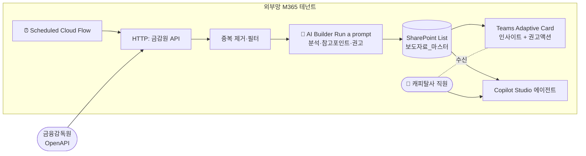

# 금감원 보도자료 캐피탈 안내 에이전트 — 설계서 v1.1

> Power Automate + Copilot Studio 기반 설계 (Azure AI Foundry 사용 안 함).
> 작성일: 2026-06-05 (KST) · 설계 버전: **v1.1**
> README 페르소나 협업·망분리 결정트리 적용.
> **v1.1 핵심**: AI가 단순 "분류·요약"하는 것이 아니라 **"어떤 부분을 참고해야 하는지, 업무에 어떤 영향이 있는지, 무엇을 해야 하는지"를 분석·안내**하도록 전면 강화.

---

## 0. 요구사항 요약 (Orchestrator 인테이크)

[Orchestrator] 사용자 요구를 분해합니다.

| 항목 | 정리 |
| --- | --- |
| **목적** | 금감원이 발행하는 보도자료 중 **캐피탈사·여신전문금융업 관련 사항**과 **금융업계 종사자가 반드시 알아야 할 사항**을 사전에 식별 + **AI가 분석하여 "어떤 부분을 참고·검토해야 하는지" 안내** |
| **데이터 소스** | 금감원 보도자료 OpenAPI (사용자가 키 보유) |
| **자동화 빈도** | 영업일 매일 1~2회 (권장: 09:00 / 17:00 KST 2회) |
| **사용자 인터페이스** | ① **자동 푸시**: Teams 채널 Adaptive Card / 이메일 ② **온디맨드 질의**: Copilot Studio 에이전트 (예: "오늘 캐피탈 관련 보도자료 보여줘", "이 자료에서 우리가 검토해야 할 포인트는?") |
| **AI 분석 깊이** | 분류·요약에 더해 **참고 포인트(3-5개)·업무 영향·권고 액션·관련 부서·긴급도** 산출 |
| **핵심 제약** | Power Automate + Copilot Studio**만** 사용. Azure AI Foundry/Functions 사용 안 함 |
| **README 제약 적용** | 망분리 의사결정 트리 적용. 보도자료는 공개정보이지만 사용자 환경(캐피탈사 사내)에 따라 배치 분기 |

---

## 1. 망 배치 결정 (Architect)

[Architect] README의 §4 결정 로직을 적용합니다.

| 조건 | 본 시스템 |
| --- | --- |
| 외부 API 호출 필요한가? | ✅ 금감원 OpenAPI |
| 개인정보·민감정보 포함? | ❌ 공개 보도자료만 다룸 |
| 내부망 M365 데이터 접근 필요? | ❌ 사용자가 Teams로 결과 수신만 |

→ 두 가지 배치 시나리오 모두 제시.

### 1-1. 시나리오 A — 외부망 M365 단독 (권장 — 간단)



### 1-2. 시나리오 B — 외부망 → 내부망 양망 연계 (Type C)

자세한 내용은 §6 참조.

---

## 2. 컴포넌트 구성 (Developer — 1단계: 데이터 수집·**분석**·저장)

### 2-1. SharePoint List 스키마 — `보도자료_마스터` (v1.1 분석 컬럼 확장)

본 설계의 **단일 진실 공급원(Single Source of Truth)**. Power Automate가 쓰고 Copilot Studio가 읽는다.

| 컬럼명 | 타입 | 설명 | 인덱싱 |
| --- | --- | --- | --- |
| Title | 단일 줄 텍스트 | 보도자료 제목 | ✅ |
| 발표일 | 날짜/시간 | 금감원 발표 일시 (KST) | ✅ |
| 자료번호 | 단일 줄 텍스트 | 금감원 API의 고유 ID (중복 제거 키) | ✅ Unique |
| 원문URL | 하이퍼링크 | 금감원 보도자료 페이지 URL | |
| 첨부URL | 하이퍼링크 | PDF/HWP 첨부 URL | |
| 원문요약_AI | 여러 줄 텍스트 | AI가 생성한 3-5줄 요약 | |
| **참고포인트_AI** ⭐ | 여러 줄 텍스트 | **AI가 분석한 "캐피탈사 직원이 반드시 확인해야 할 핵심 3-5개"** (불릿) | |
| **업무영향분석_AI** ⭐ | 여러 줄 텍스트 | **AI가 분석한 "우리 업무에 어떤 영향이 있는지" (리스크/영업/심사/시스템 등 관점)** | |
| **권고액션_AI** ⭐ | 여러 줄 텍스트 | **AI가 산출한 "지금 또는 ○일 내 해야 할 일" 액션 목록** | |
| **관련부서_AI** ⭐ | 다중 선택 | `리스크관리 / 컴플라이언스 / 여신심사 / 영업기획 / 정보보호 / IT시스템 / 인사 / 재무` | ✅ |
| **긴급도_AI** ⭐ | 선택 | `즉시(D+1) / 이번주(D+7) / 이번달(D+30) / 참고` | ✅ |
| 핵심키워드 | 여러 줄 텍스트 | AI Builder 추출 키워드 콤마 구분 | |
| 캐피탈_관련도 | 선택 | `높음 / 중간 / 낮음 / 무관` | ✅ |
| 캐피탈_관련사유 | 여러 줄 텍스트 | AI가 산출한 판정 이유 1-2문장 | |
| 업계_필수참고 | 예/아니오 | 캐피탈 무관이어도 금융업 전체가 알아야 하는지 | ✅ |
| 카테고리 | 선택 | `감독·규제 / 검사·제재 / 통계·동향 / 인사·조직 / 기타` | ✅ |
| 처리상태 | 선택 | `신규 / 알림완료 / 검토필요 / 보관` | ✅ |
| 수집시각 | 날짜/시간 | Power Automate가 저장한 시각 | |

⭐ = **v1.1에서 추가된 AI 분석·안내 핵심 컬럼**

> SharePoint List는 Copilot Studio Knowledge에서 **실시간 연결**되며 사용자 SharePoint 권한을 자동 적용. 출처: [Add SharePoint as a knowledge source — SharePoint lists](https://learn.microsoft.com/microsoft-copilot-studio/knowledge-add-sharepoint#add-sharepoint-lists-as-a-knowledge-source)

---

### 2-2. AI Builder 프롬프트 — `금감원_보도자료_캐피탈_분석안내` ⭐ (v1.1 핵심 강화)

Power Automate의 **AI Builder > Run a prompt** 액션이 호출할 커스텀 프롬프트. **단순 분류·요약이 아니라 "분석가의 시각으로 참고 포인트·업무 영향·권고 액션을 제시"** 하도록 설계.

> 2025-05 부터 액션명이 **Run a prompt**로 변경됨 (이전: Create text with GPT using a prompt). 출처: [Use your prompt in Power Automate](https://learn.microsoft.com/ai-builder/use-a-custom-prompt-in-flow)

**프롬프트 정의 (그대로 입력):**

```text
당신은 한국 캐피탈사(여신전문금융업)의 컴플라이언스·리스크 분석가다.
금융감독원이 발표한 보도자료를 받아 "단순 요약"이 아니라 "우리 회사 직원이
무엇을 어떻게 참고해야 하는지"를 분석하여 제시한다.

## 입력 변수
- title : 보도자료 제목 ({title})
- body  : 보도자료 본문 ({body})
- date  : 발표일 ({date})

## 작성 페르소나
당신은 다음 부서들의 합산 시야로 분석한다:
- 리스크관리: 신용리스크·운영리스크·시장리스크 영향
- 컴플라이언스: 신규 의무·금지·과태료·내부통제 요건
- 여신심사: 한도·심사기준·담보·연체 관리 영향
- 영업기획: 상품 라인업·금리·고객군 영향
- 정보보호·IT: 보안·전산사고·시스템 변경 요건
- 인사/재무: 임원 결격·자본·회계 영향

## 분석 절차
1. 본문을 3-5줄로 정확히 요약 (한국어, 평어체, 사실만).
2. 핵심 키워드 5개 추출.
3. 캐피탈 관련도 판정 (높음/중간/낮음/무관) + 판정 사유.
4. 캐피탈 무관이어도 다음에 해당하면 industry_must_read=true:
   - 금융소비자보호법·자금세탁방지·내부통제 등 전 금융업권 공통 규제
   - 금감원 검사·제재 일반 원칙, 임원 결격·해임 권고 사례
5. 카테고리 분류: 감독·규제 / 검사·제재 / 통계·동향 / 인사·조직 / 기타
6. ⭐ 참고 포인트 (key_points_to_review):
   "캐피탈사 직원이 본문에서 반드시 확인해야 할 핵심 포인트"를 3-5개 불릿으로 추출.
   각 포인트는:
   - 본문 어느 부분에서 도출했는지 짧게 인용
   - 왜 우리가 봐야 하는지 한 문장 이유
   형식: "✓ <확인할 사항>: <왜 봐야 하는지 1줄> (본문 발췌: '...')"
7. ⭐ 업무 영향 분석 (business_impact):
   부서별로 어떤 영향이 있는지 분석. 영향 없는 부서는 생략.
   형식: { "부서명": "구체적 영향 1-2문장" }
8. ⭐ 권고 액션 (recommended_actions):
   지금 또는 ○일 내 해야 할 일을 3-5개 액션 아이템으로 제시.
   각 액션은:
   - 누가(담당 부서)
   - 무엇을(액션)
   - 언제까지(D+1 / D+7 / D+30)
   형식: { "owner":"부서", "action":"...", "due":"D+7" }
9. ⭐ 관련 부서 (target_departments):
   위 영향·액션에서 등장한 부서를 중복 없이 배열로.
10. ⭐ 긴급도 (urgency):
    - "즉시": 신규 의무가 즉시 시행되거나 검사·제재 대응 필요
    - "이번주": 단기 검토·내부 회의·시스템 점검 필요
    - "이번달": 정책·절차 개정, 교육 필요
    - "참고": 추세·통계 등 모니터링 수준

## 출력 형식 (반드시 JSON 단일 객체, 추가 텍스트·마크다운 펜스 금지)
{
  "summary": "3-5줄 요약",
  "keywords": ["키1","키2","키3","키4","키5"],
  "capital_relevance": "높음" | "중간" | "낮음" | "무관",
  "capital_reason": "판정 사유 1-2문장",
  "industry_must_read": true | false,
  "category": "감독·규제" | "검사·제재" | "통계·동향" | "인사·조직" | "기타",
  "key_points_to_review": [
    "✓ <확인할 사항>: <왜 봐야 하는지> (본문 발췌: '...')",
    "✓ ...",
    "✓ ..."
  ],
  "business_impact": {
    "리스크관리": "구체적 영향 또는 생략",
    "컴플라이언스": "...",
    "여신심사": "...",
    "영업기획": "...",
    "정보보호·IT": "...",
    "인사·재무": "..."
  },
  "recommended_actions": [
    { "owner": "컴플라이언스", "action": "내부 규정 ○○ 조항 검토 및 개정안 작성", "due": "D+7" },
    { "owner": "여신심사", "action": "신규 한도 기준 시뮬레이션", "due": "D+30" }
  ],
  "target_departments": ["컴플라이언스","리스크관리","여신심사"],
  "urgency": "즉시" | "이번주" | "이번달" | "참고"
}

## 절대 금지
- 본문에 없는 사실·수치·일자 추측 금지.
- 의역하더라도 사실 왜곡 금지.
- 권고 액션에 "추가 검토 필요" 같은 공허한 문구 금지 — 구체적 작업으로 작성.
- 출력은 반드시 위 JSON 단일 객체만. 마크다운 코드 펜스(```) 금지.
- 영향 없는 부서는 business_impact에서 키 자체를 생략 (빈 문자열 금지).
```

**프롬프트 입력 파라미터(동적)**: `title`, `body`, `date` 3개를 텍스트로 정의.

> AI Builder Run a prompt는 GPT-4o 또는 GPT-4o mini 기반. 위와 같은 구조화 분석에는 **GPT-4o** 권장(긴 출력·정확도). 출처: [AI Builder in Power Automate overview](https://learn.microsoft.com/ai-builder/use-in-flow-overview#power-automate-ai-builder-action)

---

### 2-3. Power Automate Cloud Flow — `금감원_보도자료_일일수집_분석`

타입: **Scheduled cloud flow**. My flows > New flow > **Scheduled cloud flow**.

**Recurrence 설정**:
- Time zone: `(UTC+09:00) Seoul`
- Repeat every: `1 Day`
- At these hours: `9, 17`
- At these minutes: `5`

> 출처: [Run a cloud flow on a schedule](https://learn.microsoft.com/power-automate/run-scheduled-tasks#configure-cloud-flow-triggers-and-actions)

**액션 단계 (순서대로)**:

| # | 액션 | 커넥터 | 설정 요지 |
| --- | --- | --- | --- |
| ① | **Recurrence** | (트리거) | 위 설정 |
| ② | **Get secret** | Azure Key Vault | 금감원 API 키 보관 (코드에 키 평문 금지) |
| ③ | **HTTP** (Premium) | HTTP | `GET {금감원_API_엔드포인트}?serviceKey=@{outputs('Get_secret')?['value']}&startDate=@{formatDateTime(addDays(utcNow(),-1),'yyyyMMdd')}` 사용자 API 명세에 맞춰 작성 |
| ④ | **Parse JSON** | Data Operation | ③ 응답 스키마 정의 |
| ⑤ | **Apply to each** | (제어) | 항목 리스트 반복 |
| ⑤-1 | **Get items** | SharePoint | `자료번호 eq '<현재 ID>'` 필터 (중복 체크) |
| ⑤-2 | **Condition** | (제어) | `length(body('Get_items')?['value'])` = 0 (신규일 때만 진행) |
| ⑤-3 (true) | **Run a prompt** ⭐ | AI Builder | **프롬프트: `금감원_보도자료_캐피탈_분석안내`** (§2-2 v1.1). 파라미터: title=item.title, body=item.body, date=item.date |
| ⑤-4 | **Parse JSON** | Data Operation | ⑤-3의 응답을 v1.1 JSON 스키마로 파싱 (참고포인트·업무영향·권고액션 포함) |
| ⑤-5 | **Compose — 참고포인트 텍스트화** | Data Operation | `join(body('Parse_JSON_2')?['key_points_to_review'], decodeUriComponent('%0A'))` — 불릿 배열을 줄바꿈 텍스트로 |
| ⑤-6 | **Compose — 업무영향 텍스트화** | Data Operation | `business_impact` 객체를 "부서: 영향" 줄바꿈 텍스트로 변환 (expressions 사용) |
| ⑤-7 | **Compose — 권고액션 텍스트화** | Data Operation | `recommended_actions` 배열을 "[D+7] 컴플라이언스: ..." 줄바꿈 텍스트로 |
| ⑤-8 | **Create item** | SharePoint | `보도자료_마스터`에 항목 생성: §2-1 모든 컬럼 매핑 (⭐ 5개 컬럼 포함, 처리상태=`신규`) |
| ⑤-9 | **Condition** | (제어) | `or(equals(capital_relevance,'높음'), equals(industry_must_read, true), equals(urgency,'즉시'))` |
| ⑤-10 (true) | **Post adaptive card** | Microsoft Teams | 채널 `금감원-보도자료-알림`에 Adaptive Card 발송 (§2-4 v1.1 카드) |
| ⑤-11 | **Update item** | SharePoint | `처리상태`=`알림완료` |
| ⑥ | **Filter array (긴급도=즉시)** + **Send an email (V2)** | Office 365 Outlook | (선택) 즉시 등급 다이제스트를 경영진·컴플라이언스 메일그룹에 추가 발송 |
| ⑦ | **Configure run after** (오류 처리) | 각 액션 | HTTP/AI Builder/SharePoint에 대해 `has failed` 분기 → Teams DM 운영자 알림 |

> Premium 라이선스 필요: HTTP, SharePoint 일부 액션, AI Builder. 출처: [Cloud flow error code reference — Licensing errors](https://learn.microsoft.com/power-automate/error-reference#licensing-errors)

---

### 2-4. Teams Adaptive Card 본문 (v1.1 — 인사이트·권고 영역 추가)

```json
{
  "type": "AdaptiveCard",
  "$schema": "http://adaptivecards.io/schemas/adaptive-card.json",
  "version": "1.5",
  "body": [
    {
      "type": "TextBlock",
      "size": "Medium",
      "weight": "Bolder",
      "text": "📢 금감원 보도자료 — AI 분석 안내",
      "color": "Accent"
    },
    {
      "type": "TextBlock",
      "wrap": true,
      "weight": "Bolder",
      "size": "Default",
      "text": "@{items('Apply_to_each')?['title']}"
    },
    {
      "type": "FactSet",
      "facts": [
        { "title": "📅 발표일", "value": "@{items('Apply_to_each')?['date']}" },
        { "title": "🎯 캐피탈 관련도", "value": "@{body('Parse_JSON_2')?['capital_relevance']}" },
        { "title": "🚨 긴급도", "value": "@{body('Parse_JSON_2')?['urgency']}" },
        { "title": "🏷 카테고리", "value": "@{body('Parse_JSON_2')?['category']}" },
        { "title": "🏢 관련 부서", "value": "@{join(body('Parse_JSON_2')?['target_departments'], ', ')}" }
      ]
    },
    {
      "type": "TextBlock",
      "wrap": true,
      "weight": "Bolder",
      "text": "📝 요약",
      "color": "Accent",
      "spacing": "Medium"
    },
    {
      "type": "TextBlock",
      "wrap": true,
      "text": "@{body('Parse_JSON_2')?['summary']}"
    },
    {
      "type": "TextBlock",
      "wrap": true,
      "weight": "Bolder",
      "text": "🔍 우리가 봐야 할 핵심 포인트",
      "color": "Accent",
      "spacing": "Medium"
    },
    {
      "type": "TextBlock",
      "wrap": true,
      "text": "@{outputs('Compose_참고포인트_텍스트화')}"
    },
    {
      "type": "TextBlock",
      "wrap": true,
      "weight": "Bolder",
      "text": "💼 부서별 업무 영향",
      "color": "Accent",
      "spacing": "Medium"
    },
    {
      "type": "TextBlock",
      "wrap": true,
      "text": "@{outputs('Compose_업무영향_텍스트화')}"
    },
    {
      "type": "TextBlock",
      "wrap": true,
      "weight": "Bolder",
      "text": "✅ 권고 액션",
      "color": "Good",
      "spacing": "Medium"
    },
    {
      "type": "TextBlock",
      "wrap": true,
      "text": "@{outputs('Compose_권고액션_텍스트화')}"
    }
  ],
  "actions": [
    { "type": "Action.OpenUrl", "title": "📄 원문 보기", "url": "@{items('Apply_to_each')?['originalUrl']}" },
    { "type": "Action.OpenUrl", "title": "📌 SharePoint 등록", "url": "@{outputs('Create_item')?['body/{Link}']}" },
    { "type": "Action.OpenUrl", "title": "💬 봇에게 추가 분석 요청", "url": "https://teams.microsoft.com/l/chat/0/0?users=28:<bot-id>&message=자료번호 @{items('Apply_to_each')?['id']} 자세히 분석해줘" }
  ]
}
```

핵심 변경: **요약 → 핵심 포인트 → 부서별 영향 → 권고 액션** 4단 구조로 사용자가 "왜 봐야 하는지·뭘 해야 하는지"를 한눈에 파악.

---

## 3. Copilot Studio 에이전트 (Developer — 2단계: 사용자 인터페이스)

### 3-1. 에이전트 생성

1. Copilot Studio 포털 → **Agents** → **New agent** → **Skip to configure**
2. 이름: `금감원-보도자료-분석안내`
3. 설명: `금감원 보도자료를 AI가 분석하여 캐피탈사가 참고해야 할 핵심 포인트, 업무 영향, 권고 액션을 안내합니다.`

### 3-2. Knowledge 연결 — SharePoint List (실시간)

1. 에이전트 상세 → **Knowledge** 탭 → **+ Add knowledge**
2. **Upload file** 섹션의 **SharePoint** 선택
3. **Browse items** 또는 URL 입력으로 `보도자료_마스터` 리스트 선택
4. **Name**: `보도자료_마스터`
5. **Description** (v1.1 — 분석 컬럼 명시):
   ```
   금감원이 발표한 보도자료에 대해 AI가 사전 분석한 결과를 누적 저장한 마스터 리스트.
   각 행에는 원문요약_AI, 참고포인트_AI(우리가 봐야 할 핵심), 업무영향분석_AI(부서별 영향),
   권고액션_AI(해야 할 일), 관련부서_AI, 긴급도_AI, 캐피탈_관련도, 카테고리, 발표일 컬럼이
   있다.

   사용자 질문 유형:
   - "최근 캐피탈 관련 보도자료" → 캐피탈_관련도='높음' 또는 '중간' 정렬
   - "오늘 검사·제재" → 카테고리='검사·제재' + 발표일=today
   - "이 자료 자세히 분석해줘" → 자료번호로 단건 조회 후 모든 AI 분석 컬럼 표시
   - "우리가 봐야 할 포인트는?" → 참고포인트_AI 표시
   - "어떤 액션이 필요해?" → 권고액션_AI 표시
   - "리스크관리팀이 봐야 할 자료" → 관련부서_AI에 '리스크관리' 포함된 항목
   - "이번주 즉시 대응 필요" → 긴급도_AI='즉시' 또는 '이번주'

   답변 시 인용된 자료의 원문URL을 항상 같이 제공할 것.
   ```
6. **Add to agent**

> SharePoint List를 Knowledge로 연결하면 사용자 SharePoint 권한을 자동 적용. 출처: [Add SharePoint as a knowledge source — SharePoint lists](https://learn.microsoft.com/microsoft-copilot-studio/knowledge-add-sharepoint#add-sharepoint-lists-as-a-knowledge-source)

### 3-3. 인증 설정

- 좌측 **Settings → Security → Authentication** → **Authenticate with Microsoft**

### 3-4. 토픽 1 — `최근_캐피탈_보도자료`

1. **Topics** → **+ Add a topic** → **Create from blank**
2. **Trigger phrases**:
   - 오늘 캐피탈 관련 보도자료 알려줘
   - 이번주 여전업 관련
   - 캐피탈 검사·제재 사례
3. **Send a message**: "최근 캐피탈 관련 보도자료를 분석 결과와 함께 안내드리겠습니다."
4. **Generative answers** 노드 추가 → Data source = `보도자료_마스터` (Search only selected sources ON)
5. **Save**

### 3-5. 토픽 2 — `자료_심층분석` ⭐ (v1.1 핵심 추가)

사용자가 특정 자료에 대해 "참고 포인트·업무 영향·권고 액션"을 깊이 묻는 시나리오.

1. **+ Add a topic** → 트리거 발화:
   - 이 자료 자세히 분석해줘
   - 자료번호 ○○ 심층 분석
   - 자료번호 ○○에서 우리가 봐야 할 포인트는?
   - 이 자료 권고 액션 알려줘
2. **Ask a question**: "분석을 원하시는 보도자료 번호 또는 제목 키워드를 알려주세요." → 변수 `userQuery`
3. **Send a message**: "🔎 `@{userQuery}` 자료를 AI 분석 컬럼 기준으로 정리합니다..."
4. **Generative answers** 노드 → 입력에 `userQuery` + 추가 지시문:
   ```
   사용자가 묻는 자료를 보도자료_마스터에서 찾고, 다음 형식으로 답하라:

   ## 📄 제목
   [Title]

   ## 📝 요약
   [원문요약_AI]

   ## 🔍 우리가 봐야 할 핵심 포인트
   [참고포인트_AI 그대로]

   ## 💼 부서별 업무 영향
   [업무영향분석_AI 그대로]

   ## ✅ 권고 액션
   [권고액션_AI 그대로]

   ## 🚨 긴급도 / 🏢 관련 부서
   [긴급도_AI] / [관련부서_AI]

   ## 🔗 원문
   [원문URL]
   ```
5. Data source = `보도자료_마스터`
6. **Save**

### 3-6. 토픽 3 — `부서별_관련자료` ⭐ (v1.1 추가)

1. **+ Add a topic** → 트리거:
   - 리스크관리팀이 봐야 할 자료
   - 컴플라이언스 관련 보도자료
   - 여신심사팀 영향 자료
2. **Ask a question** (생략 가능 — 트리거 발화에서 부서 추출):
   "어느 부서 관점으로 정리해드릴까요?" → 변수 `userDept`
3. **Generative answers** → 입력:
   ```
   관련부서_AI에 '@{userDept}'가 포함된 항목을 최근 발표일 순으로 5건 정리하고,
   각 항목은 [제목] [요약 1줄] [해당 부서의 업무영향분석_AI] [관련 권고액션_AI] 형식.
   ```
4. **Save**

### 3-7. 토픽 4 — `긴급_대응필요`

1. **+ Add a topic** → 트리거:
   - 즉시 대응 필요한 거 있어?
   - 이번주 봐야 할 거
2. **Generative answers**:
   ```
   긴급도_AI='즉시' 또는 '이번주'인 미완료 항목을 발표일 순으로 정리.
   각 항목: [제목] [긴급도] [관련부서] [권고액션 첫 1개]
   ```

### 3-8. 토픽 5 — `금감원_재조회_요청`

사용자가 "지금 다시 조회해줘" 라고 하면 Power Automate flow를 즉시 실행.

#### 사전 작업: Power Automate에 **Instant cloud flow** 1개
- 트리거: **When Copilot Studio calls a flow** ("Run a flow from Copilot")
- 액션: §2-3 flow를 **Child flow**로 실행
- **Respond to Copilot** → `{ "result": "<수집된 신규 건수>건 추가, 그중 즉시 대응 N건" }`

#### Copilot Studio 토픽
1. **+ Add a topic** → 트리거: "지금 다시 조회해줘", "방금 올라온 거 있어?"
2. **Send message**: "금감원에서 최신 자료를 가져와 AI 분석을 수행하는 중입니다..."
3. **Call an action** → 위 instant flow 선택 → 응답 `result`를 Bot 변수 매핑
4. **Send message**: `"@{result}. '오늘 캐피탈 관련 보도자료'라고 물으시면 정리해 보여드립니다."`

> Copilot Studio에서 flow 호출 방법: 출처: [Use Power Automate and Copilot Studio — case study](https://learn.microsoft.com/power-platform/guidance/case-studies/boost-efficiency-experience-case-study#use-power-automate-and-copilot-studio-to-create-a-travel-policy)

### 3-9. 게시(Publish)

- 좌측 **Channels** → **Microsoft Teams** 활성화 → **Publish**

---

## 4. 보안·컴플라이언스 검토 (Security)

[Security] 본 시스템은 **외부 공개 보도자료만** 다루므로 개인정보 노출 위험은 낮지만, 금융업 운영 시 다음을 점검합니다.

| # | 점검 항목 | 상태 | 권고 |
| --- | --- | --- | --- |
| S1 | API 키 보관 | ⚠️ 필수 | **Azure Key Vault** + Power Automate의 **Get secret** 액션으로만 접근. flow 내 평문 금지 |
| S2 | HTTP 커넥터 IP | ℹ️ | 금감원 API IP 화이트리스트 요구 시 **Power Automate IP 대역** 등록 — [Power Automate IP 주소 구성](https://learn.microsoft.com/power-automate/ip-address-configuration) |
| S3 | SharePoint 권한 | ✅ 필수 | `보도자료_마스터` List: **Read=금융업 직원그룹**, **Write=Power Automate 서비스 계정만** |
| S4 | Copilot Studio 인증 | ✅ 필수 | **Authenticate with Microsoft** 활성화 |
| S5 | 운영자 알림 | ✅ 권장 | flow 실패 시 Teams DM → 운영자 |
| S6 | **AI 분석 환각 위험** ⭐ | ⚠️ **v1.1 강화** | 본 설계는 AI에 분석·권고를 요구하므로 환각 리스크가 v1.0보다 큼. 다음 적용: ① 프롬프트 §2-2의 "본문에 없는 사실 추측 금지", "공허한 권고 금지" 명시 ② **초기 30일 사용자 확인 의무화**: Adaptive Card에 "이 분석은 AI 생성이며 담당 부서의 검토가 필요합니다" 푸터 추가 ③ 샘플 50건 수동 검증 후 운영 시작 |
| S7 | 망분리 | ▣ 조건부 | 시나리오 A이면 외부망 단독 OK. 시나리오 B면 §6 양망 분리 |
| S8 | 보존 기간 | ✅ | 분기별 정리 flow로 `처리상태=보관` 이관 |
| S9 | 감사 로그 | ✅ | Power Platform Center flow run history + SharePoint List 버전 기록 |
| S10 | **권고 액션 책임 명확화** ⭐ | ⚠️ **v1.1 신규** | AI가 제시한 권고 액션은 **참고용**이며 실제 의사결정은 담당 부서가 수행. Adaptive Card·Copilot 응답 모두에 면책 문구 노출 필수 |

[Security 거부권 행사 없음] **단 S6·S10 면책·검증 보강 필수**. 분석·권고를 자동화하므로 v1.0보다 거버넌스 요구가 강화됨.

---

## 5. 산출물 정리 (Documentation)

| # | 산출물 | 위치 |
| --- | --- | --- |
| 1 | 본 설계서 (.md) | `/docs/designs/20260605_금감원_보도자료_캐피탈_안내_에이전트.md` |
| 2 | SharePoint List 스키마 (.xlsx) | `/docs/designs/assets/sharepoint_list_schema.xlsx` |
| 3 | Power Automate flow export (`.zip` Solution) | `/docs/designs/assets/flows/` |
| 4 | Copilot Studio 에이전트 export (`.zip` Solution) | `/docs/designs/assets/copilot/` |
| 5 | **AI 분석 정확도 검증 골든셋 50건 (.xlsx)** ⭐ | `/docs/designs/assets/golden_set.xlsx` (v1.1 신규) |

---

## 6. 시나리오 B(양망) 차이점

[Architect] [Security] 시나리오 B 채택 시 다음만 변경.

| 항목 | 변경 |
| --- | --- |
| 외부망 SharePoint | 스테이징 전용 (보존 1일) |
| 게이트웨이 | 사내 승인 일방향 전송 장비 또는 SFTP |
| 내부망 적재 | **온프레미스 Data Gateway** 경유, 내부망 Power Automate에서 Create item |
| Copilot Studio | 내부망 M365 테넌트에서 게시 |
| AI Builder | 내부망 환경 라이선스 확인 |
| 분석 위치 | **AI 분석은 외부망에서 수행 후 결과만 게이트웨이로 전달** (사내 데이터 외부 전송 없음) |

---

## 7. 구현 체크리스트 (Developer)

| Day | 작업 | 산출 |
| --- | --- | --- |
| 1 | Key Vault 키 저장 + SharePoint Site/List 생성 (§2-1 v1.1 컬럼 17개) | List GA |
| 2 | AI Builder 프롬프트 `금감원_보도자료_캐피탈_분석안내` 작성·테스트 (샘플 5건 → 참고포인트·권고액션 품질 확인) | 프롬프트 검증 |
| 3 | Scheduled flow 작성 (§2-3 7단계 + Compose 3종) → SharePoint 등록·Adaptive Card 발송 확인 | flow GA |
| 4 | Copilot Studio 에이전트 + Knowledge 연결 + 토픽 5종(§3-4~8) 작성 | 봇 PoC |
| 5 | Instant flow + Respond to Copilot 연동 (§3-8) | 인터랙티브 동작 |
| 6 | Teams 게시, UAT 5명, **골든셋 50건 정확도 검증 (참고포인트 정확도 + 권고액션 실효성)** | UAT 통과 |
| 7 | 오류 처리, 면책 문구 추가, Solution export | 운영 이관 |

---

## 8. 합의 (Orchestrator 종합)

[Orchestrator] v1.1 페르소나 의견 종합.

- [Architect] 시나리오 A 기본. AI 분석 결과를 단일 SharePoint List에 적재 → Teams 알림 + Copilot Studio Q&A 양쪽 재사용 구조 확정.
- [Developer] Power Automate 1 Scheduled + 1 Instant flow + Copilot Studio 5 토픽. **분석 컬럼 5개 추가로 SharePoint 스키마 확장**. 코드 작성 없음.
- [Security] v1.1은 AI 분석·권고를 자동화하므로 **S6 환각 검증 + S10 면책 책임 명확화 강화 필수**. 골든셋 50건 검증 후 운영.
- [Documentation] v1.1 설계서 본 파일로 갱신. 골든셋 산출물 1종 추가.

**✅ v1.1 합의 완료. 구현 시 S6·S10 적용 필수.**

---

## 9. 검증 출처 (Microsoft Learn 1차 문서)

1. [Run a cloud flow on a schedule](https://learn.microsoft.com/power-automate/run-scheduled-tasks)
2. [Create your first cloud flow without Copilot](https://learn.microsoft.com/power-automate/create-cloud-flow-without-copilot)
3. [Use your prompt in Power Automate](https://learn.microsoft.com/ai-builder/use-a-custom-prompt-in-flow)
4. [AI Builder in Power Automate overview](https://learn.microsoft.com/ai-builder/use-in-flow-overview#power-automate-ai-builder-action)
5. [Add SharePoint as a knowledge source](https://learn.microsoft.com/microsoft-copilot-studio/knowledge-add-sharepoint)
6. [Use SharePoint content for generative answers](https://learn.microsoft.com/microsoft-copilot-studio/nlu-generative-answers-sharepoint-onedrive)
7. [Copilot Studio overview — What is a flow](https://learn.microsoft.com/microsoft-copilot-studio/fundamentals-what-is-copilot-studio#what-is-a-flow)
8. [Use Power Automate and Copilot Studio — case study](https://learn.microsoft.com/power-platform/guidance/case-studies/boost-efficiency-experience-case-study)
9. [Knowledge sources summary](https://learn.microsoft.com/microsoft-copilot-studio/knowledge-copilot-studio#supported-knowledge-sources)
10. [Fix connection failures in cloud flows](https://learn.microsoft.com/power-automate/fix-connection-failures#top-five-5-connection-issues-by-connector)

---

## 10. 변경 이력

| 버전 | 일자 | 내용 |
| --- | --- | --- |
| v1.0 | 2026-06-05 | 최초 작성. PA 수집 + 분류 + 알림 + Copilot Studio Q&A. |
| **v1.1** | **2026-06-05** | **AI 분석·참고안내 강화**: 단순 분류·요약을 넘어 ① 참고포인트 ② 업무영향 ③ 권고액션 ④ 관련부서 ⑤ 긴급도 5개 분석 컬럼 추가. AI Builder 프롬프트 전면 재작성(분석가 페르소나 + 부서 시야). Adaptive Card 4단 인사이트 구조. Copilot Studio 심층분석·부서별·긴급대응 토픽 추가. S6/S10 거버넌스 강화. |
