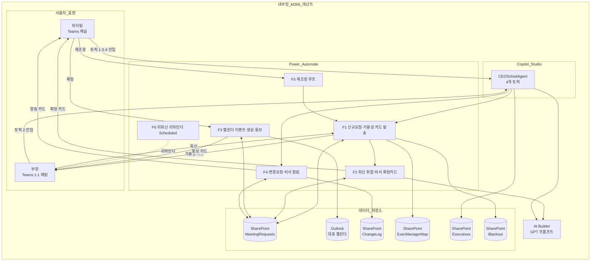

# 대표비서 임원 일정 관리 에이전트 설계서

> 본 문서는 ms-design-agents가 자동 생성한 설계서다.

| 항목 | 내용 |
|------|------|
| 작성일 | 2026-06-08 |
| 프로젝트명 | 대표비서일정에이전트 |
| 요청자 | tlsqhdrbek@gmail.com |
| 망 배치 결정 | **내부망 단독** |
| 사용 기술 | Power Automate, Copilot Studio, AI Builder, SharePoint Online, Office 365 Outlook, Microsoft Teams |

---

## 1. 개요

### 1.1 요구사항

> 대표님 전용 비서팀 에이전트. 대표는 임원들과만 미팅을 진행하며, 비서팀은 임원에게 직접 묻지 않고 임원 산하 부장에게 가용성을 문의하는 위계 구조를 따른다. 일정 등록·변경·취소의 전체 라이프사이클을 에이전트가 통제해야 하며, 부장은 변경 요청 진입점으로 에이전트를 사용한다. **Power Automate의 승인 플로우는 사용 불가**하며, 그 대체 메커니즘이 필요하다.

### 1.2 자동화 목표

비서팀이 수기로 수행하던 (a) 다수 부장에게 임원 가용성 문의 → 회신 수집 → 교집합 계산 → 대표 캘린더 등록의 4단계 프로세스를 단일 Teams 대화로 압축하고, 부장발 변경 요청을 비서팀에 즉시 통지·재조정 루프로 연결한다. 승인 액션 부재라는 제약을 Adaptive Card `wait for a response`와 SharePoint 리스트 상태기계로 대체해 동등한 거버넌스를 확보한다.

### 1.3 처리 대상 데이터

| 데이터 항목 | 종류 | 출처 | 개인정보 여부 |
|------------|------|------|--------------|
| 대표·임원·부장 이메일·이름 | 직원 식별 | Entra ID, SharePoint | ✅ |
| 미팅 목적·메모 | 업무 컨텍스트 | 비서·부장 입력 | ⚠ (업무 민감) |
| 가용 시간 슬롯 | 일정 데이터 | 부장 입력 | ⚠ (간접적으로 임원 일정 노출) |
| 캘린더 이벤트 | 일정 데이터 | Outlook 대표 캘린더 | ✅ |
| 변경 이력 | 감사 로그 | SharePoint ChangeLog | ✅ |

---

## 2. 아키텍처

### 2.1 다이어그램



### 2.2 컴포넌트 표

| 컴포넌트 | 역할 | 위치 | 사용 기술 |
|---------|------|------|-----------|
| CEOSchedAgent | 비서·부장의 단일 진입점 | 내부망 | Copilot Studio (생성형) |
| F1~F6 플로우 | 일정 라이프사이클 처리 | 내부망 | Power Automate |
| MeetingRequests | 요청 상태기계 단일 진실 원천 | 내부망 | SharePoint List |
| ExecManagerMap | 임원-부장 1:1 매핑 | 내부망 | SharePoint List |
| Executives | 임원 마스터(에이전트 ChoiceSet 동적 로드) | 내부망 | SharePoint List |
| ChangeLog | 변경 이력 감사 로그 | 내부망 | SharePoint List |
| Blackout | 대표 부재 기간 (휴가·외부 일정) | 내부망 | SharePoint List |
| 대표 캘린더 | 확정 이벤트 저장 | 내부망 | Office 365 Outlook |
| AI Builder | NL 파싱·취합 브리핑 | 내부망 | AI Builder Create text 노드 |

---

## 3. 망 배치 결정 근거

[workflow/decision_tree.md](../../workflow/decision_tree.md) 적용 결과:

- **Q1 (개인정보 처리)**: **예** — 임직원 식별 정보, 캘린더, 업무 컨텍스트 모두 개인정보·민감 업무정보
- **Q2 (외부 API 의존)**: **아니오** — 외부 인터넷·외부 SaaS 호출 없음. M365 내부 데이터만 사용
- **Q3 (외부 데이터 의존)**: **아니오** — 외부 데이터 수집 없음
- **Q4 (수신자)**: 내부 직원만 (비서·부장·임원·대표)
- **Q5 (개인정보 알림)**: N/A (외부망 미사용)

**결정: 패턴 A — 내부망 M365 단독**

대안 검토:
- **외부망 단독**: 처리 데이터가 전부 개인정보·내부 일정이므로 망분리 규정상 외부망 배치 불가 (B1 위반)
- **외부망 → 내부망 연계**: 외부 API/데이터 호출이 없어 연계 게이트웨이 자체가 불필요. 복잡도만 증가

---

## 4. Power Automate 플로우 명세

### 4.1 플로우 그룹 개요

| 플로우 | 트리거 | 위치 | 라이선스 등급 | 일 예상 호출 |
|---|---|---|---|---|
| F1 신규요청 접수 | Copilot Studio 호출 (Instant) | 내부망 | Standard | 5~20 |
| F2 회신 취합 | F1 종료 또는 Timeout | 내부망 | Standard (AI Builder 사용 시 Premium) | F1과 동일 |
| F3 캘린더 등록 | F2의 비서 확정 분기 | 내부망 | Standard | F1의 80% 추정 |
| F4 변경 요청 | Copilot Studio 호출 (Instant) | 내부망 | Standard | 2~10 |
| F5 재조정 | F4의 비서 수락 분기 | 내부망 | Standard | F4의 60% 추정 |
| F6 미회신 리마인더 | Recurrence (평일 09:00, 14:00 KST) | 내부망 | Standard | 2 |

### 4.2 사용 커넥터 종합

| 커넥터 | 등급 | 용도 |
|---|---|---|
| Microsoft Teams | Standard | Adaptive Card 발송·회신 수집 |
| SharePoint Online | Standard | 리스트 CRUD |
| Office 365 Outlook | Standard | 캘린더 이벤트 CRUD |
| Office 365 Users | Standard | 이메일→사용자 프로필 조회 |
| AI Builder | Premium | GPT 프롬프트 (NL 파싱·브리핑) |
| Microsoft Copilot Studio | Standard | 토픽에서 플로우 호출 |
| Schedule | Standard | F6 Recurrence |

### 4.3 F1 — 신규 요청 접수 & 가용성 카드 발송

#### 4.3.1 개요

| 항목 | 값 |
|------|----|
| 플로우명 | F1_RequestIntakeAndPoll |
| 위치 | 내부망 |
| 트리거 종류 | 인스턴트 (Copilot Studio "When a Power Automate flow is called") |

#### 4.3.2 단계 명세

| 순번 | 단계명 | 액션 종류 | 커넥터 | 입력 매개변수 | 출력 변수 | 비고 |
|---|---|---|---|---|---|---|
| 1 | 트리거 | When Copilot Studio agent calls | Copilot Studio | targetExecutiveIds(string), purpose(string), durationMin(int), windowStart(datetime), windowEnd(datetime), priority(string), requestedBy(string) | - | - |
| 2 | 요청 ID 생성 | Compose | Built-in | `@{guid()}` | requestId | - |
| 3 | 임원 목록 파싱 | Parse JSON | Data Operations | targetExecutiveIds | execArray | 다중 임원 처리 |
| 4 | 담당 부장 조회 | Get items | SharePoint | List=ExecManagerMap, Filter=`ExecutiveEmail in (...)` | managers | 1:1 매핑 |
| 5 | Blackout 조회 | Get items | SharePoint | List=Blackout, Filter=`Start le windowEnd and End ge windowStart` | blackouts | 대표 부재 기간 |
| 6 | 슬롯 생성 | Compose | Built-in | windowStart~windowEnd, 09:00~18:00, durationMin 단위, Blackout 제외, 최대 12개 | slotChoicesJson | JSON 배열 |
| 7 | 요청 적재 | Create item | SharePoint | List=MeetingRequests, Status="Polling", 모든 입력 매핑 | itemId | OutlookEventID는 공란 |
| 8 | 부장 병렬 카드 발송 | Apply to each | Built-in | @managers, **Concurrency Control=20** | - | 핵심: 부장당 1:1 카드 |
| 8.1 | 카드 발송·대기 | Post adaptive card and wait for a response | Microsoft Teams | Post as=Microsoft Copilot Studio agent, Post in=Chat with agent, Recipient=manager.Email, Agent=CEOSchedAgent, Message=§4.9.1 JSON, Update message="응답이 접수되었습니다 (회신 시각: @{utcNow()})" | submitActionId, selectedSlots, memo | Timeout PT24H |
| 8.2 | 응답 적재 | Update item | SharePoint | List=MeetingRequests, itemId, PollResponses=append JSON | - | 부장별 결과 |
| 9 | F2 자식 호출 | Run a Child Flow | Power Automate | F2, requestId | - | 동기 실행 |

#### 4.3.3 변수

| 변수명 | 타입 | 초기값 | 용도 |
|---|---|---|---|
| requestId | String | guid() | SharePoint PK |
| slotChoicesJson | String | "[]" | 슬롯 ChoiceSet JSON |
| pollResponsesArray | Array | [] | 부장 응답 누적 |

#### 4.3.4 조건 분기

```
If managers.length == 0:
  → Send error card to requestedBy ("담당 부장 매핑 누락")
  → Update Status="Cancelled"
  → Terminate
Else:
  → 정상 흐름
```

#### 4.3.5 에러 핸들링

| 단계 | 실패 시 동작 |
|---|---|
| 8.1 Timeout 도달 (PT24H) | 카드 자동 종료, 해당 부장 응답을 "미회신"으로 저장 후 F2 진행 |
| 8.2 SharePoint 업데이트 실패 | 3회 재시도(지수 백오프), 그래도 실패 시 비서팀 채널에 오류 카드 |

### 4.4 F2 — 가용성 취합 & 비서 확정 카드

#### 4.4.1 단계 명세

| 순번 | 단계명 | 액션 종류 | 커넥터 | 입력 매개변수 | 출력 변수 | 비고 |
|---|---|---|---|---|---|---|
| 1 | 트리거 | When called from F1 | Power Automate | requestId | - | - |
| 2 | 요청 조회 | Get item | SharePoint | MeetingRequests, requestId | item | - |
| 3 | 응답 파싱 | Parse JSON | Data Operations | item.PollResponses | responses | - |
| 4 | 교집합 계산 | Compose (식) | Built-in | `intersection(map(responses, 'selectedSlots'))` | common | 비어있으면 공집합 |
| 5 | Top3 후보 산출 | Compose | Built-in | common이 비면 응답 빈도 상위 3개, 아니면 common 상위 3개 | top3 | - |
| 6 | 부장 원문 컴포즈 | Select | Data Operations | responses → "{name}: {memo}" 형태 | rawResponsesList | **요약 안 함, 원문** |
| 7 | AI Builder 브리핑 | Create text with GPT | AI Builder | 프롬프트 §4.12.1 | summaryText | top3·미회신만 요약 (메모 제외) |
| 8 | 확정 카드 발송 | Post adaptive card and wait for a response | Microsoft Teams | Post as=Copilot Studio agent, Post in=Channel, Recipient=비서팀 채널, Message=§4.9.2 JSON | submitActionId, finalSlot | Timeout PT72H |
| 9 | 분기 처리 | Switch | Built-in | submitActionId | - | - |
| 9a | "confirm" 분기 | Update item + Run child | SharePoint + Power Automate | Status="Confirmed", FinalSlot=finalSlot → F3 호출 | - | - |
| 9b | "manual" 분기 | Question (다이얼로그) | Copilot Studio Action | 비서가 직접 시각 입력 → F3 호출 | finalSlot | - |
| 9c | "cancel" 분기 | Update item + 통보 | SharePoint + Teams | Status="Cancelled", 모든 부장에게 취소 카드 (Post adaptive card in a chat or channel, 응답 불필요) | - | - |

#### 4.4.2 조건 분기 상세

```
common = intersection(모든 회신 부장의 selectedSlots)
미회신 = 카드 발송했으나 timeout으로 응답 없는 부장

If common.length >= 1:
  top3 = common 상위 3개 (시간 빠른 순)
Else:
  슬롯별 가능 부장 수 카운트
  top3 = 카운트 상위 3개
  summaryText에 "공통 슬롯 없음. 가장 많이 가능한 슬롯 추천" 명시

summaryText 구성:
  - top3 슬롯 목록
  - 슬롯별 누가 가능/불가
  - 미회신 부장 명단 (있는 경우)
  - 부장 원문 메모는 카드의 별도 섹션에 그대로 노출 (요약 안 함)
```

### 4.5 F3 — 캘린더 이벤트 생성 & 통보

#### 4.5.1 단계 명세

| 순번 | 단계명 | 액션 종류 | 커넥터 | 입력 매개변수 | 출력 변수 | 비고 |
|---|---|---|---|---|---|---|
| 1 | 트리거 | When called | Power Automate | requestId, finalSlot, isUpdate(bool) | - | isUpdate=true는 F5 경로 |
| 2 | 요청 조회 | Get item | SharePoint | MeetingRequests, requestId | item | - |
| 3 | 분기 | Condition | Built-in | isUpdate? | - | - |
| 3a | 신규 생성 | Create event (V4) | Office 365 Outlook | Calendar Id=대표 캘린더, Subject=item.Purpose, Start=finalSlot, End=finalSlot+durationMin, Required Attendees=대표·임원들·비서팀, Optional Attendees=담당 부장들, **Is Online Meeting=true**, Time zone=Korea Standard Time | eventId | Teams 회의 자동 생성 |
| 3b | 기존 업데이트 | Update event (V4) | Office 365 Outlook | Id=item.OutlookEventID, Start/End=신규 시각 | eventId | F5에서 호출 |
| 4 | 요청 마감 | Update item | SharePoint | Status="Done", OutlookEventID=eventId, FinalSlot=finalSlot | - | - |
| 5 | 부장 통보 | Apply to each (managers) | Built-in | Concurrency=20 | - | - |
| 5.1 | 통보 카드 | Post adaptive card in a chat or channel | Microsoft Teams | Recipient=manager.Email, Card=§4.9.4 JSON (응답 불필요) | - | - |

### 4.6 F4 — 변경 요청 알림

#### 4.6.1 단계 명세

| 순번 | 단계명 | 액션 종류 | 커넥터 | 입력 매개변수 | 출력 변수 | 비고 |
|---|---|---|---|---|---|---|
| 1 | 트리거 | When called from agent | Copilot Studio | requestId(string), reason(string), proposedSlots(string), urgency(string), requesterEmail(string) | - | 부장 진입 |
| 2 | 요청 조회 | Get item | SharePoint | MeetingRequests, requestId | item | - |
| 3 | 권한 검증 | Condition | Built-in | requesterEmail이 ExecManagerMap에서 item.TargetExecutives의 담당 부장인가 | - | 실패 시 거부 |
| 4 | 변경 횟수 확인 | Get items | SharePoint | ChangeLog, Filter=`RequestID eq '@{requestId}'` | changeHistory | - |
| 5 | 폭주 차단 | Condition | Built-in | changeHistory.length >= 3 | - | True면 경보 |
| 6 | 상태 변경 | Update item | SharePoint | Status="Changing" | - | - |
| 7 | 감사 로그 | Create item | SharePoint | ChangeLog: RequestID, RequestedBy=requesterEmail, Reason=reason, ProposedSlots, CreatedAt=utcNow() | - | **Reason은 원문** |
| 8 | 비서 알림 카드 | Post adaptive card and wait for a response | Microsoft Teams | Recipient=비서팀 채널, Card=§4.9.3 JSON | submitActionId | Timeout PT24H |
| 9 | 분기 | Switch | Built-in | submitActionId | - | - |
| 9a | "reschedule" | Run child flow | Power Automate | F5(requestId, proposedSlots) | - | - |
| 9b | "escalate" | Update item + 카드 | SharePoint + Teams | Status="Confirmed"로 되돌림, 부장에게 "비서가 임원 직접 컨택 예정" 통보 | - | - |
| 9c | "reject" | Update item + 카드 | SharePoint + Teams | Status="Confirmed", 부장에게 사유 메모와 함께 거절 통보 | - | - |

### 4.7 F5 — 재조정 루프

본 플로우는 F1을 재사용하되 부장 제안 슬롯을 우선 노출한다.

| 순번 | 단계명 | 액션 | 비고 |
|---|---|---|---|
| 1 | 트리거 | When called from F4 (requestId, proposedSlots) | - |
| 2 | 슬롯 합성 | Compose | 부장 제안 슬롯 + F1 알고리즘으로 생성한 잔여 슬롯 (제안 슬롯이 상위) |
| 3 | F1 호출 | Run child flow | F1 (단, slotChoicesJson 직접 주입) |
| 4 | F3 호출 | Run child flow | F3 (isUpdate=true) — 기존 OutlookEventID 업데이트 |

### 4.8 F6 — 미회신 리마인더

| 순번 | 단계명 | 액션 종류 | 커넥터 | 입력 | 비고 |
|---|---|---|---|---|---|
| 1 | 트리거 | Recurrence | Schedule | Frequency=Week, On Mon-Fri, At=09:00 14:00, TZ=Korea Standard Time | - |
| 2 | 대상 조회 | Get items | SharePoint | MeetingRequests, Filter=`Status eq 'Polling' and Created lt addHours(utcNow(), -4)` | - |
| 3 | 미회신 부장 파싱 | Compose | Built-in | item.PollResponses에 없는 매핑 부장 추출 | - |
| 4 | 리마인더 발송 | Apply to each + Post adaptive card in a chat or channel | Teams | 응답 불필요 카드 ("아직 회신 대기 중") | - |

### 4.9 Adaptive Card JSON 명세

#### 4.9.1 부장 가용성 요청 카드 (F1)

```json
{
  "type": "AdaptiveCard",
  "$schema": "http://adaptivecards.io/schemas/adaptive-card.json",
  "version": "1.4",
  "body": [
    { "type": "TextBlock", "text": "[가용성 확인 요청]", "weight": "Bolder", "color": "Accent", "size": "Medium" },
    { "type": "TextBlock", "text": "@{items('Apply_to_each_managers')?['ExecutiveName']} 임원님 일정 협의", "size": "Large", "weight": "Bolder", "wrap": true },
    { "type": "FactSet", "facts": [
      { "title": "목적", "value": "@{triggerBody()?['purpose']}" },
      { "title": "소요시간", "value": "@{triggerBody()?['durationMin']}분" },
      { "title": "우선순위", "value": "@{triggerBody()?['priority']}" },
      { "title": "요청자", "value": "@{triggerBody()?['requestedBy']}" },
      { "title": "회신 기한", "value": "@{addHours(utcNow(), 24)}" }
    ]},
    { "type": "TextBlock", "text": "가능한 시간대를 **모두** 선택해주세요. 회신이 많을수록 일정 확정이 빠릅니다.", "weight": "Bolder", "wrap": true, "separator": true },
    { "type": "Input.ChoiceSet", "id": "selectedSlots", "isMultiSelect": true, "style": "expanded", "choices": "@{variables('slotChoicesArray')}" },
    { "type": "TextBlock", "text": "추가 메모 (선택)", "weight": "Bolder", "wrap": true, "separator": true },
    { "type": "Input.Text", "id": "memo", "isMultiline": true, "placeholder": "예: 14시 슬롯은 직전 회의 종료 후 30분 버퍼가 필요합니다" }
  ],
  "actions": [
    { "type": "Action.Submit", "title": "제출", "data": { "actionId": "submit" } },
    { "type": "Action.Submit", "title": "전부 불가", "data": { "actionId": "allUnavailable" } }
  ]
}
```

> **주의**: Power Automate는 Adaptive Card templating(`$data`, `$when`)을 지원하지 않으므로 `choices` 배열을 플로우에서 미리 컴포즈한 후 주입한다. `slotChoicesArray` 형식: `[{"title":"2026-06-10 14:00", "value":"2026-06-10T14:00:00+09:00"}, ...]`

#### 4.9.2 비서팀 확정 카드 (F2)

```json
{
  "type": "AdaptiveCard",
  "version": "1.4",
  "body": [
    { "type": "TextBlock", "text": "[가용성 취합 완료]", "weight": "Bolder", "color": "Good", "size": "Medium" },
    { "type": "TextBlock", "text": "@{variables('summaryText')}", "wrap": true },
    { "type": "TextBlock", "text": "📋 부장 회신 원문", "weight": "Bolder", "separator": true, "spacing": "Medium" },
    { "type": "Container", "style": "emphasis", "items": [
      { "type": "TextBlock", "text": "@{variables('rawResponsesMarkdown')}", "wrap": true }
    ]},
    { "type": "TextBlock", "text": "✅ 확정 시간 선택", "weight": "Bolder", "separator": true, "spacing": "Medium" },
    { "type": "Input.ChoiceSet", "id": "finalSlot", "style": "expanded", "choices": "@{variables('top3Choices')}" }
  ],
  "actions": [
    { "type": "Action.Submit", "title": "이 시간으로 확정", "data": { "actionId": "confirm" } },
    { "type": "Action.Submit", "title": "다른 시간 직접 입력", "data": { "actionId": "manual" } },
    { "type": "Action.Submit", "title": "요청 취소", "data": { "actionId": "cancel" } }
  ]
}
```

> `rawResponsesMarkdown` 예시 값:
> `**김부장 (A임원 담당)**: 6/10 14:00, 6/12 10:00 가능 — "12일 오전이 더 좋습니다"\n\n**이부장 (B임원 담당)**: 6/12 10:00 가능 — (메모 없음)\n\n**박부장 (C임원 담당)**: 미회신`

#### 4.9.3 비서팀 변경요청 알림 카드 (F4)

```json
{
  "type": "AdaptiveCard",
  "version": "1.4",
  "body": [
    { "type": "TextBlock", "text": "⚠ [일정 변경 요청]", "weight": "Bolder", "color": "Warning", "size": "Large" },
    { "type": "FactSet", "facts": [
      { "title": "대상 임원", "value": "@{variables('execName')}" },
      { "title": "기존 일정", "value": "@{variables('originalSlot')}" },
      { "title": "미팅 목적", "value": "@{variables('purpose')}" },
      { "title": "요청 부장", "value": "@{triggerBody()?['requesterEmail']}" },
      { "title": "긴급도", "value": "@{triggerBody()?['urgency']}" },
      { "title": "변경 누적 횟수", "value": "@{length(outputs('Get_change_history')?['body/value'])}" }
    ]},
    { "type": "TextBlock", "text": "📝 변경 사유 (부장 원문)", "weight": "Bolder", "separator": true },
    { "type": "TextBlock", "text": "@{triggerBody()?['reason']}", "wrap": true, "style": "emphasis" },
    { "type": "TextBlock", "text": "🕓 부장 제안 새 후보", "weight": "Bolder", "separator": true },
    { "type": "TextBlock", "text": "@{triggerBody()?['proposedSlots']}", "wrap": true }
  ],
  "actions": [
    { "type": "Action.Submit", "title": "재조정 시작", "data": { "actionId": "reschedule" } },
    { "type": "Action.Submit", "title": "임원 직접 확인 필요", "data": { "actionId": "escalate" } },
    { "type": "Action.Submit", "title": "요청 거절", "data": { "actionId": "reject" } }
  ]
}
```

#### 4.9.4 부장 확정 통보 카드 (F3, 응답 불필요)

```json
{
  "type": "AdaptiveCard",
  "version": "1.4",
  "body": [
    { "type": "TextBlock", "text": "✅ 일정 확정 알림", "weight": "Bolder", "color": "Good" },
    { "type": "FactSet", "facts": [
      { "title": "대상 임원", "value": "@{items('Apply_to_each_managers_2')?['ExecutiveName']}" },
      { "title": "확정 시각", "value": "@{variables('finalSlot')}" },
      { "title": "목적", "value": "@{variables('purpose')}" },
      { "title": "참석", "value": "대표 외 임원 @{length(variables('execArray'))}명" }
    ]},
    { "type": "TextBlock", "text": "캘린더 초대장이 임원님께 직접 발송되었습니다. 변경이 필요하면 본 에이전트에서 '일정 변경 요청'을 시작하세요.", "wrap": true }
  ]
}
```

### 4.10 SharePoint 리스트 스키마

#### 4.10.1 MeetingRequests

| 컬럼 | 타입 | 필수 | 기본값 | 비고 |
|---|---|---|---|---|
| Title | Single line | ✅ | "{Purpose 앞 30자}" | - |
| RequestID | Single line (Indexed, Unique) | ✅ | - | GUID |
| Purpose | Multi-line | ✅ | - | - |
| TargetExecutives | Person (multi) | ✅ | - | Entra ID |
| RequestedBy | Person | ✅ | - | - |
| DurationMin | Number | ✅ | 60 | - |
| WindowStart | Date and Time | ✅ | - | - |
| WindowEnd | Date and Time | ✅ | - | - |
| Priority | Choice | ✅ | Normal | High/Normal |
| Status | Choice | ✅ | Polling | Polling/Aggregated/Confirmed/Changing/Cancelled/Done |
| PollResponses | Multi-line (Plain text) | - | "[]" | JSON 누적 |
| FinalSlot | Date and Time | - | - | 확정 후 채움 |
| OutlookEventID | Single line | - | - | - |
| LastChangedAt | Date and Time | - | utcNow() | - |

#### 4.10.2 ExecManagerMap

| 컬럼 | 타입 | 비고 |
|---|---|---|
| ExecutiveEmail (Title) | Single line (Indexed) | UPN |
| ExecutiveName | Single line | 표시명 |
| ManagerEmail | Single line (Indexed) | UPN |
| ManagerName | Single line | 표시명 |
| Department | Single line | 본부/실 |
| IsActive | Yes/No | 인사 이동 시 false |

#### 4.10.3 Executives

| 컬럼 | 타입 | 비고 |
|---|---|---|
| Email (Title) | Single line | UPN |
| DisplayName | Single line | Copilot Studio ChoiceSet 표시값 |
| Position | Single line | 직책 |
| IsActive | Yes/No | - |

#### 4.10.4 ChangeLog

| 컬럼 | 타입 | 비고 |
|---|---|---|
| Title | Single line | "변경:{RequestID 앞 8자}" |
| RequestID | Single line (Indexed) | FK |
| Action | Choice | Created/Updated/Cancelled/RescheduleRequest/RescheduleApproved/RescheduleRejected |
| RequestedBy | Person | - |
| Reason | Multi-line | 부장 원문 |
| ProposedSlots | Multi-line | JSON |
| BeforeSnapshot | Multi-line | JSON (변경 전 FinalSlot) |
| AfterSnapshot | Multi-line | JSON |
| CreatedAt | Date and Time | utcNow() |

#### 4.10.5 Blackout

| 컬럼 | 타입 | 비고 |
|---|---|---|
| Title | Single line | "휴가/외부일정" |
| Start | Date and Time | - |
| End | Date and Time | - |
| Reason | Single line | 비공개 코멘트 |

### 4.11 변수 종합

| 변수명 | 타입 | 사용 플로우 | 용도 |
|---|---|---|---|
| requestId | String | F1~F5 | SharePoint PK |
| execArray | Array | F1, F3 | 대상 임원 객체 배열 |
| managers | Array | F1, F3 | 담당 부장 배열 |
| slotChoicesArray | Array | F1, F5 | Adaptive Card 슬롯 |
| top3Choices | Array | F2 | 추천 슬롯 |
| summaryText | String | F2 | AI Builder 출력 |
| rawResponsesMarkdown | String | F2 | 부장 원문 마크다운 |
| finalSlot | String (ISO 8601) | F2, F3 | 확정 시각 |

### 4.12 AI Builder 프롬프트

#### 4.12.1 F2 취합 브리핑 프롬프트

```
다음은 비서팀이 대표님 임원 미팅 일정을 잡기 위해 부장들에게 받은 회신 데이터입니다.
공통 가용 시간이 있으면 상위 3개를, 없으면 가장 많은 부장이 가능한 슬롯 상위 3개를 추천하세요.

규칙:
- 슬롯별 누가 가능/불가한지 간단히 명시
- 미회신 부장이 있으면 별도 라인에 명시
- 부장 자유 메모는 절대 요약·재해석하지 말고 무시(원문은 별도 섹션에서 그대로 노출됨)
- 비서가 즉시 결정할 수 있도록 한 문단으로 압축
- 행동 권유로 마무리: 공통 슬롯 없으면 "임원 직접 컨택 필요 여부 검토 요망"

입력:
{취합된 JSON: 임원·부장·selectedSlots·미회신여부}

출력:
한국어 한 문단.
```

#### 4.12.2 F1 NL 파싱 프롬프트 (Copilot Studio 토픽에서 호출)

```
비서팀의 자연어 미팅 요청에서 다음 필드를 JSON으로 추출하세요:
- targetExecutiveEmails (이메일 배열)
- purpose (문자열)
- durationMin (정수, 기본 60)
- windowStart, windowEnd (ISO 8601, 한국시간 +09:00)
- priority ("High" 또는 "Normal", 기본 "Normal")

판단 기준:
- "급히", "긴급" → priority="High"
- 시간 미지정 시 windowStart=오늘 익일 09:00, windowEnd=+5영업일 18:00

입력: {비서 발화}
임원 마스터: {SharePoint Executives 리스트}
출력: JSON only.
```

### 4.13 에러 핸들링 종합

| 단계 | 실패 시 동작 |
|---|---|
| Adaptive Card timeout | 미회신 처리, 다음 단계 진행. 절대 차단하지 않음 |
| SharePoint 업데이트 실패 | 3회 재시도(2s/4s/8s), 그래도 실패 시 비서팀 채널에 오류 카드 + Power Automate 실패 알림 메일 |
| Outlook Create event 실패 | 1회 재시도, 실패 시 Status를 "Confirmed"로 유지(미생성) + 비서팀에 수동 등록 안내 카드 |
| AI Builder 호출 실패 | Fallback: 슬롯 카운트 기반 룰 베이스로 요약 텍스트 자체 생성 ("3명 중 2명이 6/12 10:00 가능") |
| Copilot Studio → 플로우 호출 실패 | 사용자에게 "잠시 후 다시 시도해주세요" + 운영팀 알림 |

### 4.14 처리량·한도

- SharePoint Get items 5,000건 한도: MeetingRequests는 연간 약 1,500건 예상 (충분), Indexed 컬럼 활용
- Outlook 캘린더 호출: 사용자 시간당 10,000건 한도, 일 호출 50회 미만으로 여유
- AI Builder: 회사 라이선스 호출 쿼터 확인 필요 (월 100~200회 예상)

### 4.15 DLP 정책 영향

- 사용 커넥터 모두 **Business** 카테고리 (Teams/SharePoint/Outlook/AI Builder/Copilot Studio)
- HTTP 액션·외부 SaaS 미사용 → DLP 위반 없음
- Custom Connector 미사용

### 4.16 알려진 제약

- Adaptive Card `wait for a response`는 동일 카드당 첫 응답만 수집 → 부장당 별도 1:1 카드 발송 필수 (Apply to each, Concurrency 20)
- Adaptive Card templating(`$data`) 미지원 → `choices` 배열은 플로우에서 미리 컴포즈
- Run a Child Flow는 호출자 라이선스 상속 → AI Builder Premium은 호출자 권한으로 실행
- SharePoint Multi-line 컬럼은 255자 초과 시 페이지네이션 위험 — PollResponses는 JSON 압축(공백 제거)으로 저장

---

## 5. Copilot Studio 구성 명세

### 5.1 에이전트 개요

| 항목 | 값 |
|------|----|
| 에이전트명 | CEOSchedAgent (대표비서) |
| 위치 | 내부망 |
| 채널 | Microsoft Teams (개인 + 비서팀 채널) |
| 오케스트레이션 | 생성형 (Generative) |
| 사용 LLM | 회사 승인 모델 (Copilot Studio 내부 호스팅, 외부 모델 미사용) |

### 5.2 시스템 토픽 수정

| 시스템 토픽 | 수정 내용 |
|---|---|
| Greeting | "안녕하세요. 대표님 일정 비서 에이전트입니다. 어떤 도움이 필요하신가요? (예: 임원 미팅 잡기, 일정 변경)" |
| Fallback | "처리할 수 없는 요청입니다. 비서팀 운영 담당자에게 문의해주세요: secops@company.com" |
| Escalate | 사용 안 함 (Live agent 핸드오프 불필요) |

### 5.3 커스텀 토픽 목록

| 토픽명 | 트리거 구문/설명 | 엔티티 | 호출 액션 | 변수 |
|---|---|---|---|---|
| NewMeetingRequest | "임원 미팅 잡아줘", "대표님 일정 등록", "OO 임원이랑 미팅" / 비서가 신규 임원 미팅 요청 | ExecutiveName (List, SharePoint 동적), DateTimePrebuiltEntity | F1_RequestIntakeAndPoll | targetExecutiveEmails, purpose, durationMin, windowStart, windowEnd, priority, requestedBy |
| ChangeRequest | "OO 임원 일정 변경", "미팅 시간 바꿔야 해" / 부장이 일정 변경 요청 | (없음 — SharePoint 조회로 동적 선택) | F4_ChangeRequest | requestId, reason, proposedSlots, urgency, requesterEmail |
| ScheduleLookup | "이번 주 임원 미팅", "대표님 일정 알려줘" / 일정 조회 | DateTimePrebuiltEntity | (없음 — SharePoint 직접 조회 액션) | window |
| CancelMeeting | "미팅 취소", "OO 일정 빼줘" / 비서가 일정 취소 | (SharePoint 동적) | F_CancelMeeting (간단 플로우) | requestId, reason |

### 5.4 토픽별 상세 노드 트리

#### 5.4.1 NewMeetingRequest

**용도**: 비서가 자연어로 미팅 요청 → 5개 슬롯 채우기 → F1 호출

**대화 흐름**:

```
1. 사용자 발화 인식 (생성형 트리거)
   → 의도: 신규 미팅 요청

2. Question 노드: "어떤 임원과 미팅을 잡으시겠어요? (복수 선택 가능)"
   → ChoiceSet: SharePoint "Executives" 리스트 IsActive=true에서 동적 로드
   → 다중 선택
   → 변수 저장: Topic.targetExecutiveEmails

3. Question 노드: "미팅 목적을 알려주세요"
   → 자유 텍스트
   → 변수: Topic.purpose

4. Question 노드: "소요시간은?"
   → ChoiceSet: 30분 / 60분 / 90분 / 120분
   → 변수: Topic.durationMin

5. Question 노드: "후보 기간은? (시작·종료)"
   → DateTime 엔티티 2회 (또는 자유 텍스트 → Generative 답변 처리)
   → 변수: Topic.windowStart, Topic.windowEnd

6. Question 노드: "우선순위는?"
   → ChoiceSet: 일반 / 긴급
   → 변수: Topic.priority

7. Send adaptive card: 확인 카드
   → 입력 요약을 비서에게 보여주고 [요청 시작] [수정] [취소]

8. Condition: 사용자 응답
   case "요청 시작":
     → Call an action: F1_RequestIntakeAndPoll
       입력: targetExecutiveEmails, purpose, durationMin, windowStart, windowEnd, priority, requestedBy=User.Email
     → Send a message: "✅ 가용성 조회를 시작했습니다. {N}명의 부장에게 카드가 발송되었습니다. 결과는 비서팀 채널로 전달됩니다."
   case "수정":
     → 2번부터 다시
   case "취소":
     → Send a message: "요청이 취소되었습니다." → 종료

9. 종료
```

**오류 처리**:
- F1 호출 실패 시: "요청 접수에 실패했습니다. 운영팀에 문의해주세요. 오류 ID: {AgentSession.Id}"

#### 5.4.2 ChangeRequest

**용도**: 부장이 본인 담당 임원의 확정 미팅 중 하나를 선택해 변경 요청

**대화 흐름**:

```
1. 사용자 발화 인식
2. Action 노드: Get items (SharePoint MeetingRequests)
   Filter: Status eq 'Done' AND FinalSlot ge utcNow()
          AND TargetExecutives/Email in (
            SELECT ExecutiveEmail FROM ExecManagerMap
            WHERE ManagerEmail = User.Email AND IsActive = true)
   → 변수: Topic.candidateMeetings

3. Condition: candidateMeetings 비었는가?
   true → Send a message: "변경 가능한 본인 담당 임원 일정이 없습니다." → 종료
   false → 4번 진행

4. Question 노드: "어떤 일정을 변경하시겠어요?"
   → ChoiceSet: candidateMeetings에서 동적 (제목 + 시각 노출)
   → 변수: Topic.requestId

5. Question 노드: "변경 사유를 알려주세요"
   → 자유 텍스트
   → 변수: Topic.reason

6. Question 노드: "대체 가능한 새 후보 시간 (복수)"
   → 자유 텍스트 또는 ChoiceSet
   → 변수: Topic.proposedSlots

7. Question 노드: "긴급도는?"
   → ChoiceSet: 일반 / 긴급
   → 변수: Topic.urgency

8. Send adaptive card 확인 → [전송] [수정] [취소]

9. Call an action: F4_ChangeRequest
   입력: requestId, reason, proposedSlots, urgency, requesterEmail=User.Email

10. Send a message: "변경 요청이 비서팀에 전달되었습니다. 결과 알림을 기다려주세요."
```

**오류 처리**:
- F4의 권한 검증 실패 시 (담당 임원 외): "이 임원의 일정은 변경 권한이 없습니다."

#### 5.4.3 ScheduleLookup

**대화 흐름**:

```
1. Question 노드: "어느 기간의 일정을 보시겠어요?"
   → DateTime (default: 이번 주)
2. Action: Get items (MeetingRequests, FinalSlot between window, Status=Done)
3. Send adaptive card: 일정 목록 표
4. 종료
```

#### 5.4.4 CancelMeeting

**대화 흐름**:

```
1. Action: Get items (확정 미팅, requesterBy=User.Email OR 권한자)
2. Question: 어떤 일정?
3. Question: 취소 사유?
4. Send adaptive card 확인
5. Call action: F_CancelMeeting
   - SharePoint Status="Cancelled"
   - Outlook Delete event
   - 부장들에게 취소 통보 카드
6. 종료
```

### 5.5 엔티티 정의

#### 5.5.1 시스템 엔티티

- DateTimePrebuiltEntity
- BooleanPrebuiltEntity

#### 5.5.2 사용자 정의 엔티티

| 엔티티명 | 종류 | 정의 |
|---|---|---|
| ExecutiveName | List (동적) | SharePoint "Executives" 리스트의 DisplayName 컬럼, IsActive=true |
| Priority | List (정적) | "일반", "긴급" |
| Duration | List (정적) | "30분", "60분", "90분", "120분" |

### 5.6 호출하는 외부 액션

| 액션 종류 | 이름 | 매개변수 | 반환값 |
|---|---|---|---|
| Power Automate Flow | F1_RequestIntakeAndPoll | targetExecutiveEmails, purpose, durationMin, windowStart, windowEnd, priority, requestedBy | requestId, statusMessage |
| Power Automate Flow | F4_ChangeRequest | requestId, reason, proposedSlots, urgency, requesterEmail | statusMessage |
| Power Automate Flow | F_CancelMeeting | requestId, reason | statusMessage |
| Connector Action | SharePoint - Get items | siteUrl, listId, $filter | items[] |

### 5.7 인증·인가

- **채널 인증**: Teams SSO (사용자 Entra ID 자동 식별)
- **사용자 식별**: `User.Email` 사용
- **권한 분기 정책**:
  - NewMeetingRequest, ScheduleLookup, CancelMeeting: 비서팀 보안 그룹(`sg-CEOSecretary`) 멤버만 진입 가능. 토픽 시작 노드에서 `User.Email` ↔ SharePoint "Secretaries" 리스트 매칭 확인. 외부 진입 시 "권한이 없습니다" 메시지 후 종료
  - ChangeRequest: 부장 보안 그룹(`sg-Managers`) 멤버만 진입. 토픽 시작 노드에서 ExecManagerMap에 `ManagerEmail=User.Email` 존재 확인

### 5.8 생성형 AI 사용

- 사용 모델: Copilot Studio 내장 LLM (회사 테넌트 내, 외부 모델 미사용)
- RAG 데이터 소스: 사용 안 함 (구조화 슬롯 채우기 위주)
- 입력 분류: 업무 컨텍스트 + 임직원 이메일 (개인정보) → 외부 LLM 미사용으로 망분리 위반 없음
- 답변 가드레일: Copilot Studio 기본 컨텐츠 필터 활성화

### 5.9 채널 게시

- 게시 채널: Microsoft Teams
- 게시 환경: 개발 → 스테이징 → 운영 (3단계)
- 게시 절차: 운영 게시 전 비서팀 2명 + 부장 3명 UAT 필수

---

## 6. 보안 검토 결과

### A. 망분리 규정

| # | 항목 | 결과 | 근거 |
|---|---|---|---|
| A1 | 내부망 플로우에 외부 인터넷 호출 액션 없음 | ✅ | HTTP/RSS/외부 SaaS 커넥터 0건 |
| A2 | 외부망 플로우가 내부망 데이터 접근 없음 | ✅ | 외부망 플로우 자체 없음 |
| A3 | 외부망 ↔ 내부망 연계 게이트웨이 사용 | ✅ N/A | 연계 자체 없음 |
| A4 | 외부망 → 내부망 단방향 | ✅ N/A | 연계 없음 |
| A5 | 내부망 → 외부망 전송 없음 | ✅ | 전송 0건 |

### B. 개인정보 보호

| # | 항목 | 결과 | 근거 |
|---|---|---|---|
| B1 | 개인정보 외부망 미저장·미처리 | ✅ | 전체 내부망 |
| B2 | 외부 API/외부 LLM 미전송 | ✅ | 외부 호출 없음, AI Builder 내부 호스팅 |
| B3 | 외부 알림에 개인정보 미포함 | ✅ | 외부 알림 자체 없음 |
| B4 | 최소 수집 원칙 | ✅ | 이메일·이름·일정 시각만 |
| B5 | 보존기간 명시 | ✅ | MeetingRequests·ChangeLog 3년, 이후 자동 파기 (§8.2) |
| B6 | 자동 파기 메커니즘 | ⚠ | Power Automate Recurrence 파기 플로우 별도 구성 필요 (구현 단계 항목) |

### C. 민감정보

| # | 항목 | 결과 | 근거 |
|---|---|---|---|
| C1 | 민감정보 처리 여부 | 아니오 | 주민번호·신용·의료 정보 미처리 |
| C2-C4 | - | N/A | - |

### D. 인증·인가

| # | 항목 | 결과 | 근거 |
|---|---|---|---|
| D1 | 서비스 계정 명시 | ⚠ | `svc-CEOSched` 계정 신청·승인 필요 (구현 단계) |
| D2 | 최소 권한 | ✅ | SharePoint 사이트 Contribute, Outlook Calendar Read/Write (대표 계정 위임) |
| D3 | 익명 호출 차단 | ✅ | Copilot Studio Teams SSO 필수 |
| D4 | Copilot Studio 채널 인증 | ✅ | Teams SSO |
| D5 | 사용자 권한 분기 | ✅ | §5.7 sg-CEOSecretary / sg-Managers 보안 그룹 |

### E. 감사·로깅

| # | 항목 | 결과 | 근거 |
|---|---|---|---|
| E1 | 플로우 실행 이력 보존 | ✅ | Power Automate 기본 28일 |
| E2 | 개인정보 접근·처리 감사 로그 | ✅ | SharePoint ChangeLog 리스트 별도 (§4.10.4) |
| E3 | 실패·이상 이벤트 알림 | ✅ | §4.13 비서팀 채널 오류 카드 + 메일 |
| E4 | 감사 로그 안전 저장 | ⚠ | ChangeLog 리스트 권한을 비서팀 Read-only + 운영팀 Full로 설정 필요 |

### F. 외부 AI 사용

| # | 항목 | 결과 | 근거 |
|---|---|---|---|
| F1 | 회사 승인 모델 | ✅ | Copilot Studio 내장 LLM (테넌트 내) |
| F2 | 외부 LLM 사용 안 함 | ✅ | - |
| F3 | 모델 학습 차단 | ✅ | M365 Copilot 데이터는 학습에 사용되지 않음 (MS 정책) |
| F4 | 컨텐츠 필터 | ✅ | Copilot Studio 기본 활성 |
| F5 | RAG 출처 분리 | N/A | RAG 미사용 |

### G. 데이터 분류·이송

| # | 항목 | 결과 | 근거 |
|---|---|---|---|
| G1-G3 | 외부망 이송 | N/A | 이송 자체 없음 |

### 최종 보안 판정

**조건부 통과** — 다음 두 조건을 운영 단계에서 확보할 것:

1. **B6**: 보존기간 자동 파기 Recurrence 플로우(F_Cleanup) 별도 구축, 월 1회 점검
2. **D1**: `svc-CEOSched` 서비스 계정 신청, 권한 최소화 승인 절차 완료 후 운영 게시
3. **E4**: ChangeLog 리스트 권한 설정 (비서팀 Read-only, 운영팀 Full Control) 후 운영 게시

---

## 7. 구현 단계별 가이드

### 7.1 사전 준비

1. 내부망 M365 테넌트 환경 라이선스 확인 (Copilot Studio + AI Builder 라이선스 보유)
2. 비서팀 보안 그룹 `sg-CEOSecretary` 생성, 멤버 추가
3. 부장 보안 그룹 `sg-Managers` 생성, 인사 데이터로 멤버 동기화
4. 서비스 계정 `svc-CEOSched` 신청 → 승인
5. Power Platform Environment "Internal-Production" 생성 또는 기존 활용
6. DLP 정책 확인: 사용 커넥터(Teams/SharePoint/Outlook/AI Builder)가 Business 그룹에 있음을 확인

### 7.2 내부망 SharePoint 구성 단계

1. [스크린샷 위치: SharePoint 사이트 생성 화면] 사이트 `CEOSchedAgent` 생성 (Private)
2. 5개 리스트 생성 (§4.10 스키마):
   - MeetingRequests, ExecManagerMap, Executives, ChangeLog, Blackout
3. ExecManagerMap·Executives 초기 데이터 입력 (인사 데이터 기반)
4. 리스트 권한 설정:
   - MeetingRequests: 비서팀 Contribute, 부장 Read, svc-CEOSched Full
   - ExecManagerMap: 운영팀 Full, 그 외 Read
   - Executives: 운영팀 Full, 그 외 Read
   - ChangeLog: **비서팀 Read-only**, 운영팀 Full, svc-CEOSched Contribute
   - Blackout: 비서팀 Contribute, svc-CEOSched Read
5. 컬럼 인덱스 설정: MeetingRequests.RequestID, Status, FinalSlot / ExecManagerMap.ExecutiveEmail, ManagerEmail / ChangeLog.RequestID

### 7.3 내부망 Power Automate 구성 단계

1. [스크린샷 위치: Power Automate Maker Portal] Environment 선택 후 새 솔루션 `CEOSchedSolution` 생성
2. F1부터 순서대로 6개 플로우 생성. **자식 플로우(F2/F3/F5)는 F1·F4 완성 후 마지막에 연결** (Run a Child Flow 액션은 호출 대상 플로우가 존재해야 함)
3. Adaptive Card JSON은 §4.9의 4개 카드를 Compose 변수에 등록
4. 각 플로우 테스트 실행 → SharePoint 상태 변화 확인
5. F6 Recurrence 활성화

### 7.4 Copilot Studio 구성 단계

1. [스크린샷 위치: Copilot Studio 홈] 새 에이전트 `CEOSchedAgent` 생성, 오케스트레이션=생성형
2. 시스템 토픽 3개 수정 (§5.2)
3. 커스텀 토픽 4개 생성, 각 토픽의 첫 노드에 권한 확인 로직 추가
4. 액션 등록: F1, F4, F_Cancel 플로우 연결 + SharePoint Get items 액션
5. 엔티티 등록: ExecutiveName (List 동적, Executives 리스트 참조)
6. 테스트 캔버스에서 4개 토픽 시나리오 검증
7. Teams 채널에 게시 (개발 → 스테이징 → 운영)

### 7.5 테스트 시나리오

| # | 시나리오 | 입력 | 기대 결과 |
|---|---|---|---|
| T1 | 정상 신규 등록 | 비서: 임원 2명, 6/10~6/14, 60분 | 부장 2명에게 카드 → 모두 회신 → 비서 확정 → 캘린더 생성 |
| T2 | 공통 슬롯 없음 | 부장 응답이 모두 다름 | AI 브리핑이 Top3 + "공통 없음" 명시, 비서 위임 |
| T3 | 부장 미회신 | 부장 1명 24h 미회신 | F6 리마인더 후 timeout, F2 진행 시 미회신 표시 |
| T4 | 변경 요청 정상 | 부장: 자기 임원 일정 변경 | 비서 알림 → 재조정 → 캘린더 업데이트 |
| T5 | 변경 권한 외 | 부장 A가 부장 B 담당 임원 변경 시도 | 거부 메시지 |
| T6 | 변경 폭주 | 동일 RequestID 3회째 변경 | 비서 채널 경보 카드 |
| T7 | Blackout 적용 | 대표 휴가 기간이 후보에 포함된 요청 | 휴가 기간 슬롯 자동 제외 |
| T8 | 부장 자유 메모 | 회신에 자유 텍스트 포함 | 비서 카드에 원문 그대로 노출, AI 요약 안 함 |
| T9 | 취소 | 비서가 확정 후 취소 | Outlook 이벤트 삭제, 부장에게 통보 카드 |
| T10 | 비서 권한 외 | 비서팀 아닌 사용자가 토픽 진입 | 진입 차단 메시지 |

---

## 8. 운영 가이드

### 8.1 모니터링

- **실패 알림 채널**: 비서팀 Teams 채널 + 운영팀 메일
- **일별 점검**:
  - Power Automate 실패 실행 0건 확인
  - Polling 상태가 48h 이상 잔류한 요청 확인 (정체 감지)
- **주별 점검**:
  - ChangeLog 변경 누적 횟수 상위 RequestID 검토 (변경 사이클 폭주 패턴)
  - F1 평균 처리 시간 (목표: 부장 회신 평균 4h 이내)
- **월별 점검**:
  - AI Builder 호출 쿼터 사용량
  - SharePoint 리스트 항목 수 (5,000 한도 모니터링)
  - 보존기간 경과 항목 자동 파기 정상 동작 여부 (B6)

### 8.2 보존 및 파기

- **MeetingRequests**: FinalSlot 기준 3년 후 자동 파기
- **ChangeLog**: CreatedAt 기준 3년 후 자동 파기
- **Outlook 이벤트**: 사용자 캘린더 정책 따름 (별도 자동 파기 없음)
- 파기 플로우 `F_Cleanup`: Recurrence 매월 1일 03:00 KST, 조건 만료 항목 Delete

### 8.3 변경 관리

- **인사 이동(부장)**: ExecManagerMap.IsActive=false → 새 매핑 추가. 진행 중 Polling 요청은 새 매핑으로 재전송 수동 처리
- **임원 추가/퇴직**: Executives 리스트 업데이트 → 토픽 ChoiceSet에 자동 반영
- **신규 비서 추가**: `sg-CEOSecretary` 그룹에 추가
- **휴가**: 비서가 Blackout 리스트에 직접 등록 (별도 토픽 미제공, SharePoint 폼 사용)
- **Adaptive Card 디자인 변경**: 카드 JSON을 Power Automate Compose 변수로 분리 보관, 일괄 업데이트 가능
- **AI Builder 프롬프트 튜닝**: F2 단계 7번 노드의 프롬프트만 수정, 플로우 전체 재배포 불필요

---

## 9. 부록

### 9.1 참고 문서

- [Send proactive Microsoft Teams messages — Copilot Studio (MS Learn)](https://learn.microsoft.com/microsoft-copilot-studio/advanced-proactive-message)
- [Overview of adaptive cards for Microsoft Teams (MS Learn)](https://learn.microsoft.com/power-automate/overview-adaptive-cards)
- [Create your first adaptive card (MS Learn)](https://learn.microsoft.com/power-automate/create-adaptive-cards)
- [Differences between flow approval actions (MS Learn)](https://learn.microsoft.com/troubleshoot/power-platform/power-automate/approvals/differences-between-flow-approval-actions) — 승인 액션 대체 근거
- [Office 365 Outlook connector (MS Learn)](https://learn.microsoft.com/connectors/office365/)
- [Microsoft Teams connector — Post adaptive card and wait for a response](https://learn.microsoft.com/connectors/teams/)
- 사내 정책: 망분리 규정 (정책 번호 TBD), 개인정보 처리방침 (정책 번호 TBD)

### 9.2 변경 이력

| 날짜 | 변경 내용 | 작성자 |
|---|---|---|
| 2026-06-08 | 최초 작성 | ms-design-agents (Architect/Developer/Security/Documentation/Orchestrator) |
