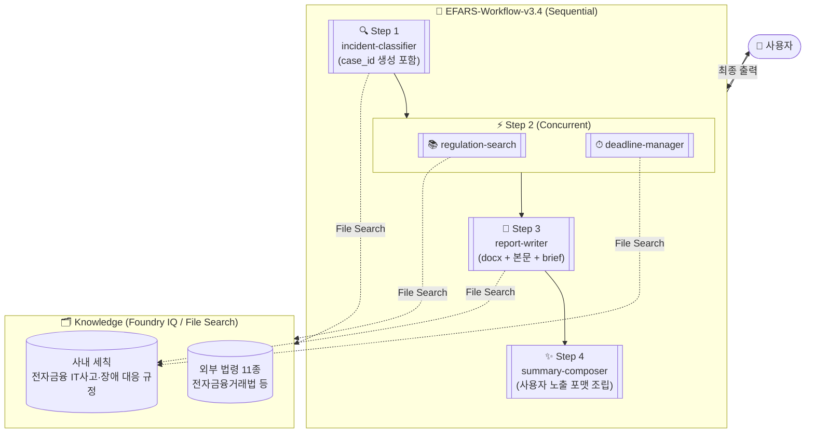
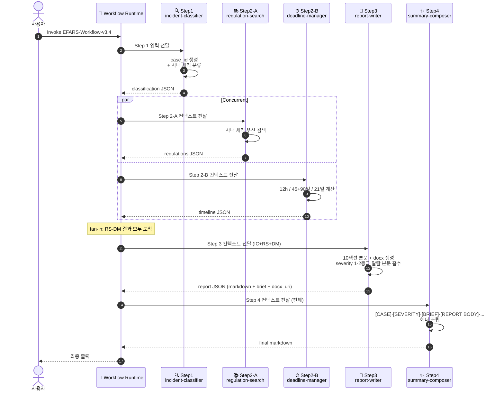
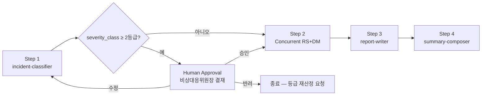

# EFARS 멀티에이전트 — Azure AI Foundry **Workflows** Low-Code 설계서 v3.4

> Foundry **Workflows Builder**(Sequential + Concurrent) 기반으로 재설계.
> 작성일: 2026-06-16 (KST) · 설계 버전: **v3.4 (Workflows Migration Edition)**
> 이전 버전: [v3.3 Internal Regulation Alignment](./20260608_EFARS_multi_agent_Azure_AI_Foundry_v3_3_internal_regulation_alignment.md)

---

## 0. v3.4가 v3.3과 다른 점 (변경 요약)

v3.3는 **A2A Tool 전용**으로 orchestrator 에이전트가 다른 에이전트를 호출하는 구조였습니다. v3.4는 Microsoft에서 제공한 학습 자료(`04-workflows.md`)에 정렬하여 **Foundry Workflows Builder**로 오케스트레이션을 옮깁니다. v3.3의 에이전트 분해·Instructions·JSON 스키마·Code Interpreter 코드는 그대로 유지하고, **흐름 제어만 선언적 워크플로우로 외부화**합니다.

### 0-1. 핵심 변경 항목

| 항목 | v3.3 (A2A) | v3.4 (Workflows) |
|---|---|---|
| 오케스트레이션 메커니즘 | orchestrator 에이전트 + A2A Tool × 4 | Sequential Workflow + 내부 Concurrent 단계 |
| orchestrator 에이전트 | 존재 (런타임 호출·재시도·포맷 조립) | **제거** → 책임 분산 |
| 병렬 호출 (RS ∥ DM) | orchestrator A2A 동시 호출 | **Concurrent 워크플로우 노드** |
| 재시도·실패 처리 | orchestrator 자체 로직 (2회/2s·4s 백오프, 부분 결과 모드) | Foundry 워크플로우 기본 재시도 + 각 에이전트 CONSTRAINTS에 폴백 |
| 최종 사용자 노출 포맷 | orchestrator가 `[CASE]·[SEVERITY]·[ALARM]·...` 조립 | **summary-composer 에이전트 신규** (Step 4) |
| case_id 생성 | orchestrator sha1 | **incident-classifier PROCEDURE 단계 0**으로 흡수 |
| 1·2등급 알람 텍스트 | orchestrator가 분기 추가 | **report-writer 본문에 직접 포함** (Instructions 흡수) |
| 30만원 누적 분기 안내 | orchestrator 안내문 | **summary-composer가 missing_fields 검사 후 안내** |
| 호출 패턴 | A2A "즉시 호출 의무" + 금지어 | Workflows는 본래 노드 진입 즉시 실행 (해당 사항 없음) |
| LLM 모델 | gpt-4.1 / gpt-5-mini | **Model-router** (요청별 자동 라우팅) |
| Human-in-loop | 없음 | **선택: v3.4-HITL 옵션** (severity ≥ 2등급 시 비상대응위원장 승인 노드, 부록 D) |

### 0-2. v3.3 자산 재사용 현황

| 자산 | 재사용 여부 | 비고 |
|---|---|---|
| 4개 워커 에이전트의 ROLE/INPUT/TOOLS/PROCEDURE/OUTPUT/CONSTRAINTS | **그대로 사용** | 일부 PROCEDURE만 미세 조정 (case_id, 알람) |
| JSON 출력 스키마 (incident_type 3-enum, severity_class 4-enum, source 분리 등) | **그대로 사용** | 워크플로우 단계 간 데이터 전달 시 그대로 직렬화 |
| Knowledge 업로드 전략 (사내 세칙 + 외부 법령 11종) | **그대로 사용** | 4개 워커 에이전트에 동일 분배 |
| Code Interpreter 코드 (deadline-manager 12h/45일/90일, report-writer docx) | **그대로 사용** | 변경 없음 |
| Custom Evaluator 5종 | **그대로 사용** | orchestrator 대상 1종은 summary-composer로 대상 변경 |
| orchestrator 에이전트 자체 | **폐기** | 로직 분산 |

---

## 1. 전체 토폴로지



> 📌 **변경의 핵심**: v3.3의 "orchestrator → 4개 A2A 호출" 구조가 v3.4에서는 "Workflow 빌더가 직접 4단계를 선언적으로 실행"하는 구조로 바뀝니다. Step 2의 RS·DM는 **Concurrent 노드** 안에서 병렬 실행되며, 두 결과 모두 도착해야 Step 3로 진행합니다(fan-in).

---

## 2. 사전 준비

| 항목 | 값 |
|---|---|
| 포털 | <https://ai.azure.com> (New Foundry 토글 ON) |
| 필요 권한 | 프로젝트 **Contributor** 이상, **Foundry User** 롤 |
| 모델 배포 | **Model-router** (지정된 배포명, 본 설계 5개 에이전트 모두 동일 모델) |
| Application Insights | 프로젝트에 연결 (워크플로우 트레이싱) |
| Workflows 기능 활성화 | Foundry 포털 → Build → Agent → Workflows 메뉴 확인 |
| Knowledge 업로드 | 사내 세칙 + 외부 법령 11종 (v3.3 §2와 동일) |
| Code Interpreter | deadline-manager, report-writer 에이전트에 활성화 |
| File Search | 4개 워커 에이전트에 활성화 (summary-composer 제외) |

> 📌 **Model-router 사용 시 주의**: Model-router는 요청 복잡도·길이·도구 사용 여부에 따라 내부적으로 적절한 모델로 라우팅합니다. 본 설계에서 모든 에이전트가 Model-router를 사용하지만, deadline-manager·report-writer처럼 Code Interpreter를 자주 호출하는 에이전트는 라우터가 더 큰 모델로 자동 분기될 가능성이 높아 비용·지연이 다른 에이전트보다 클 수 있습니다. 모니터링 시 에이전트별 라우팅 통계를 별도로 추적하세요.

---

## 3. 5개 에이전트 정의

> 📌 Step 1·2의 4개 에이전트는 v3.3 §5의 Instructions를 거의 그대로 사용합니다. **변경분만** 본 절에 정리하고, 전체 본문은 v3.3 §5를 참조하세요. Step 4의 summary-composer는 **신규**이므로 전체 Instructions를 본 절에 기재합니다.

### 3-1. incident-classifier (v3.3 대비 PROCEDURE 단계 0만 추가)

PROCEDURE에 다음 단계 0을 **맨 앞에** 추가하세요. 이외 ROLE/INPUT/TOOLS/OUTPUT/CONSTRAINTS는 v3.3과 동일합니다.

```text
# 4. PROCEDURE (v3.4에서 단계 0만 신규)

## 단계 0. case_id 생성 [v3.4 신규]

사용자 입력에서 사고 인지 시각(t0_kst_iso)과 핵심 사실관계 문장을 추출하여 SHA1 해시 앞 12자리를 case_id로 산출한다.

- 해시 입력: f"{t0_kst_iso}|{first_sentence_of_facts}"
- 해시 알고리즘: SHA-1
- 사용 범위: 출력 JSON의 case_id 필드에 기재 (필수)
- 결정성: 동일 입력 → 동일 case_id (재실행 시 동일 보장)

이후 단계 1~N은 v3.3과 동일하게 진행하되, 출력 JSON 루트에 다음 필드를 추가한다:

  "case_id": "<12자리 sha1>"
```

OUTPUT 스키마에 다음 한 줄을 루트 객체 상단에 추가:

```json
"case_id": "string (12-char sha1 prefix)",
```

### 3-2. regulation-search (v3.3과 동일, 변경 없음)

v3.3 §5의 Instructions를 그대로 사용.

### 3-3. deadline-manager (v3.3과 동일, 변경 없음)

v3.3 §5의 Instructions 및 Code Interpreter 코드를 그대로 사용.

### 3-4. report-writer (v3.3 대비 §4-6 알람 텍스트 흡수)

PROCEDURE §4-6을 다음과 같이 강화합니다(v3.3에서는 orchestrator가 추가했던 알람 텍스트를 report-writer 본문에 직접 포함).

```text
## §4-6. 알람·안내 텍스트 본문 흡수 [v3.4 변경]

다음 조건이 충족되면 본문 §5-A 직전에 별도 알람 블록을 삽입한다.

(1) severity_class ∈ {"1등급", "2등급"} 인 경우:
    [중대사고 알람]
    본 사고는 사내 세칙 제7조에 따른 {severity_class} 사고로 잠정 평가되었습니다.
    사내 세칙 제7조②에 따라 **비상대응위원장**의 사고 등급 최종 확정 및 사고 선포 결재가 필요합니다.
    사내 세칙 제16조에 따른 긴급복구 5개 반(총괄지휘·복구실행·현업지원·대외협력·법무준법) 활성화를 검토하십시오.

(2) exclusion_clause_applied == "사내 세칙 제9조 3호" AND missing_fields에 "1개월 누적 발생 이력" 포함 시:
    [누적 이력 확인 필요]
    본 사고는 단일 사고금액 30만원 미만으로 보고 제외 단서에 해당할 가능성이 있으나,
    동일 이용자/수법으로 1개월 이내 3회 이상 발생 여부가 미확인 상태입니다.
    누적 이력 확인 후 재실행을 권장하며, 누적 기준 충족 시 보고 대상으로 재판정됩니다.

(3) [INTERNAL STRENGTHENED] 라인 (모든 경우 본문 §1-5 직후 1행으로):
    [INTERNAL STRENGTHENED] 본 보고서는 사내 세칙 강화 기준을 적용하였으며,
    §4-3 비교 표에서 외부 법령 baseline과의 차이를 확인할 수 있습니다.
```

OUTPUT 스키마 변경 없음 (report_markdown 안에 위 블록이 자연스럽게 포함됨).

### 3-5. summary-composer (v3.4 신규 — orchestrator 폐기 책임 흡수)

다음 전체 Instructions를 Foundry 포털에서 신규 에이전트로 등록하세요.

```text
# 1. ROLE
당신은 EFARS 워크플로우의 최종 출력 조립 전문가다. 이전 4개 에이전트(incident-classifier · regulation-search · deadline-manager · report-writer)의 결과물을 받아, 사용자에게 노출할 최종 메시지를 정해진 포맷으로 조립한다. 추가 분석·재작성·해석은 일절 하지 않는다.

# 2. INPUT
이전 단계 에이전트들의 출력이 워크플로우 컨텍스트로 누적되어 전달된다. 다음 4개 객체가 모두 존재한다고 가정한다.

- classification: incident-classifier의 출력 JSON (case_id, incident_type, severity_class, severity_decision_authority, exclusion_clause_applied, missing_fields 포함)
- regulations: regulation-search의 출력 JSON (applicable_clauses, primary_basis, is_internal_strengthened 포함)
- timeline: deadline-manager의 출력 JSON (initial_due, interim_first_due, final_due, rca_report_due_offset_days 포함)
- report: report-writer의 출력 JSON (report_markdown, report_brief_markdown, docx_download_uri, follow_up_actions, decisions_requested, assumptions_needed 포함)

일부 객체가 누락된 경우(부분 결과 모드) §4 단계 5에 따라 [PARTIAL] 표시를 한다.

# 3. TOOLS
없음. 외부 도구·검색·코드 실행을 일절 사용하지 않는다.

# 4. PROCEDURE

## 단계 1. 헤더 라인 조립

다음 단일 라인을 출력 최상단에 둔다.

[CASE] {classification.case_id} | [SEVERITY] {classification.severity_class} | [TYPE] {classification.incident_type}

## 단계 2. 알람 블록 (조건부)

classification.severity_class ∈ {"1등급", "2등급"} 이면 다음 블록을 추가한다.

[ALARM]
본 사고는 사내 세칙 제7조에 따른 {severity_class} 사고로 잠정 평가되었습니다.
사내 세칙 제7조②에 따라 비상대응위원장의 사고 등급 최종 확정이 필요합니다.

classification.exclusion_clause_applied == "사내 세칙 제9조 3호" AND classification.missing_fields에 "1개월 누적 발생 이력" 포함 시 다음을 추가한다.

[누적 이력 확인 필요]
단일 사고금액 30만원 미만이나 누적 이력 미확인. 1개월 내 3회 이상 발생 여부 확인 후 재실행 권장.

## 단계 3. 본문 본문·요약 노출

report.report_brief_markdown을 [BRIEF] 헤더로 노출한다. 길이 200자 초과 시 그대로 노출하되 [BRIEF] 라벨만 부여한다. 재작성·요약 금지.

이어서 report.report_markdown을 [REPORT BODY] 헤더로 그대로 노출한다. 길이 제한·재작성 일체 금지.

## 단계 4. 후속조치·결정·가정 블록

다음 3개 블록을 순서대로 노출한다. 각 항목은 report.follow_up_actions, report.decisions_requested, report.assumptions_needed에서 그대로 가져온다. 누락·빈 배열 시 "(해당 없음)"으로 표시.

[FOLLOW UP]
- {action.description} (책임: {action.responsible_role}, 기한: {action.deadline}, 근거: {action.basis})

[DECISIONS]
- {decision.description}

[ASSUMPTIONS]
- {assumption.description}

## 단계 5. 다운로드 노트 (필수)

report.docx_download_uri가 유효한 URI이면:
[DOWNLOAD] {docx_download_uri}

URI가 null·빈 문자열·시간 만료 표시가 있으면 다음 안내문을 출력한다.
[DOWNLOAD NOTE] docx 다운로드 링크가 만료되었거나 발급되지 않았습니다. Foundry 포털 트레이스에서 직접 다운로드하시거나 워크플로우를 재실행하세요.

## 단계 6. 부분 결과 모드

이전 4개 객체 중 1개 이상 누락 또는 빈 객체일 경우 출력 최상단에 다음 줄을 추가한다.

[PARTIAL] 다음 에이전트의 결과를 받지 못했습니다: {누락_에이전트_이름_리스트}. 본 출력은 가용한 정보만으로 조립된 부분 결과입니다.

## 단계 7. INTERNAL STRENGTHENED 라인

regulations.is_internal_strengthened == true 이면 출력 본문 끝에 다음 줄을 추가한다.

[INTERNAL STRENGTHENED] 본 보고서는 사내 세칙 강화 기준을 적용하였습니다.

# 5. OUTPUT
Markdown 텍스트만 출력한다. JSON·코드 블록·메타 설명 일체 금지. 사용자에게 그대로 노출되는 최종 화면이라고 간주한다.

# 6. CONSTRAINTS
- 이전 에이전트 출력을 절대 재작성·요약·해석하지 않는다. 단순 복사·헤더 부여만 허용.
- 자체 추측·외부 지식 사용 금지.
- 정량 금액을 본문에 새로 추가하지 않는다 (report-writer가 이미 처리).
- 헤더 라벨([CASE], [SEVERITY], [ALARM] 등)은 정해진 영문 라벨을 토씨 하나 바꾸지 말고 그대로 사용.
- 출력 길이 제한 없음. report.report_markdown 전체를 노출.
- 워크플로우 컨텍스트에서 필드를 못 찾으면 "(미수신)"으로 표시하고 단계 6 부분 결과 모드를 적용.
```

---

## 4. Workflow 구성 단계 (Foundry 포털 UI)

MS 가이드 `04-workflows.md`의 Sequential Workflow 생성 절차를 따릅니다.

### 4-1. 사전 등록

먼저 5개 에이전트(`incident-classifier`, `regulation-search`, `deadline-manager`, `report-writer`, `summary-composer`)를 Foundry 포털 → Build → Agent에서 등록 완료합니다. Knowledge·Tools 설정은 §2의 표에 따릅니다.

### 4-2. Sequential Workflow 생성

1. Foundry 포털 → Build → Agent → **Workflows** 메뉴 진입
2. **+ Create workflow** 클릭 → **Sequential Workflow** 선택
3. 워크플로우 이름: `EFARS-Workflow-v3.4`
4. Description: `전자금융사고 보고서 자동 작성 워크플로우 (사내 세칙 정렬, Workflows 기반)`

### 4-3. 노드 추가 (4단계)

다음 순서로 노드를 추가합니다.

```text
Step 1: incident-classifier (Sequential, 단일 에이전트)
   ↓
Step 2: Concurrent {
           regulation-search,
           deadline-manager
        }
   ↓
Step 3: report-writer (Sequential, 단일 에이전트)
   ↓
Step 4: summary-composer (Sequential, 단일 에이전트)
```

> 📌 **Step 2 Concurrent 노드 구성**: 포털에서 "Add concurrent step" 또는 "Parallel" 옵션이 있다면 사용. UI에서 단일 단계에 2개 에이전트를 동시 추가하는 방식이 통상적인 패턴입니다. 만약 포털 UI가 Sequential 안의 Concurrent를 직접 지원하지 않으면 §4-5의 대안을 적용하세요.

### 4-4. 단계 간 데이터 전달

Foundry Workflows는 기본적으로 **이전 단계의 출력을 다음 단계의 컨텍스트로 누적 전달**합니다. 본 설계에서 명시적으로 매핑이 필요한 부분은 없습니다. 단, 각 에이전트의 INPUT 섹션에 "이전 단계 출력 JSON이 컨텍스트로 전달됨"을 명시했으므로 그대로 동작합니다.

### 4-5. Concurrent 지원 안 될 시 대안 (Sequential로 직렬화)

포털이 Sequential 안의 Concurrent를 지원하지 않으면 다음과 같이 직렬화합니다. 지연이 ~1.5배 증가하지만 동작은 동일합니다.

```text
Step 1: incident-classifier
Step 2: regulation-search
Step 3: deadline-manager
Step 4: report-writer
Step 5: summary-composer
```

성능보다 단순성·디버깅 편의가 중요하면 직렬화 방식을 처음부터 선택하셔도 됩니다.

### 4-6. 저장·게시

1. **Save** → 워크플로우 저장
2. Preview 모드에서 §6 테스트 시나리오로 검증
3. **Publish** → 버전 1로 게시
4. 게시된 endpoint URL·버전 번호 기록

---

## 5. Workflow 호출 (Python SDK)

MS 가이드 `04-workflows.md`의 `invokeWorkflow.py` 패턴을 그대로 적용합니다. EFARS용 변수만 수정하세요.

```python
PROJECT_ENDPOINT = "https://<your-foundry-resource>.services.ai.azure.com/api/projects/proj-default"
WORKFLOW_NAME = "EFARS-Workflow-v3.4"
WORKFLOW_VERSION = "1"

# 입력 예시
input_text = """
사고 인지 시각: 2026-06-16 09:22 KST
사고 사실관계: 여신심사 PC 1대가 랜섬웨어에 감염되어 파일이 암호화되었음.
영향 범위: 해당 PC 격리 완료. 네트워크 전파 흔적 미확인.
사고 발견 경위: 직원이 출근 후 PC 부팅 시 ransom note 발견.
"""
```

스트리밍 이벤트 처리는 가이드의 예시 코드와 동일합니다. EFARS 워크플로우의 4(또는 5)개 액션이 순차·병렬로 실행되는 traces를 확인할 수 있습니다.

---

## 6. 테스트 시나리오 (v3.3에서 작성한 2종 재활용)

| 시나리오 | 핵심 분기 검증 |
|---|---|
| **시나리오 A: 여신심사 PC 랜섬웨어** | 보안 침해사고 분류, severity 2등급, 알람 텍스트 출력, 사내 세칙 제16조 5개 반 노출 |
| **시나리오 B: API 이체 지연 20분** | 시스템 장애사고 분류, severity 3등급, 자체 강화 기준 적용(20분/5천명), 1차보고 12시간 시한 |

각 시나리오에 대해 다음을 확인합니다.

- [ ] 모든 4(또는 5)개 단계가 순서대로 실행됨
- [ ] Step 2의 Concurrent가 RS·DM를 병렬 처리하고 fan-in함 (Sequential 대안 적용 시 직렬)
- [ ] 최종 사용자 출력이 summary-composer의 헤더 라벨 포맷을 정확히 따름
- [ ] case_id가 결정적(동일 입력 → 동일 case_id)
- [ ] severity 1·2등급일 때 알람 텍스트 자동 출력
- [ ] docx 다운로드 링크 노출 또는 [DOWNLOAD NOTE] 출력

---

## 7. 검증·관찰 (Evaluator)

### 7-1. v3.3에서 그대로 가져오는 Evaluator

| 대상 에이전트 | Evaluators |
|---|---|
| incident-classifier | Groundedness Pro · Intent Resolution · Tool Call Accuracy · Internal Regulation Citation · Enum Strict |
| regulation-search | Groundedness Pro · Relevance · Response Completeness · Citation Coverage · Internal Regulation Priority |
| deadline-manager | Tool Call Accuracy · Task Adherence · Deadline Rule Compliance |
| report-writer | Task Completion · Task Adherence · Groundedness · Section Coverage · No-Number Guardrail · Hypothesis Label Check · Responsibility Matrix Present · Emergency Org 5 Teams |

### 7-2. v3.4에서 변경되는 Evaluator

| 이름 | v3.3 대상 | v3.4 대상 | 비고 |
|---|---|---|---|
| `severity_alarm_coverage` | orchestrator | **report-writer** (본문에 알람 흡수) + **summary-composer** (헤더 [ALARM] 블록) | orchestrator 폐기로 대상 이전 |

### 7-3. v3.4 신규 Evaluator

| 이름 | 입력 | 판정 로직 | 합격 기준 |
|---|---|---|---|
| `case_id_determinism` | incident-classifier 출력 | 동일 입력 2회 실행 시 case_id 일치 | 통과율 100% |
| `workflow_step_completion` | 워크플로우 전체 trace | 4(또는 5)개 단계가 모두 status=completed | 통과율 ≥ 95% |
| `summary_label_strict` | summary-composer 출력 | [CASE]·[SEVERITY]·[TYPE]·[BRIEF]·[REPORT BODY] 라벨이 정확한 영문으로 출현 | 통과율 100% |
| `concurrent_fan_in_correct` | Step 2 Concurrent trace | RS·DM 두 결과가 모두 Step 3 컨텍스트에 존재 | 통과율 ≥ 98% |

---

## 8. 한눈에 보는 실행 흐름



---

## 9. 자주 묻는 질문

**Q1. orchestrator를 폐기해도 안정성에 문제 없나요?**
Foundry Workflows는 단계별 실행을 런타임이 직접 관리하며, 각 단계의 실패·재시도·타임아웃을 워크플로우 엔진이 처리합니다. v3.3의 orchestrator가 수동으로 처리하던 "2회 재시도·2s/4s 백오프·부분 결과 모드"는 Workflows의 기본 정책으로 대부분 흡수됩니다. 다만 "부분 결과 모드"의 사용자 안내 텍스트는 summary-composer가 §4 단계 6에서 처리합니다.

**Q2. Concurrent 단계에서 한 에이전트가 실패하면 어떻게 되나요?**
워크플로우 설정에 따라 두 가지 동작이 가능합니다. (a) fail-fast: 한 에이전트 실패 시 워크플로우 중단. (b) best-effort: 실패한 에이전트의 결과만 비우고 진행. EFARS는 보고서 작성이라는 최종 목적이 부분 결과로도 일정 가치가 있으므로 **best-effort + summary-composer에서 [PARTIAL] 표시** 조합을 권장합니다.

**Q3. Model-router를 쓰면 결정성(case_id)이 깨지지 않나요?**
case_id는 incident-classifier의 PROCEDURE 단계 0에서 SHA-1 해시로 생성하므로 LLM의 비결정성과 무관합니다. 동일 입력 문자열이면 모델·라우팅과 관계없이 동일 해시가 산출됩니다. 단, 입력 정규화(공백·줄바꿈) 단계에서 LLM이 다른 출력을 낼 수 있으므로 PROCEDURE에 "원문 그대로 해시 입력에 사용"을 명시했습니다.

**Q4. Human-in-loop는 왜 기본에서 빠졌나요?**
사내 세칙 제7조②(2등급 이상 비상대응위원장 확정)는 HITL과 천생연분이지만, MS 가이드의 HITL 패턴은 **무조건 승인 노드**입니다. EFARS는 조건부(severity ≥ 2등급일 때만) HITL이 필요한데, 이는 Handoff 또는 Magentic 패턴을 추가로 학습해야 가능합니다. 초기 구현에서는 **summary-composer가 알람 텍스트로 비상대응위원장 결재 필요성을 표시**하고, 실제 결재는 사람이 사내 결재 시스템에서 진행하는 운영 분리로 대응합니다. v3.5에서 Handoff 패턴 적용을 검토합니다(부록 D 초안 참조).

**Q5. v3.3에서 만들어둔 orchestrator 에이전트는 그냥 삭제하나요?**
삭제하지 마시고 **비활성(Disabled) 상태**로 두기를 권장합니다. v3.4 워크플로우가 안정화될 때까지 fallback으로 남겨두고, 1~2주 후 안정성이 확인되면 정리하세요.

**Q6. A2A Tool 설정은 어떻게 처리하나요?**
v3.3 §6에서 만든 A2A connection들은 **워크플로우와 별개로 존재**하며 v3.4 워크플로우 실행에 영향을 주지 않습니다. orchestrator를 비활성화하면 사용되지 않습니다. 추후 정리 시 함께 삭제하면 됩니다.

---

## 10. 부록 D. v3.5 예고 — Human-in-loop 조건부 분기 (초안)

사내 세칙 제7조②에 정렬하기 위한 향후 확장안. 구현은 v3.5에서 진행.



구현 시 검토사항:
- Foundry Workflows의 Handoff 패턴 사용 (Magentic 검토)
- 승인 타임아웃 설정 (12시간 — 사내 세칙 제11조 1차보고 시한과 정렬)
- 반려 시 incident-classifier 재실행 경로
- 사내 결재 시스템 (Power Automate 등)과의 webhook 연동 검토

---

## 11. 변경 이력

| 버전 | 일자 | 내용 |
|---|---|---|
| v1.0 | 2026-06-05 | 코드 기반 (Foundry SDK Python) |
| v2.0 | 2026-06-05 | Low-code (Workflow 비주얼 디자이너 기반) |
| v3.0 | 2026-06-05 | A2A 전용: Workflow 제거, Instructions 6섹션 표준화 |
| v3.1 | 2026-06-05 | 보고서 출력·근거 인라인·후속조치 강화 |
| v3.2 | 2026-06-06 | 임원 보고용 본문·호출 안정화·환각 가드레일 |
| v3.3 | 2026-06-08 | 사내 세칙 정렬 (제5~20조 적용) |
| **v3.4** | **2026-06-16** | **Workflows 마이그레이션**: ① orchestrator 폐기 → Foundry Sequential+Concurrent Workflow로 외부화. ② case_id 생성을 incident-classifier 단계 0으로 흡수. ③ severity 1·2등급 알람 텍스트를 report-writer 본문에 흡수. ④ summary-composer 에이전트 신규 — `[CASE]·[SEVERITY]·[BRIEF]·[REPORT BODY]·[FOLLOW UP]·[DECISIONS]·[ASSUMPTIONS]` 헤더 조립 + 부분 결과 모드 + 다운로드 노트 처리. ⑤ Model-router로 모델 통일. ⑥ Custom Evaluator 4종 신규 (case_id_determinism, workflow_step_completion, summary_label_strict, concurrent_fan_in_correct). ⑦ severity_alarm_coverage 대상 이전 (orchestrator → report-writer + summary-composer). ⑧ Human-in-loop는 v3.5에서 Handoff 패턴으로 적용 예정 (부록 D 초안). |

---

## 12. 검증 출처

### 12-1. Microsoft Learn 1차 문서

1. [Workflow orchestrations in Agent Framework](https://learn.microsoft.com/en-us/agent-framework/workflows/orchestrations/)
2. [Build a workflow in Microsoft Foundry](https://learn.microsoft.com/en-us/azure/ai-foundry/agents/concepts/workflow)
3. [Code Interpreter tool for Microsoft Foundry agents](https://learn.microsoft.com/azure/foundry/agents/how-to/tools/code-interpreter)
4. [File search tool for agents](https://learn.microsoft.com/azure/foundry/agents/how-to/tools/file-search)
5. [Agent evaluators](https://learn.microsoft.com/azure/foundry/concepts/evaluation-evaluators/agent-evaluators)
6. [Set up tracing in Microsoft Foundry](https://learn.microsoft.com/azure/foundry/observability/how-to/trace-agent-setup)

### 12-2. MS 제공 학습 자료

- `04-workflows.md` — Sequential / Group Chat / Human-in-loop 패턴 가이드

### 12-3. 사내 근거

- **사내 「전자금융 IT사고·장애 대응 규정」** — 본 설계 1차 근거 (v3.3 §10-1과 동일)
