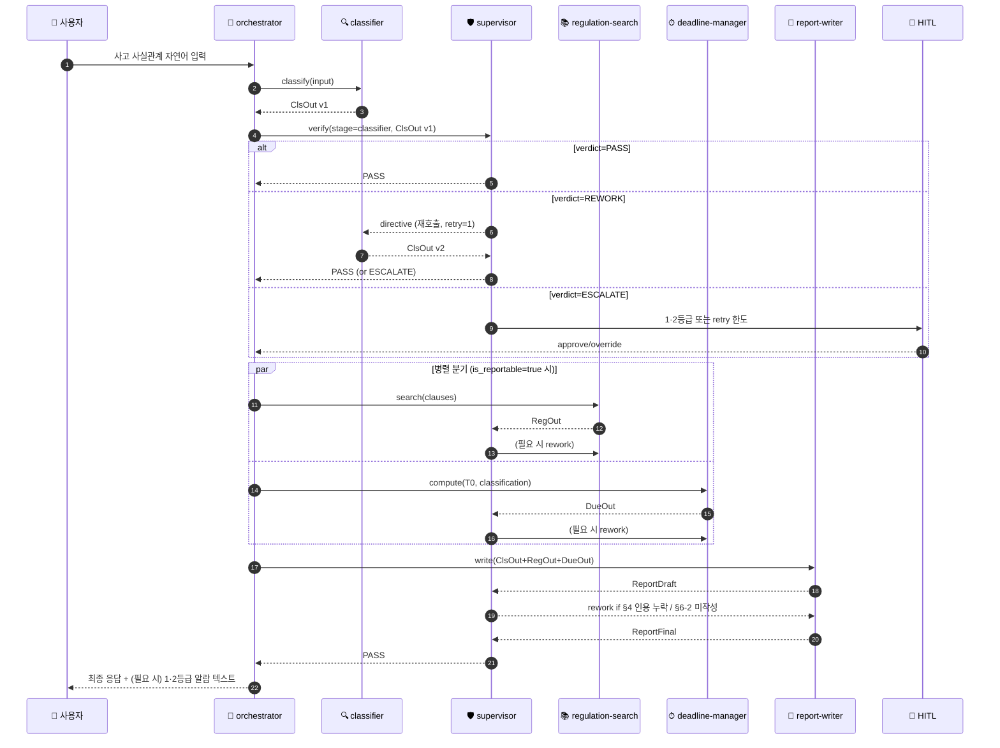

# EFARS 멀티에이전트 — Azure AI Foundry  
## v3.4 Quality Supervisor Annex (Closed-Loop Verification Edition)

- **작성일**: 2026-06-17 KST
- **기준 문서**: `20260608_EFARS_multi_agent_Azure_AI_Foundry_v3_3_internal_regulation_alignment.md` (v3.3)
- **변경 범위**: 본 Annex는 v3.3의 §1·§5·§7·§8을 **추가·갱신**합니다. 사내 세칙 정렬·시한 임계값·Custom Evaluator 5종(§7-1) 등 기존 합의 사항은 그대로 유지됩니다.
- **요지**: 사후(batch) Evaluator만 존재하던 v3.3 구조에 **런타임 검증·재지시 루프**를 담당하는 6번째 에이전트 **`quality-supervisor`** 를 추가하고, Foundry Workflows의 **Group chat + 조건 분기 + Connected Agent Tool** 조합으로 *유기적 양방향* 통신을 실현합니다.

---

## 0. v3.4 변경 요약

| 영역 | v3.3 | v3.4 (본 Annex) |
|---|---|---|
| 검증 시점 | 사후 batch (Application Insights → Evaluator 보고) | **런타임 in-loop** 검증 + 사후 batch (이중) |
| 검증 주체 | Custom Evaluator 5종 (코드) | **`quality-supervisor` 에이전트** + Built-in Agent Evaluators(Task Adherence·Tool Call Accuracy·Intent Resolution) 인라인 호출 |
| 재지시 채널 | 없음 (실패 시 부분결과 모드로만 후속 진행) | **Rework Directive 메시지 스키마**로 해당 하위 에이전트 재호출 (Handoff back) |
| 토폴로지 | orchestrator 단방향 라우팅 (M-1) | **Group chat + Handoff** 양방향, supervisor가 모든 하위 에이전트와 mesh 연결 (M-5) |
| 무한 루프 방지 | 해당 없음 | `max_retries=2` + HITL 에스컬레이션 노드 |
| Foundry 구성 | 5개 Connected Agent + A2A | **Foundry Workflow (Group chat 템플릿)** + 6개 Connected Agent + Power Fx if/else |
| 관측 | App Insights tracing | App Insights + `verdict`·`retry_count`·`rework_reason` 사용자 정의 속성 |

> **v3.3 호환성**: 기존 5개 에이전트의 Instructions·도구·Knowledge는 **변경되지 않습니다**. 단 하나, 각 에이전트의 OUTPUT 스키마에 `self_assessment` 필드(자가진단 신뢰도 0-1)를 *권고 항목*으로 추가합니다(없어도 supervisor가 외부 평가로 보완).

---

## 1. 신규 에이전트 — `🛡 quality-supervisor`

### 1-1. 책임 (Role)
- 각 하위 에이전트 출력의 **규정·스키마·일관성**을 즉시 검증한다.
- 미흡 항목이 발견되면 **재지시 디렉티브(Rework Directive)** 를 생성해 해당 에이전트에 반환한다.
- 재시도 한계 도달 또는 1·2등급 사고일 경우 **HITL(human-in-the-loop)** 분기로 라우팅한다.
- 모든 판정과 사유를 **JSON verdict 객체**로 기록해 App Insights에 트레이스한다.

### 1-2. 위치 — M-5 (양방향 토폴로지)

- **양방향 화살표**: Supervisor가 각 하위 에이전트를 **Connected Agent Tool**로 등록하기 때문에 *호출자 ↔ 피호출자* 양방향 호출이 가능합니다(MS Learn — *Build collaborative, multi-agent systems with Connected Agents*).
- **Group chat 패턴**: Foundry Workflow의 *Group chat* 템플릿은 에이전트 간 라우팅을 **컨텍스트/룰 기반**으로 동적 전환하도록 설계되어, Supervisor가 매 턴 다음 발화자를 선택할 수 있습니다(MS Learn — *Build a workflow in Microsoft Foundry §workflow patterns*).
- **Handoff 의미**: 재지시 시점에는 컨텍스트(원본 입력 + 직전 출력 + 결함 사유) 전체가 피호출 에이전트로 인계되어, 사용자가 질의를 반복할 필요 없이 회복합니다(MS Learn — *Handoff orchestration*).

### 1-3. Instructions (6섹션 표준, v3.3 §3 규약 준수)

```text
[ROLE]
당신은 EFARS 멀티에이전트 시스템의 품질 감독자(Quality Supervisor)다.
하위 4개 에이전트(incident-classifier, regulation-search, deadline-manager, report-writer)의 출력이
사내 「전자금융 IT사고·장애 대응 규정」(이하 사내 세칙)과 v3.3 OUTPUT 스키마를 충족하는지 검증한다.
판정 결과만 산출하며, 그 어떤 보고서나 시한도 직접 생성하지 않는다.

[INPUT]
{
  "stage": "classifier" | "regulation" | "deadline" | "writer",
  "agent_output": <해당 에이전트의 JSON 출력 전체>,
  "context": {
     "case_id": string,
     "T0": ISO8601,
     "user_query": string,
     "prior_verdicts": [<직전 verdict 객체 0..n>],
     "retry_count": integer (0..2)
  }
}

[TOOLS]
- agent_evaluator (built-in): Task Adherence·Tool Call Accuracy·Intent Resolution
- a2a_incident_classifier (Connected Agent Tool)
- a2a_regulation_search    (Connected Agent Tool)
- a2a_deadline_manager     (Connected Agent Tool)
- a2a_report_writer        (Connected Agent Tool)
- file_search: 사내 세칙 본문 (검증 시 인용 확인용)
- code_interpreter: 시한 산정 재검증, 12개 self-check 항목 카운트 산정

[PROCEDURE]
1. stage 별 검증 체크리스트 적용 (§2-1 표):
   - schema_check : 필수 키 존재, enum 값, 날짜 포맷
   - rule_check   : 사내 세칙 조항 일치(예: initial_due == T0+12h ±5분, severity_class ∈ 4값)
   - cite_check   : applicable_clauses[].source 에 "internal_regulation" 1건 이상
   - integrity    : prior_verdicts 와의 일관성 (case_id, T0 동일성)
2. agent_evaluator 도구로 Task Adherence·Tool Call Accuracy 점수 산출 (임계값 ≥ 0.80).
3. 모든 check pass 시 verdict.status = "PASS".
4. 일부 실패 시 retry_count < 2 이면 verdict.status = "REWORK",
   directive 객체에 결함 항목·기대값·근거 조항을 한국어로 명시하여 해당 에이전트를 a2a_* 도구로 재호출.
5. retry_count == 2 또는 severity_class ∈ {"1등급","2등급"} 또는
   사내 세칙 1차 보고 12시간 임박(잔여 ≤ 1h) 시 verdict.status = "ESCALATE" → HITL 노드로 라우팅.
6. 모든 verdict 는 App Insights 사용자 정의 속성으로 트레이스: case_id, stage, verdict.status, retry_count.

[OUTPUT]  -- JSON Schema (strict)
{
  "case_id": "string",
  "stage": "classifier|regulation|deadline|writer",
  "status": "PASS|REWORK|ESCALATE",
  "checks": {
     "schema_check": "pass|fail",
     "rule_check":   "pass|fail",
     "cite_check":   "pass|fail|n/a",
     "integrity":    "pass|fail",
     "evaluator_score": 0.0-1.0
  },
  "failed_items": [
     {"path": "applicable_clauses[0].source",
      "found": "external_law",
      "expected": "internal_regulation",
      "basis": "사내 세칙 제5조"}
  ],
  "directive": {            // REWORK 시에만 채움
     "target_agent": "regulation-search",
     "instruction_ko": "사내 세칙 제8조 기준 적용 조항을 1건 이상 우선 인용하고, 외부 법령은 보조 인용으로 분리하라.",
     "must_include": ["internal_regulation 출처 1건 이상"],
     "retry_count_next": 1
  },
  "escalation_reason": "string|null",
  "timestamp": ISO8601
}

[CONSTRAINTS]
- 절대 사용자에게 직접 응답하지 않는다(응답은 orchestrator 권한).
- 보고서 본문, 시한 값, 조항 번호를 *새로 생성*하지 않는다 — 검증과 재지시만 한다.
- retry_count > 2 는 금지. 강제 ESCALATE.
- 1·2등급 사고는 REWORK 횟수와 무관하게 즉시 ESCALATE 병행 알람.
- 출력은 위 JSON 스키마만, 자연어 산문 금지.
```

---

## 2. 검증 체크리스트 (stage 별)

### 2-1. 핵심 검증 항목

| stage | schema_check | rule_check | cite_check | integrity |
|---|---|---|---|---|
| classifier | `incident_type` ∈ {시스템장애, 보안침해, 부정거래}, `severity_class` ∈ {1·2·3·4등급}, `is_reportable` boolean | 4-2/4-3 분기 기준 일치, 30만원 단서 적용 시 누적 3회 조건 표기 | n/a | case_id 부여, T0 ISO8601 |
| regulation | `applicable_clauses[]` ≥ 1, 각 항목에 `source`·`article`·`text` | `applicable_clauses[].source` 에 `internal_regulation` 1건 이상 (사내 세칙 제5조) | 인용 조항이 file_search 결과와 문자열 일치(±공백) | 동일 case_id, classification 입력 일치 |
| deadline | `initial_due`, `interim_due[]`, `final_due` ISO8601 | `initial_due == T0 + 12h ±5분` (사내 세칙 제8조), `interim_due` 매 45·90일, `final_due == 종료일+21일` (제10조) | n/a | 동일 case_id, T0 일치 |
| writer | §0~§7 + 부록 A/B/C 헤더 존재, `self_check_score` ≥ 0.75 | §6-2 책임자·§5-A 5개반·§4 인용 충족, 정량 추정 금지 어구 부재 | §4 인용이 regulation 단계 결과와 동일 조항 | classifier/regulation/deadline 3개 결과 모두 참조 |

### 2-2. Rework Directive 예시
```json
{
  "target_agent": "deadline-manager",
  "instruction_ko": "initial_due 값이 T0(2026-06-15T09:00:00+09:00)+12h 기준에서 17분 어긋났습니다. 사내 세칙 제8조 제1항에 따라 09:00 기준 12시간 후인 21:00로 재산정하고, code_interpreter 로그를 함께 제출하세요.",
  "must_include": ["initial_due == 2026-06-15T21:00:00+09:00 (±5분)"],
  "retry_count_next": 1
}
```

---

## 3. Foundry 내 구현 — 단계별 설정 가이드

> 출처: Microsoft Learn — *Build a workflow in Microsoft Foundry* / *Connected Agents* / *Evaluate your AI agents* (2026-06 기준).

### 3-1. 사전 준비
1. **포털 접속**: `https://ai.azure.com` 에서 **New Foundry 토글 ON**.
2. **권한**: 작업 계정에 `Foundry User` + `Contributor` 부여(워크플로 편집 권한).
3. **모델 배포**: `gpt-4.1` 또는 `gpt-5-mini` 가 v3.3대로 이미 배포됨을 확인. Supervisor용 별도 모델 배포 불필요 — 동일 배포 재사용 가능.
4. **Application Insights**: v3.3 절차대로 프로젝트에 연결되어 있어야 트레이싱이 자동 수집됨.

### 3-2. `quality-supervisor` 에이전트 생성
1. **Build → Agents → + New agent** 선택.
2. 이름: `quality-supervisor`, Description: "Verifies output from sub-agents and issues rework directives per internal regulation".
3. **Instructions**: 본 문서 §1-3 전문을 그대로 붙여 넣기.
4. **Tools**:
   - File Search → Knowledge에 사내 세칙 문서 연결(`internal_regulation_v2026.docx`).
   - Code Interpreter 활성화 (시한 재산정용).
5. **Response format**: JSON Schema 모드로 §1-3 OUTPUT 스키마 등록.
   - Foundry 포털: *Invoke agent → Details → 파라미터 아이콘 → Text format = JSON Schema* (MS Learn에 절차 명시).
6. **Save** → 게시 후 Agent ID 메모.

### 3-3. 하위 4개 에이전트를 Supervisor의 도구로 등록(역방향 채널)
1. v3.3에서 게시된 `incident-classifier`, `regulation-search`, `deadline-manager`, `report-writer` 의 Agent ID를 확보.
2. `quality-supervisor` 에이전트의 Tools에 **Connected Agent Tool** 4개 추가:
   - 이름: `a2a_incident_classifier`, ID: `<classifier-agent-id>`, Description: "Re-invokes classifier with rework directive".
   - 동일 패턴으로 regulation/deadline/writer 3개 추가.
3. 이로써 Supervisor → 각 하위 에이전트 호출이 가능해지고, **각 하위 에이전트는 v3.3에서 이미 orchestrator의 도구로 등록되어 있으므로 양방향(상위·하위) 호출 채널이 동시에 성립**합니다.

### 3-4. Foundry Workflow (Group chat) 빌드
1. **Build → Workflows → Create new workflow → Group chat 템플릿** 선택.
2. **노드 추가 순서**:
   - **Ask a question** 노드: 사용자 입력 → 변수 `Local.UserQuery` 저장.
   - **Invoke agent: orchestrator** → 변수 `Local.InitialPlan` 저장(JSON).
   - **Invoke agent: incident-classifier** → 변수 `Local.ClsOut` 저장.
   - **Invoke agent: quality-supervisor** (stage=`classifier`) → 변수 `Local.Verdict1` 저장.
   - **If/Else 노드** (Power Fx 조건):
     - 분기 A: `Local.Verdict1.status = "PASS"` → 다음 단계(regulation 병렬)로.
     - 분기 B: `Local.Verdict1.status = "REWORK"` → **Go to** `incident-classifier` 노드, 입력에 `Local.Verdict1.directive` 병합.
     - 분기 C: `Local.Verdict1.status = "ESCALATE"` → **Human in the loop** 노드로 점프.
3. **반복**: regulation/deadline/writer 단계마다 동일 패턴(에이전트 호출 → supervisor 검증 → if/else)을 추가.
4. **재시도 가드**: Power Fx 식 `If(Local.RetryCount >= 2, "ESCALATE", Local.Verdict1.status)` 로 무한 루프 차단.
5. **HITL 노드**: *Ask a question* 노드를 재사용 — "1·2등급 알람 또는 재시도 한도 초과. 승인/반려/오버라이드를 선택하세요." 응답에 따라 다음 액션 분기.
6. **Save**(자동 저장 안 됨, 매 변경마다 저장 필수 — MS Learn 명시).

### 3-5. 관측·평가 통합
1. **App Insights 사용자 정의 속성** 자동 수집을 위해 Supervisor 출력의 `case_id`, `stage`, `status`, `retry_count` 4개를 노드 액션 설정의 **Save output as** 변수로 보존 → 트레이스 metadata 자동 부착됨.
2. **사후 배치 평가**(v3.3 §7 유지): `azure-ai-evaluation` SDK 의 `Task Adherence`·`Tool Call Accuracy`·`Intent Resolution`·`Task Completion` 평가기를 일일 1회 thread 단위로 실행하고, v3.3의 Custom Evaluator 5종과 함께 Foundry Evaluations 탭에 결과 게시. (MS Learn — *Evaluate your AI agents*)
3. **클러스터 분석**: REWORK 사유(`failed_items[].path`)를 주기적으로 군집화해 Knowledge·Instructions 개선 신호로 활용.

### 3-6. 권한·보안 보강 (v3.3 §5 박보안 영역 연장)
- **Connected Agent 게시 시 ID 재발급**: Supervisor 게시 후 4개 하위 에이전트의 권한(특히 File Search 대상 Knowledge)을 supervisor 의 Agent Identity 에도 부여(MS Learn — *Connected agents-specific considerations*).
- **JSON 스키마에 비밀값 금지**(MS Learn 명시). Supervisor 출력에 토큰·키 절대 포함하지 않음.
- **민감정보**: `agent_output` 에 사고 로그·고객 식별자가 포함될 수 있으므로 Purview Sensitivity Label `Confidential-Incident` 자동 부착, Workflow 변수 영구 보존 OFF(휘발성 메모리).

---

## 4. M-6 — 실행 시퀀스 (Closed-Loop)



---

## 5. 무한 루프·장애 대비

| 위험 | 가드 | 위치 |
|---|---|---|
| Supervisor ↔ 에이전트 핑퐁 | `retry_count_next` 가 2 도달 시 `ESCALATE` 강제 | Supervisor Instructions §PROCEDURE 5 |
| Workflow timeout | Group chat 노드별 timeout 90s, 전체 워크플로 SLO 8분 | Foundry workflow 설정 |
| Supervisor 자체 오류 | Power Fx `IfError(...)` 로 status="ESCALATE", HITL 라우팅 | If/Else 노드 |
| 재호출 컨텍스트 폭증 | 직전 verdict + directive 만 전달, 이전 turn raw output 은 case_id 로 thread 조회 | Supervisor INPUT 스키마 `prior_verdicts[]` 만 보관 |
| Agent Identity 권한 결손 | 게시 시 Knowledge·Tool 권한 supervisor 에 별도 부여(체크리스트화) | §3-6 |

---

## 6. FAQ 추가 (Q17~Q20)

**Q17. Supervisor 가 orchestrator 의 역할을 흡수해야 하지 않나요?**  
A. 분리합니다. orchestrator 는 **사용자 응답·라우팅 의사결정**을, supervisor 는 **품질 판정**을 전담해 단일 에이전트의 책임 과중을 피합니다(MS Learn — *AI agent orchestration patterns*).

**Q18. Connected Agents (classic) 가 deprecated 인데 괜찮나요?**  
A. 본 설계는 **Foundry Agent Service의 최신 Workflows(2025-11-15-preview API)** 를 기준으로 합니다. classic Connected Agents(2025-05-15-preview)는 2027-03-31 retire 예정으로 신규 채택하지 않으며, 새 Workflows 의 *Invoke agent* 노드와 Group chat 패턴을 사용합니다.

**Q19. Supervisor 가 사실상 두 번 LLM 호출이라 비용이 두 배가 되지 않나요?**  
A. 비용은 증가합니다(추정 +25~40% 토큰). 다만 사내 세칙 위반 1건의 행정 리스크 대비 미미하며, supervisor 모델을 `gpt-5-mini` 로 다운사이즈하면 +10% 내로 억제 가능. (이성과 영역의 ROI 표 재산정 필요.)

**Q20. HITL 노드의 승인자는 누구입니까?**  
A. 사내 세칙 제15조의 사고대응반장 — orchestrator 가 Teams Adaptive Card 로 통지, 응답을 Workflow `Ask a question` 변수로 수신. 응답 SLA 30분 초과 시 자동 ESCALATE 알람을 정보보호최고책임자(CISO) 채널로 전송.

---

## 7. 검증 출처 (Microsoft Learn, 2026-06 fetch)

- *Build a workflow in Microsoft Foundry* — workflow patterns (Sequential/Group chat/HITL), Add agents, JSON Schema 출력, Power Fx if/else.  
  https://learn.microsoft.com/azure/foundry/agents/concepts/workflow
- *Build collaborative, multi-agent systems with Connected Agents* — Connected Agent Tool 등록, 게시 시 Agent Identity 재구성.  
  https://learn.microsoft.com/azure/foundry-classic/agents/how-to/connected-agents
- *AI agent orchestration patterns — Handoff orchestration* — 컨텍스트 보존 양방향 인계.  
  https://learn.microsoft.com/azure/architecture/ai-ml/guide/ai-agent-design-patterns#handoff-orchestration
- *Microsoft Agent Framework Workflows — Handoff* — checkpoint, autonomous mode, 양방향 mesh.  
  https://learn.microsoft.com/agent-framework/workflows/orchestrations/handoff
- *Evaluate your AI agents* — Task Adherence·Tool Call Accuracy·Intent Resolution·Task Completion 평가기.  
  https://learn.microsoft.com/azure/foundry/observability/how-to/evaluate-agent
- *Agent evaluators (system evaluation)* — multi-agent 시스템의 최종 결과물 평가 가이드.  
  https://learn.microsoft.com/azure/foundry/concepts/evaluation-evaluators/agent-evaluators

---

## 8. 변경 이력

| 버전 | 일자 | 변경 |
|---|---|---|
| v3.3 | 2026-06-08 | Internal Regulation Alignment Edition |
| v3.4 | 2026-06-17 | **Quality Supervisor Annex 추가** — `quality-supervisor` 에이전트, Foundry Workflow Group chat 기반 양방향 토폴로지(M-5), Closed-Loop 시퀀스(M-6), Rework Directive 스키마, HITL 가드 |
