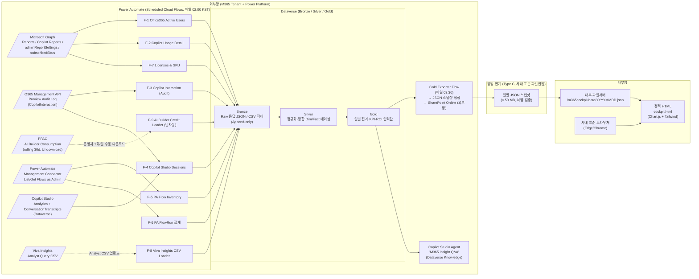
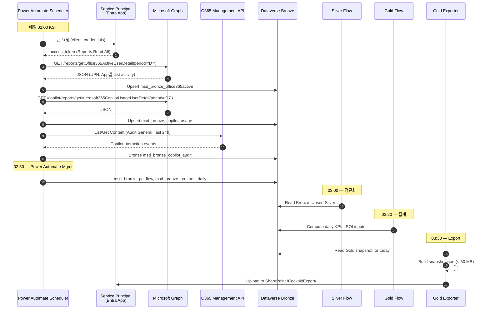
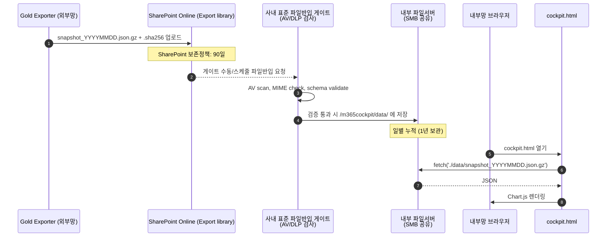
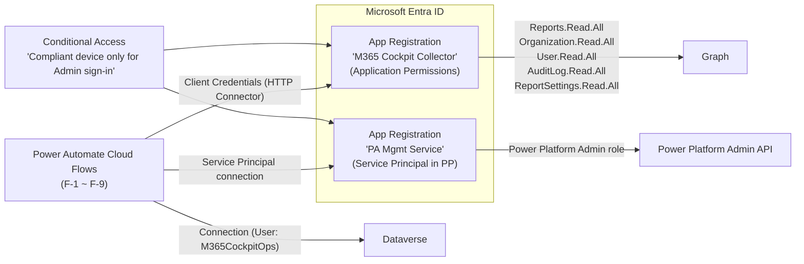

# M365 사용현황 인사이트 대시보드 (M365 Adoption & ROI Cockpit)

> **문서 ID** : 20260624_M365_사용현황_인사이트_대시보드
> **버전** : v1.0 (2026-06-24)
> **목적** : Viva Insights의 제한(보존기간·화면 분산)을 극복하고, 회사가 보고 싶은 지표만 정리된 단일 대시보드를 내부망에서 제공한다.
> **근거 방식** : 모든 데이터 출처·API·보존기간은 Microsoft Learn 1차 문서로 검증한 사실만 기재한다. 검증되지 않은 가정은 "가정/제약"으로 분리 표기한다.
> **대상 사용자** : 사내 DX·DT·정보전략 담당자, 임원 보고용 ROI 리포트 작성자, Power Platform Admin.

---

## 0. Executive Summary (한 페이지 요약)

| 항목 | 결정 |
| --- | --- |
| 대시보드 형태 | **단일 페이지 정적 HTML + JSON 데이터 파일** (Chart.js 기반). exe 패키징은 권장하지 않음 |
| 명칭 제안 | **"M365 Adoption & ROI Cockpit"** (사내 명칭: *M365 활용 인사이트 센터*) |
| 데이터 적재 위치 | **외부망 Dataverse** (Bronze/Silver/Gold 3계층). 내부망에는 Gold 계층의 일별 스냅샷 JSON만 반입 |
| 수집 주기 | 매일 02:00 (KST) Power Automate Scheduled Cloud Flow 11개가 각각 영역별로 수집 → Dataverse upsert |
| 핵심 데이터 소스 (사실 검증 완료) | ① Microsoft Graph Reports API ② Microsoft 365 Copilot Usage Report API ③ Office 365 Management Activity API (Purview Audit) ④ AI Builder Consumption Report (PPAC) ⑤ Power Automate Management Connector ⑥ Copilot Studio ConversationTranscripts (Dataverse) |
| 내부망 반입 방식 | Gold 계층의 일별 JSON 스냅샷(< 50 MB)을 사내 표준 파일반입(Type C 양망연계) 절차로 매일 1회 반입. 대시보드는 그 JSON만 fetch. |
| LLM 연동 | 외부망에 한해 **Copilot Studio Agent (Dataverse Knowledge)** 로 자연어 질의. 내부망 HTML 자체엔 LLM 미연동 (정책상). 임원/관리자가 외부망에서 자연어 질의 가능. |
| ROI 산출 | "절감시간 × 시급 × 성공률 − 라이선스/크레딧 비용" 모형. 자세한 식은 8장. |

> **요지** : "달이 지나면 사라지는" Viva Insights·M365 admin center 보고서의 **30일 보존 한계**를 Dataverse 누적 적재로 해소하고, **PowerBI 없이도** Chart.js HTML로 대시보드를 표시한다. Power BI를 못 쓰는 제약 → 정적 HTML이 가장 안전한 선택이다.

---

## 1. 배경·요구사항·범위

### 1.1 현재 사용자가 부딪힌 문제
- Viva Insights는 *화면이 정해져 있고* 회사가 원하지 않는 지표도 함께 보여 주의가 분산된다.
- 테넌트 전체 앱 사용현황은 **달이 지나면 이전 달 데이터를 보기 어렵다** → 누적 비교 불가.
- 타사는 Power BI로 자체 대시보드를 만들지만, **본사 정책상 Power BI 사용 불가**.
- 데이터는 **내부망에서 봐야 한다** (운영 환경). 외부망에서 수집·가공된 결과만 내부망으로 반입한다.

### 1.2 사용자 요구사항 (직접 발화 기반)
| # | 요구사항 | 채택 여부 |
| --- | --- | --- |
| R1 | M365 사용도구 현황을 단일 대시보드화 | ✅ |
| R2 | 내부망에서 사용 가능 | ✅ (정적 HTML + JSON 반입) |
| R3 | Office 365 / M365 Copilot / Copilot Studio Agent / Power Automate / AI Builder 의 사용현황 | ✅ |
| R4 | Power Automate 흐름별 사용횟수 | ✅ (Power Automate Management connector + FlowRun) |
| R5 | AI Builder 크레딧 사용량 | ✅ (PPAC Consumption Report + AI Event 테이블) |
| R6 | ROI 도출 | ✅ (8장 ROI 모델) |
| R7 | 원본데이터 자체보관 (Dataverse 등) | ✅ (Dataverse Bronze/Silver/Gold) |
| R8 | 실시간 or 저장관리 | ✅ (저장관리 D+1 일배치 기본, 일부는 5분 폴링 옵션 — 5장) |
| R9 | M365 Copilot / Copilot Studio / AI Builder를 분석 LLM으로 활용 | ✅ (9장, 단 외부망에 한정) |
| R10 | Power BI 없이 구현 | ✅ (정적 HTML + Chart.js) |

### 1.3 범위 외 (Out of Scope)
- Power BI 라이선스 도입 (정책상 불가)
- Viva Insights 대체 — 본 대시보드는 *Viva Insights를 보완하는 누적 인사이트 레이어* 다.
- 사용자별 프롬프트 내용 보관 (개인정보) — 메시지 카운트·메타데이터까지만 수집.

---

## 2. 데이터 소스 매트릭스 (사실 검증)

> **모든 행은 Microsoft Learn 1차 출처로 검증되었다. URL은 11장 부록에 정리.**

| ID | 영역 | 소스 | 데이터 | 보존기간 (Microsoft 측) | 접근 방법 | 권한 |
| --- | --- | --- | --- | --- | --- | --- |
| **S1** | Office 365 (Teams·Outlook·OneDrive·SharePoint·Viva Engage) 활동 | Microsoft Graph `/reports/getOffice365ActiveUserDetail` | 사용자별 활동 (앱별 last activity date) | period=D7/D30/D90/D180 (D180까지) | REST GET (CSV redirect 또는 `$format=application/json`) | `Reports.Read.All` (Application) |
| **S2** | Office 활성화 | Graph `/reports/getOffice365ActivationsUserDetail` | 데스크톱·모바일 활성화 현황 | 시점 스냅샷 | REST GET | `Reports.Read.All` |
| **S3** | M365 Copilot 사용 (라이선스 사용자) | Graph `/copilot/reports/getMicrosoft365CopilotUsageUserDetail` (v1.0 GA) | UserPrincipalName, App별 Last Activity Date (Word/Excel/PowerPoint/Outlook/OneNote/Loop/Teams/Copilot Chat) | period=D7/D30/D90/D180/ALL | REST GET | `Reports.Read.All` |
| **S4** | 미라이선스 Copilot Chat 사용 | M365 Admin Center > Copilot Chat Usage report **또는** Purview Audit Log (`Search-UnifiedAuditLog`) | 미라이선스 사용자 활동 | 감사 로그 보존 정책 따름 (조직 설정) | Admin Center UI 다운로드 / O365 Management Activity API | Audit Reader |
| **S5** | Copilot Interaction 상세 (전체 앱호스트별) | Purview Audit Log `RecordType=CopilotInteraction` | AppHost (BizChat/Bing/Office/Word/Excel/...), Operation, Workload, Messages (count) | 감사 보존 정책 따름 | Office 365 Management Activity API webhook 구독 또는 PowerShell | Audit Reader |
| **S6** | Copilot Studio 에이전트 사용 | (a) Dataverse `ConversationTranscripts` 테이블 (b) Copilot Studio Analytics API (c) Purview Audit `CopilotInteraction (AppIdentity = Copilot.Studio.<guid>)` | 세션수, engaged/unengaged, 토픽별 사용 | (a) 기본 30일 (bulk delete job) (b) Analytics 360일 / Session 28일 (c) 감사 정책 | (a) Dataverse Web API (b) Copilot Studio Analytics (c) Audit | Dataverse 권한 / Audit Reader |
| **S7** | Power Automate 클라우드 플로우 인벤토리 | Power Automate Management connector — `List Flows as Admin (V2)`, `Get Flow as Admin` | 환경별 플로우 ID/이름/오너/상태/연결자 | 최신 스냅샷 | Power Automate cloud flow (Service Principal 권장) | Power Platform Admin |
| **S8** | Power Automate 흐름별 실행 횟수·성공/실패 | (a) PPAC `/analytics/flow` (b) Solution-aware Flow의 Dataverse **`FlowRun`** 테이블 (c) Application Insights export | (a) 환경 28일 (b) `FlowRunTimeToLiveInSeconds` 기본 28일, 연장 가능 (c) Azure Monitor 보존정책 | (a) UI (b) Dataverse Web API (c) AI Logs | PP Admin / Dataverse |
| **S9** | AI Builder 크레딧 소비 (테넌트) | PPAC > Resources > Capacity > Add-ons > Download reports > **AI Builder** | 일자×사용자×환경별 credit 소비 | rolling 30일, 보고서 생성 후 30일 다운로드 | UI 다운로드 (현 시점 공식 API 없음) | PP Admin |
| **S10** | AI Builder 모델별 소비 (환경) | Dataverse **`AI Event`** 테이블 + Power Automate `AI Builder Activity` 페이지 | 모델별 실행 이벤트 (실시간) | Dataverse 보존정책 | Dataverse Web API | 환경 Maker/Admin |
| **S11** | Viva Insights 협업 메트릭 | Viva Insights Advanced Analyst | meeting / chat / call / email **메타데이터** (헤더만, 본문 미사용) | collaboration 27개월 / Copilot 메트릭 13개월 | Analyst Query 결과 CSV | Insights Analyst |
| **S12** | 라이선스 (보유/할당) | Graph `/subscribedSkus`, `/users?$select=assignedLicenses` | SKU별 보유/할당 수 | 실시간 | REST GET | `Organization.Read.All`, `User.Read.All` |
| **S13** | 사용자 식별 노출 설정 | Graph `adminReportSettings.displayConcealedNames` | true/false | 즉시 반영 | PATCH | `ReportSettings.ReadWrite.All` |

### 2.1 사실 확인된 한계
1. **M365 Copilot 사용 보고서는 라이선스 사용자만 포함**. 무라이선스(Copilot Chat) 사용량은 S4 경로로 별도 수집 필요.
2. **Per-user Copilot prompt count는 Graph 공개 API로 미지원** (Microsoft의 명시적 제약). 횟수는 Purview Audit `CopilotInteraction` 레코드 수로 근사한다.
3. **AI Builder Consumption 공식 API 없음** — PPAC UI에서 매일 다운로드해야 한다. Power Automate가 PPAC 페이지를 자동화하는 공식 경로는 현재 없다. 따라서 **운영자 1명이 매일 1회 다운로드 → SharePoint에 업로드 → 플로우가 파싱**하는 반자동 흐름으로 설계한다 (5장 F-9 참조).
4. **PPAC self-service analytics → ADLS Gen2 export는 preview + 유료 premium Dataverse 라이선스 필요**. 본 설계는 이 경로를 옵션 B로 둔다.
5. **사용자명 노출은 기본 비식별 (concealed)** 이며, 2021-09-01 이후 default가 true다. 본 설계는 ID 식별 노출이 필요한 경우 `displayConcealedNames=false`로 변경하되, **변경 자체가 Purview 감사 로그에 기록됨**을 보안 절차에 포함한다 (10장).
6. **FlowRun 테이블은 solution-aware 클라우드 플로우만** 적용 — 비솔루션 플로우는 PPAC 환경분석 28일까지만 가능.

### 2.2 사용자가 표현한 가정에 대한 확인
| 사용자 가정 | 확인 결과 |
| --- | --- |
| "Viva Insights 데이터를 따로 보관할 수 있으면 베스트" | ✅ 부분 가능. 협업 메타데이터는 Analyst Query CSV 다운로드 후 보관 가능. 단 **Viva Insights 자체 원본 raw signal은 외부로 export 불가**. 우리가 직접 보관 가능한 형태는 **메트릭 결과(쿼리 결과 CSV)** 다. |
| "관리센터에서 한번에 모든 데이터를 내려받기" | ❌ 단일 다운로드 버튼은 없다. 영역별 (S1~S13) 분산 수집이 필요하다. PPAC self-service analytics(옵션 B, preview)가 가장 근접한 일괄 export 경로다. |
| "Power Automate로 매일 Dataverse에 쌓는다" | ✅ 완전 가능. 본 설계의 핵심 패턴이다. (5장) |
| "이전 달 데이터가 사라진다" | ✅ 사실. M365 Active User 보고서·AI Builder 보고서 모두 rolling 30일. 따라서 **누적 보관은 우리(Dataverse) 책임이다.** |

---

## 3. 전체 아키텍처

### 3.1 결정: HTML vs exe

| 옵션 | 장점 | 단점 | 결정 |
| --- | --- | --- | --- |
| **정적 HTML + Chart.js + JSON** | 별도 빌드 불필요, AV 검사 통과 용이, 내부망 표준 브라우저로 즉시 동작, 데이터 교체만으로 갱신 | 인쇄/오프라인 PDF는 별도 처리 필요 | **채택** |
| WPF/Electron exe | 풍부한 UI 컨트롤 | 코드서명·AV 검사·배포 절차 부담, 데이터 갱신 시 재배포 우려 | 미채택 |
| Excel Power Query | 회계팀 친숙 | 동시열람 한계, 시각화 제약 | 보조 산출물 (월간 보고서)만 |

→ **단일 페이지 정적 HTML** 을 메인으로 하고, 보조로 PDF/Excel 월간 보고서를 Power Automate로 생성한다.

### 3.2 M-1 : 전체 아키텍처 (Mermaid)



### 3.3 핵심 설계 원칙
1. **수집은 외부망, 표시는 내부망.** 내부망에서 외부 API 호출은 일절 하지 않는다.
2. **누적 보관은 Dataverse가 책임진다.** Microsoft 측 보존기간(D30/27개월)이 만료돼도 Dataverse에는 유지된다.
3. **정적 HTML은 데이터 의존성이 없다.** 같은 HTML로 어제·오늘·내일 JSON을 모두 표시할 수 있다 → 동결된 자료체 보존이 쉽다.
4. **사실 기반.** 모든 차트는 S1~S13 중 하나의 검증된 소스에서만 유래한다 (대시보드 footer에 출처 명시).

---

## 4. 데이터 소스 → Flow 매핑 (수집 계층)

### 4.1 9개 Scheduled Cloud Flow 명세

> 모두 **솔루션 인지(solution-aware) 클라우드 플로우**로 작성한다. 사유: FlowRun 테이블 적재(S8(b))가 가능해 본 시스템 자체의 운영 관찰이 가능하기 때문.

| Flow | 트리거 | 인증 | 핵심 액션 | Bronze 적재 테이블 |
| --- | --- | --- | --- | --- |
| F-1 Office365 Active Users | Recurrence 매일 02:00 | HTTP with Microsoft Entra ID (Application, `Reports.Read.All`) | `GET /v1.0/reports/getOffice365ActiveUserDetail(period='D7')?$format=application/json` → Parse JSON → Apply to each → `Add a new row (msd_bronze_office365active)` | `msd_bronze_office365active` |
| F-2 Copilot Usage | Recurrence 매일 02:05 | App 토큰 (`Reports.Read.All`) | `GET /v1.0/copilot/reports/getMicrosoft365CopilotUsageUserDetail(period='D7')?$format=application/json` → Upsert by `(UPN, ReportRefreshDate)` | `msd_bronze_copilot_usage` |
| F-3 Copilot Interaction (Audit) | Recurrence 매일 02:10 (24h 윈도) | App 토큰 (`AuditLog.Read.All` + Office 365 Management API webhook) | `Manage Subscriptions` → `List Content` → `Get Content (Audit.General)` → Filter `RecordType in (CopilotInteraction, ConnectedAIAppInteraction)` → Bronze 적재 | `msd_bronze_copilot_audit` |
| F-4 Copilot Studio Sessions | Recurrence 매일 02:15 | 환경 Maker 계정 (Service Principal로 변경 권장) | Dataverse `ConversationTranscripts` 신규(어제~오늘) → SessionInfo 파싱 (engaged/unengaged) → Bronze 적재. **추가**: bulk delete job(기본 30일) 전에 반드시 적재되도록 매일 실행. | `msd_bronze_cps_session` |
| F-5 PA Flow Inventory | Recurrence 매일 02:20 | Power Automate Management connector (Service Account) | 환경 목록 → 각 환경별 `List Flows as Admin (V2)` → Upsert by `FlowName` | `msd_bronze_pa_flow` |
| F-6 PA FlowRun 집계 | Recurrence 매일 02:30 | Dataverse (환경별) | 솔루션 플로우의 `FlowRun` 테이블 list rows (`createdon ge yesterday`) → status별 카운트 → Bronze 집계 (행별이 아니라 (flow, day, status) 단위) | `msd_bronze_pa_runs_daily` |
| F-7 Licenses & SKU | Recurrence 매일 02:35 | Graph App 토큰 (`Organization.Read.All`) | `GET /v1.0/subscribedSkus` + `GET /v1.0/users?$select=id,assignedLicenses` (paged) → SKU별 할당 카운트 | `msd_bronze_sku_assignment` |
| F-8 Viva Insights CSV Loader | SharePoint folder Trigger (When a file is created) | SharePoint connector | Analyst가 주간 1회 업로드한 CSV 자동 파싱 → Bronze | `msd_bronze_viva_metric` |
| F-9 AI Builder Credit Loader | SharePoint folder Trigger | SharePoint connector | 운영자가 매일 PPAC에서 다운로드한 Excel을 약속된 폴더에 업로드 → `List rows present in a table (Excel)` → Bronze | `msd_bronze_aib_credit` |

### 4.2 Silver → Gold 변환
- **Silver dataflows (또는 Power Automate scheduled flow)**: 매일 03:00. Bronze에서 사용자·환경·SKU 디멘션과 일별 팩트를 분리.
- **Gold scheduled flow**: 매일 03:20. 사용자·부서·SKU 단위 일/주/월 집계 + KPI (8장 정의).

### 4.3 M-2 : 일별 수집 시퀀스



---

## 5. Dataverse 데이터 모델

### 5.1 환경·솔루션 구성
- 환경: **"M365 Cockpit (Production)"** (Region: Korea Central). Dataverse DB 필요.
- 솔루션: `M365CockpitCore` (publisher prefix `msd_`).
- 모든 테이블은 **Auditing ON**, **Track changes ON**.

### 5.2 Bronze (Append-only raw)
| 테이블 (논리명) | Primary Key | 주요 컬럼 | TTL |
| --- | --- | --- | --- |
| `msd_bronze_office365active` | (UPN, ReportRefreshDate) | UPN, DisplayName, ProductType, LastActivityDate, RawJson | 영구 |
| `msd_bronze_copilot_usage` | (UPN, ReportRefreshDate) | UPN, App별 LastActivityDate(8개 컬럼), RawJson | 영구 |
| `msd_bronze_copilot_audit` | EventId | CreationTime, UserId, RecordType, Operation, AppHost, AppIdentity, Workload, RawJson | 13개월 (bulk delete) |
| `msd_bronze_cps_session` | TranscriptId | BotId, SessionId, EngagementStatus, TopicName, StartTime, RawJson | 13개월 |
| `msd_bronze_pa_flow` | FlowName (GUID) | EnvironmentId, DisplayName, State, OwnerUPN, CreatedTime, ModifiedTime, ConnectorList | 영구 |
| `msd_bronze_pa_runs_daily` | (FlowName, RunDate) | RunCount, SucceededCount, FailedCount, AvgDurationSec | 영구 |
| `msd_bronze_sku_assignment` | (SkuId, RefreshDate) | SkuPartNumber, AssignedCount, CapabilityStatus, RawJson | 영구 |
| `msd_bronze_viva_metric` | (MetricName, GroupName, WeekStart) | Value, Unit, RawCsvRow | 영구 |
| `msd_bronze_aib_credit` | (EnvironmentId, UserId, CreditDate) | CreditsUsed, ModelName(빈값 가능), Source('PPAC'/'AIEvent') | 영구 |

### 5.3 Silver (정규화)
| 테이블 | 설명 |
| --- | --- |
| `msd_silver_user` | UPN, DisplayName, Dept, Title, ManagerUPN (HR sync 또는 Graph `/users` join) |
| `msd_silver_environment` | EnvironmentId, Name, Type, Region |
| `msd_silver_sku` | SkuId, SkuPartNumber, FriendlyName, MonthlyCostKRW (수기 입력) |
| `msd_silver_flow` | FlowName(GUID), EnvId, Owner, Solution, Trigger, ConnectorCount |
| `msd_silver_app_activity_daily` | (UPN, Date, AppCode, IsActive) — Teams/Outlook/Word/Copilot Chat 등 |

### 5.4 Gold (집계·KPI)
| 테이블 | 설명 | 갱신 |
| --- | --- | --- |
| `msd_gold_adoption_daily` | (Date, Dept, AppCode) → DAU, WAU(30d trailing), MAU | 일 |
| `msd_gold_copilot_daily` | (Date, Dept) → 활성 Copilot 사용자, 상호작용 수, 미라이선스 Chat 사용자 | 일 |
| `msd_gold_pa_daily` | (Date, EnvId, FlowName) → 실행수·성공률·평균시간·추정 절감시간 | 일 |
| `msd_gold_aib_daily` | (Date, EnvId, ModelOrUser) → 크레딧 소비·비용 | 일 |
| `msd_gold_roi_monthly` | (Month, Dept, Service) → 절감금액, 라이선스비용, Net ROI | 월 |
| `msd_gold_kpi_today` | 단일 행: 오늘자 핵심 KPI (대시보드 상단 카드용) | 일 |

### 5.5 적재 멱등성
- 모든 Bronze 테이블은 **alternate key**를 정의해 Dataverse `Update a row`의 upsert 동작 활용 (사실 검증: Web API PATCH + alternate key 또는 Power Automate `Update a row` with explicit GUID).
- 멱등성 보장: 같은 (UPN, ReportRefreshDate) 재실행은 덮어쓰기 → 재처리 안전.

---

## 6. 내부망 반입 패턴 (Type C 양망연계)

### 6.1 반입 형식 결정
- **단일 JSON 스냅샷** (`snapshot_YYYYMMDD.json`), 압축(gzip 또는 zstd)으로 평균 < 10 MB 예상.
- 동봉: 무결성을 위한 `snapshot_YYYYMMDD.sha256` 텍스트 파일.
- (옵션) PGP/CMS 서명 — 사내 보안 정책 따름.

### 6.2 JSON 스키마 (요약)
```json
{
  "meta": {
    "snapshotDate": "2026-06-24",
    "tenantId": "...",
    "sourceVersions": { "graph": "v1.0", "copilotReports": "v1.0" },
    "generatedAtUtc": "2026-06-24T18:30:00Z",
    "rowCounts": { "adoption": 18230, "copilot": 415, "pa": 1273, "aib": 92 }
  },
  "kpis": { "dau": 1024, "wau": 3201, "copilotActive": 415, "paRuns24h": 18742, "aibCredits24h": 12450, "roiMonthKRW": 142000000 },
  "adoptionDaily":     [ { "date": "...", "dept": "...", "app": "Teams", "dau": 132 } ],
  "copilotDaily":      [ { "date": "...", "dept": "...", "users": 22, "interactions": 540 } ],
  "paFlows":           [ { "flowName": "...", "dispName": "...", "runs": 220, "successRate": 0.98, "savedHours": 11.0 } ],
  "aibDaily":          [ { "date": "...", "env": "...", "credits": 1900, "costKRW": 22800 } ],
  "roiMonthly":        [ { "month": "2026-05", "dept": "...", "savedKRW": 5600000, "costKRW": 1800000, "net": 3800000 } ],
  "sourceFootnotes":   { "Teams DAU": "Graph getOffice365ActiveUserDetail(D7)", "Copilot interactions": "Purview Audit CopilotInteraction" }
}
```

### 6.3 M-3 : 양망 반입 (Type C)



### 6.4 운영 절차 (RACI 요약)
| 작업 | R | A | C | I |
| --- | --- | --- | --- | --- |
| 외부 수집 Flow 모니터링 | DX팀 운영자 | DX팀장 | PP Admin | 정보보안 |
| AI Builder Excel 수동 다운로드 | DX팀 운영자 (일 1회) | DX팀장 | — | — |
| Snapshot 반입 결재 | DX팀 운영자 | 정보보안 검토자 | DLP | 임원 |
| 내부망 파일서버 적재 | 인프라팀 | 인프라팀장 | DX팀 | — |
| 대시보드 사용자 안내 | DX팀 | DX팀장 | HR | 전사 |

---

## 7. 대시보드 (HTML) 사양

### 7.1 페이지 구조 (단일 HTML, SPA)
- 상단 KPI 카드 6개
- 좌측 네비게이션 (탭 5개): Overview · M365 Apps · Copilot · Power Platform · ROI
- 우측 컨텍스트 패널: 출처(footnote), 데이터 신선도(meta.snapshotDate)

### 7.2 ASCII 와이어프레임

```
┌──────────────────────────────────────────────────────────────────────────────────┐
│  M365 Adoption & ROI Cockpit                Snapshot: 2026-06-24  (Source: Tenant) │
├──────────────────────────────────────────────────────────────────────────────────┤
│  ┌─KPI─────────┐ ┌─KPI─────────┐ ┌─KPI─────────┐ ┌─KPI─────────┐ ┌─KPI─────────┐ │
│  │ DAU         │ │ Copilot 활성│ │ PA 일실행수 │ │ AIB 일크레딧│ │ 월 Net ROI  │ │
│  │ 1,024 ▲2%  │ │ 415 / 600   │ │ 18,742      │ │ 12,450      │ │ ₩142M  ▲8%  │ │
│  └─────────────┘ └─────────────┘ └─────────────┘ └─────────────┘ └─────────────┘ │
│                                                                  ┌─KPI─────────┐ │
│                                                                  │ Viva 협업시간│ │
│                                                                  │ 32.4 h/주    │ │
│                                                                  └─────────────┘ │
├──────────────────────────────────────────────────────────────────────────────────┤
│ [Overview] [M365 Apps] [Copilot] [Power Platform] [ROI]                          │
├──────────────────────────────────────────────────────────────────────────────────┤
│                                                                                  │
│ Overview 탭                                                                      │
│ ─────────────────────────────────────────────────────────────────────────────── │
│ ┌─앱별 DAU 30일 트렌드 (stacked area) ──────────────────────────────────────────┐│
│ │ Teams ████████████████████████████████████████████████████████████████████   ││
│ │ Outlook ███████████████████████████████████████████████████████              ││
│ │ Word  ██████████████████████████████████                                     ││
│ │ Excel ███████████████████████████                                            ││
│ │ Copilot ████████                                                             ││
│ └─────────────────────────────────────────────────────────────────────────────┘│
│ ┌─부서별 적응도 (heatmap)──────────┐ ┌─적용률 게이지 (라이선스 대비 DAU) ──────┐│
│ │ Dept × App                       │ │                                         ││
│ └──────────────────────────────────┘ └─────────────────────────────────────────┘│
└──────────────────────────────────────────────────────────────────────────────────┘
```

### 7.3 탭별 차트 (사실 기반 출처 표기 필수)
| 탭 | 차트 | Gold 테이블 | 출처 (footnote) |
| --- | --- | --- | --- |
| Overview | 앱별 30일 DAU stacked area | `msd_gold_adoption_daily` | Graph getOffice365ActiveUserDetail |
| Overview | 부서×앱 히트맵 | `msd_gold_adoption_daily` + `msd_silver_user.dept` | 동상 + HR |
| M365 Apps | 앱별 활성 사용자 (Teams/Outlook/OneDrive/SP/Engage) bar | `msd_gold_adoption_daily` | Graph |
| M365 Apps | Office 활성화 모바일/데스크톱 도넛 | Bronze `msd_bronze_office365active` (Activations report) | Graph getOffice365ActivationsUserDetail |
| Copilot | 라이선스 사용자 활동(앱별) | `msd_gold_copilot_daily` | Graph copilot/reports/getMicrosoft365CopilotUsageUserDetail |
| Copilot | 상호작용 수 by AppHost (BizChat/Bing/Office/Word…) | `msd_bronze_copilot_audit` 집계 | Purview Audit `CopilotInteraction` |
| Copilot | 라이선스 대비 활성률 게이지 | `msd_gold_copilot_daily` + `msd_silver_sku` | 동상 |
| Copilot | Copilot Studio 세션수·engaged율 by Agent | `msd_bronze_cps_session` | ConversationTranscripts + Analytics |
| Power Platform | 환경별 플로우 수, 활성/비활성 | `msd_silver_flow` | PA Mgmt connector |
| Power Platform | 흐름별 실행수 Top 20 + 성공률 (R5) | `msd_gold_pa_daily` | FlowRun / PPAC analytics |
| Power Platform | 에러 추세 (24h 라인) | `msd_bronze_pa_runs_daily` | 동상 |
| Power Platform | AI Builder 환경별 크레딧 소비 stacked bar (R5) | `msd_gold_aib_daily` | PPAC Consumption Report |
| Power Platform | 모델별 소비 도넛 | `msd_gold_aib_daily` (Source='AIEvent') | Dataverse AI Event |
| ROI | 월별 절감금액 vs 비용 area | `msd_gold_roi_monthly` | 8장 모델 |
| ROI | 서비스별 ROI bar (Copilot, PA, AIB) | 동상 | 동상 |
| ROI | Payback Period 카드 | 동상 | 동상 |

### 7.4 기술 스택 (정적 HTML)
- Tailwind CSS (CDN 미사용 — 사전 빌드 후 단일 CSS) 또는 단일 사내 호스팅 CSS.
- Chart.js v4 (사전 다운로드, single bundle).
- 데이터 fetch는 같은 폴더의 `./data/snapshot_YYYYMMDD.json.gz` (브라우저 native `DecompressionStream`).
- **외부 CDN/네트워크 호출 일체 없음** — 내부망 안전.
- 페이지는 단일 `cockpit.html` + `cockpit.bundle.js` + `cockpit.css` + `data/`.

### 7.5 신선도·출처 표시
- 상단 우측에 항상 `Snapshot: YYYY-MM-DD` 표기.
- 각 차트 우상단 `[i]` 아이콘 hover → tooltip에 출처 (S1~S13) 와 보존기간 표기.
- 데이터 누락 시 (예: AIB Excel 미반입) 해당 카드는 회색 + "데이터 미수신" 안내.

---

## 8. ROI 모델

> 가정 입력값은 모두 `msd_silver_*` 또는 별도 수기 입력 테이블 `msd_input_roi_param`에 보관 → 추후 조정 가능하도록 분리.

### 8.1 표기
- `T_hour_KRW` : 시간당 평균 인건비 (부서별 설정 가능).
- `t_save_event` : 이벤트당 절감 분 (서비스/시나리오별).
- `p_success` : 성공률 (0~1).
- `N` : 발생 횟수.
- `C` : 라이선스 또는 크레딧 비용.

### 8.2 산정식
| 영역 | 절감 금액 식 | 비용 식 | Net |
| --- | --- | --- | --- |
| **M365 Copilot** | `Σ users · t_save_user_month · T_hour_KRW / 60` | `라이선스 단가 × 할당 수` | 차액 |
| **Copilot Studio Agent** | `Σ sessions(engaged) · t_save_session · T_hour_KRW / 60` | `Copilot Credits × 단가 + 운영비` | 차액 |
| **Power Automate Flow** | `Σ flow_runs(success) · t_save_run · T_hour_KRW / 60` | `Premium 라이선스 × 사용자 수` | 차액 |
| **AI Builder** | `Σ events(success) · t_save_event · T_hour_KRW / 60` | `Credits 사용량 × 단가` | 차액 |

### 8.3 기본 파라미터(예시 — 조직별 조정 필수)
| 시나리오 | t_save | 비고 |
| --- | --- | --- |
| Word/PowerPoint Copilot draft | 12 분/회 | 회사 내부 1차 실측치로 대체 권장 |
| Teams Copilot meeting recap | 8 분/회 | 동 |
| Outlook Copilot draft | 3 분/회 | 동 |
| Power Automate run (avg) | 5 분/회 | 동 |
| AI Builder document extraction | 2 분/문서 | 동 |

### 8.4 KPI
- **Adoption Rate** = 활성 사용자 / 라이선스 할당 사용자
- **Engagement Depth** = 사용자당 일평균 상호작용수 / 부서평균
- **Net ROI (Monthly)** = Σ(절감금액) − Σ(비용)
- **Payback Period** = 누적 비용 / 월평균 절감금액
- **Coverage** = 도구 사용 부서 수 / 전사 부서 수

### 8.5 ROI 신뢰도 표기
- 대시보드에 **"표시된 절감시간은 산정식 기반 추정치이며, 분기 1회 사용자 설문(opt-in)으로 보정한다"** 를 명시.
- 보정 후 보정계수 `α`를 곱한 *조정 ROI* 도 함께 표시.

---

## 9. LLM 연동 (M365 Copilot / Copilot Studio / AI Builder)

### 9.1 원칙
- 내부망 HTML은 LLM 미연동 (정책상 외부 호출 금지).
- 자연어 질의는 **외부망의 임원/관리자**가 Microsoft 365 Copilot Chat 또는 Copilot Studio Agent로 수행.

### 9.2 Copilot Studio Agent : "M365 Insight Q&A"
- **이름** : `M365 Insight Q&A`
- **위치** : 외부망 Power Platform 환경 (M365 Cockpit).
- **지식 원본** :
  1. Dataverse `msd_gold_*` 테이블 (생성형 답변 — Dataverse Knowledge)
  2. Dataverse `msd_silver_*` 디멘션
  3. (옵션) SharePoint 문서: ROI 산정식 안내서, 가정값 표.
- **Topic 설계** :
  - "이번 달 Copilot 활성 사용자 수와 부서별 분포" → Dataverse Knowledge 활용 자연어 답변.
  - "PA 실행수 Top 10 흐름" → `msd_gold_pa_daily` 조회.
  - "AI Builder 크레딧이 가장 많이 쓰인 환경" → `msd_gold_aib_daily`.
- **인증** : Microsoft Entra ID (조직 SSO). Agent 사용자는 Copilot Studio 라이선스 또는 M365 Copilot 라이선스 필요.
- **PII** : Gold 테이블은 비식별 ID 또는 부서 단위 집계만 사용. UPN 노출이 필요하면 Purview 감사 + 명시적 권한 부여.

### 9.3 M365 Copilot 활용 (개인용)
- Excel·Word로 추출된 월간 ROI 보고서를 M365 Copilot이 요약하도록 사용자가 직접 요청 (별도 통합 코드 불필요).

### 9.4 AI Builder 활용 가능성
- ROI 추정 보정용 사용자 설문 PDF → AI Builder `Document processing`으로 정량화.
- 이 사용 자체가 `msd_bronze_aib_credit`에 기록되어 **자체 dogfooding** 가능.

### 9.5 명시적 한계
- Copilot Studio Agent는 **외부망에서만 동작**. 내부망 사용자는 (a) 외부망 PC에서 질의 후 결과 캡처를 반입하거나, (b) 내부망 HTML의 정해진 차트만 본다.
- 내부망 LLM 도입(예: 사내 LLM 서버)은 본 설계 범위 외 (별도 검토).

---

## 10. 보안·컴플라이언스

### 10.1 인증·권한 (M-4 : Entra ID 흐름)



### 10.2 권한 원칙
- **최소 권한**: Reports 관련은 `Reports.Read.All`만 부여. 더 높은 `Mail.Read` 등은 절대 금지.
- **Application 권한** 사용 → 사용자 로그인 없이 백그라운드 동작.
- **시크릿**: Azure Key Vault에 저장, Power Automate 환경 변수 (Azure Key Vault 참조)로 주입. PPAC 환경 변수에 평문 보관 금지.
- **PA Service Principal**: PP Admin Center에서 Service Principal을 Admin role로 등록.

### 10.3 데이터 보호
- 기본 `displayConcealedNames = true` 유지 (사용자 식별 익명화). 식별 노출이 정말 필요한 경우만 절차서에 따라 임시 변경 후 복귀 (변경은 Purview에 자동 감사).
- Dataverse 환경에 **Customer-managed key (CMK)** 검토 (premium Dataverse 필요 — 사내 정책에 따라).
- **Sensitivity Label**: 스냅샷 JSON, SharePoint 라이브러리, Dataverse 테이블에 'Internal' 라벨.
- **DLP 정책**: M365 Cockpit 환경에 한해 Business/Non-Business 연결자 분리 → 외부 SaaS로 데이터 유출 방지.

### 10.4 감사 (Purview)
- 모든 Cockpit 운영자 작업(Concealed names 토글, Service Principal 권한 변경, 스냅샷 생성)은 Purview Unified Audit Log로 추적.
- 분기 1회 보안팀이 Audit Reader 권한으로 회독.

### 10.5 금융권 규제 관점 (참고)
- 본 데이터는 사내 사용 메타데이터 (이메일 헤더·실행 횟수)이며 **고객 정보 미포함** → 전자금융감독규정 직접 적용 대상은 아님.
- 다만 사내 정보보호지침·ISMS-P 통제 (사용자 식별·접근통제·감사로그)에 부합하도록 위 10.1~10.4 통제를 적용.
- 자세한 컴플라이언스 검토는 보안팀(박보안 역) 결재 절차에 회부.

---

## 11. 구현 로드맵 · 가정/한계 · 참고

### 11.1 단계별 로드맵
| Phase | 기간 | 산출물 | 핵심 의사결정 |
| --- | --- | --- | --- |
| **P0 준비** | 1주 | Entra App 등록, PP 환경, Dataverse DB, Service Principal 권한 | App Permission 승인 필요 (테넌트 관리자) |
| **P1 수집** | 2주 | F-1, F-2, F-5, F-6, F-7 (Graph + PA Mgmt) 동작. Bronze 적재 확인 | Reports.Read.All 승인 |
| **P2 확장 수집** | 2주 | F-3, F-4 (Audit, CPS) — Office 365 Management API webhook 구독 검증 | Audit Reader 권한, ConversationTranscripts retention 운영 결정 |
| **P3 반자동/수동** | 1주 | F-8, F-9 (Viva CSV, AIB Excel) | 운영자 일과 정의 |
| **P4 Gold/ROI** | 2주 | Silver/Gold 변환, ROI 파라미터 입력 UI (Model-driven App) | 부서·시급 매핑 표 확정 |
| **P5 Exporter** | 1주 | snapshot.json 생성·서명·SharePoint 업로드 | 스키마 v1 동결 |
| **P6 내부망 HTML** | 2주 | `cockpit.html` 단일 페이지, 7장 차트 구현 | UX 디자인 동결 |
| **P7 양망반입** | 1주 | Type C 게이트 연계, 첫 운영 반입 | 보안팀 결재 통과 |
| **P8 Copilot Agent** | 1주 | "M365 Insight Q&A" Copilot Studio agent | Knowledge 동기 주기 결정 |
| **P9 안정화** | 2주 | 6주 데이터 누적 후 ROI 보정 | 보정계수 α 결정 |

총: **약 15주 (사람 1.5 FTE 기준)**.

### 11.2 가정과 한계 (정직한 고지)
1. 본 설계의 모든 차트 정확도는 **Microsoft Graph reports의 D7~D180 집계 정밀도** 에 의존한다. Microsoft 측 보고서 자체 지연(통상 D+2~D+3)이 존재한다.
2. **AI Builder Consumption은 공식 API 미제공** → 수동 1단계 (운영자 매일 1회 다운로드)가 불가피하다. 운영자 부재 시 누락 위험 존재.
3. M365 Copilot 사용자 **프롬프트 횟수 정확값은 Microsoft 공식 미지원**. Audit 레코드 수 기반 근사치임을 명시.
4. Viva Insights raw data는 외부 export 불가 — Analyst Query 결과만 보관 가능.
5. 내부망 반입 주기가 매일 1회이므로 **실시간 모니터링은 불가**. 운영 알람은 외부망 Power Automate가 직접 Teams/Email로 발송.
6. Copilot Studio Agent는 외부망 한정.
7. Dataverse 비용·용량 모니터링 필요 (Bronze는 빠르게 증가). 보관 정책 분기 검토.
8. 본 설계는 Commercial 클라우드 기준. GCC/GCC High/DoD/21Vianet은 endpoint·일부 기능 차이 존재 (검토 시 별도 확인).

### 11.3 향후 확장 후보
- **옵션 B**: PPAC Self-service Analytics(ADLS Gen2 export, preview) 도입 → Bronze 수집을 일부 대체. premium Dataverse 라이선스 필요.
- **옵션 C**: Azure Synapse Link for Dataverse로 ConversationTranscripts 장기 보관 (CDM 포맷, append-only mode).
- **옵션 D**: PA Application Insights export로 실시간 흐름 텔레메트리 확보.

### 11.4 참고 (Microsoft Learn 1차 출처)
- Graph Reports — Office 365 Active Users: https://learn.microsoft.com/graph/api/reportroot-getoffice365activeuserdetail
- Graph Reports — Office 365 Activations: https://learn.microsoft.com/graph/api/reportroot-getoffice365activationsuserdetail
- Microsoft 365 Copilot Usage (graph-v1): https://learn.microsoft.com/microsoft-365/copilot/extensibility/api/admin-settings/reports/copilotreportroot-getmicrosoft365copilotusageuserdetail
- adminReportSettings (concealed names): https://learn.microsoft.com/graph/api/resources/adminreportsettings
- Purview Audit Logs for Copilot and AI: https://learn.microsoft.com/purview/audit-copilot
- Office 365 Management Activity API Schema: https://learn.microsoft.com/office/office-365-management-api/office-365-management-activity-api-schema
- AI Builder Consumption Report: https://learn.microsoft.com/ai-builder/administer-consumption-report
- AI Builder Credit Management: https://learn.microsoft.com/ai-builder/credit-management
- AI Builder Activity Monitoring (AI Event 테이블 안내): https://learn.microsoft.com/ai-builder/activity-monitoring
- Power Automate Monitoring & Analytics: https://learn.microsoft.com/power-automate/guidance/coding-guidelines/monitoring-and-alerting
- Power Automate Management Connector: https://learn.microsoft.com/connectors/flowmanagement/
- FlowRun in Dataverse: https://learn.microsoft.com/power-automate/dataverse/cloud-flow-run-metadata
- PPAC Self-service Analytics (preview): https://learn.microsoft.com/power-platform/admin/self-service-analytics
- Application Insights export (Power Platform): https://learn.microsoft.com/power-platform/admin/set-up-export-application-insights
- Copilot Studio Custom Analytics Strategy: https://learn.microsoft.com/microsoft-copilot-studio/guidance/custom-analytics-strategy
- Copilot Studio Analytics Overview: https://learn.microsoft.com/microsoft-copilot-studio/analytics-overview
- Audit Copilot Studio Activities: https://learn.microsoft.com/microsoft-copilot-studio/admin-logging-copilot-studio
- Viva Insights Privacy & Retention: https://learn.microsoft.com/viva/insights/advanced/privacy/privacy
- Dataverse Upsert (Power Automate): https://learn.microsoft.com/power-automate/dataverse/update
- Dataverse Web API Upsert: https://learn.microsoft.com/power-apps/developer/data-platform/use-upsert-insert-update-record

---

## 부록 A. 페르소나 합의 (회의 합의 형식)

> 본 설계도는 별도 슬랙/회의 없이 1인(Claude) 작성본 v1.0이며, 다음 페르소나 관점에서의 추가 보강 포인트를 적시한다.

- **장기획 (PM)** : 합의. 다음 회의에서 ROI 파라미터(`t_save_*`) 사내 합의 필요. ROI 보고 라인 (DX팀 → CIO) 확정 요청.
- **윤아키 (SA)** : Bronze/Silver/Gold + 정적 HTML 조합 적정. 옵션 B(ADLS) 도입 여부는 6개월 운영 후 재결정 권장.
- **김개발 (Dev)** : F-1~F-9는 솔루션 인지 플로우로 통일. Bronze upsert는 alternate key 정의 필수. Power Fx는 Gold에서 사용하지 않음 (Dataverse Web API 직호출 권장).
- **이성과 (효과)** : ROI 보정계수 α는 분기 1회 opt-in 설문으로 결정. 8장 산정식 채택.
- **박보안 (보안)** : 본 데이터는 사내 메타데이터로 외부 고객정보 미포함. 다만 `displayConcealedNames` 변경은 결재 절차 필수. CMK 검토는 별도 안건.
- **최인프라 (Entra)** : App Permission 승인은 테넌트 관리자만 가능. Service Principal에 PP Admin Role 부여는 분기 검토.
- **정망분리 (망)** : 본 설계는 **Type C (양망 파일반입)** 패턴이다. C-2(파일전송 게이트) 경로를 사용. C-3(API 직통신) 미사용.
- **한문서 (문서화)** : 본 문서 자체가 자산화 산출물 v1.0이다. 운영 후 변경분은 v1.1로 분기 1회 갱신.

✅ **합의. 설계도 v1.0 발행 (2026-06-24)**
