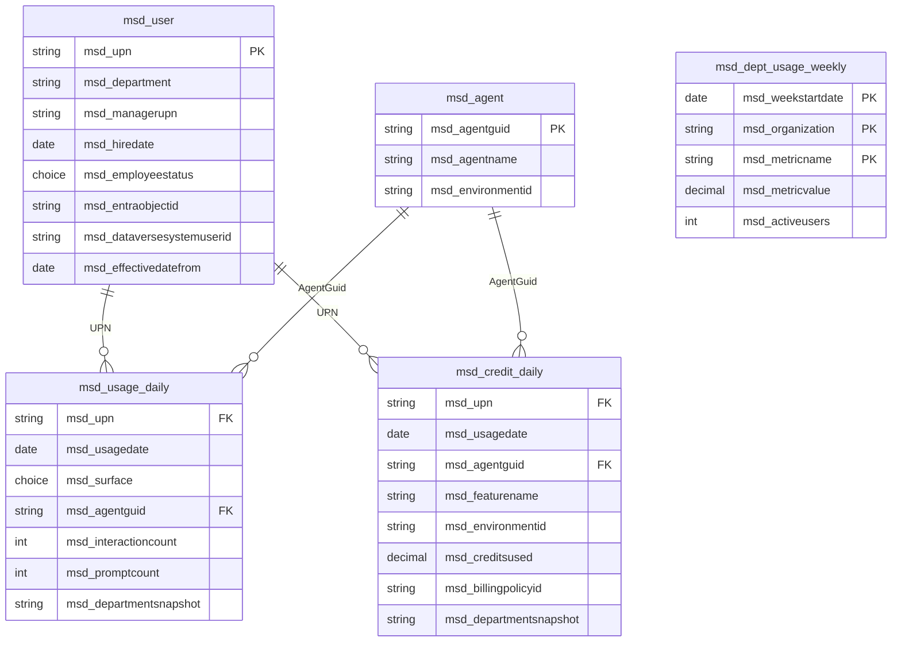
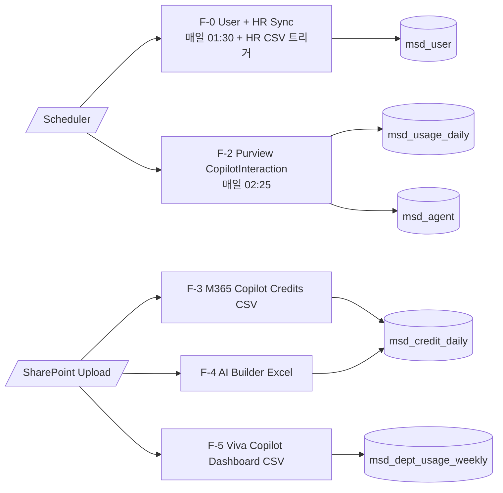

# M365 Copilot 사용량 대시보드 (v2.1)

> **문서 ID** : 20260625_M365_Copilot_사용자별_사용량_대시보드
> **버전** : v2.1 (2026-06-25) — v2.0 in-place 갱신
> **이전 버전** : v1.0 → [20260624](./20260624_M365_사용현황_인사이트_대시보드.md)
> **v2.0 → v2.1 변경** : ① Office 앱 내 Copilot은 **부서 단위만** 트래킹(Viva Copilot Dashboard CSV export) → Graph `getMicrosoft365CopilotUsageUserDetail` 호출 제거. ② **AI Builder Credit을 Copilot Credit으로 통합**(별도 통화 분리 폐기, Source 컬럼만 보존). ③ 신규입사자/조직변동을 위한 SCD 패턴 + Fact 테이블의 **DepartmentSnapshot** 컬럼.
> **근거 방식** : Microsoft Learn 1차 검증.

---

## 0. Executive Summary

| 항목 | 결정 |
| --- | --- |
| 수집 영역 | ① **부서별** Office 앱 내 Copilot 사용량 (Viva Copilot Dashboard 주간 CSV export) ② **사용자별** Copilot Studio Agent / BizChat / Bing / 기타 Copilot 호스트 활동 (Purview Audit) ③ **사용자별** Copilot Credit 소비 (M365 Credits report + PPAC + AI Builder report **통합**) |
| Dataverse 테이블 수 | **5개** (Dim 2 + Fact 3) |
| Power Automate 플로우 | **5개** (F-0 User/HR Sync · F-2 Audit · F-3 Copilot Credits · F-4 AI Builder Excel · F-5 Viva Copilot Dashboard CSV) |
| 신규입사/조직변동 | F-0가 매일 Graph + 월 1회 HR CSV로 `msd_user` 동기화. 모든 Fact는 적재 시점의 **`msd_departmentsnapshot`** 컬럼을 함께 기록 → 과거 활동은 **과거 부서**로 정확히 집계 |
| AI Builder 통합 | v2.1에서 별도 통화 분리 폐기. 모두 `msd_credit_daily`에 적재, `msd_source`로 출처 구분. *근거*: MS Learn — 2025-11-01부터 신규 고객은 Copilot Credit만, 2026-11-01에 seeded credit 완전 폐지. Copilot Studio agents/agent flows는 이미 Copilot Credit만 사용. |
| 핵심 한계 | Viva Copilot Dashboard export는 **preview**, tenant 최소 50 Copilot/Viva 라이선스, 사용자 ID는 anonymized — 개인별 매핑 불가, 부서별 집계 전용. |

### 0.1 사용자 의도와 v2.1 답
| 의도 | v2.1 처리 |
| --- | --- |
| "개인별 Office 365 내 Copilot 사용량은 안 봐도 됨" | ✅ Graph 사용량 보고서(v2.0의 F-1) 폐기. 부서별만 Viva CSV로. |
| "Viva Insights CSV로 부서별 Office Copilot 사용량 + 부서 메타데이터" | ✅ Copilot Dashboard **Export data** (preview)가 정확히 이 목적. AnonymousUserId지만 **Organization 필터**가 Entra ID `department` 또는 업로드한 `Microsoft_Organization` 기반 → 부서 집계 가능. |
| "Copilot Studio Agent 등 Copilot 호스트는 Purview 그대로" | ✅ F-2 유지. AppHost 매핑으로 BizChat/Bing/Studio Agent 구분. |
| "신규입사자/조직변동 고려" | ✅ Viva Insights 표준 패턴(`EffectiveDate`, 월 1회 HR 업데이트) 차용 + Fact 부서 스냅샷. |
| "AI Builder는 Copilot Credit으로 합쳐졌음" | ✅ MS Learn 검증 — 통합 진행 중. v2.1에서 단일 테이블. |

---

## 1. 데이터 소스 (검증)

| ID | 영역 | 소스 | 입자도 | 보존기간 | 접근 |
| --- | --- | --- | --- | --- | --- |
| **S-A** | 부서별 Office 앱 내 Copilot 사용량 | Viva Copilot Dashboard > **Export data** (preview, browser CSV 자동 다운로드) | Week × AnonymousUserId × **Organization** × Metric (Copilot actions in Word/Excel/PowerPoint/Outlook/Teams/OneNote/Edge, Copilot Chat web/work prompts, 등 30+) | 주간, 6개월 | UI 다운로드 → SharePoint |
| **S-B** | Copilot 상호작용 상세 (사용자별) | Purview Audit Log `RecordType=261 (CopilotInteraction)` via O365 Management Activity API | 이벤트별 (UserId/UPN, CreationTime, AppHost, AppIdentity, AgentName, Messages[isPrompt]) | Audit 보존정책 | App 토큰 (`ActivityFeed.Read`) |
| **S-C** | Copilot Credit (User × Agent × Day) | M365 Admin Center > Reports > Microsoft 365 Copilot > **Credits** (CSV export) | UPN × AgentId × BillingPolicyId × Day | preview 30일 | UI → SharePoint |
| **S-D** | Copilot Credit (PPAC Pay-as-you-go) | PPAC > Billing plan > Download reports | Caller ID(UPN) × Environment × Resource(Agent) × Meter × Datetime | rolling | UI → SharePoint |
| **S-E** | AI Builder 소비 | PPAC > Capacity > Add-ons > Download reports > **AI Builder** Excel | UserId(GUID) × EnvironmentId × Date × AIConsumption × IsTrial | rolling 30일 | UI → SharePoint |
| **S-F** | 사용자 + 부서 + 입사일 | Graph `/users?$select=id,userPrincipalName,displayName,department,jobTitle,employeeHireDate,accountEnabled` + (옵션) `/manager` | per-user | 실시간 | App 토큰 (`User.Read.All`) |
| **S-G** | (옵션) HR 부서/계층 | HR 시스템 CSV (Viva 표준 컬럼: PersonId/EffectiveDate/Organization/ManagerId/HireDate/LevelDesignation/FunctionType) | per-person × EffectiveDate | — | 운영자 월 1회 SharePoint 업로드 |
| **S-H** | Copilot Studio Agent 마스터 | Audit `AppIdentity=Copilot.Studio.<GUID>` + `AgentName` | per-agent | — | Audit |

### 1.1 검증된 한계
1. **Viva Copilot Dashboard Export**는 preview, tenant 최소 50 Copilot/Viva 라이선스, global access 권한자만 사용. **AnonymousUserId** — 개인별 재매핑 불가. **부서 단위 집계 전용**.
2. Viva Export는 weekly (Sunday-Saturday) 단위 6개월. **수동 다운로드** (자동 API 미지원, 2026-06 기준).
3. **사용자별 Copilot 프롬프트 카운트**(앱별)는 Graph API 미지원 (Microsoft 명시). v2.1은 Office 앱 안의 카운트는 **부서 단위 Viva 메트릭으로**, 개인별은 Audit으로 비식별 호스트(BizChat/Bing/Studio Agent) 만.
4. **S-C**는 preview, 30일 history, concealed names 기본 — 보고서 UI에서 toggle 후 export 필요 (Purview 자동 감사).
5. **S-E**의 UserId는 Dataverse User GUID. UPN 매핑은 `msd_user`의 `msd_dataversesystemuserid` 캐시로.
6. **AI Builder ↔ Copilot Credit 통합 시점**: MS 공식 — 2025-11-01부터 신규 가입은 Copilot Credit만, **2026-11-01에 seeded credit 완전 폐지**. 그 사이는 dual-mode (AIB → Copilot fallback). v2.1은 단일 통화 가정, dual-mode 환경은 `msd_source`로 추적.

---

## 2. Dataverse 데이터 모델 (5 테이블)

### 2.1 환경/솔루션
- 환경: **M365 Copilot Cockpit (Production)**, Korea Central, Dataverse DB.
- 솔루션: `M365CopilotCockpitCore`, prefix `msd_`.
- Auditing ON, Track changes ON, alternate key 정의.

### 2.2 Dim 테이블

#### `msd_user` — 사용자 + HR (SCD-1)
| 컬럼 | 타입 | 비고 |
| --- | --- | --- |
| `msd_userid` (PK) | Autonumber | |
| `msd_upn` | Text(320) | **Alternate Key** |
| `msd_displayname` | Text(256) | |
| `msd_department` | Text(128) | 현재 부서. HR CSV가 있으면 우선, 없으면 Entra `department` |
| `msd_managerupn` | Text(320) | |
| `msd_jobtitle` | Text(128) | |
| `msd_leveldesignation` | Text(64) | HR CSV reserved (옵션) |
| `msd_functiontype` | Text(64) | HR CSV reserved (옵션) |
| `msd_hiredate` | Date | Graph `employeeHireDate` 또는 HR `HireDate` |
| `msd_employeestatus` | Choice | `Active, OnLeave, Inactive` |
| `msd_entraobjectid` | Text(36) | Graph `id` |
| `msd_dataversesystemuserid` | Text(36) | F-4 (AI Builder Excel) UserId 매핑용 |
| `msd_effectivedatefrom` | Date | 현재 레코드 유효 시작일 (HR EffectiveDate) |
| `msd_lastsyncedutc` | DateTime | F-0 갱신 시각 |

> SCD Type-1 (현재 상태만). 이력 변경은 Dataverse Auditing/Track changes로 시스템 차원 보존. 비즈니스 쿼리는 Fact 측 `DepartmentSnapshot`에서.

#### `msd_agent` — Copilot Studio Agent
| 컬럼 | 타입 | 비고 |
| --- | --- | --- |
| `msd_agentid` (PK) | Autonumber | |
| `msd_agentguid` | Text(36) | **Alternate Key** — Audit `AppIdentity` 끝 GUID |
| `msd_agentname` | Text(256) | |
| `msd_environmentid` | Text(36) | |
| `msd_environmentname` | Text(128) | |
| `msd_firstseenutc` | DateTime | |

### 2.3 Fact 테이블

#### `msd_usage_daily` — 사용자별 Copilot 상호작용 (Audit 출처)
> v2.1: Surface는 검증된 AppHost 값 그대로 보존 (Word/Excel 등 Office 앱 surface도 수집은 함). 단 대시보드 시각화는 5장 KPI 규칙에 따라 분리.

| 컬럼 | 타입 | 비고 |
| --- | --- | --- |
| `msd_usagedailyid` (PK) | Autonumber | |
| `msd_upn` | Text(320) | |
| `msd_usagedate` | Date Only (UTC) | |
| `msd_surface` | Choice | `BizChat, Bing, Office, Word, Excel, PowerPoint, Outlook, OneNote, Loop, Teams, CopilotStudioAgent, Other` |
| `msd_agentguid` | Text(36) | Surface=CopilotStudioAgent 시 채움, 그 외 `'-'` |
| `msd_interactioncount` | Whole Number | 그룹별 이벤트 수 |
| `msd_promptcount` | Whole Number | `Messages[isPrompt=true]` 합 |
| `msd_departmentsnapshot` | Text(128) | **적재 시점의 user.department** (SCD-0) |
| `msd_source` | Choice | `PurviewAudit` |
| `msd_lastupdatedutc` | DateTime | |
| **Alt Key** | `(msd_upn, msd_usagedate, msd_surface, msd_agentguid)` | |

#### `msd_credit_daily` — 사용자별 Copilot Credit 소비 (AI Builder 통합)
| 컬럼 | 타입 | 비고 |
| --- | --- | --- |
| `msd_creditdailyid` (PK) | Autonumber | |
| `msd_upn` | Text(320) | F-4(AI Builder)의 UserId GUID는 F-0 캐시로 UPN 변환 |
| `msd_usagedate` | Date Only | |
| `msd_agentguid` | Text(36) | Source=AIBuilderReport 또는 환경 단위 적재 시 `'-'` |
| `msd_featurename` | Text(256) | M365 Credits report의 Feature, PPAC의 Meter Subcategory, AIB는 `'AIBuilder'` |
| `msd_environmentid` | Text(36) | |
| `msd_environmentname` | Text(128) | |
| `msd_creditsused` | Decimal(4) | Copilot Credit 단위로 정규화 (Source별 단위 차이는 footnote) |
| `msd_billingpolicyid` | Text(36) | |
| `msd_departmentsnapshot` | Text(128) | 적재 시점 user.department |
| `msd_source` | Choice | `M365CreditsReport, PPACPayAsYouGo, AIBuilderReport` |
| `msd_lastupdatedutc` | DateTime | |
| **Alt Key** | `(msd_upn, msd_usagedate, msd_agentguid, msd_featurename, msd_environmentid)` | |

#### `msd_dept_usage_weekly` — 부서별 주간 Copilot 사용 (Viva CSV 출처)
> Viva Export의 anonymized user-level 행을 부서별로 집계해 적재 (개인은 익명 ID 폐기, 부서 합계만 보존).

| 컬럼 | 타입 | 비고 |
| --- | --- | --- |
| `msd_deptusageweeklyid` (PK) | Autonumber | |
| `msd_weekstartdate` | Date Only | 일요일 (Viva 주 시작) |
| `msd_organization` | Text(128) | Viva의 Organization 필터값 = 부서 |
| `msd_metricname` | Text(128) | 예: `CopilotActionsTakenInWord`, `CopilotChatWebPromptsSubmitted` 등 |
| `msd_metricvalue` | Decimal(2) | 부서 합산값 |
| `msd_activeusers` | Whole Number | 해당 부서 활성 사용자 수 (non-zero 사용자 카운트) |
| `msd_source` | Choice | `VivaCopilotDashboardExport` |
| `msd_lastupdatedutc` | DateTime | |
| **Alt Key** | `(msd_weekstartdate, msd_organization, msd_metricname)` | |

### 2.4 ER 다이어그램



### 2.5 적재 멱등성 · SCD
- 모든 Fact는 alternate key 기반 **upsert** (재처리 안전).
- `msd_departmentsnapshot`은 **적재 시점에 user.department 값을 복사** (lookup 후 freeze). 사용자가 7월에 영업1팀 → 8월에 영업2팀 이동 시: 7월 Fact 행은 영업1팀, 8월 Fact 행은 영업2팀으로 유지 → **과거 활동의 부서별 집계가 왜곡되지 않음**.
- `msd_user`는 SCD-1 (overwrite). 이력은 Dataverse Auditing이 시스템 차원에서 보존.

---

## 3. Power Automate 플로우 (5개)

### 3.1 플로우 개요



### 3.2 공통 사전 준비
| 항목 | 내용 |
| --- | --- |
| Entra App 등록 | "M365 Cockpit Collector" — Application: `User.Read.All`, `ActivityFeed.Read` (O365 Mgmt API) |
| Client Secret | Azure Key Vault, Power Automate 환경변수에서 참조 |
| Dataverse Connection | 운영 Service Principal |
| SharePoint 라이브러리 | `/CockpitImport/CopilotCredits/`, `/AIBuilder/`, `/Viva/`, `/HR/` |
| Viva Copilot Dashboard | tenant에 ≥50 Copilot/Viva 라이선스 + global access 권한자 |

> **v2.1 변경**: `Reports.Read.All` 권한 제거 (Graph Copilot Usage Report 미사용).

---

### 3.3 F-0 : User & HR Sync (강화)

**트리거**:
- (자동) Recurrence 매일 01:30 KST → Graph `/users` 풀 동기화
- (반자동) SharePoint `/HR/hr_YYYYMMDD.csv` 업로드 트리거 → 월 1회 HR 데이터 반영

#### 매일 자동 분기
| # | 액션 | 상세 |
| --- | --- | --- |
| 1 | HTTP — Token (Graph) | scope `https://graph.microsoft.com/.default` |
| 2 | HTTP — List Users | `GET /v1.0/users?$select=id,userPrincipalName,displayName,department,jobTitle,employeeHireDate,accountEnabled&$top=999` (페이지네이션) |
| 3 | (옵션) HTTP — Manager | `GET /v1.0/users/{upn}/manager?$select=userPrincipalName` |
| 4 | Apply to each user | |
| 4-1 | Update a row | Table `msd_users`, alt key `msd_upn`, body: displayName, department, jobTitle, managerUpn, hiredate, employeestatus(`Active` if accountEnabled else `Inactive`), entraObjectId, effectivedatefrom=오늘, lastsyncedutc=`utcNow()` |
| 4-2 | (신규입사자) | 새 UPN → Update a row가 자동 생성 |
| 4-3 | (퇴직/비활성) | accountEnabled=false → employeestatus=`Inactive`. 데이터 삭제는 안 함 (historical 활동 보존). |

#### HR CSV 업로드 분기
| # | 액션 | 상세 |
| --- | --- | --- |
| 1 | Trigger | SharePoint "When file is created" — `/HR/` |
| 2 | Get file content | |
| 3 | Parse CSV (Office Script 또는 List rows present in a table) | Viva 권장 컬럼: PersonId(=UPN), EffectiveDate, Organization, ManagerId, HireDate, LevelDesignation, FunctionType |
| 4 | Apply to each row | |
| 4-1 | Update a row | alt key `msd_upn=PersonId`, body: department=Organization (HR이 Entra보다 우선), managerUpn=ManagerId, hiredate=HireDate, leveldesignation, functiontype, effectivedatefrom=EffectiveDate |
| 5 | Move file → `/HR/Archive/YYYY/MM/` | |

> **신규입사자/조직변동 처리**:
> - **신규입사자**: Graph 일일 동기화 시 새 UPN 등장 → 즉시 `msd_user` 신규 row. HR CSV 후속 도착 시 부서/매니저 갱신.
> - **부서 이동**: HR EffectiveDate가 변동되면 `msd_user.department` overwrite. **그 이후의 Fact 적재만 새 부서 스냅샷**, 과거 Fact의 DepartmentSnapshot은 그대로 (왜곡 방지).
> - **퇴직**: Graph `accountEnabled=false` → `msd_employeestatus=Inactive`. row 보존, 대시보드 필터에서 기본 제외.

---

### 3.4 F-2 : Purview CopilotInteraction (자동)

> v2.0의 F-2 동작 유지. v2.1에서 마지막 단계에 **DepartmentSnapshot 채우기 추가**.

| # | 액션 | 상세 |
| --- | --- | --- |
| 1 | HTTP — Token | scope `https://manage.office.com/.default` |
| 2 | HTTP — Start subscription (idempotent) | `POST /api/v1.0/{tenantId}/activity/feed/subscriptions/start?contentType=Audit.General` |
| 3 | Compose start/end | 어제 00:00 ~ 오늘 00:00 UTC |
| 4 | HTTP — List content | `GET /subscriptions/content?contentType=Audit.General&startTime=...&endTime=...` (페이지네이션) |
| 5 | Apply to each content URI → Get content → Filter RecordType=261 | |
| 6 | Compose — flatten + group by (UPN, Date, Surface, AgentGuid) | |
| 7 | (플로우 시작 시 1회) List rows — msd_user 전체 → Compose dictionary 캐시 | 1만 사용자 ≈ 2MB |
| 8 | Apply to each group | |
| 8-1 | Lookup currentDept from cache | |
| 8-2 | Update a row — msd_agent | Surface=CopilotStudioAgent일 때만, alt key=AgentGuid |
| 8-3 | Update a row — msd_usage_daily | alt key=(UPN, Date, Surface, AgentGuid). body: interactioncount, promptcount, **departmentsnapshot=currentDept**, source=PurviewAudit |

#### AppHost → Surface 매핑
```
BizChat → BizChat
Bing → Bing
Office → Office
Word/Excel/PowerPoint/OneNote/Teams → 동명
Loop → Loop
(AppIdentity ^Copilot.Studio.) → CopilotStudioAgent
default → Other
```

---

### 3.5 F-3 : M365 Copilot Credits (반자동)

| # | 액션 | 상세 |
| --- | --- | --- |
| 1 | Trigger SharePoint | `/CockpitImport/CopilotCredits/credits_YYYYMMDD.csv` |
| 2 | Get file content | |
| 3 | Parse CSV | M365 Credits report 컬럼 (UPN, AgentId, AgentName, BillingPolicyId, Date, CreditsUsed, Feature) |
| 4 | Apply to each row | |
| 4-1 | Update a row — msd_agent | alt key=AgentId, body AgentName |
| 4-2 | Get user dept (from F-0 cache) | |
| 4-3 | Update a row — msd_credit_daily | alt key=(UPN, Date, AgentId, Feature, `'-'`). body: creditsused, billingpolicyid, **departmentsnapshot**, source=M365CreditsReport |

#### 운영자 일과 (5분)
1. M365 Admin Center → Reports > Usage > Microsoft 365 Copilot > **Credits**.
2. 기간 30일 선택 → 우상단 Export → CSV 저장.
3. (UPN 노출 필요 시) Settings > Reports에서 concealed names 토글 후 export.
4. SharePoint 업로드.

---

### 3.6 F-4 : AI Builder Excel (v2.1에서 단일 통화로 통합)

> **v2.1 변경**: 별도 `CreditType` 컬럼 폐기. AIB의 AIConsumption은 `msd_credit_daily.msd_creditsused`로 동일 컬럼에 적재. `Source=AIBuilderReport`만으로 구분.

| # | 액션 | 상세 |
| --- | --- | --- |
| 1 | Trigger SharePoint | `/CockpitImport/AIBuilder/aib_YYYYMMDD.xlsx` |
| 2 | List rows present in a table (Excel Online) | 표준 컬럼: Date, UserId(GUID), EnvironmentId, EnvironmentName, AIConsumption, IsTrial |
| 3 | Apply to each row | |
| 3-1 | Lookup UPN | `msd_user where msd_dataversesystemuserid eq UserId`. 없으면 Graph `/users/{guid}` 조회 후 캐시. |
| 3-2 | Get dept from cache | |
| 3-3 | Update a row — msd_credit_daily | alt key=(UPN, Date, `'-'`, `'AIBuilder'`, EnvironmentId). body: creditsused=AIConsumption, environmentname, **departmentsnapshot**, source=AIBuilderReport |

#### 운영자 일과 (10분)
1. PPAC → Resources > Capacity > Summary > Add-ons **Download reports**.
2. New > AI Builder > Submit → 수 분 대기 → Download.
3. SharePoint `/AIBuilder/aib_YYYYMMDD.xlsx` 업로드.

---

### 3.7 F-5 : Viva Copilot Dashboard CSV (신규)

> v2.1 핵심 신규 플로우. **부서별** 주간 Copilot 사용량 집계.

**운영자 일과 (주 1회, 10분)**:
1. Teams > Viva Insights > **Copilot Dashboard** (global access 권한 필요).
2. 우상단 **Export data** 클릭 → 6개월 weekly CSV 자동 다운로드.
3. SharePoint `/CockpitImport/Viva/viva_YYYYMMDD.csv` 업로드.

#### Viva Export CSV 컬럼 (검증)
- **AnonymousUserId, WeekStartDate, Organization** (Entra `department` 또는 업로드한 `Microsoft_Organization`), **FunctionType** (옵션), 그리고 30+ 메트릭 컬럼:
  - "Copilot actions taken in Word/Excel/PowerPoint/Outlook/Teams/Edge/OneNote/Microsoft 365 Copilot app"
  - "Copilot Chat (web) prompts submitted (in Teams/Outlook)"
  - "Compose chat message actions taken using Copilot in Teams"
  - "Total Copilot enabled days"
  - "Returning Microsoft 365 Copilot user (28 days)" 등

#### 액션 상세
| # | 액션 | 상세 |
| --- | --- | --- |
| 1 | Trigger SharePoint | `/CockpitImport/Viva/` |
| 2 | Get file content | |
| 3 | CSV → table 변환 + List rows | (Office Script로 unpivot 권장) |
| 4 | Compose — group by (WeekStart, Organization, MetricName) | 익명 사용자의 메트릭값을 부서·메트릭별로 합산, 동시에 non-zero 사용자 수 카운트 |
| 5 | Apply to each group | |
| 5-1 | Update a row — msd_dept_usage_weekly | alt key=(WeekStart, Organization, MetricName). body: metricvalue=합, activeusers=non-zero 카운트, source=VivaCopilotDashboardExport |
| 6 | Move file → `/Viva/Archive/YYYY/MM/` | |

#### 한계 (정직)
- Viva Export는 **preview**, 향후 스키마 변경 가능 → F-5 첫 실행 시 컬럼 confirm 필수.
- **AnonymousUserId만 제공** → 개인 매핑 불가. **부서 단위 집계 전용**.
- "Copilot Chat (without Copilot license)" 분리 메트릭 포함 — 미라이선스 사용자도 부서 단위 활동 트래킹 가능.
- 권장 빈도: **주 1회** (Sunday-Saturday 완성주 기준).

---

## 4. 사용자별 + 부서별 KPI

### 4.1 사용자별 KPI (msd_usage_daily / msd_credit_daily)

| KPI | 출처 |
| --- | --- |
| 사용자 30일 Copilot 활동 (Surface별) | usage_daily where UPN=@u GROUP BY Surface |
| 사용자 30일 Copilot Credit 소비 | credit_daily where UPN=@u SUM(creditsused) |
| Top 20 Copilot 헤비 유저 (BizChat + Studio Agent) | usage_daily where Surface IN (BizChat, CopilotStudioAgent) GROUP BY UPN |
| 사용자×Agent 매트릭스 | usage_daily where Surface=CopilotStudioAgent GROUP BY (UPN, AgentGuid) |
| 사용자별 Top Agent | 같은 그룹의 사용자별 최다 사용 Agent |
| Top 20 Credit 소비자 | credit_daily GROUP BY UPN |

### 4.2 부서별 KPI (msd_dept_usage_weekly + Fact의 DepartmentSnapshot)

| KPI | 출처 |
| --- | --- |
| 부서별 Office Copilot 활동 (Word/Excel/PPT/Outlook/Teams 등) | dept_usage_weekly where MetricName LIKE 'CopilotActionsTakenIn%' GROUP BY Organization |
| 부서별 30일 Credit 소비 | credit_daily GROUP BY DepartmentSnapshot |
| 부서별 Copilot Studio Agent 활성 사용자 | usage_daily where Surface=CopilotStudioAgent GROUP BY DepartmentSnapshot, COUNT DISTINCT UPN |
| 부서별 Copilot 도입률 | dept_usage_weekly의 activeusers / 부서 인원수 (msd_user count) |
| 부서별 Returning user (28d) | dept_usage_weekly where MetricName='ReturningM365CopilotUser28Days' |

### 4.3 조직 변동 분석
| KPI | 출처 |
| --- | --- |
| 신규입사자 30일 Copilot 활용도 | usage_daily JOIN user WHERE user.HireDate >= today-30 |
| 부서 이동자 활용 변화 | (Fact.DepartmentSnapshot != current msd_user.department) 인 사용자의 이전/이후 활동 비교 |
| 미활성 라이선스 사용자 | user where employeestatus=Active AND NOT EXISTS(usage_daily where UPN=user.UPN AND usagedate>=today-30) |

---

## 5. 보안 (요약)
- **App Permissions**: `User.Read.All` (Graph), `ActivityFeed.Read` (O365 Mgmt API). v2.0의 `Reports.Read.All` 제거 → 더 최소권한.
- **익명화**:
  - Viva Export: 자체 anonymized.
  - M365 Credits report: concealed names 기본. F-3 운영자가 export 전 toggle (Purview 자동 감사).
- **Sensitivity Label**: 5개 테이블 모두 "Confidential / Internal".
- **PII**: dept_usage_weekly에 개인 식별자 없음. usage_daily / credit_daily에 UPN 보유 → 보안팀 결재 절차.

---

## 6. 한계/주의 (정직한 고지)

1. **Viva Copilot Dashboard "Export data"는 preview** — GA 일정/스키마 변동 가능. tenant 자격 (≥50 Copilot/Viva license) 확인 필수.
2. Viva 데이터는 **주간 단위 6개월**만 export — 누적 보관은 Dataverse 책임.
3. **AnonymousUserId** — Viva 데이터로 개인 분석 불가. 개인 분석은 Audit/Credit 출처에서만.
4. **사용자 프롬프트 카운트**: Office 앱 내 카운트는 부서 단위 Viva 메트릭으로, Studio/BizChat는 Audit 이벤트 카운트 근사.
5. **AI Builder ↔ Copilot Credit 통합 단위**: 환경에 따라 dual-mode (AIB → Copilot fallback) 가능 → `creditsused` 단위 해석 시 `source` 확인. 분석 footnote 명시.
6. **F-2 DepartmentSnapshot 정확도**: `msd_user` cache는 플로우 시작 시점. 같은 날 부서 변경되면 한쪽 스냅샷 가능 — 일별 적재 + HR 월 1회 사이클이면 실무적 충분.
7. **신규입사자 등록 lag**: Graph가 새 UPN 노출까지 통상 수 시간. F-0 매일 1회 → D+1 반영. 즉시성 필요 시 Graph delta query 확장.
8. **퇴직자**: `Inactive` 마킹만, 삭제 안 함 — 1년+ 누적 시 `msd_user` 사이즈는 sustainable. Dataverse 용량 분기 모니터링.

---

## 7. 참고 (Microsoft Learn)

| 주제 | URL |
| --- | --- |
| Viva Copilot Dashboard (커넥트·필터·Organization) | https://learn.microsoft.com/viva/insights/org-team-insights/copilot-dashboard |
| Viva Copilot Dashboard Export data (preview, 메트릭 카탈로그) | https://learn.microsoft.com/viva/insights/org-team-insights/export-copilot-metrics |
| Viva Insights — Org data 업로드 (Microsoft_Organization 등) | https://learn.microsoft.com/viva/insights/advanced/admin/manage-settings-copilot-dashboard |
| Viva HR file (PersonId, EffectiveDate, ManagerId, HireDate, LevelDesignation) | https://learn.microsoft.com/viva/insights/advanced/admin/prepare-org-data |
| Viva subsequent upload (신규/조직변동/삭제) | https://learn.microsoft.com/viva/insights/advanced/admin/upload-org-data-subsequent |
| Viva API import (preview, incremental) | https://learn.microsoft.com/viva/insights/advanced/admin/import-org-data-subsequent |
| Purview Audit Copilot 스키마 | https://learn.microsoft.com/purview/audit-copilot |
| O365 Mgmt API CopilotInteraction (RecordType 261) | https://learn.microsoft.com/office/office-365-management-api/copilot-schema |
| M365 Copilot Credits Report | https://learn.microsoft.com/microsoft-365/admin/activity-reports/microsoft-365-copilot-credits |
| Copilot Credits 빌링 레이트 | https://learn.microsoft.com/microsoft-copilot-studio/requirements-messages-management |
| AI Builder → Copilot Credit 통합 일정 | https://learn.microsoft.com/ai-builder/endofaibcredits |
| AI Builder Licensing 개요 | https://learn.microsoft.com/ai-builder/administer-licensing |
| AI Builder Consumption Report | https://learn.microsoft.com/ai-builder/administer-consumption-report |
| PPAC Pay-as-you-go 사용량 리포트 | https://learn.microsoft.com/power-platform/admin/pay-as-you-go-usage-costs |
| Dataverse Web API Upsert | https://learn.microsoft.com/power-apps/developer/data-platform/use-upsert-insert-update-record |
| Graph /users employeeHireDate | https://learn.microsoft.com/graph/api/user-get |

---

## 8. v2.0 → v2.1 변경 요약

| 영역 | v2.0 | v2.1 |
| --- | --- | --- |
| Office 앱 내 Copilot | 개인별 (Graph `getMicrosoft365CopilotUsageUserDetail`) | **부서별** (Viva Copilot Dashboard Export CSV) |
| AI Builder | 별도 통화 `CreditType=AIBuilderCredit` | **Copilot Credit으로 통합** (`Source` 컬럼으로 출처 구분) |
| 사용자 변동 처리 | 없음 | **F-0 강화**: Graph + HR CSV, `employeestatus`/`hiredate`/`effectivedatefrom` + Fact의 **DepartmentSnapshot** |
| Dataverse 테이블 | 4 (user/agent/usage/credit) | **5** (+ dept_usage_weekly) |
| Power Automate 플로우 | F-0~F-4 (5개) | **F-0/F-2/F-3/F-4/F-5 (5개)**. F-1 (Graph Copilot Usage) 제거, F-5 (Viva) 신규 |
| 권한 | + `Reports.Read.All` | `Reports.Read.All` 제거 → 더 최소권한 |

✅ **합의. 설계도 v2.1 발행 (2026-06-25).**
