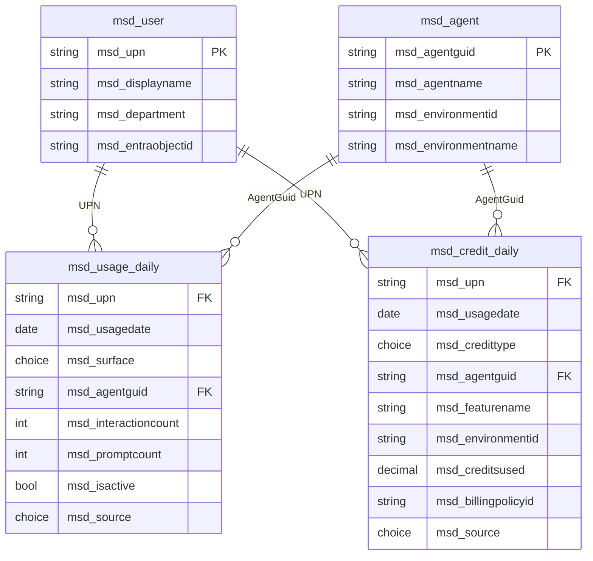
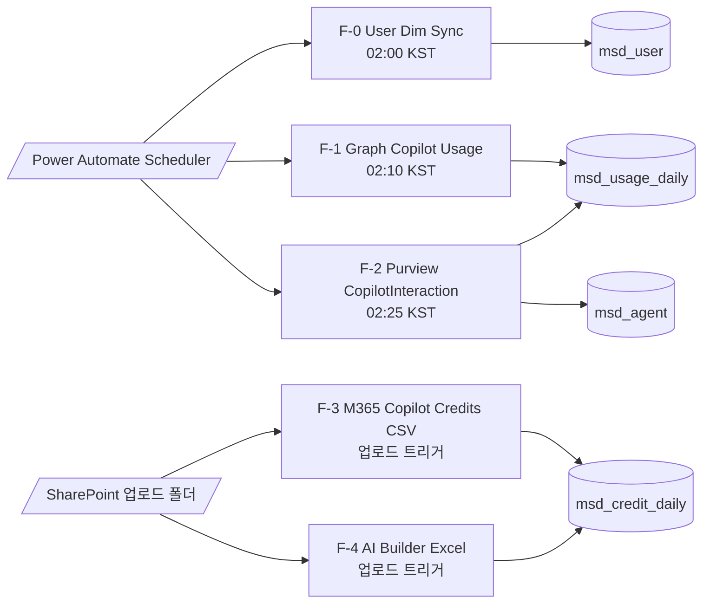
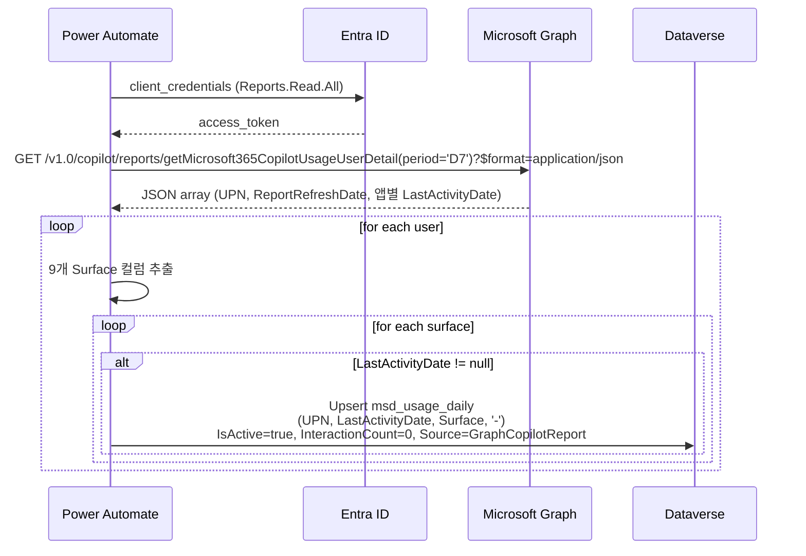

# M365 Copilot 사용자별 사용량 대시보드 (v2.0)

> **문서 ID** : 20260625_M365_Copilot_사용자별_사용량_대시보드
> **버전** : v2.0 (2026-06-25)
> **이전 버전** : [v1.0 (2026-06-24)](./20260624_M365_사용현황_인사이트_대시보드.md)
> **범위 변경** : Office 365 활성도(Teams/Outlook/OneDrive/SharePoint 사용량) 트래킹 **제거**. **M365 Copilot + Copilot Studio Agent + Copilot Credit + AI Builder Credit** 4개 영역으로 압축, **사용자(UPN)별 분석**을 핵심 KPI로 격상.
> **근거 방식** : Microsoft Learn 1차 문서로 검증한 사실만 기재. 검증되지 않은 부분은 "한계/주의"로 분리.

---

## 0. Executive Summary

| 항목 | 결정 |
| --- | --- |
| 수집 영역 | ① M365 Copilot 사용량 (Word/Excel/PowerPoint/Outlook/OneNote/Loop/Teams 내 Copilot 기능 + Copilot Chat + M365 Copilot 앱) ② Copilot Studio에서 배포된 Agent 사용량 ③ Copilot Credit 소비 ④ AI Builder Credit 소비 |
| 핵심 단위 | **UPN × Date** (사용자별 일 단위) — 모든 Fact 테이블의 alternate key 첫 컬럼 |
| Dataverse 테이블 수 | **4개** (Dim 2 + Fact 2) — Bronze/Silver/Gold 계층 폐기, 단일 정규화 모델로 단순화 |
| 수집 주기 | 매일 02:00~02:45 KST 4개 Power Automate 플로우 직렬 실행 |
| 자동/반자동 | F-1·F-2 완전 자동 (Graph + Purview Audit API). F-3·F-4 반자동 (CSV/XLSX 수동 업로드 → SharePoint 트리거) |
| 핵심 한계 | Microsoft 공식: **테넌트에 걸쳐 사용자별 Copilot 프롬프트 카운트는 미지원**. 따라서 **활동 횟수는 Purview Audit `CopilotInteraction` 이벤트 카운트로 근사**. |

### 0.1 사용자가 가졌던 의문에 대한 답
| 질문 | 답 (검증) |
| --- | --- |
| "각 Office 앱의 Copilot 기능도 M365 Copilot 사용량에 포함되나?" | ✅ **포함**. Graph `getMicrosoft365CopilotUsageUserDetail`은 Word/Excel/PowerPoint/Outlook/OneNote/Loop/Teams 내 Copilot 기능을 자동으로 M365 Copilot 사용량에 합산하고, **앱별 Last Activity Date를 사용자별로 반환**. |
| "Copilot Studio Agent 사용량이 Copilot 사용량에 포함되나, 별개인가?" | **별개로 처리하는 것이 정확**. M365 Copilot Usage 보고서는 Copilot 라이선스 사용자의 앱별 활동을 보여주고, Copilot Studio Agent와의 상호작용은 Purview Audit `CopilotInteraction (AppIdentity=Copilot.Studio.<GUID>)`로 별도 추적. 이렇게 해야 "어떤 사용자가 어떤 Agent와 얼마나 대화했는지" 답할 수 있다. |
| "AI Builder는 Copilot Credit으로 차감되니 같이 봐야 하나?" | **별도 트래킹 권장**. 검증 사실: AI Builder와 Copilot Credit은 **별개 통화**(currency). AI Builder 환경 액션은 **먼저 AI Builder Credit을 소진, 부족 시 Copilot Credit fallback**. 따라서 두 통화를 동일 Fact 테이블에 `CreditType` 컬럼으로 구분 저장하되, 합산 시 단위를 명확히 표시한다. |
| "최대한 Dataverse 테이블을 간소화" | ✅ **4개 테이블 (Dim 2 + Fact 2)**. v1.0의 Bronze/Silver/Gold 9테이블 → 정규화된 4개로 축소. |

---

## 1. 데이터 소스 (검증)

| ID | 영역 | 소스 | 사용자별 입자도(granularity) | 보존기간 (Microsoft 측) | 접근 방법 |
| --- | --- | --- | --- | --- | --- |
| **S-A** | M365 Copilot 라이선스 사용자의 앱별 활동 | Graph v1.0 `/copilot/reports/getMicrosoft365CopilotUsageUserDetail(period='D7')` | UPN × App별 LastActivityDate (Word/Excel/PowerPoint/Outlook/OneNote/Loop/Teams/Copilot Chat/M365 Copilot 앱) | rolling D7/D30/D90/D180/ALL | App 토큰 (`Reports.Read.All`) |
| **S-B** | Copilot 상호작용 카운트 (전체 호스트) | Purview Audit Log `RecordType=CopilotInteraction` (Office 365 Management Activity API) | 이벤트별: UserId(UPN), AppHost, AppIdentity, AgentId, AgentName | 조직 Audit 보존정책 | App 토큰 (`ActivityFeed.Read`) |
| **S-C** | Copilot Credit 소비 (사용자×에이전트) | M365 Admin Center > Reports > Microsoft 365 Copilot > **Credits** 리포트 (CSV export) | **User × Agent × Day**, Billing Policy 단위 | preview 시점 최근 30일 | UI 다운로드 → SharePoint 업로드 |
| **S-D** | Copilot Credit 소비 (Pay-as-you-go 환경별/리소스별) | PPAC > Billing plan > **Download reports** | Caller ID(UPN) × Environment × Resource(Agent ID) × Meter × Datetime | rolling | UI 다운로드 → SharePoint 업로드 |
| **S-E** | AI Builder Credit 소비 | PPAC > Resources > Capacity > Add-ons > **Download reports > AI Builder** (Excel) | UserId × EnvironmentId × Date × AIConsumption(크레딧) | rolling 30일 | UI 다운로드 → SharePoint 업로드 |
| **S-F** | 사용자 디렉터리 | Graph `/users?$select=id,userPrincipalName,displayName,department` | per-user | 실시간 | App 토큰 (`User.Read.All`) |
| **S-G** | Copilot Studio Agent 메타데이터 | Audit 이벤트의 `AppIdentity=Copilot.Studio.<GUID>`, `AgentName` (선택) Dataverse `bot` 테이블 | per-agent | — | Audit 또는 Dataverse |

### 1.1 검증된 한계
1. **사용자별 Copilot 프롬프트 카운트 API 미지원** (Microsoft 명시: *"Tracking per-user Copilot prompt counts across tenants isn't supported due to privacy and security constraints"*). → `S-B` (Audit 이벤트 수) 로 근사.
2. **S-C (M365 Copilot Credits 리포트) 프로그래밍 export 없음** (preview 단계 30일 history). → 운영자 매일 1회 CSV 다운로드.
3. **S-E (AI Builder Consumption) 프로그래밍 API 없음**. → 운영자 매일 1회 Excel 다운로드.
4. **AI Builder 리포트는 에이전트 차원이 없다** — User × Environment × Date만 제공. 모델별 분해는 Dataverse `AI Event` 테이블 필요 (본 v2.0 범위 외, 옵션).
5. **Audit `CopilotInteraction`의 `Messages` 배열은 prompt-response 쌍을 포함**. "이벤트 1개 = 프롬프트 1회"로 카운트하는 것이 보수적이며, 실제 프롬프트 수는 `IsPrompt=true` 메시지 수로 더 정확히 산출 가능.

---

## 2. Dataverse 데이터 모델 (간소화: 4 테이블)

### 2.1 환경/솔루션
- 환경: **M365 Copilot Cockpit (Production)**, Region: Korea Central, Dataverse DB 활성화.
- 솔루션: `M365CopilotCockpitCore`, publisher prefix `msd_`.
- 모든 테이블: **Auditing ON**, **Track changes ON**, **alternate key 정의**.

### 2.2 Dim 테이블

#### `msd_user` — 사용자 마스터
| 컬럼 (논리명) | 타입 | 비고 |
| --- | --- | --- |
| `msd_userid` (primary) | Autonumber | |
| `msd_upn` | Single Line of Text (320) | **Alternate Key** (unique) |
| `msd_displayname` | Single Line of Text (256) | |
| `msd_department` | Single Line of Text (128) | nullable |
| `msd_entraobjectid` | Single Line of Text (36) | Graph `id` |
| `msd_jobtitle` | Single Line of Text (128) | nullable |
| `msd_lastsyncedutc` | Date and Time | F-0 갱신 시각 |

#### `msd_agent` — Copilot Studio Agent 마스터
| 컬럼 | 타입 | 비고 |
| --- | --- | --- |
| `msd_agentid` (primary) | Autonumber | |
| `msd_agentguid` | Single Line of Text (36) | **Alternate Key** — Copilot Studio Agent GUID (Audit `AppIdentity` 끝 GUID 또는 PPAC Resource ID) |
| `msd_agentname` | Single Line of Text (256) | Audit `AgentName`에서 발견 시 채움 |
| `msd_environmentid` | Single Line of Text (36) | |
| `msd_environmentname` | Single Line of Text (128) | |
| `msd_firstseenutc` | Date and Time | 첫 발견 시각 |

> Microsoft 365 Copilot 자체 (Word·Excel 등 첫 9개 surface)는 별도 마스터가 필요 없다 — `msd_usage_daily.msd_surface` Choice 컬럼으로 표현.

### 2.3 Fact 테이블

#### `msd_usage_daily` — 사용자×표면×일 활동
> Surface = 사용자가 Copilot을 사용한 "표면" (앱 또는 Agent). **단 1 행이 (UPN, Date, Surface, AgentGuid)를 유일 식별.**

| 컬럼 | 타입 | 비고 |
| --- | --- | --- |
| `msd_usagedailyid` (primary) | Autonumber | |
| `msd_upn` | Single Line of Text (320) | Audit/Graph 응답의 UserPrincipalName |
| `msd_usagedate` | Date Only (UTC) | 일 단위 |
| `msd_surface` | Choice | `Word, Excel, PowerPoint, Outlook, OneNote, Loop, Teams, CopilotChat, M365CopilotApp, BizChat, Bing, Office, CopilotStudioAgent, Other` |
| `msd_agentguid` | Single Line of Text (36) | Surface=CopilotStudioAgent 시 필수, 그 외 `'-'` (NULL은 alternate key 제약상 불가, dash sentinel 사용) |
| `msd_interactioncount` | Whole Number | Audit 출처에서 이벤트 카운트. Graph 출처에서는 0. |
| `msd_promptcount` | Whole Number | Audit `Messages[].isPrompt=true` 카운트 (선택적 정밀 카운트) |
| `msd_isactive` | Two Options (Yes/No) | Graph 출처에서 LastActivityDate=usagedate면 Yes |
| `msd_source` | Choice | `GraphCopilotReport, PurviewAudit` |
| `msd_lastupdatedutc` | Date and Time | upsert 시각 |
| **Alternate Key** | `(msd_upn, msd_usagedate, msd_surface, msd_agentguid)` | 멱등 upsert 보장 |

#### `msd_credit_daily` — 사용자×크레딧타입×일 소비
| 컬럼 | 타입 | 비고 |
| --- | --- | --- |
| `msd_creditdailyid` (primary) | Autonumber | |
| `msd_upn` | Single Line of Text (320) | S-E의 UserId는 Dataverse User GUID — F-4에서 UPN으로 보강 |
| `msd_usagedate` | Date Only (UTC) | |
| `msd_credittype` | Choice | `CopilotCredit, AIBuilderCredit` |
| `msd_agentguid` | Single Line of Text (36) | S-C/S-D의 Agent 차원. S-E(AIB)는 `'-'`. |
| `msd_featurename` | Single Line of Text (256) | S-D의 Meter Subcategory, S-E의 모델명 등 (nullable) |
| `msd_environmentid` | Single Line of Text (36) | S-D/S-E. S-C는 `'-'`. |
| `msd_environmentname` | Single Line of Text (128) | |
| `msd_creditsused` | Decimal (4 소수) | 단위는 CreditType별 의미가 다름 (Copilot Credit vs AI Builder Credit) |
| `msd_billingpolicyid` | Single Line of Text (36) | S-C/S-D에서만 채움 |
| `msd_source` | Choice | `M365CreditsReport, PPACPayAsYouGo, AIBuilderReport` |
| `msd_lastupdatedutc` | Date and Time | |
| **Alternate Key** | `(msd_upn, msd_usagedate, msd_credittype, msd_agentguid, msd_environmentid)` | |

### 2.4 ER 다이어그램



### 2.5 멱등성 (Idempotency)
- Power Automate **`Update a row`** 액션은 alternate key를 사용해 upsert(없으면 생성, 있으면 갱신)를 수행한다. Dataverse Web API의 `PATCH /api/data/v9.2/msd_usage_dailies(msd_upn='alice@contoso.com',msd_usagedate=2026-06-24,msd_surface=706580000,msd_agentguid='-')` 와 동등.
- 같은 날 같은 플로우를 재실행해도 같은 (UPN, Date, Surface, AgentGuid) 행은 덮어쓰기 → **재처리 안전**.

---

## 3. Power Automate 플로우 (4개)

### 3.1 플로우 개요



> **F-0**은 보조 (사용자 디렉터리 갱신). 본 v2.0에선 5개 플로우가 되지만 핵심은 F-1~F-4 4개.

### 3.2 공통 사전 준비

| 항목 | 내용 |
| --- | --- |
| Entra App 등록 | "M365 Cockpit Collector" — Application 권한 `Reports.Read.All`, `User.Read.All`, `ActivityFeed.Read` (O365 Management API용 Office 365 Management API 권한) |
| Client Secret | Azure Key Vault 보관, Power Automate 환경변수에서 Key Vault 참조 |
| Dataverse Connection | 같은 환경의 Dataverse, 운영 서비스 계정 (또는 Service Principal) |
| SharePoint 라이브러리 | `/sites/cockpit/CockpitImport/CopilotCredits/`, `/sites/cockpit/CockpitImport/AIBuilder/` (운영자만 쓰기 권한) |

---

### 3.3 F-0 : User Dim Sync (보조)

**트리거**: Recurrence — 매일 02:00 KST.
**목적**: `msd_user`를 최신 상태로 유지.

| 단계 | 액션 | 상세 |
| --- | --- | --- |
| 1 | HTTP — Get Token | POST `https://login.microsoftonline.com/{tenantId}/oauth2/v2.0/token`, body `grant_type=client_credentials&client_id={env}&client_secret={env}&scope=https://graph.microsoft.com/.default` |
| 2 | HTTP — Graph | `GET https://graph.microsoft.com/v1.0/users?$select=id,userPrincipalName,displayName,department,jobTitle&$top=999` (페이지네이션: `@odata.nextLink` 루프) |
| 3 | Parse JSON | 사용자 배열 |
| 4 | Apply to each user | |
| 4-1 | Update a row (Dataverse) | Table `msd_users`, alternate key `msd_upn = items('Apply_to_each')?['userPrincipalName']`, set DisplayName / Department / EntraObjectId / JobTitle / LastSyncedUtc=`utcNow()` |

---

### 3.4 F-1 : Graph M365 Copilot Usage (자동)

**트리거**: Recurrence — 매일 02:10 KST.
**소스**: S-A.
**출력**: `msd_usage_daily` (Source=GraphCopilotReport).

#### 시퀀스


#### 액션 상세
| # | 액션 | 입력 |
| --- | --- | --- |
| 1 | HTTP — Get Token | (F-0과 동일) |
| 2 | HTTP — Get Copilot Usage | `GET https://graph.microsoft.com/v1.0/copilot/reports/getMicrosoft365CopilotUsageUserDetail(period='D7')?$format=application/json`, header `Authorization: Bearer @{outputs('Token').body.access_token}` |
| 3 | Parse JSON | schema: `[{userPrincipalName, reportRefreshDate, copilotChatLastActivityDate, microsoftTeamsCopilotLastActivityDate, wordCopilotLastActivityDate, excelCopilotLastActivityDate, powerPointCopilotLastActivityDate, outlookCopilotLastActivityDate, oneNoteCopilotLastActivityDate, loopCopilotLastActivityDate, copilotAppLastActivityDate}]` (실제 필드명은 Graph 응답 기준) |
| 4 | Apply to each (user) | |
| 4-1 | Compose surfaceMap | 키-값: `Word`→wordCopilotLastActivityDate, `Excel`→excelCopilotLastActivityDate, ... 9개 |
| 4-2 | Apply to each (surface in surfaceMap) | |
| 4-2-a | Condition | `@not(empty(items('surface').value))` |
| 4-2-a-Y | Update a row | Table `msd_usage_dailies`, alternate key `msd_upn` = UPN, `msd_usagedate` = surface.value (LastActivityDate), `msd_surface` = surface.key choice value, `msd_agentguid` = `'-'`. Body: `msd_isactive=true`, `msd_interactioncount=0`, `msd_source=GraphCopilotReport`, `msd_lastupdatedutc=utcNow()` |
| 5 | Configure run after — Failure | Teams 알림: "F-1 실패: @{outputs('HTTP').statusCode}" |

> **주의**: Graph 응답 필드명은 사용자 테넌트 시점에 확정. 위는 Microsoft Learn 보고서 컬럼 명칭 (Word/Excel/PowerPoint/Outlook/OneNote/Loop/Teams/Copilot Chat/Microsoft 365 Copilot 앱) 의 표준 대응을 가정 — 첫 실행 시 실제 응답으로 `Parse JSON` 스키마를 confirm.

#### 환경변수
- `env_TenantId`, `env_ClientId`, `env_ClientSecretRef` (Azure Key Vault 참조)

---

### 3.5 F-2 : Purview CopilotInteraction (자동)

**트리거**: Recurrence — 매일 02:25 KST.
**소스**: S-B (O365 Management Activity API, RecordType=`CopilotInteraction`).
**출력**: `msd_usage_daily` (Source=PurviewAudit, InteractionCount/PromptCount 채움) + `msd_agent` upsert.

#### 핵심 로직
- **윈도**: 어제 00:00 ~ 24:00 UTC (전일 24시간).
- 이벤트 → `(UPN, Date, AppHost→Surface 매핑, AgentGuid)` 키로 그룹화 → `InteractionCount=count(*)`, `PromptCount=sum(IsPrompt msg)`.
- `AppHost` → `msd_surface` 매핑:
  - `BizChat` → CopilotChat (Microsoft 365 Copilot Chat)
  - `Bing` → Bing
  - `Office` → Office
  - `Word/Excel/PowerPoint/OneNote/Teams` → 동명
  - `Loop` → Loop
  - `Studio` 또는 AppIdentity=`Copilot.Studio.<GUID>` → CopilotStudioAgent (+ AgentGuid 세팅)
  - 그 외 → Other.

#### 액션 상세
| # | 액션 | 입력 |
| --- | --- | --- |
| 1 | HTTP — Get Token | scope `https://manage.office.com/.default` |
| 2 | HTTP — Start subscription (idempotent) | `POST https://manage.office.com/api/v1.0/{tenantId}/activity/feed/subscriptions/start?contentType=Audit.General` (이미 활성이면 200 또는 400 무시) |
| 3 | Compose start/end | `startTime = formatDateTime(addDays(utcNow(),-1),'yyyy-MM-ddT00:00:00')`, `endTime = formatDateTime(utcNow(),'yyyy-MM-ddT00:00:00')` |
| 4 | HTTP — List content | `GET https://manage.office.com/api/v1.0/{tenantId}/activity/feed/subscriptions/content?contentType=Audit.General&startTime=@{startTime}&endTime=@{endTime}` → 페이지네이션 |
| 5 | Apply to each content URI | |
| 5-1 | HTTP — Get content | `GET {contentUri}` |
| 5-2 | Parse JSON (event array) | |
| 5-3 | Filter array | `@equals(item()?['RecordType'], 261)` (RecordType 261 = CopilotInteraction) |
| 5-4 | Compose — flatten | 각 event → `{UPN: UserId, Date: substring(CreationTime,0,10), AppHost: CopilotEventData.AppHost, AppIdentity: CopilotEventData.AppIdentity, AgentName: AgentName(있으면), Messages: CopilotEventData.Messages}` |
| 5-5 | Append to array variable | 결과 누적 |
| 6 | Compose — Group by (UPN, Date, Surface, AgentGuid) | (PA 자체 `groupBy` 미지원 → Office Script 또는 Filter array + length 패턴 사용) |
| 7 | Apply to each group | |
| 7-1 | Update a row — msd_agent | Surface=CopilotStudioAgent일 경우 alternate key=`msd_agentguid`, body: `msd_agentname=AgentName, msd_firstseenutc=utcNow()` (없으면 생성) |
| 7-2 | Update a row — msd_usage_daily | alternate key=`(UPN, Date, Surface, AgentGuid)`, body: `msd_interactioncount=group count`, `msd_promptcount=sum of IsPrompt=true`, `msd_source=PurviewAudit`, `msd_isactive=true`, `msd_lastupdatedutc=utcNow()` |

#### AppHost → Surface 매핑 표 (`Compose Surface lookup`)
```
BizChat        → CopilotChat
Bing           → Bing
Office         → Office
Word           → Word
Excel          → Excel
PowerPoint     → PowerPoint
OneNote        → OneNote
Loop           → Loop
Teams          → Teams
(AppIdentity ^Copilot.Studio.) → CopilotStudioAgent
default        → Other
```

#### 운영 메모
- O365 Management Activity API 구독은 **F-2 최초 1회 활성화** 후 영구. 매일 호출은 List Content만.
- 페이지네이션: List Content 응답이 비어 있으면 종료. `nextPageUri` 헤더 처리.
- Audit이 늦게 도착하는 경우 (~24h lag) 가 있어 **D-2 윈도** (2일 전) 로 보정 실행하는 보조 플로우 옵션도 고려.

---

### 3.6 F-3 : M365 Copilot Credits 적재 (반자동)

**트리거**: SharePoint — When a file is created or modified (properties only) — 라이브러리 `CockpitImport/CopilotCredits/`.
**소스**: S-C (M365 Admin Center > Reports > Microsoft 365 Copilot > Credits 화면의 **Export** CSV).
**출력**: `msd_credit_daily` (CreditType=CopilotCredit, Source=M365CreditsReport).

#### 운영자 일과 (5분 작업)
1. M365 Admin Center 로그인 → Reports > Usage > Microsoft 365 Copilot > Credits 탭 진입.
2. 기간 30일 선택 → 우상단 **Export** 클릭, CSV 저장.
3. SharePoint `CockpitImport/CopilotCredits/credits_YYYYMMDD.csv`로 업로드.

#### 액션 상세
| # | 액션 | 입력 |
| --- | --- | --- |
| 1 | Trigger | SharePoint "When a file is created (properties only)" — 라이브러리 path 필터 |
| 2 | Get file content | id = trigger.outputs.body/id |
| 3 | Convert CSV → JSON | OneDrive/Excel 커넥터의 List rows present in a table 또는 Office Script 호출. 권장: 운영자가 업로드 전 Excel 변환 (CSV→XLSX 후 Table 변환) — 자동화 안정성. 또는 Power Automate의 `select` + `split(body,'\n')` 텍스트 파싱. |
| 4 | Apply to each row | |
| 4-1 | Compose — date / upn / agent | M365 Credits report 컬럼: `Date, User Principal Name, Display Name, Agent Name, Agent ID, Billing Policy ID, Credits Used` (Microsoft Learn 명세 기준) |
| 4-2 | Update a row — msd_agent | alternate key=AgentId, body AgentName |
| 4-3 | Update a row — msd_credit_daily | alternate key=`(UPN, Date, CopilotCredit, AgentId, '-')`. body: `msd_creditsused=Credits Used`, `msd_billingpolicyid`, `msd_source=M365CreditsReport`. |
| 5 | (옵션) Move file → /Archive/YYYY/MM/ | |

#### 한계
- 컬럼명은 Microsoft 측 UI 변경에 따라 바뀔 수 있음 → F-3 첫 실행 시 confirm. 컬럼명을 환경변수로 추출해 두면 변경 대응 용이.
- 운영자가 anonymized(가명) view에서 export하면 UPN이 마스킹된다. **M365 Admin Center > Settings > Reports > "Display concealed user, group, and site names in all reports" 옵션을 켠 후 export** 가 필요 (Purview에 감사 기록됨).

---

### 3.7 F-4 : AI Builder Consumption 적재 (반자동)

**트리거**: SharePoint — `CockpitImport/AIBuilder/`.
**소스**: S-E (PPAC > Resources > Capacity > Add-ons > Download reports > AI Builder, Excel).
**출력**: `msd_credit_daily` (CreditType=AIBuilderCredit, Source=AIBuilderReport).

#### 운영자 일과 (10분 작업)
1. PPAC 로그인 → Resources > Capacity > Summary > Add-ons 섹션 **Download reports** 클릭.
2. New > AI Builder > Submit. 생성 완료 (수 분) 까지 대기 후 Download.
3. SharePoint `CockpitImport/AIBuilder/aib_YYYYMMDD.xlsx`로 업로드.

#### 액션 상세
| # | 액션 | 입력 |
| --- | --- | --- |
| 1 | Trigger | SharePoint "When a file is created" — `*.xlsx` |
| 2 | List rows present in a table (Excel Online) | File = trigger.outputs.body/id, Table = 첫 번째 (Microsoft 표준 export 형식) |
| 3 | Apply to each row | |
| 3-1 | Compose userUpn | row.UserId 는 Dataverse User GUID — F-0 캐시 또는 Graph `/users/{guid}?$select=userPrincipalName` 조회 → `msd_user`에서 UPN 조회 (성능: F-4 시작 시 dictionary 캐시 1회 구축 권장) |
| 3-2 | Update a row — msd_credit_daily | alternate key=`(UPN, row.Date, AIBuilderCredit, '-', row.EnvironmentId)`. body: `msd_creditsused=row.AIConsumption`, `msd_environmentname=row.EnvironmentName`, `msd_source=AIBuilderReport`. |
| 4 | (옵션) Move file → /Archive/YYYY/MM/ | |

#### 한계
- AI Builder Consumption 리포트 컬럼: `Date, UserId(GUID), EnvironmentId, EnvironmentName, AIConsumption, IsTrial` (Microsoft Learn 명세). 모델/Agent 차원 없음.
- IsTrial=TRUE 행은 별도 카운트 가능 (대시보드에서 분리 표시).

---

### 3.8 모든 플로우 공통 권장
- **솔루션 인지(solution-aware)** 플로우로 생성 → 환경 간 이동 가능 + `FlowRun` Dataverse 테이블에 실행 기록 적재.
- **재시도**: 모든 HTTP 액션에 retry policy = exponential, 5회.
- **실패 알림**: Top-level "Run after Failed" → Teams "Cockpit 운영" 채널 알림.
- **권한 분리**: F-3/F-4 트리거 SharePoint 커넥터는 운영자 그룹만 업로드 가능하도록 라이브러리 권한 적용.

---

## 4. 사용자별 분석 KPI (대시보드 영역)

> 모든 KPI는 위 2개 Fact 테이블 (`msd_usage_daily`, `msd_credit_daily`) + 2개 Dim에서 직접 계산. Gold 별도 집계 테이블 없이도 일별 1만 사용자 × 30일 ≈ 30만 행 규모는 Dataverse가 충분히 처리.

### 4.1 핵심 KPI 카탈로그

| KPI | 정의 | 쿼리 패턴 | 대시보드 위젯 |
| --- | --- | --- | --- |
| **사용자별 30일 Copilot 활동** | 특정 UPN의 Surface별 InteractionCount/PromptCount 합 + 마지막 활동일 | `msd_usage_daily where UPN=@upn AND usagedate>=today-30 GROUP BY Surface` | 사용자 상세 페이지의 stacked bar |
| **Top N Copilot 헤비 유저** | InteractionCount 합 Top 20 | `msd_usage_daily where usagedate>=today-30 AND Source='PurviewAudit' GROUP BY UPN ORDER BY sum(InteractionCount) DESC LIMIT 20` | Overview Top 20 표 |
| **부서별 Copilot 활성률** | 부서 인원 대비 최근 30일 InteractionCount > 0 사용자 비율 | usage join user GROUP BY department | 부서 히트맵 |
| **사용자×에이전트 매트릭스** | 사용자 i가 에이전트 j와 30일간 몇 번 대화 | `msd_usage_daily where Surface='CopilotStudioAgent' AND usagedate>=today-30 GROUP BY (UPN, AgentGuid)` join agent | 행렬 히트맵 (사용자 × Agent) |
| **사용자별 Copilot Credit 소비** | UPN당 30일 Credits Used 합 | `msd_credit_daily where CreditType='CopilotCredit' AND usagedate>=today-30 GROUP BY UPN ORDER BY sum desc` | Top 20 credit 소비자 |
| **사용자별 AI Builder Credit 소비** | 동상 (CreditType='AIBuilderCredit') | 동상 | Top 20 |
| **사용자별 통합 크레딧 (별도 단위)** | Copilot Credit과 AI Builder Credit을 동시 표시 (합산 X, 별 컬럼) | UPN별 두 합을 별도 컬럼 | "사용자별 비용 표" 듀얼 칼럼 |
| **에이전트별 활성 사용자 수** | 30일간 해당 에이전트와 대화한 unique UPN 수 | `msd_usage_daily where Surface='CopilotStudioAgent' GROUP BY AgentGuid → COUNT DISTINCT UPN` | 에이전트 카드 |
| **에이전트별 크레딧 소비** | 에이전트별 30일 Copilot Credit 합 | `msd_credit_daily where CreditType='CopilotCredit' AND AgentGuid<>'-' GROUP BY AgentGuid` | 에이전트 카드 |
| **사용자별 1일 활동 추이** | 30일 일별 InteractionCount 라인 | usage where UPN=@upn group by date | 사용자 상세 line chart |
| **앱별 Copilot 도입률** | 9개 Surface 각각의 unique 활성 사용자 수 / 라이선스 사용자 수 | usage Source='GraphCopilotReport' AND IsActive=true GROUP BY Surface | Overview 도입률 게이지 |
| **미사용 라이선스 사용자** | 라이선스 보유 but 30일 IsActive=true 없음 | `msd_user where NOT EXISTS (usage where UPN=user.UPN AND usagedate>=today-30 AND IsActive=true)` | 미사용 사용자 표 |

### 4.2 사용자별 페이지 (UX)

```
┌──────────────────────────────────────────────────────────────────────────────┐
│ Alice Kim (alice@contoso.com) · 영업1팀                                       │
│                                                              [Snapshot D-1]  │
├──────────────────────────────────────────────────────────────────────────────┤
│ 30일 요약                                                                     │
│ ┌─KPI─────────┐ ┌─KPI─────────┐ ┌─KPI─────────┐ ┌─KPI─────────┐             │
│ │ 활동일      │ │ 총 상호작용 │ │ Copilot     │ │ AI Builder  │             │
│ │  22 / 30   │ │   538       │ │ Credit 1,240│ │ Credit  86  │             │
│ └─────────────┘ └─────────────┘ └─────────────┘ └─────────────┘             │
├──────────────────────────────────────────────────────────────────────────────┤
│ Surface별 사용 (30일)                                                         │
│ Word        ████████████████ 142                                              │
│ Excel       ███████ 64                                                        │
│ PowerPoint  ██████ 52                                                         │
│ Outlook     ████████████ 110                                                  │
│ Teams       █████ 41                                                          │
│ CopilotChat ███████████ 98                                                    │
│ Agent: 영업도우미 ████████ 71  (AgentGuid: 1a2b...)                          │
│ Agent: HR FAQ    ██ 20                                                        │
├──────────────────────────────────────────────────────────────────────────────┤
│ 일별 활동 추이 (30일, 라인 차트)                                              │
│                                                                              │
│ 크레딧 소비 트렌드 (CopilotCredit 라인 + AIBuilderCredit 라인 듀얼축)        │
└──────────────────────────────────────────────────────────────────────────────┘
```

---

## 5. 권한/보안 (요약)

- **App Permissions**: Entra App "M365 Cockpit Collector"에 `Reports.Read.All` + `User.Read.All` + (O365 Mgmt API의) `ActivityFeed.Read`. 테넌트 관리자 admin consent 필요.
- **익명화**: M365 Admin Center 보고서 컬럼은 기본 익명화(`displayConcealedNames=true`). 사용자별 분석을 위해 **false로 토글 필요**. 이 토글은 Purview에 자동 감사되며, 보안팀 결재 절차 권장.
- **DLP**: 본 환경에 대해 Business/Non-Business 커넥터 분리 정책 (Graph/Dataverse만 Business).
- **Sensitivity Label**: `msd_usage_daily`, `msd_credit_daily`는 사용자 식별이 포함되므로 "Confidential / Internal" 라벨 부여.
- **Audit**: Dataverse 환경 Auditing ON, 모든 테이블 Track changes ON.

---

## 6. 한계/주의 (정직한 고지)

1. Microsoft 측에서 **사용자별 Copilot 프롬프트 카운트 API 미지원**. `msd_usage_daily.msd_interactioncount`는 Audit 이벤트 수 기반 근사치임을 대시보드 footnote에 명시.
2. **AI Builder 소비는 사용자×환경×날짜만 알 수 있음**. 어떤 모델/모델 호출인지는 Dataverse `AI Event` 테이블로 별도 수집 필요 (v2.1 옵션).
3. **F-3·F-4는 운영자 1명 의존**. 운영자 부재 시 SharePoint 알람 + Teams 알림으로 보강. 또는 PPAC self-service analytics (preview, premium Dataverse 필요) 채택 시 자동화 가능.
4. **Audit 데이터 지연**: 약 24시간. 따라서 F-2 결과는 `usagedate >= today-2` 까지 갱신되도록 보조 플로우 권장.
5. **Surface 매핑**: AppHost 신규 값 (예: 새 Copilot 호스트 앱 추가) 등장 시 `Other`로 적재됨. 분기 검토.
6. **`'-'` sentinel**: alternate key에 NULL 불가하여 대시(-) 사용. 쿼리/대시보드 필터에서 명시 제외.
7. M365 Admin Center "Copilot Credits" 보고서는 **현재 preview, 30일 history 한정**. 따라서 우리(Dataverse)가 영구 누적 보관 책임.

---

## 7. 참고 (Microsoft Learn 1차 출처)

| 주제 | URL |
| --- | --- |
| Graph M365 Copilot Usage User Detail | https://learn.microsoft.com/microsoft-365/copilot/extensibility/api/admin-settings/reports/copilotreportroot-getmicrosoft365copilotusageuserdetail |
| M365 Copilot Usage Report (관리센터) | https://learn.microsoft.com/microsoft-365/admin/activity-reports/microsoft-365-copilot-usage |
| M365 Copilot Credits Report (관리센터) | https://learn.microsoft.com/microsoft-365/admin/activity-reports/microsoft-365-copilot-credits |
| Purview Audit Copilot 스키마 (RecordType 261, AppHost, AppIdentity, AgentName) | https://learn.microsoft.com/purview/audit-copilot |
| Copilot Interaction events (CopilotInteraction schema) | https://learn.microsoft.com/office/office-365-management-api/copilot-schema |
| Copilot Studio Audit logging | https://learn.microsoft.com/microsoft-copilot-studio/admin-logging-copilot-studio |
| Copilot Credits 빌링 레이트 | https://learn.microsoft.com/microsoft-copilot-studio/requirements-messages-management |
| PPAC Copilot Studio 용량 관리 (환경별 credit) | https://learn.microsoft.com/power-platform/admin/manage-copilot-studio-messages-capacity |
| PPAC Pay-as-you-go 사용량 리포트 | https://learn.microsoft.com/power-platform/admin/pay-as-you-go-usage-costs |
| AI Builder Consumption Report | https://learn.microsoft.com/ai-builder/administer-consumption-report |
| AI Builder & Copilot Credit (별개 통화) | https://learn.microsoft.com/ai-builder/administer-licensing |
| Dataverse Web API Upsert | https://learn.microsoft.com/power-apps/developer/data-platform/use-upsert-insert-update-record |
| Dataverse Alternate Keys | https://learn.microsoft.com/power-apps/developer/data-platform/define-alternate-keys-entity |
| O365 Management Activity API | https://learn.microsoft.com/office/office-365-management-api/office-365-management-activity-api-reference |

---

## 8. v1.0 → v2.0 변경 요약

| 영역 | v1.0 | v2.0 |
| --- | --- | --- |
| 범위 | Office 365 + M365 Copilot + PA + AIB + Viva | **M365 Copilot + Copilot Studio Agent + Copilot Credit + AIB Credit** |
| 핵심 차원 | 부서 + 앱 | **UPN(사용자) + Surface/Agent + Credit Type** |
| Dataverse 테이블 | Bronze 9 + Silver 5 + Gold 6 = 20 | **Dim 2 + Fact 2 = 4** |
| Power Automate 플로우 | F-1~F-9 (9개) | **F-0~F-4 (5개, 본질은 4개)** |
| 대시보드 | 5개 탭 (Overview/Apps/Copilot/PA/ROI) | "사용자별 페이지" 1차 시민 + 영역별 KPI |
| ROI 모델 | 8장 | 본 v2.0 범위 외 (별도 v2.1 검토) |
| 양망연계 | Type C 파일반입 (v1.0의 6장) 유지 | 동일 (변경 없음) |

✅ **합의. 사용자별 사용량 대시보드 설계도 v2.0 발행 (2026-06-25).**
