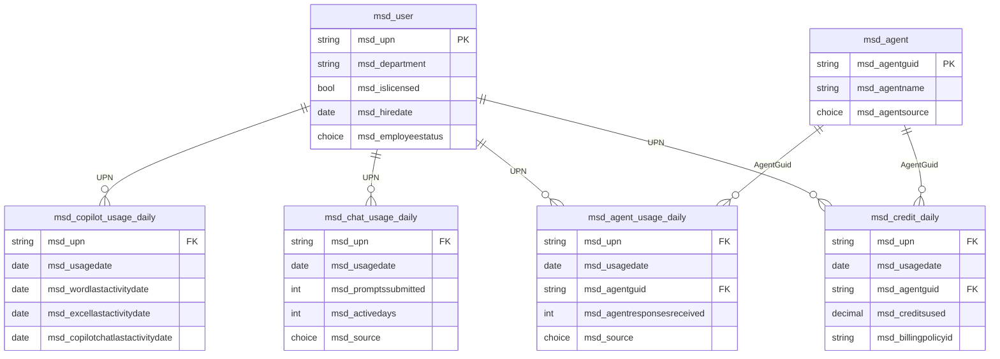
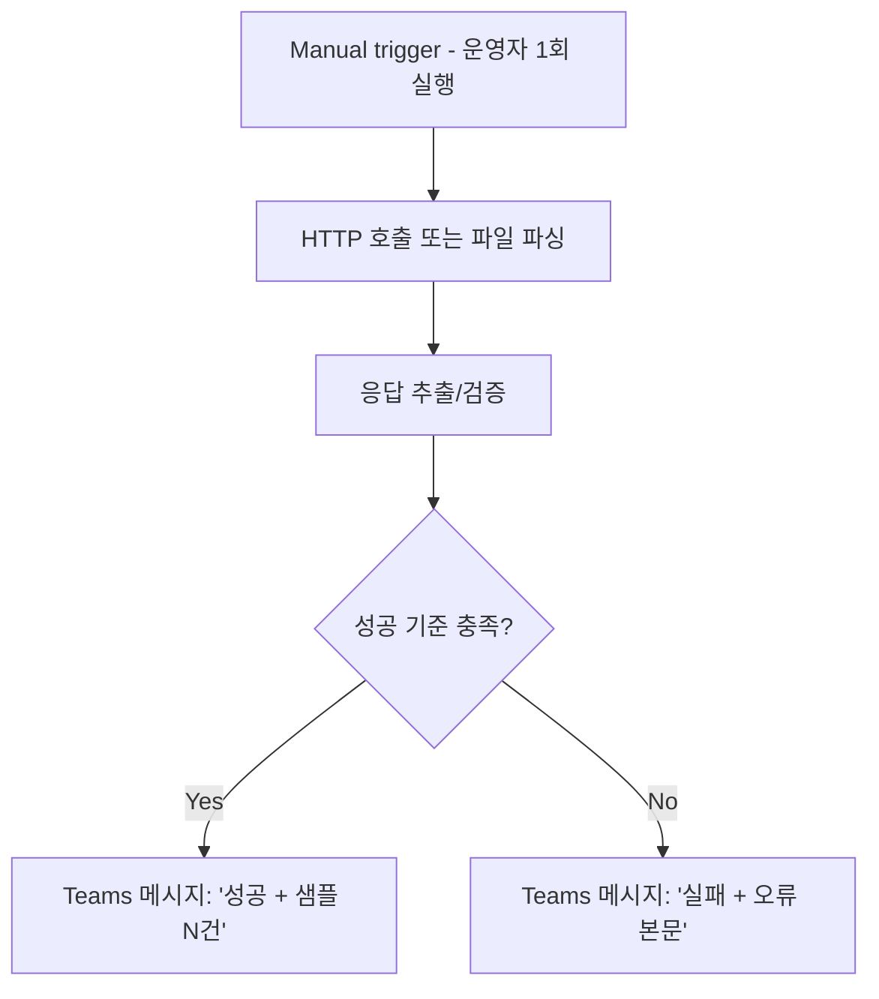

# M365 Copilot 사용량 대시보드 (v2.2)

> **문서 ID** : 20260625_M365_Copilot_사용자별_사용량_대시보드
> **버전** : v2.2 (2026-06-25) — v2.1 in-place 갱신
> **v2.1 → v2.2 변경 핵심** :
> 1. 데이터 소스를 **M365 Admin Center 4개 보고서**(Copilot Usage / Copilot Chat / Agents / Credits) 기준으로 재정렬 — Microsoft가 사전 집계해 둔 그대로 차용
> 2. **Phase 0 PoC 테스트 플로우** 4개 추가 — 본격 적재 전에 "이 경로가 실제 데이터를 가져오는가" 를 Power Automate로 사전 검증
> 3. **Purview Audit 자동 우회 경로**를 Chat/Agents 보고서 대안으로 명시 (수동 CSV 의존도↓). PoC F-T3에서 실측 검증 후 채택 결정
> 4. **Entra ID 권한** 섹션 신설 — Application permissions, admin consent, 운영자 권한 분리 명시
> 5. v2.1의 Viva Copilot Dashboard 의존 폐기 (Admin Center 4개 보고서로 cover)
> **근거 방식** : Microsoft Learn 1차 검증.

---

## 0. Executive Summary

| 항목 | 결정 |
| --- | --- |
| 메인 데이터 소스 | M365 Admin Center > Reports > Microsoft 365 Copilot 하위 **4개 보고서**: ① Copilot ② Copilot Chat ③ Agents (preview) ④ Credits (preview) |
| 자동/반자동 | ① Copilot Usage = **Graph API 자동** (v1.0 GA) ②③④ = CSV 수동 업로드 + (PoC 검증 후) **Purview Audit으로 자동 우회 시도** |
| Dataverse 테이블 | **6개** (Dim 2 + Fact 4) — 4개 보고서가 각각 다른 의미를 담으므로 1:1 매핑 Fact 4개 |
| 신규입사/조직변동 | `msd_user` SCD-1 + Fact의 `msd_departmentsnapshot` (v2.1과 동일 패턴 유지) |
| 검증 전제 | **Phase 0 PoC** (F-T1~F-T4) 통과 → Phase 1 정식 플로우 승격 |

### 0.1 사용자 의도 → v2.2 답
| 의도 | v2.2 처리 |
| --- | --- |
| "4개 CSV로 보여지니 그대로 Dataverse에 쌓고 싶다" | ✅ 1:1 매핑 Fact 4개 |
| "Audit으로 자동 우회 가능?" | ✅ **PoC F-T3에서 실측 검증**. Audit `CopilotInteraction` RecordType=261이 실제로 ① 미라이선스 Chat 프롬프트 ② Agents 사용 이벤트를 모두 카운트 가능한지 확인 후 채택 |
| "Entra ID 권한이 무엇이 필요?" | ✅ 3장 권한 매트릭스 |
| "Credits 보고서 한계?" | ✅ 미라이선스 + Chat metered만 cover. 라이선스 사용자의 Studio agent 활동은 Agents 보고서로 별도 |
| "AI Builder는 Copilot Credit으로 통합?" | ✅ *공급 측* 통합 사실. *소비 보고서*는 출처별 분산 — v2.2에서는 PPAC AI Builder Excel은 **별도 옵션(F-5)** 으로 분리, 메인 4개 보고서는 그대로 |

---

## 1. 데이터 소스 (검증)

| ID | 보고서 | 의미(인용) | Granularity | Graph API | CSV Export | Audit 우회 가능성 |
| --- | --- | --- | --- | --- | --- | --- |
| **S-1** | **Copilot Usage Report** | 라이선스 사용자의 앱별 last activity + (Word/Excel/PowerPoint 일부) 프롬프트 수 | UPN × App × 일 | ✅ `getMicrosoft365CopilotUsageUserDetail` v1.0 GA | ✅ | (필요 없음 — API 자동) |
| **S-2** | **Copilot Chat Report** | 미라이선스 + 라이선스 사용자의 Copilot Chat 프롬프트 수 | UPN × 일 + 앱별 (Teams/Outlook/m365.chat/Edge/Word/Excel/PowerPoint/OneNote) | ❌ | ✅ | ✅ Audit `CopilotInteraction` `AppHost=BizChat/Bing/Office/Word/...` |
| **S-3** | **Agents Usage Report (preview)** | per user × per agent × per agent-user pair 활동량 (라이선스/미라이선스 모두) | UPN × AgentId × AgentName × 일 | ❌ | ✅ | ✅ Audit `CopilotInteraction` `AppIdentity=Copilot.Studio.<GUID>` + `AgentName`/`AgentVersion` |
| **S-4** | **Copilot Credits Report (preview)** | **미라이선스 Chat**의 metered agent 소비 (per user / per agent / per billing policy / per agent-user pair) | UPN × AgentId × BillingPolicyId × 일 | ❌ | ✅ | ❌ Audit은 이벤트 단위, credit 수치는 아님. 청구는 Azure Cost Management 또는 PPAC 흐름이 진실의 원천 |
| **S-5** *(옵션)* | PPAC AI Builder Excel | AI Builder 환경 소비 (User × Env × Day) | UserId(GUID) × Env × Day × AIConsumption | ❌ | ✅ | ❌ |
| **S-6** | Graph `/users` | 사용자/부서/입사일 dim | per-user | ✅ | — | — |

### 1.1 검증된 한계
1. **S-2, S-3, S-4 = preview / Graph API 미지원**. 정식 자동화 경로는 (a) CSV 수동 (b) Audit 우회. v2.2는 **PoC에서 (b) 가능성을 실측**.
2. S-4(Credits)는 **미라이선스 Chat metered 사용분만** 카운트 — 라이선스 사용자의 Studio agent 호출은 무과금이라 보고서에 없음. 그건 S-3(Agents 보고서)의 활동 카운트로 별도 cover.
3. Audit `CopilotInteraction`은 credit "수치"를 주지 않음 — 이벤트 카운트만. 따라서 **S-4를 Audit으로 완전 대체 불가**.
4. CSV 보고서 모두 기본 anonymized (concealed names). 실명 노출 토글은 Global Admin 전용 + Purview 자동 감사.

---

## 2. Dataverse 데이터 모델 (6 테이블)

### 2.1 환경/솔루션
- 환경: **M365 Copilot Cockpit (Production)**, Korea Central, Dataverse DB.
- 솔루션: `M365CopilotCockpitCore`, prefix `msd_`.
- Auditing ON, Track changes ON, alternate key 정의.

### 2.2 Dim 테이블

#### `msd_user` — 사용자 마스터 (SCD-1)
| 컬럼 | 타입 | 비고 |
| --- | --- | --- |
| `msd_userid` (PK) | Autonumber | |
| `msd_upn` | Text(320) | **Alternate Key** |
| `msd_displayname` | Text(256) | |
| `msd_department` | Text(128) | 현재 부서 (Entra `department` 또는 HR CSV) |
| `msd_managerupn` | Text(320) | |
| `msd_jobtitle` | Text(128) | |
| `msd_hiredate` | Date | |
| `msd_employeestatus` | Choice | `Active, OnLeave, Inactive` |
| `msd_entraobjectid` | Text(36) | |
| `msd_dataversesystemuserid` | Text(36) | AI Builder UserId 매핑용 |
| `msd_islicensed` | Two Options | M365 Copilot 라이선스 보유 여부 (Graph `assignedLicenses`에서 도출) |
| `msd_lastsyncedutc` | DateTime | |

#### `msd_agent` — Copilot Studio Agent 마스터
| 컬럼 | 타입 | 비고 |
| --- | --- | --- |
| `msd_agentid` (PK) | Autonumber | |
| `msd_agentguid` | Text(36) | **Alternate Key** (Audit `AppIdentity` 끝 GUID 또는 보고서의 Agent ID) |
| `msd_agentname` | Text(256) | |
| `msd_agentsource` | Choice | `CopilotStudio, AgentBuilder, TeamsToolkit, Microsoft, Partner, Unknown` |
| `msd_environmentid` | Text(36) | (있을 경우) |
| `msd_environmentname` | Text(128) | |
| `msd_firstseenutc` | DateTime | |

### 2.3 Fact 테이블 — 4개 보고서 1:1 매핑

#### `msd_copilot_usage_daily` — S-1 (Copilot Usage Report)
| 컬럼 | 타입 | 비고 |
| --- | --- | --- |
| `msd_id` (PK) | Autonumber | |
| `msd_upn` | Text(320) | |
| `msd_usagedate` | Date Only | |
| `msd_lastactivitydate` | Date Only | 보고서의 Last Activity Date |
| `msd_teamslastactivitydate` | Date Only | |
| `msd_wordlastactivitydate` | Date Only | |
| `msd_excellastactivitydate` | Date Only | |
| `msd_powerpointlastactivitydate` | Date Only | |
| `msd_outlooklastactivitydate` | Date Only | |
| `msd_onenotelastactivitydate` | Date Only | |
| `msd_looplastactivitydate` | Date Only | |
| `msd_copilotchatlastactivitydate` | Date Only | |
| `msd_departmentsnapshot` | Text(128) | |
| `msd_source` | Choice | `GraphAPI` |
| `msd_lastupdatedutc` | DateTime | |
| **Alt Key** | `(msd_upn, msd_usagedate)` | |

#### `msd_chat_usage_daily` — S-2 (Copilot Chat Report)
| 컬럼 | 타입 | 비고 |
| --- | --- | --- |
| `msd_id` (PK) | Autonumber | |
| `msd_upn` | Text(320) | |
| `msd_usagedate` | Date Only | |
| `msd_promptssubmitted` | Whole Number | 보고서 컬럼 |
| `msd_activedays` | Whole Number | |
| `msd_lastactivitydate` | Date Only | |
| `msd_hascopilotlicense` | Two Options | 라이선스 보유 여부 (보고서에 미라이선스 포함) |
| `msd_departmentsnapshot` | Text(128) | |
| `msd_source` | Choice | `AdminCenterCSV, PurviewAudit` |
| `msd_lastupdatedutc` | DateTime | |
| **Alt Key** | `(msd_upn, msd_usagedate, msd_source)` | source별 분리 (CSV vs Audit 이중 적재 시) |

#### `msd_agent_usage_daily` — S-3 (Agents Report)
> **per agent-user pair** 메트릭을 그대로 적재.

| 컬럼 | 타입 | 비고 |
| --- | --- | --- |
| `msd_id` (PK) | Autonumber | |
| `msd_upn` | Text(320) | |
| `msd_usagedate` | Date Only | |
| `msd_agentguid` | Text(36) | |
| `msd_agentresponsesreceived` | Whole Number | 보고서 컬럼 |
| `msd_lastactivitydate` | Date Only | |
| `msd_hascopilotlicense` | Two Options | |
| `msd_departmentsnapshot` | Text(128) | |
| `msd_source` | Choice | `AdminCenterCSV, PurviewAudit` |
| `msd_lastupdatedutc` | DateTime | |
| **Alt Key** | `(msd_upn, msd_usagedate, msd_agentguid, msd_source)` | |

#### `msd_credit_daily` — S-4 (Credits Report)
> 미라이선스 + Chat metered 만 들어옴. Source는 `AdminCenterCSV` 단일.

| 컬럼 | 타입 | 비고 |
| --- | --- | --- |
| `msd_id` (PK) | Autonumber | |
| `msd_upn` | Text(320) | |
| `msd_usagedate` | Date Only | |
| `msd_agentguid` | Text(36) | |
| `msd_billingpolicyid` | Text(36) | |
| `msd_creditsused` | Decimal(4) | Copilot Credit |
| `msd_lastactivitydetected` | DateTime | 보고서의 "Last activity detected" |
| `msd_departmentsnapshot` | Text(128) | |
| `msd_source` | Choice | `AdminCenterCSV` |
| `msd_lastupdatedutc` | DateTime | |
| **Alt Key** | `(msd_upn, msd_usagedate, msd_agentguid, msd_billingpolicyid)` | |

### 2.4 (옵션) `msd_aib_consumption_daily` — S-5
AI Builder Excel 별도 적재 시 활성화. 컬럼: `msd_upn`(매핑된), `msd_usagedate`, `msd_environmentid`, `msd_aiconsumption`, `msd_istrial`.

### 2.5 ER 다이어그램



### 2.6 멱등성·SCD
- 모든 Fact는 alternate key upsert.
- `msd_departmentsnapshot` = 적재 시점 user.department freeze (SCD-0).
- `msd_chat_usage_daily`/`msd_agent_usage_daily`는 `msd_source` 컬럼이 alternate key에 포함 → CSV 적재와 Audit 적재가 독립적으로 보존 (교차 검증 가능).

---

## 3. Entra ID 권한 (사전 준비) — 신설

### 3.1 Entra App 등록
**App 이름**: `M365 Cockpit Collector`
- Tenant: Single tenant
- Application 인증 (서비스 계정 없음)
- Federated credentials 권장 (client secret 대안)

### 3.2 Application Permissions (Admin Consent 필수)

| API | Permission | 용도 | Required by |
| --- | --- | --- | --- |
| **Microsoft Graph** | `Reports.Read.All` | Copilot Usage Report API 호출 | F-T1, F-1 |
| **Microsoft Graph** | `User.Read.All` | 사용자 dim 동기화, GUID↔UPN 매핑 | F-T1, F-0, (옵션) F-5 |
| **Microsoft Graph** | `Organization.Read.All` | `subscribedSkus` 조회 (라이선스 보유 판정) | F-0 |
| **Office 365 Management APIs** | `ActivityFeed.Read` | Purview Audit (O365 Mgmt Activity API) — `CopilotInteraction` 이벤트 fetch | F-T2, F-T3, F-2-Audit, F-3-Audit |

> Audit 우회를 안 쓰는 경우 `ActivityFeed.Read`는 미부여 가능.

### 3.3 Admin Consent 절차
1. Entra admin center > App registrations > `M365 Cockpit Collector` > API permissions
2. 위 4개 권한 Add → **"Grant admin consent for {tenant}"** 클릭 (Global Admin 또는 Application Administrator 필요)
3. 각 권한이 `Granted for {tenant}` 상태인지 확인

### 3.4 Credentials
| 옵션 | 권장 시나리오 |
| --- | --- |
| **Federated Identity Credentials (FIC)** | ✅ 권장 — secret-less, Power Automate의 HTTP에서 Workload Identity Federation으로 토큰 발급 |
| Client Secret | Power Automate가 Workload ID 미지원이면 사용. Azure Key Vault 보관 + 환경변수 참조 |

### 3.5 운영자(Human) 권한 — 별도

| 작업 | 필요 역할 |
| --- | --- |
| 4개 보고서 화면 보기 | **AI Administrator** (또는 Reports Reader / Usage Summary Reports Reader) |
| Concealed names 토글 (실명 보기) | **Global Administrator** (변경 시 Purview 자동 감사) |
| AI Builder Excel 다운로드 (옵션 S-5) | **Power Platform Administrator** |
| Power Automate 솔루션 운영 | 환경 Maker + 위 Entra App을 Service Principal로 PPAC에 등록 |
| Dataverse 환경 관리 | System Administrator (해당 환경) |

### 3.6 권한 최소화 정리
- v2.1의 `Reports.Read.All` 유지 (Graph Copilot Usage용)
- v2.2 신규 `ActivityFeed.Read` (Audit 우회 시도용 — PoC F-T3 통과 시 정식 사용, 실패 시 권한 회수 가능)
- v2.1의 Viva Insights 의존 폐기 → Viva 관련 권한/라이선스 자격 불필요

---

## 4. Phase 0 — PoC 테스트 플로우 (4개)

> **목적**: "이 경로가 실제 우리 테넌트에서 데이터를 가져오는가" 를 본격 적재 전에 검증. 4개 테스트 플로우는 모두 **Dataverse 적재하지 않고**, 결과를 **Teams 또는 운영자 이메일로 dump** 하여 사람이 눈으로 검증.

### 4.1 테스트 플로우 공통 패턴



각 테스트는 **수동 트리거 (Manually trigger a flow)** + **Teams "Post a message in a chat or channel"** 으로 단순화. 실패 시 즉시 Entra 권한/네트워크 점검.

---

### 4.2 F-T1 : Graph Copilot Usage Report 호출 테스트

**목적**: S-1 자동화 경로(Graph API v1.0 GA) 가 우리 테넌트에서 실제 응답을 주는지 확인.

| # | 액션 | 입력 |
| --- | --- | --- |
| 1 | Trigger | Manually trigger a flow |
| 2 | HTTP — Get token | `POST https://login.microsoftonline.com/{env_TenantId}/oauth2/v2.0/token` body `grant_type=client_credentials&client_id={env_ClientId}&client_secret={env_ClientSecret}&scope=https://graph.microsoft.com/.default` |
| 3 | HTTP — Get Copilot Usage | `GET https://graph.microsoft.com/v1.0/copilot/reports/getMicrosoft365CopilotUsageUserDetail(period='D7')?$format=application/json` Authorization: `Bearer @{outputs('Token').body.access_token}` |
| 4 | Compose — first 3 rows | `take(body('GetUsage')?['value'], 3)` |
| 5 | Post message in Teams | "F-T1 결과: HTTP @{outputs('GetUsage')['statusCode']}, 행 수 @{length(body('GetUsage')?['value'])}, 샘플: @{outputs('Compose')}" |

**성공 기준** (모두 충족):
- HTTP 200
- 행 수 > 0
- 샘플 행에 `userPrincipalName`, `wordCopilotLastActivityDate`, `copilotChatLastActivityDate` 등 컬럼 존재

**실패 시 점검**:
- 401/403: `Reports.Read.All` admin consent 미완료
- 빈 결과: 테넌트에 M365 Copilot 라이선스 사용자 0명
- D7 지연: Microsoft 측 보고서가 D+2~3 지연 (period='D30'으로 재시도)

---

### 4.3 F-T2 : O365 Management API 구독 시작 테스트

**목적**: Audit 우회 경로의 **첫 관문**(구독 활성화) 통과 확인.

| # | 액션 | 입력 |
| --- | --- | --- |
| 1 | Trigger | Manually trigger a flow |
| 2 | HTTP — Get token | scope `https://manage.office.com/.default` |
| 3 | HTTP — List subscriptions | `GET https://manage.office.com/api/v1.0/{env_TenantId}/activity/feed/subscriptions/list` |
| 4 | Compose — check Audit.General | `body('ListSubs')`에서 `Audit.General` 항목 존재 + `status: enabled` 여부 확인 |
| 5 | Condition | 비활성이면 → HTTP `POST https://manage.office.com/api/v1.0/{env_TenantId}/activity/feed/subscriptions/start?contentType=Audit.General` (admin consent + ActivityFeed.Read 필요) |
| 6 | Post in Teams | "F-T2: 구독 상태 @{outputs('Compose')}" |

**성공 기준**:
- ListSubs HTTP 200 + Audit.General `status=enabled`
- (필요 시) Start 호출 200

**실패 시 점검**:
- 401/403: `ActivityFeed.Read` Application permission + admin consent 미완료. Office 365 Management APIs는 Graph와 별개의 권한 카탈로그
- "AF20023" (이미 활성): 정상, 무시

---

### 4.4 F-T3 : Purview Audit `CopilotInteraction` 1건 fetch 테스트 ⭐

**목적**: **자동 우회 가능성의 핵심 검증**. 어제 24시간 윈도의 Audit 이벤트 중 `RecordType=261 (CopilotInteraction)` 가 1건이라도 잡히는지 + Chat/Agent를 구분할 수 있는 필드가 모두 존재하는지 확인.

| # | 액션 | 입력 |
| --- | --- | --- |
| 1 | Trigger | Manually trigger a flow |
| 2 | HTTP — Get token | scope `https://manage.office.com/.default` |
| 3 | Compose — start/end | `startTime = formatDateTime(addDays(utcNow(),-1),'yyyy-MM-ddT00:00:00')`, `endTime = formatDateTime(utcNow(),'yyyy-MM-ddT00:00:00')` |
| 4 | HTTP — List content URIs | `GET https://manage.office.com/api/v1.0/{tenantId}/activity/feed/subscriptions/content?contentType=Audit.General&startTime=@{startTime}&endTime=@{endTime}` |
| 5 | Compose — URI count | `length(body('ListContent'))` |
| 6 | Condition: URI 수 == 0 → Teams "No content (Audit empty for this window)" → End | |
| 7 | HTTP — Get first content | `GET @{first(body('ListContent'))?['contentUri']}` Authorization 필요 |
| 8 | Parse JSON | event array |
| 9 | Filter array | `@equals(item()?['RecordType'], 261)` |
| 10 | Compose — first event | `take(body('Filter'), 1)` |
| 11 | Post in Teams | "F-T3: 컨텐츠 URI @{outputs('Count')}건, CopilotInteraction 첫 이벤트 = @{outputs('FirstEvent')}" — UserId, AppHost, AppIdentity, AgentName(있다면), Messages 배열 노출되는지 확인 |

**성공 기준** (모두 충족):
- 컨텐츠 URI 1개 이상
- `RecordType=261` 이벤트 1건 이상
- 그 이벤트에서 다음 필드 모두 추출 가능:
  - `UserId` (UPN)
  - `CopilotEventData.AppHost` (BizChat/Bing/Office/Word/Excel/...)
  - `CopilotEventData.AppIdentity` (Copilot.Studio.<GUID> 형태 시 Studio agent 호출 식별 가능)
  - `CopilotEventData.AgentName` (Studio agent인 경우)
  - `CopilotEventData.Messages` (isPrompt=true 카운트 가능)

**판정 → 정식 플로우 라우팅**:
| F-T3 결과 | 채택 경로 |
| --- | --- |
| 모든 필드 충족 | **Audit 우회 채택**: F-2 Chat (Audit), F-3 Agents (Audit) 자동화. CSV 업로드는 검증·중복 적재용으로만 |
| RecordType=261 이벤트는 잡히나 일부 필드 누락 (예: AgentName 빈값) | **Hybrid**: Chat은 Audit 자동, Agents는 CSV 수동 유지 |
| CopilotInteraction 이벤트 0건 | **CSV 수동만**: 테넌트 audit 설정 점검 후 재시도. Audit 우회 보류 |

**실패 시 점검**:
- Audit이 testTenant에 활성화되어 있는지 (Microsoft 365 Compliance > Audit)
- `RecordType=261` 외에 `262 (TeamCopilotInteraction)`, `263 (ConnectedAIAppInteraction)` 등도 함께 잡히는지 — 사이드 채널 가능성
- 데이터 지연: Audit은 ~24h 지연 가능 → 어제 윈도가 비면 D-2 윈도로 재시도

---

### 4.5 F-T4 : Admin Center CSV 업로드·파싱 테스트

**목적**: 운영자가 4개 보고서 중 1개를 화면에서 export → SharePoint 업로드 → 자동 파싱 경로가 작동하는지 확인.

| # | 액션 | 입력 |
| --- | --- | --- |
| 1 | Trigger | SharePoint "When a file is created" — 라이브러리 `/CockpitImport/_PoC/` |
| 2 | Get file content | trigger output |
| 3 | Parse CSV → table (Office Script "Parse CSV" 또는 Excel Online 변환 후 List rows) | |
| 4 | Compose — first 3 rows + 행 수 | |
| 5 | Post in Teams | "F-T4 결과: 파일 @{triggerOutputs()['filename']}, 총 @{outputs('Count')}행, 샘플: @{outputs('First3')}" |

**운영자 작업 (각 보고서 1회씩)**:
1. M365 Admin > Reports > Microsoft 365 Copilot 하위 4개 보고서 각각 진입
2. 우상단 **Export** 클릭 → CSV 다운로드
3. `/CockpitImport/_PoC/` 라이브러리에 업로드 (각 보고서별 1번씩 = 4회 트리거)

**성공 기준**:
- 4개 보고서 모두 export 성공 (Settings > Org Settings > Reports에서 concealed names 토글 필요할 수 있음)
- 각 CSV 컬럼 헤더 확인 → 2.3 Fact 테이블 컬럼과 매핑 표 작성

**실패 시 점검**:
- "Export" 버튼 없음: Agents 보고서 details 테이블의 Export는 일시적 제거 (Microsoft 공지). 다른 chart의 Export 사용
- 컬럼이 모두 공란/마스킹: concealed names 켜져 있음. Settings 토글 후 재export

---

## 5. Phase 1 — 정식 Power Automate 플로우 (5개) + Audit 우회 분기

### 5.1 플로우 개요

```mermaid
flowchart LR
    SCH[/Scheduler/]
    SP[/SharePoint Upload/]

    SCH --> F0[F-0 User Sync<br/>매일 01:30]
    SCH --> F1[F-1 Copilot Usage<br/>매일 02:00 (Graph 자동)]
    SCH --> F2A{F-T3 통과?}
    F2A -- Yes --> F2_AUD[F-2 Chat<br/>매일 02:25 - Audit 자동]
    F2A -- No  --> F2_CSV[F-2 Chat<br/>SharePoint CSV 트리거]
    SCH --> F3A{F-T3 통과?}
    F3A -- Yes --> F3_AUD[F-3 Agents<br/>매일 02:30 - Audit 자동]
    F3A -- No  --> F3_CSV[F-3 Agents<br/>SharePoint CSV 트리거]
    SP  --> F4[F-4 Credits<br/>SharePoint CSV 트리거]

    F0 --> DV_USER[(msd_user)]
    F1 --> DV_CU[(msd_copilot_usage_daily)]
    F2_AUD --> DV_CHAT[(msd_chat_usage_daily)]
    F2_CSV --> DV_CHAT
    F3_AUD --> DV_AG[(msd_agent_usage_daily)]
    F3_AUD --> DV_AGENT[(msd_agent)]
    F3_CSV --> DV_AG
    F3_CSV --> DV_AGENT
    F4 --> DV_CR[(msd_credit_daily)]
```

### 5.2 F-0 : User Sync (v2.1 유지)
- 매일 01:30 Graph `/users?$select=id,userPrincipalName,displayName,department,jobTitle,employeeHireDate,accountEnabled,assignedLicenses`
- `assignedLicenses`에서 M365 Copilot SKU 보유 여부 → `msd_islicensed` 채움
- 신규입사자: 자동 등록 / 비활성: `msd_employeestatus=Inactive` 마킹

### 5.3 F-1 : Copilot Usage (Graph 자동)
- F-T1 그대로 production화 + Dataverse upsert로 마무리
- `msd_copilot_usage_daily` alternate key (UPN, UsageDate) upsert
- `msd_departmentsnapshot` 채움 (시작 시점 user.department 캐시)

### 5.4 F-2 : Copilot Chat

#### F-T3 통과 시 → F-2-Audit (자동)
- 매일 02:25 Recurrence
- Audit content fetch (어제 윈도) → Filter `RecordType=261 AND AppHost IN (BizChat, Bing, Office, Word, Excel, PowerPoint, OneNote, Teams, Loop)` (Studio agent 제외 — 그쪽은 F-3에서)
- 그룹화: (UserId, Date) → 프롬프트 카운트 = `count(Messages[isPrompt=true])` 합
- `msd_chat_usage_daily` upsert, `msd_source=PurviewAudit`

#### F-T3 미통과 시 → F-2-CSV (반자동)
- SharePoint `/CockpitImport/Chat/chat_YYYYMMDD.csv` 트리거
- 운영자 주 1회 export → 업로드
- 컬럼 매핑: Username→UPN, Prompts submitted→`msd_promptssubmitted`, Active days→`msd_activedays`, Last activity date→`msd_lastactivitydate`
- `msd_source=AdminCenterCSV`

### 5.5 F-3 : Agents

#### F-T3 통과 시 → F-3-Audit (자동)
- 매일 02:30
- Audit filter `RecordType=261 AND AppIdentity startsWith 'Copilot.Studio.'`
- 그룹화: (UserId, Date, AgentGuid) → 이벤트 카운트 → `msd_agentresponsesreceived`
- AgentName 발견 시 `msd_agent` upsert (`msd_agentsource=CopilotStudio`)
- `msd_agent_usage_daily` upsert, `msd_source=PurviewAudit`

#### F-T3 미통과 시 → F-3-CSV (반자동)
- SharePoint `/CockpitImport/Agents/agents_YYYYMMDD.csv` 트리거
- 컬럼 매핑: Username→UPN, Agent Name→`msd_agentname`, Number of agents used (집계용), Agent responses received→`msd_agentresponsesreceived`
- `msd_source=AdminCenterCSV`

### 5.6 F-4 : Credits (CSV 전용)
> Audit으로 대체 불가. 청구 정확성 위해 공식 보고서만 사용.

- SharePoint `/CockpitImport/Credits/credits_YYYYMMDD.csv` 트리거
- 컬럼 매핑: User Principal Name→UPN, Agent ID→`msd_agentguid`, Agent Name→`msd_agent.msd_agentname`(upsert), Billing Policy ID→`msd_billingpolicyid`, Credits Used→`msd_creditsused`, Last activity detected→`msd_lastactivitydetected`
- `msd_source=AdminCenterCSV`

### 5.7 운영자 일과 (Phase 1)

| 빈도 | 작업 |
| --- | --- |
| 주 1회 (월요일) | F-T3 미통과 시: 4개 보고서 중 자동화 안 된 것만 export → SharePoint 업로드 |
| F-T3 통과 시 | Credits 보고서 1개만 주 1회 export → 업로드. 나머지 자동 |
| 분기 1회 | F-T3 재실행으로 Audit 경로 안정성 회귀 점검 |

---

## 6. 사용자별 + 부서별 KPI

(v2.1과 동일 — Fact 4개에서 직접 쿼리)

| KPI | 출처 Fact |
| --- | --- |
| 사용자 30일 Copilot 활동 (앱별 last activity) | `msd_copilot_usage_daily` |
| 사용자 30일 Chat 프롬프트 수 | `msd_chat_usage_daily` |
| 사용자×Agent 매트릭스 (활동 카운트) | `msd_agent_usage_daily` |
| 사용자×Agent 매트릭스 (크레딧 소비) | `msd_credit_daily` |
| 부서별 적용률 | (Fact GROUP BY `msd_departmentsnapshot`) |
| Top 20 헤비 유저 / Top 에이전트 / Top 크레딧 소비자 | 동상 |

---

## 7. 보안 (요약)

- **익명화 토글**: 4개 보고서 실명 노출은 Global Admin이 켜야 함 → Purview 자동 감사
- **DLP**: Cockpit 환경 Business/Non-Business 분리
- **Sensitivity Label**: Fact 4개 모두 "Confidential / Internal"
- **권한 최소화**: 3장 참조

---

## 8. 한계/주의

1. **PoC 결과에 따라 5장이 분기**. F-T3 통과 가정으로 운영 인력 줄이기 X — 분기 1회 회귀 점검 필수.
2. **Audit 우회의 프롬프트 카운트는 공식 보고서와 100% 일치 보장 X**. 둘 다 적재(`msd_source` 분리)해 교차 검증 권장.
3. **Credits는 Audit 대체 불가** — 청구 정확성은 공식 보고서가 진실의 원천.
4. **Agents 보고서는 preview** — 컬럼 변동 가능. F-T4 재실행으로 분기 1회 회귀.
5. **AI Builder 환경 소비**(S-5)는 v2.2 메인에서 제외, 옵션 분기. PPAC AI Builder Excel은 별도 SharePoint 라이브러리로 동일 패턴 적용 가능.

---

## 9. 참고 (Microsoft Learn)

| 주제 | URL |
| --- | --- |
| Copilot Usage Report (Graph API) | https://learn.microsoft.com/microsoft-365/copilot/extensibility/api/admin-settings/reports/copilotreportroot-getmicrosoft365copilotusageuserdetail |
| Copilot Usage Report (UI) | https://learn.microsoft.com/microsoft-365/admin/activity-reports/microsoft-365-copilot-usage |
| Copilot Chat Report | https://learn.microsoft.com/microsoft-365/admin/activity-reports/microsoft-copilot-usage |
| Agents Usage Report (new, preview) | https://learn.microsoft.com/microsoft-365/admin/activity-reports/microsoft-365-copilot-agents-new |
| Agents Usage Report (legacy) | https://learn.microsoft.com/microsoft-365/admin/activity-reports/microsoft-365-copilot-agents |
| Credits Report | https://learn.microsoft.com/microsoft-365/admin/activity-reports/microsoft-365-copilot-credits |
| Purview Audit Copilot 스키마 | https://learn.microsoft.com/purview/audit-copilot |
| O365 Mgmt API CopilotInteraction | https://learn.microsoft.com/office/office-365-management-api/copilot-schema |
| O365 Mgmt API Reference | https://learn.microsoft.com/office/office-365-management-api/office-365-management-activity-api-reference |
| Microsoft 365 Copilot reporting options | https://learn.microsoft.com/microsoft-365/copilot/microsoft-365-copilot-reports-for-admins |
| Graph permissions reference | https://learn.microsoft.com/graph/permissions-reference |
| O365 Mgmt API permissions | https://learn.microsoft.com/office/office-365-management-api/get-started-with-office-365-management-apis |

---

## 10. v2.1 → v2.2 변경 요약

| 영역 | v2.1 | v2.2 |
| --- | --- | --- |
| 메인 데이터 소스 | Purview Audit + Viva CSV + Admin Center Credits CSV | **M365 Admin Center 4개 보고서** (1:1 매핑) |
| Office 앱 내 Copilot | 부서 단위 Viva CSV | **개인별** Copilot Usage Graph API |
| Chat 사용량 | Audit 단독 | **CSV 메인 + Audit 우회 (PoC 검증 후)** |
| Agents 사용량 | Audit (AppIdentity 매핑) | **CSV 메인 + Audit 우회 (PoC 검증 후)** |
| Credits | M365 CSV + PPAC + AIB Excel 통합 적재 | **M365 Credits CSV 단일**. AIB는 옵션으로 분리 |
| Viva Copilot Dashboard | F-5 신규 도입 | **폐기** (4개 보고서로 cover) |
| PoC 단계 | 없음 | **Phase 0 PoC 4개 추가** (F-T1~F-T4) |
| Entra ID 권한 명시 | 흩어져 있음 | **3장에 통합** |
| Dataverse 테이블 | 5 (Dim 2 + Fact 3) | **6 (Dim 2 + Fact 4)** — 4개 보고서 1:1 매핑 |

✅ **합의. 설계도 v2.2 발행 (2026-06-25).**
