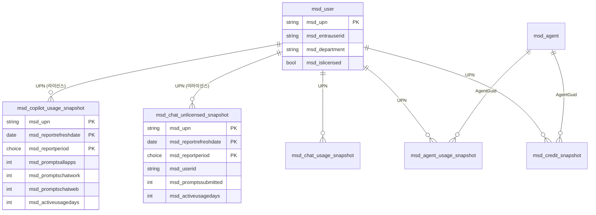

# M365 Copilot 사용량 대시보드 (v2.3)

> **문서 ID** : 20260629_M365_Copilot_사용자별_사용량_대시보드
> **버전** : v2.3 (2026-06-29) — v2.2 구조 일부 폐기 + CSV 스냅샷 모델로 재설계 + 미라이선스(EDP) Chat 통합
> **v2.2 → v2.3 변경 핵심**
> 1. **데이터 모델 패러다임 전환**: `*_usage_daily` (일자별 Fact) → `*_usage_snapshot` (기간 스냅샷 Fact). 실제 CSV가 daily가 아니라 "RefreshDate 시점 × Period 누적" 스냅샷임을 검증 후 반영.
> 2. **중복 적재 문제 원천 차단**: Alternate Key `(UPN, ReportRefreshDate, ReportPeriod)` upsert로 동일 스냅샷 재업로드 시 자동 덮어쓰기. 운영자가 횟수·기간 걱정 불요.
> 3. **F-1 Graph API 자동 경로 일시 보류**: 사용자 환경에서 per-user prompt count를 Graph가 미제공 → 4개 보고서 **전체 CSV 수동 경로**로 통일. (Audit 우회 PoC는 v2.2 그대로 유지)
> 4. **실제 CSV 헤더 1:1 매핑 확정** — 두 종류 CSV 파일을 직접 검증
>    - **S-1** : `CopilotActivityUserDetail*.csv` (라이선스 사용자) — 20개 컬럼
>    - **S-1B (신규)** : `CopilotEDPActivityUserDetail*.csv` (미라이선스 사용자 EDP Chat) — 사용자 요청 9개 컬럼
> 5. **운영 절차 표준화**: 매주 월요일 1회, 고정 Period (권장 30일), Show concealed names ON 후 export. 파일명·SharePoint 경로 규약.
> 6. **Chat (work) / Chat (web) 분리 적재** — 단일 컬럼 통합은 정보 손실로 폐기.
> 7. **🆕 통합 뷰 추가**: 라이선스(S-1) + 미라이선스(S-1B) 합산 → "전 직원 Copilot 사용량" 단일 KPI 산출 가능
> **근거 방식** : 실제 CSV 파일 + 스크린샷 직접 검증 + Microsoft Learn 1차 검증.

---

## 0. Executive Summary

| 항목 | v2.3 결정 |
| --- | --- |
| 메인 데이터 소스 | **M365 Admin Center 5개 보고서 CSV 수동 export** (S-1 라이선스 / S-1B 미라이선스 EDP / S-2 Chat / S-3 Agents / S-4 Credits) |
| 데이터 모델 | **스냅샷 모델** (UPN × RefreshDate × Period). v2.2의 daily 모델 폐기 |
| 중복 방지 | **Alternate Key upsert** — `(msd_upn, msd_reportrefreshdate, msd_reportperiod)` |
| Dataverse 테이블 | **7개** (Dim 2 + Fact 스냅샷 5) — S-1B 추가 |
| 운영 빈도 | 주 1회 (월요일) × Period 30일 고정 × 보고서 모두 |
| Concealed names | **이미 ON 확인됨** (EDP 파일에서 평문 UPN·실명 관측) |
| 시각화 | v2.2의 WPF + Dataverse Web API. 상단 KPI는 **라이선스+미라이선스 합산** |

### 0.1 사용자 문제 → v2.3 해결 매트릭스

| 사용자 우려 | v2.3 답 |
| --- | --- |
| "Graph API로 per-user 프롬프트 수 못 가져옴" | ✅ 인정. F-1을 CSV로 전환. F-T1 PoC는 한계 확인용만 |
| "6/29에 7일 받으면 6/24 데이터 → 5일 뒤 7일 받으면 또 6/24 데이터 → 중복" | ✅ Alt Key `(UPN, RefreshDate, Period)` upsert → 같은 RefreshDate면 자동 덮어쓰기 |
| "빨리 받아도 늦게 받아도 문제" | ✅ 빈도 무관. 같은 데이터 100번 올려도 결과 1행 |
| "엑셀 열 명칭은 어떻게?" | ✅ 3장에 CSV → `msd_*` 1:1 매핑표 (S-1 20열, S-1B 9열) |
| "라이선스 없는 사용자 Copilot Chat 사용량도 보고 싶음" | ✅ **S-1B 신규 Fact 테이블 + 통합 KPI** (§3.5, §7.6) |
| "전 직원 Copilot 사용량 통합 뷰" | ✅ Power Fx UNION + WPF 상단 단일 KPI 카드 |

---

## 1. 문제 진단 — v2.2 모델이 왜 깨졌나

### 1.1 v2.2의 가정
`msd_copilot_usage_daily`, Alt Key = `(msd_upn, msd_usagedate)`. "행 = 사용자 × 특정 1일 활동".

### 1.2 실제 CSV의 모양 (2026-06-29 다운로드 검증)

**S-1 (`CopilotActivityUserDetail*.csv`)**: 20개 컬럼, 라이선스 사용자, UPN/DisplayName 해시(토글 OFF 시).

```
샘플 행:
2026-06-24, 9FC57E…, E4EF…, 2026-06-15, 30, 34, 25, 6, 6, 2026-06-15, …
```

**S-1B (`CopilotEDPActivityUserDetail*.csv`)**: 사용자 요청 9개 컬럼, 미라이선스 사용자 EDP Chat, **평문 UPN·실명**.

```
헤더(가시):
Report refresh date | User id | User principal name | Display name | Report period |
Prompts submitted | Active usage days | Last activity date |
Last activity date of Microsoft 365 Copilot (app) (UTC)

샘플 행:
2026-06-24, 01200a04-72e..., user@otncapital.co.kr, 성과 측정 (강승규), 30, 12, 6, 2026-06-09, 2026-05-15
```

### 1.3 진단
- **`Report refresh date`**: 스냅샷 "기준 시점" (오늘 6/29 기준 D-5 지연 관측)
- **`Report period`**: 운영자 선택 기간 (7/30/60/90/180)
- **`Prompts submitted ...`**: 그 기간 **누적 합계** — 일자별 분해 없음
- **한 행 = 한 장의 스냅샷**

→ v2.2의 daily 모델은 "행 = 1일"을 가정해 모델 자체가 어긋남. 스냅샷 모델로 교체 불가피.

### 1.4 S-1과 S-1B의 의미 분리

| 측면 | S-1 (라이선스 사용자) | S-1B (미라이선스 사용자, EDP) |
| --- | --- | --- |
| 대상 | M365 Copilot 라이선스 보유 | M365 라이선스만 보유, Copilot 라이선스 없음 |
| Chat 종류 | Chat (work) + Chat (web) 분리 | **EDP Chat (web) 단일** |
| 앱별 활동 | Word/Excel/PPT/Outlook/Teams/OneNote/Loop/Edge/Agent 등 9개 별도 컬럼 | M365 Copilot (app) 단일 |
| UPN/이름 | concealed names 토글 영향 받음 | 동일 토글 적용 (현재 ON) |
| 보고서 export 위치 | M365 Admin Center > Copilot Usage Report | M365 Admin Center > **Copilot Chat Report (EDP/미라이선스 뷰)** |

→ **두 보고서 합쳐야 "테넌트 전체 Copilot 사용량"이 나옴.**

---

## 2. v2.3 해결 전략

### 2.1 스냅샷 모델 도입

| 개념 | v2.2 (폐기) | v2.3 |
| --- | --- | --- |
| Fact 행의 의미 | UPN × 특정 1일 활동 | **UPN × RefreshDate × Period 누적 스냅샷** |
| 시간 축 컬럼 | `msd_usagedate` (Date Only) | `msd_reportrefreshdate` + `msd_reportperiod` (Choice) |
| Alternate Key | `(msd_upn, msd_usagedate)` | `(msd_upn, msd_reportrefreshdate, msd_reportperiod)` |
| 일자별 분해 | (그 자체로 일자) | **불가능** — CSV가 안 줌 |
| 시계열 trend | usagedate로 직선 | **(같은 Period의) 서로 다른 RefreshDate 행 비교** |

### 2.2 중복 시나리오 전부 시뮬레이션

UPN `user@otncapital.co.kr` 행 하나 추적:

| 일자 | 운영자 행동 | CSV RefreshDate | CSV Period | Dataverse 동작 | 결과 행 수 |
| --- | --- | --- | --- | --- | --- |
| 2026-06-29 | "지난 7일" export → 업로드 | 2026-06-24 | 7 | INSERT | 1 |
| 2026-06-29 | 같은 export 또 업로드 | 2026-06-24 | 7 | UPSERT (덮어쓰기) | **1 (그대로)** |
| 2026-06-29 | "지난 30일"도 추가 | 2026-06-24 | 30 | INSERT (Period 다름) | 2 |
| 2026-07-04 | "지난 7일", MS refresh 안 됨 | 2026-06-24 | 7 | UPSERT | **2 (그대로)** |
| 2026-07-04 | "지난 7일", MS refresh 됨 | 2026-06-29 | 7 | INSERT (시계열 보존) | 3 |
| 2026-07-11 | "지난 7일", refresh 됨 | 2026-07-06 | 7 | INSERT | 4 |

→ **운영자 빈도 의식 불요.** 중복은 자동 흡수, 새 스냅샷은 자동 보존.

### 2.3 "특정 일자 사용량"이 보고 싶을 때

CSV가 일자 분해를 안 주므로 **본질적으로 불가**. 대안:

#### A) 시계열 trend (권장 / 기본)
같은 Period로 RefreshDate를 시간축으로 잡고 추세 비교.

#### B) 차분(Delta) 계산 (보조)
같은 RefreshDate × 다른 Period:
- `period30 - period7` ≈ "8~30일 전 누적치"
- `period180 - period90` ≈ "91~180일 전 누적치"

> ⚠️ 정확하지는 않음. trend 검증·이상 탐지용.

### 2.4 Concealed Names — 자동 확인 결과

EDP 파일에서 **평문 UPN(`@otncapital.co.kr`)과 한글 실명** 그대로 보임 → **테넌트 토글이 이미 ON 상태**. 추가 결재 불필요. 단:
- 향후 토글이 누군가에 의해 OFF로 바뀌면 적재된 데이터가 분석 불가 → Phase 0 PoC F-T4에 **자동 ON 상태 검증 액션** 1단계 추가 (parsed row의 UPN이 `@` 포함하는지 5건 sample 확인).

---

## 3. Dataverse 데이터 모델 (Dim 2 + Fact 5 스냅샷)

### 3.1 환경/솔루션
v2.2 그대로: **M365 Copilot Cockpit (Production)**, Korea Central, prefix `msd_`.

### 3.2 Dim 테이블 — v2.2 무수정 + 1 컬럼 추가

#### `msd_user` — 사용자 마스터 (SCD-1)

v2.2 컬럼 + **신규 컬럼**:

| 신규 컬럼 | 타입 | 비고 |
| --- | --- | --- |
| `msd_entrauserid` | Text(36) | EDP 리포트의 `User id` GUID — UPN 변경(이름변경) 시에도 동일인 추적용 |

기존 `msd_islicensed`(Two Options)으로 Copilot 라이선스 보유 분류. F-0에서 Graph `assignedLicenses` 기준 자동 갱신.

#### `msd_agent`
v2.2 그대로.

### 3.3 Fact #1 — `msd_copilot_usage_snapshot` (S-1: 라이선스 사용자)

> CSV: `CopilotActivityUserDetail*.csv` — 20개 컬럼 1:1 매핑.

| # | Dataverse 컬럼 | 타입 | CSV 컬럼명 |
| --- | --- | --- | --- |
| 1 | `msd_id` (PK) | Autonumber | — |
| 2 | `msd_reportrefreshdate` | Date Only | `Report Refresh Date` |
| 3 | `msd_upn` | Text(320) | `User Principal Name` |
| 4 | `msd_displayname` | Text(256) | `Display Name` |
| 5 | `msd_lastactivitydate` | Date Only | `Last Activity Date` |
| 6 | `msd_reportperiod` | Choice (D7/D30/D60/D90/D180) | `Report Period` |
| 7 | `msd_promptsallapps` | Whole Number | `Prompts submitted for All Apps` |
| 8 | `msd_promptschatwork` | Whole Number | `Prompts submitted for Copilot Chat (work)` |
| 9 | `msd_promptschatweb` | Whole Number | `Prompts submitted for Copilot Chat (web)` |
| 10 | `msd_activeusagedays` | Whole Number | `Active Usage Days for All Apps` |
| 11 | `msd_lastactchatwork` | Date Only | `Last activity date of Copilot Chat (work) (UTC)` |
| 12 | `msd_lastactchatweb` | Date Only | `Last activity date of Copilot Chat (web) (UTC)` |
| 13 | `msd_lastactteams` | Date Only | `Last activity date of Teams Copilot (UTC)` |
| 14 | `msd_lastactword` | Date Only | `Last activity date of Word Copilot (UTC)` |
| 15 | `msd_lastactexcel` | Date Only | `Last activity date of Excel Copilot (UTC)` |
| 16 | `msd_lastactpowerpoint` | Date Only | `Last activity date of PowerPoint Copilot (UTC)` |
| 17 | `msd_lastactoutlook` | Date Only | `Last activity date of Outlook Copilot (UTC)` |
| 18 | `msd_lastactonenote` | Date Only | `Last activity date of OneNote Copilot (UTC)` |
| 19 | `msd_lastactloop` | Date Only | `Last activity date of Loop Copilot (UTC)` |
| 20 | `msd_lastactm365app` | Date Only | `Last activity date of Microsoft 365 Copilot (app) (UTC)` |
| 21 | `msd_lastactedge` | Date Only | `Last activity date of Edge (UTC)` |
| 22 | `msd_lastactagent` | Date Only | `Last activity date of Copilot Agent (UTC)` |
| 23 | `msd_departmentsnapshot` | Text(128) | (Graph 보강) |
| 24 | `msd_sourcefilename` | Text(256) | (시스템) |
| 25 | `msd_ingestedutc` | DateTime | (시스템) |
| **Alt Key** | `(msd_upn, msd_reportrefreshdate, msd_reportperiod)` | | |

### 3.4 🆕 Fact #2 — `msd_chat_unlicensed_snapshot` (S-1B: 미라이선스 EDP Chat)

> CSV: `CopilotEDPActivityUserDetail*.csv` — 스크린샷 검증 9개 컬럼만 매핑. 우측 잔여 열은 의도적 제외.

| # | Dataverse 컬럼 | 타입 | CSV 컬럼명 | 비고 |
| --- | --- | --- | --- | --- |
| 1 | `msd_id` (PK) | Autonumber | — | |
| 2 | `msd_reportrefreshdate` | Date Only | `Report refresh date` | **Alt Key** |
| 3 | `msd_userid` | Text(36) | `User id` | GUID (보조키, `msd_user.msd_entrauserid` 매핑) |
| 4 | `msd_upn` | Text(320) | `User principal name` | **Alt Key** (평문) |
| 5 | `msd_displayname` | Text(256) | `Display name` | 평문 |
| 6 | `msd_reportperiod` | Choice (D7/D30/D60/D90/D180) | `Report period` | **Alt Key** |
| 7 | `msd_promptssubmitted` | Whole Number | `Prompts submitted` | EDP Chat 누적 합계 |
| 8 | `msd_activeusagedays` | Whole Number | `Active usage days` | |
| 9 | `msd_lastactivitydate` | Date Only | `Last activity date` | |
| 10 | `msd_lastactm365app` | Date Only | `Last activity date of Microsoft 365 Copilot (app) (UTC)` | |
| 11 | `msd_departmentsnapshot` | Text(128) | (Graph 보강) | 부서별 통합 분석용 |
| 12 | `msd_sourcefilename` | Text(256) | (시스템) | |
| 13 | `msd_ingestedutc` | DateTime | (시스템) | |
| **Alt Key** | `(msd_upn, msd_reportrefreshdate, msd_reportperiod)` | | | |

> **이름이 짧은 이유**: 우측 컬럼 무시 요청 반영. 향후 컬럼 확장 시 alter table로 추가 가능 (멱등 적재라 기존 데이터 영향 없음).

### 3.5 Fact #3~5 (S-2 Chat / S-3 Agents / S-4 Credits)

v2.2의 4개 Fact를 v2.3 스냅샷 모델로 패치. (이전 답변과 동일 — 변경 없음)
- `msd_chat_usage_snapshot` (S-2)
- `msd_agent_usage_snapshot` (S-3)
- `msd_credit_snapshot` (S-4)

모두 Alt Key 패턴: `(upn, reportrefreshdate, reportperiod[, agentguid][, billingpolicyid][, source])`

### 3.6 ER 다이어그램 (v2.3 통합)



---

## 4. Power Automate 적재 플로우

### 4.1 SharePoint 라이브러리 구조

```
/sites/M365CockpitImport/Shared Documents/
├── 01_CopilotActivity/       ← S-1 (라이선스 사용자)
├── 01B_CopilotEDPActivity/   ← S-1B (🆕 미라이선스 EDP Chat)
├── 02_ChatUsage/             ← S-2
├── 03_AgentUsage/            ← S-3
├── 04_Credits/               ← S-4
└── _Archive/YYYY-MM/         ← 적재 성공 후 이동
```

### 4.2 파일명 규칙 (운영자 강제)

```
YYYYMMDD_<Report>_D<Period>.csv
예: 20260629_CopilotActivity_D30.csv
    20260629_CopilotEDPActivity_D30.csv  ← 🆕
    20260629_ChatUsage_D30.csv
    20260629_AgentUsage_D30.csv
    20260629_Credits_D30.csv
```

Power Automate가 정규식 `^\d{8}_(CopilotActivity|CopilotEDPActivity|ChatUsage|AgentUsage|Credits)_D(7|30|60|90|180)\.csv$` 로 검증.

### 4.3 F-1 (S-1 라이선스) — v2.2 v2.3 답변과 동일

Excel/CSV 파싱 → Graph로 department 보강 → Dataverse Update a row (Alt Key upsert) → Archive → Teams 알림.

### 4.4 🆕 F-1B (S-1B 미라이선스 EDP Chat)

F-1과 동일 패턴, 매핑 표만 다름.

#### 매핑 식 (Power Automate)

| CSV column → Dataverse field | Power Automate 식 |
| --- | --- |
| `Report refresh date` → `msd_reportrefreshdate` | `formatDateTime(item()?['Report refresh date'], 'yyyy-MM-dd')` |
| `User id` → `msd_userid` | `item()?['User id']` |
| `User principal name` → `msd_upn` | `toLower(trim(item()?['User principal name']))` |
| `Display name` → `msd_displayname` | `item()?['Display name']` |
| `Report period` → `msd_reportperiod` | `concat('D', string(int(item()?['Report period'])))` |
| `Prompts submitted` → `msd_promptssubmitted` | `int(coalesce(item()?['Prompts submitted'], '0'))` |
| `Active usage days` → `msd_activeusagedays` | `int(coalesce(item()?['Active usage days'], '0'))` |
| `Last activity date` → `msd_lastactivitydate` | `if(empty(item()?['Last activity date']), null, formatDateTime(...))` |
| `Last activity date of Microsoft 365 Copilot (app) (UTC)` → `msd_lastactm365app` | `if(empty(...), null, formatDateTime(...))` |
| (Graph 보강) → `msd_departmentsnapshot` | `outputs('GetUser')?['body/department']` |
| (시스템) → `msd_sourcefilename` | `triggerOutputs()?['body/{FilenameWithExtension}']` |
| (시스템) → `msd_ingestedutc` | `utcNow()` |

#### Dataverse Update a row 식 (멱등 보장 핵심)

```
Table  : msd_chat_unlicensed_snapshots
Row ID (Alt Key) :
  msd_upn                = @{toLower(trim(item()?['User principal name']))}
  msd_reportrefreshdate  = @{formatDateTime(item()?['Report refresh date'], 'yyyy-MM-dd')}
  msd_reportperiod       = @{concat('D', string(int(item()?['Report period'])))}
```

같은 키 → PATCH (덮어쓰기). 미존재 → POST (Insert).

### 4.5 F-2/F-3/F-4

v2.2 + v2.3 답변과 동일. 별도 변경 없음.

### 4.6 통합 KPI 산출 — Power Fx Union 또는 Virtual table

Dataverse에 직접 union view를 만들 순 없지만, WPF 클라이언트나 Power Apps에서 두 호출 결과를 union해 통합 분석:

```csharp
// WPF — 두 테이블 병렬 호출 후 메모리에서 union
var licensed   = await GET("msd_copilot_usage_snapshots?$filter=msd_reportperiod eq 'D30' and msd_reportrefreshdate eq <latest>");
var unlicensed = await GET("msd_chat_unlicensed_snapshots?$filter=msd_reportperiod eq 'D30' and msd_reportrefreshdate eq <latest>");

var unified = licensed.Select(r => new UnifiedRow {
    UPN = r.msd_upn, Display = r.msd_displayname,
    Prompts = r.msd_promptsallapps,  // 라이선스는 All Apps
    License = "Licensed"
})
.Concat(unlicensed.Select(r => new UnifiedRow {
    UPN = r.msd_upn, Display = r.msd_displayname,
    Prompts = r.msd_promptssubmitted,  // 미라이선스는 단일 Chat
    License = "Unlicensed (EDP)"
}));

// → 상단 KPI: 전 직원 Copilot 사용자 = unified.Count(x => x.Prompts > 0)
```

---

## 5. 운영 절차 표준화

### 5.1 주간 export 루틴 — 운영자 (5개 보고서)

매주 **월요일 09:00 KST**:

1. **M365 Admin Center 진입** → Reports > Microsoft 365 Copilot
2. **Settings 토글 확인** → Org settings > Reports > "Display concealed user, group, and site names in all reports" **ON**
   (현재 ON 상태 확인됨. OFF로 바뀌면 Phase 0 자동 알림)
3. **5개 보고서 각각 (S-1, S-1B, S-2, S-3, S-4)**:
   - 화면 우상단 기간 dropdown → **"Last 30 days" 고정**
   - **Export** 클릭 → CSV 다운로드
4. **다운로드 폴더에서 rename** (4.2 규칙 준수)
5. **SharePoint 라이브러리 5개 폴더에 각각 업로드**
6. **Teams 알림 확인** — 5건의 "F-X 완료" 메시지 30분 내 도착

> S-1B 위치: M365 Admin Center > Reports > Microsoft 365 Copilot > **"Copilot Chat" 보고서 진입 후 "Microsoft 365 Copilot Chat (EDP)" 또는 "미라이선스 사용자" 뷰 선택 → Export**

### 5.2 운영자 권한
v2.2 그대로. AI Administrator + SharePoint Contribute.

### 5.3 Period 변경은 분기 1회 예외
기본 D30 고정. 분기 1회 (3·6·9·12월 마지막 월요일) D7 + D30 + D90 동시 export (delta 계산용).

---

## 6. Phase 0 PoC (v2.3 갱신)

| # | 내용 | v2.3 변경 |
| --- | --- | --- |
| F-T1 | Graph Copilot Usage Report 호출 | 한계 확인용으로 유지 |
| F-T2 | Audit 구독 활성화 | 그대로 |
| F-T3 | Audit CopilotInteraction 1건 fetch | 그대로 |
| **F-T4** | Admin Center CSV 업로드·파싱 | ⭐ **확장**: **5개 보고서 모두** PoC. concealed names ON 검증 자동화 (parsed UPN 5건 `@` 포함 sanity check) |

---

## 7. 데이터 분석 패턴

### 7.1 라이선스 사용자 30일 활동
```
msd_copilot_usage_snapshot
WHERE msd_reportperiod='D30' AND msd_reportrefreshdate=<latest>
```

### 7.2 미라이선스 사용자 EDP Chat 30일 활동
```
msd_chat_unlicensed_snapshot
WHERE msd_reportperiod='D30' AND msd_reportrefreshdate=<latest>
```

### 7.3 🆕 전 직원 통합 Copilot 사용량
```
SELECT upn, displayname, prompts, license_status
FROM (
    SELECT msd_upn, msd_displayname, msd_promptsallapps AS prompts, 'Licensed' AS license_status
    FROM msd_copilot_usage_snapshot WHERE …<latest>
  UNION
    SELECT msd_upn, msd_displayname, msd_promptssubmitted AS prompts, 'Unlicensed (EDP)' AS license_status
    FROM msd_chat_unlicensed_snapshot WHERE …<latest>
)
```

KPI 카드 예:
- **전 직원 Copilot 활성 사용자** = 통합 행 수 (prompts > 0)
- **라이선스 활성률** = Licensed 활성 / 전체 Licensed 사용자
- **미라이선스 활성률** = Unlicensed 활성 / 전체 Unlicensed 사용자
- **라이선스 효율 갭** = 미라이선스인데 prompts ≥ 50 인 사용자 수 → 라이선스 부여 추천 후보

### 7.4 시계열 trend (Period 고정)
같은 D30 × RefreshDate 시간축 → 라이선스/미라이선스 각각 추세선.

### 7.5 부서별 비교
GROUP BY `msd_departmentsnapshot` × license_status → 누적 stacked bar.

### 7.6 라이선스 추천 후보 자동 추출
```
SELECT msd_upn, msd_displayname, msd_promptssubmitted
FROM msd_chat_unlicensed_snapshot
WHERE msd_reportperiod='D30' AND msd_reportrefreshdate=<latest>
  AND msd_promptssubmitted >= 50  -- 임계값 조정
ORDER BY msd_promptssubmitted DESC
```
→ "유료 라이선스 부여 검토 대상" 리포트, 월 1회 자동 발송.

---

## 8. WPF 시각화 (v2.2 9장 + 통합 KPI 갱신)

### 8.1 상단 KPI 카드 (v2.3 신규)

```
┌─KPI─────────┐ ┌─KPI─────────┐ ┌─KPI─────────┐ ┌─KPI─────────┐ ┌─KPI─────────┐
│ 전직원      │ │ 라이선스    │ │ 미라이선스  │ │ 라이선스 갭 │ │ 부서 1위    │
│ Copilot     │ │ 활성률      │ │ 활성률      │ │ 추천 대상   │ │             │
│ 1,240명     │ │ 76%         │ │ 41%         │ │ 47명        │ │ 영업본부    │
│ (820+420)   │ │ (820/1080)  │ │ (420/1020)  │ │ ≥50 prompts │ │ 142 prompts │
└─────────────┘ └─────────────┘ └─────────────┘ └─────────────┘ └─────────────┘
```

### 8.2 OData 쿼리 (병렬)

```csharp
// 라이선스
var t1 = http.GetAsync("msd_copilot_usage_snapshots?" +
    "$select=msd_upn,msd_displayname,msd_promptsallapps,msd_activeusagedays,msd_departmentsnapshot&" +
    $"$filter=msd_reportperiod eq 'D30' and msd_reportrefreshdate eq {latest:yyyy-MM-dd}");

// 미라이선스 EDP
var t2 = http.GetAsync("msd_chat_unlicensed_snapshots?" +
    "$select=msd_upn,msd_displayname,msd_promptssubmitted,msd_activeusagedays,msd_departmentsnapshot&" +
    $"$filter=msd_reportperiod eq 'D30' and msd_reportrefreshdate eq {latest:yyyy-MM-dd}");

await Task.WhenAll(t1, t2);
// 메모리에서 union → 통합 분석
```

---

## 9. v2.2 → v2.3 변경 요약

| 영역 | v2.2 | v2.3 |
| --- | --- | --- |
| Fact 모델 | `*_usage_daily` | **`*_usage_snapshot`** |
| Alt Key (S-1) | `(upn, usagedate)` | **`(upn, reportrefreshdate, reportperiod)`** |
| F-1 (Copilot Usage) | Graph API v1.0 자동 | **CSV 수동 (스냅샷 upsert)**. Graph는 한계 PoC만 |
| 중복 처리 | usagedate 모호 → 일부 손실 | **Alt Key upsert 멱등성 보장** |
| Chat (work/web) | 단일 컬럼 통합 | **분리 컬럼 2개** |
| Edge / Copilot Agent last activity | 누락 | **추가** |
| Concealed names | 6장에 한 줄 | **운영 절차 1단계 + 자동 검증** |
| 파일명 규칙 | 미정의 | **`YYYYMMDD_<Report>_D<Period>.csv`** 정규식 |
| Period 운영 | 미명시 | **D30 고정 + 분기 1회 D7/D90** |
| 미라이선스 사용자 EDP Chat | (Audit 우회 시도만, 한계 큼) | **🆕 S-1B 신규 Fact 테이블 + F-1B 적재 플로우** |
| 통합 KPI | (별도 측정) | **🆕 라이선스+미라이선스 union view** |
| User id (GUID) | 미사용 | **🆕 `msd_user.msd_entrauserid` 보조키** — UPN 변경 추적 |
| Fact 테이블 수 | 4 | **5** (S-1B 추가) |

✅ **합의. 설계도 v2.3 발행 (2026-06-29).**
