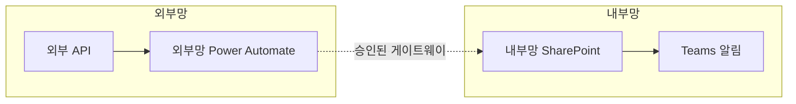

# {{ 설계서 제목 }}

> 본 문서는 ms-design-agents가 자동 생성한 설계서다.

| 항목 | 내용 |
|------|------|
| 작성일 | YYYY-MM-DD |
| 프로젝트명 | {{ 프로젝트명 }} |
| 요청자 | {{ 요청자 (선택) }} |
| 망 배치 결정 | 내부망 단독 / 외부망 단독 / 외부망 → 내부망 연계 |
| 사용 기술 | Power Automate / Copilot Studio / (해당 항목 표시) |

---

## 1. 개요

### 1.1 요구사항
사용자 요청 원문 (가능하면 그대로 인용):

> {{ 사용자 요청 }}

### 1.2 자동화 목표
자동화가 해결하려는 업무 문제와 기대 효과를 2~3문장.

### 1.3 처리 대상 데이터
| 데이터 항목 | 종류 | 출처 | 개인정보 여부 |
|------------|------|------|--------------|
| ... | ... | ... | ✅/❌ |

---

## 2. 아키텍처

### 2.1 다이어그램

### 2.2 컴포넌트 표

| 컴포넌트 | 역할 | 위치 | 사용 기술 |
|---------|------|------|-----------|
| ... | ... | 외부망/내부망 | Power Automate / Copilot Studio / SharePoint |

---

## 3. 망 배치 결정 근거

[workflow/decision_tree.md](../../workflow/decision_tree.md) 적용 결과:

- Q1 (개인정보 처리): 예/아니오 — 근거
- Q2/Q3 (외부 의존): 예/아니오 — 근거
- Q4 (수신자): ... (해당 시)
- Q5 (개인정보 알림): ... (해당 시)

**결정: 패턴 A/B/C**

대안 검토:
- 패턴 X는 왜 부적합한가
- 패턴 Y는 왜 부적합한가

---

## 4. Power Automate 플로우 명세

### 4.1 플로우 개요
| 항목 | 값 |
|------|----|
| 플로우명 | ... |
| 위치 | 외부망/내부망 |
| 트리거 종류 | 자동/수동/일정 |
| 실행 빈도 | 매일 09:00 KST / 이벤트 기반 등 |

### 4.2 단계 명세

| 순번 | 단계 | 액션 종류 | 커넥터 | 입력 | 출력 변수 | 비고 |
|-----|------|----------|--------|------|----------|------|
| 1 | 트리거 | ... | Schedule | 매일 09:00 | - | - |
| 2 | 액션 | Get items | SharePoint | List URL, Filter | items | - |

### 4.3 변수 목록
| 변수명 | 타입 | 초기값 | 용도 |
|-------|------|--------|------|
| ... | String / Array / Object | ... | ... |

### 4.4 조건 분기
조건 분기가 있는 경우 표 또는 의사 코드로 명시.

### 4.5 에러 핸들링
- 실패 시 동작: 재시도 / 알림 / 로그
- 재시도 정책: 횟수, 간격

---

## 5. Copilot Studio 구성 명세 (사용 시)

### 5.1 에이전트 개요
| 항목 | 값 |
|------|----|
| 에이전트명 | ... |
| 위치 | 외부망/내부망 |
| 채널 | Teams / Web / 기타 |

### 5.2 토픽 목록

| 토픽명 | 트리거 구문 / 설명 | 엔티티 | 호출 액션 | 변수 |
|-------|-------------------|--------|-----------|------|
| ... | ... | ... | ... | ... |

### 5.3 변수·엔티티 상세
필요 시 토픽별 상세.

### 5.4 생성형 AI 사용 여부
- 사용 여부: 예/아니오
- 사용 모델: 회사 승인 모델명
- 입력 데이터 분류: ...

---

## 6. 보안 검토 결과

[templates/security_checklist.md](security_checklist.md)의 결과:

| 항목 | 결과 | 비고 |
|------|------|------|
| 망분리 위반 여부 | ✅/❌ | ... |
| 개인정보 외부망 처리 여부 | ✅/❌ | ... |
| 외부 AI 사용 시 데이터 분류 | ✅/⚠️/❌ | ... |
| 인증·인가 설계 | ✅/⚠️ | ... |
| 감사 로그 활성화 | ✅/⚠️ | ... |
| 보존기간 설계 | ✅/⚠️ | ... |

**최종 보안 판정**: 통과 / 조건부 통과 (조건 명시) / Veto

---

## 7. 구현 단계별 가이드

### 7.1 사전 준비
1. 외부망/내부망 환경 라이선스 확인
2. 필요 커넥터 활성화
3. 게이트웨이 승인 (연계 패턴 시)

### 7.2 외부망 구성 단계 (해당 시)
1. [스크린샷 위치: 외부망 Power Automate Maker Portal 메인 화면] 새 자동 클라우드 플로우 생성
2. 트리거 설정 — ...
3. ...

### 7.3 내부망 구성 단계 (해당 시)
1. [스크린샷 위치: 내부망 Power Automate Maker Portal] 새 인스턴트 클라우드 플로우 생성
2. ...

### 7.4 Copilot Studio 구성 단계 (사용 시)
1. [스크린샷 위치: Copilot Studio 에이전트 생성 화면] ...
2. 토픽 생성 — ...

### 7.5 테스트 시나리오
| 시나리오 | 입력 | 기대 결과 |
|---------|------|----------|
| 정상 케이스 | ... | ... |
| 빈 데이터 | ... | ... |
| 외부 API 실패 | ... | ... |

---

## 8. 운영 가이드

### 8.1 모니터링
- 실패 알림 채널: ...
- 일별/주별 점검 항목: ...

### 8.2 보존 및 파기
- 데이터 보존기간: ...
- 파기 방식: 자동/수동

### 8.3 변경 관리
- 외부 API 스펙 변경 시 점검 항목
- 신규 직원 추가 시 처리

---

## 9. 부록

### 9.1 참고 문서
- Microsoft Learn 링크
- 사내 정책 문서 (정책 번호)

### 9.2 변경 이력
| 날짜 | 변경 내용 | 작성자 |
|------|----------|--------|
| YYYY-MM-DD | 최초 작성 | ms-design-agents |
