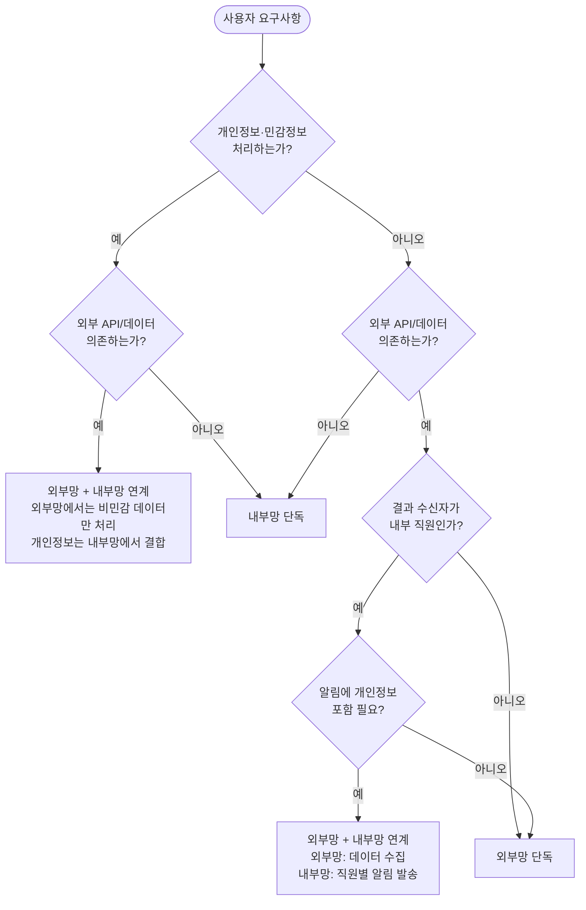

# 망 배치 결정 트리

Architect 페르소나가 따르는 의사결정 흐름. 이 트리는 [constraints/network_separation.md](../constraints/network_separation.md)의 규정을 운영 가능한 절차로 변환한 것.

---

## 결정 트리



---

## 질문별 판단 기준

### Q1. 개인정보·민감정보를 처리하는가?

다음 중 하나라도 해당하면 **예**:
- 직원 이름, 사번, 이메일 등을 자동화 로직 안에서 다룸
- 고객 정보를 다룸
- 신용정보·의료정보·민감정보 다룸

다음만 해당하면 **아니오**:
- 외부에서 가져온 공개 데이터만 다룸 (법령, 공시 등)
- 회사 일반 업무 데이터 (일정, 회의록 요약 등으로 직원 식별 없음)
- 알림 발송 시 "부서 전체" 같은 그룹 단위만 사용

### Q2/Q3. 외부 API/데이터에 의존하는가?

다음 중 하나라도 해당하면 **예**:
- 법제처, 공공데이터포털, 외부 RSS 등 호출
- 외부 LLM(ChatGPT, Azure OpenAI 등) 호출
- 외부 웹사이트 스크래핑
- 외부 번역, 외부 OCR

다음만 해당하면 **아니오**:
- M365 내부 데이터만 사용 (SharePoint, Teams, Outlook, Planner 등)
- 회사 승인된 내부 AI 모델만 사용
- 일정·시간 트리거만 사용 (외부 데이터 없음)

### Q4. 결과 수신자가 내부 직원인가?

- **예**: 내부 직원에게 Teams 알림, 메일, SharePoint 게시 등으로 결과 전달 필요
- **아니오**: 외부 보고용, 외부 시스템에 적재용, 공개 리포트 생성 등

### Q5. 알림에 개인정보 포함 필요?

- **예**: 개인별 맞춤 알림 필요 ("홍길동님의 신청건이 승인됨")
- **아니오**: 공통 공지 ("오늘자 법령 변경 사항")

---

## 분기별 패턴 요약

### 패턴 A: 내부망 단독
- **예시**: Planner 업무 관리 에이전트, SharePoint 문서 자동 분류, Outlook 메일 분류
- **특징**: 외부 의존성 없음, M365 내부에서 완결
- **구현**: 내부망 Power Automate + Copilot Studio

### 패턴 B: 외부망 단독
- **예시**: 법령 변경 분석 보고서 (외부 임원진 또는 외부 시스템에 적재)
- **특징**: 외부 데이터 수집 + 결과도 외부 또는 비개인화 알림
- **구현**: 외부망 Power Automate + (필요 시) 외부망 Copilot Studio + AI Builder

### 패턴 C: 외부망 → 내부망 연계
- **예시**: 법령 변경을 내부 직원에게 알림, 외부 데이터를 내부 직원이 검색
- **특징**: 외부 수집 + 내부 전달
- **구현**:
  - 외부망 플로우: 외부 데이터 수집·정제 (개인정보 미포함)
  - 게이트웨이 전송: 텍스트만 단방향
  - 내부망 플로우: SharePoint 적재 + 직원 알림 발송

---

## 결정 결과 출력 형식

Architect는 결정 후 다음을 명시:

```
[Architect] 결정: <패턴 A/B/C>
근거:
- Q1 (개인정보 처리): 예/아니오 — <이유>
- Q2/Q3 (외부 의존): 예/아니오 — <이유>
- Q4 (수신자): ... (해당 시)
- Q5 (개인정보 알림): ... (해당 시)

배치:
- 외부망: <컴포넌트 목록>
- 내부망: <컴포넌트 목록>
- 연계: <방식, 데이터 종류>
```
